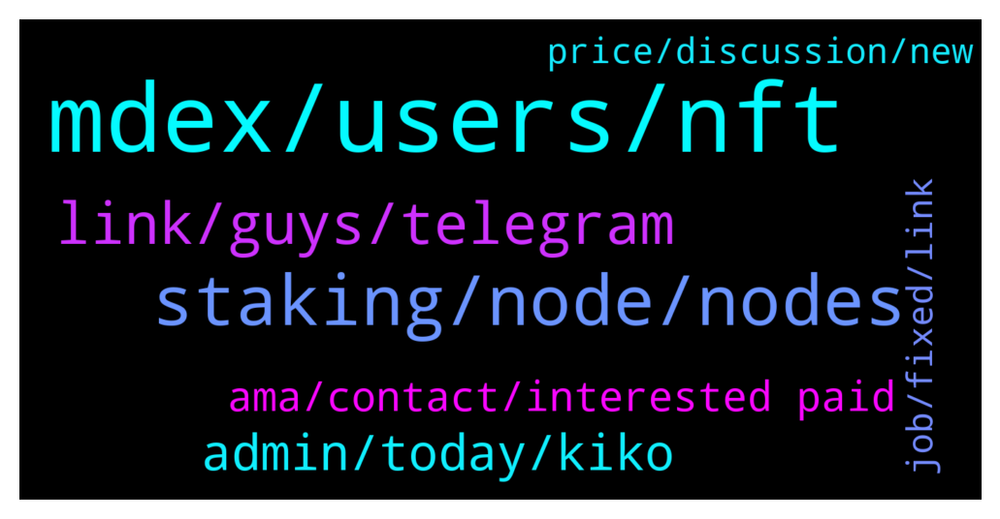

# **@chainlinkofficial**
 ## Analysis for **2022-01-20** - **2022-01-21**.

---

## 📊 **Basic Stats**

**n_messages_sent**: 196

---

---

## 🔝 **Top keywords and related messages**

1. **mdex, users, nft**

    @Joypokkamol --- *Over the past six months, the center stage in the blockchain industry has been undoubtedly GameFi and Metaverse. So, what is MDEX’s plan for Metaverse?* **--->** [TG Discussion](https://t.me/chainlinkofficial/367422)

    @Joypokkamol --- *Here we come to an exciting question, what benefits will users in our community get when they use MDEX?* **--->** [TG Discussion](https://t.me/chainlinkofficial/367470)

    @Joypokkamol --- *We can see that many projects on the market have been hacked, resulting in a serious loss of assets for many users. So how does MDEX, which has been running smoothly for a year, ensure the safety of users' funds?* **--->** [TG Discussion](https://t.me/chainlinkofficial/367419)

    @Joypokkamol --- *After talking about NFT and the Metaverse, now let's talk about the cooperation of MDEX with other projects. MDEX released the Hunter program a few months ago: $10 million to support ecological projects. Can you give us a detailed introduction to this program?* **--->** [TG Discussion](https://t.me/chainlinkofficial/367445)

    @Joypokkamol --- *Very nice!  After a year of development, what achievements has MDEX made?* **--->** [TG Discussion](https://t.me/chainlinkofficial/367395)

    @Joypokkamol --- *You just mentioned that MDEX had released NFT. Could you please give us more details?* **--->** [TG Discussion](https://t.me/chainlinkofficial/367433)

2. **staking, node, nodes**

    @Linkederic --- *Corect, staking is not yet live  https://t.me/chainlinkofficial/366377* **--->** [TG Discussion](https://t.me/chainlinkofficial/367112)

    @zermoise --- *To confirm...contracts are not collateralised currently? rather than use the word staking.* **--->** [TG Discussion](https://t.me/chainlinkofficial/367117)

    @Sylvarantt --- *There are no "staking rewards" but LINK payments to node operators that fulfill job requests* **--->** [TG Discussion](https://t.me/chainlinkofficial/366495)

    @Rpatel1443 --- *there are no staking rewards right now, but when staking is live there will be rewards for stakers...and is there details on what % of rewards goes to stakers?* **--->** [TG Discussion](https://t.me/chainlinkofficial/366499)

    @Rpatel1443 --- *thanks so no real estimate on when staking will go live yet either right?* **--->** [TG Discussion](https://t.me/chainlinkofficial/366503)

    @zermoise --- *hello team. i constantly see that staking is involved in the current implementation from a variety of articles, even if it isnt explicit staking. i confirmed yesterday that no staking (whether node/data provider to work contracts or passive holder to node) exists currently. whats the truth? why do i see so many articles referencing staking in the current implementation?* **--->** [TG Discussion](https://t.me/chainlinkofficial/367101)

3. **link, guys, telegram**

    @marcromeron --- *Any integration will be announced through official channels like twitter.com/chainlink. Anything else can be considered speculation. Also you can check chainlinkecosystem.com* **--->** [TG Discussion](https://t.me/chainlinkofficial/366711)

    @KostasZrk --- *How do I check for verified chainlink members?* **--->** [TG Discussion](https://t.me/chainlinkofficial/367297)

    @cankinglion --- *What is the Wallet for chainlink on mobile iOS?* **--->** [TG Discussion](https://t.me/chainlinkofficial/366903)

    @Cryptothi --- *Hi guys, it came to my attention this project called TuringDao which seems cool but kind of suspicious, and they claim to have a partnership which Chainlink. Can any insider confirm this information for me, please?* **--->** [TG Discussion](https://t.me/chainlinkofficial/366925)

    @RomainSwitzerland --- *https://t.me/chainlinkofficial/366413 but no official integration from Chainlink until now* **--->** [TG Discussion](https://t.me/chainlinkofficial/366928)

    @marcromeron --- *Chainlink have the Advocates program: https://chain.link/community/advocates* **--->** [TG Discussion](https://t.me/chainlinkofficial/367262)

4. **admin, today, kiko**

    @Joypokkamol --- *We have Kiko joining us from MDEX, So welcome and thank you for your time @kikomdex2021. Before we go into the details, could you please introduce yourself and tell us a bit of your background?* **--->** [TG Discussion](https://t.me/chainlinkofficial/367376)

    @Joypokkamol --- *You can find more details here:https://bit.ly/3fyPFbq* **--->** [TG Discussion](https://t.me/chainlinkofficial/367484)

    @juankaramoy --- *Our whitepapers would be a great place to start https://chain.link/whitepaper* **--->** [TG Discussion](https://t.me/chainlinkofficial/366608)

    @kikomdex2021 --- *Thanks for having me here today* **--->** [TG Discussion](https://t.me/chainlinkofficial/367492)

    @Joypokkamol --- *Fantastic! 👍🏼 Thank you very much, Kiko, for your time today.* **--->** [TG Discussion](https://t.me/chainlinkofficial/367487)

    @kikomdex2021 --- *Sure, will be glad to do* **--->** [TG Discussion](https://t.me/chainlinkofficial/367377)

5. **ama, contact, interested paid**

    @Michael34521 --- *Hello, I'm  Marketer at Crypto Panda , I think your project has great potential.I would like to invite you to hold an AMA  session in our community, who is the concerned person here I can talk to?* **--->** [TG Discussion](https://t.me/chainlinkofficial/367047)

    @sobin01 --- *Hello🤗 I am sobin from crypto blasters. Whom can I contact for an AMA proposal ?* **--->** [TG Discussion](https://t.me/chainlinkofficial/367211)

    @jubuda109 --- *Hi there 👋  I have a business proposal its about doing an AMA & posting ads on different social media with our community. Our community including  investors, traders, ambassador etc. Should I contact with?* **--->** [TG Discussion](https://t.me/chainlinkofficial/366635)

    @asfandyarm --- *Oiee oiee Abachies :) looking forward for the AMA* **--->** [TG Discussion](https://t.me/chainlinkofficial/367530)

    @serqpo --- *hello 🥰 who is the right candidate to contact regarding AMA marketing??* **--->** [TG Discussion](https://t.me/chainlinkofficial/366715)

    @kath_jeon --- *hello there✋🏻 who is the right candidate to contact for AMA session?* **--->** [TG Discussion](https://t.me/chainlinkofficial/366705)

6. **price, discussion, new**

    @marcromeron --- *You could complain about token price if you wish, not here, but not about how is running the company with their achievements and developments. Obviously community sentiment is better in other market situation but we’re working very hard 24/7 on new integrations, new services, new hires, etc…* **--->** [TG Discussion](https://t.me/chainlinkofficial/367351)

    @Tofugitive --- *Totally understand. My point is that in none of those groups will you find members of the team discussing price, which is fantastically ironic because if hodlers hadn’t believed in them, price wouldn’t have held long enough and high enough for them to unleash their billions to pay themselves and fund operations. Anyway I’ll stop now. The project has huge potential, but it’s been a terrible investment, which the team should acknowledge and address IMHO. That is all.* **--->** [TG Discussion](https://t.me/chainlinkofficial/367350)

    @Sylvarantt --- *The benefit of forbidding price discussion in this chat to the signal:noise ratio vastly outweights the possible disadvantages. A lot of people come in here because they want to learn, build useful hybrid smart contracts and applications with real world use cases and basically educate themselves on what the blockchain is. That is a huge opportunity for everyone involved in this group to grow together.  If price, trading and token value is the thing you want to talk about there are dozens of other non-official groups that allow that sort of discussion. You can find them by searching in Telegram "Chainlink Community"* **--->** [TG Discussion](https://t.me/chainlinkofficial/367348)

    @Tofugitive --- *The irony is thick. The team refuses to discuss price while relying on a certain price to unleash a tsunami of tokens on the market in order to pay themselves and fund their operations. Feel free to ban me. Been here since day 1, but enough is enough already.* **--->** [TG Discussion](https://t.me/chainlinkofficial/367347)

    @Tofugitive --- *You miss the point. The team has made themselves above talking about price anywhere on any platform at any time. That’s ironic. That is all.* **--->** [TG Discussion](https://t.me/chainlinkofficial/367353)

    @JoshSimenhoff --- *Hey Rahul, thanks for joining our chat, but price discussion isn't allowed here. Please review our pinned rules, thanks 🙂* **--->** [TG Discussion](https://t.me/chainlinkofficial/367181)

7. **job, fixed, link**

    @Linkederic --- *As with the overall job payment, this will vary based on a number of factors, so there is no fixed return amount, nor is that estimable at this time.* **--->** [TG Discussion](https://t.me/chainlinkofficial/366501)

    @luckychipjack --- *I want to use VRF on bsc mainnet, the fee for each request is fixed to 0.2 LINK or it depends to the job?* **--->** [TG Discussion](https://t.me/chainlinkofficial/366560)

    @Rpatel1443 --- *do you know how much Link is required to be paid per job or is that all variable?* **--->** [TG Discussion](https://t.me/chainlinkofficial/366496)

    @Linkederic --- *It is 0.2 LINK per random number call https://docs.chain.link/docs/vrf-contracts/#binance-smart-chain-mainnet* **--->** [TG Discussion](https://t.me/chainlinkofficial/366572)

    @Sylvarantt --- *It will really depend on a per-job and per-feed basis, but we can't know for sure as these details haven't been disclosed yet* **--->** [TG Discussion](https://t.me/chainlinkofficial/366498)

    @Linkederic --- *Thats correct, feel free to review the docs for a way to reduce the per call cost.* **--->** [TG Discussion](https://t.me/chainlinkofficial/366580)

