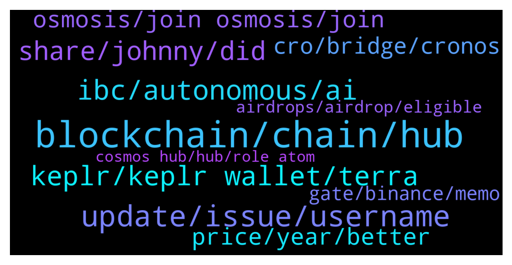

# **@cosmosproject**
 ## Analysis for **2022-01-20** - **2022-01-21**.

---

## 📊 **Basic Stats**

**n_messages_sent**: 346

---

---

## 🔝 **Top keywords and related messages**

1. **blockchain, chain, hub**

    @Gxxin --- *Since the creation of its virtual currency ATOM, the Cosmos platform has been bringing many innovations to the blockchain world. Cosmos focuses its efforts on creating an ecosystem that could solve the 3 main problems of blockchain technology to make it less complex for developers and users, Scalability, Usability, and Interoperability. Let's take a deep dive and understand everything you need to know about Cosmos in 2022.  https://sgstockmarketinvestor.com/everything-you-need-to-know-about-cosmos-atom-in-2022/* **--->** [TG Discussion](https://t.me/cosmosproject/478650)

    @AtomJazz --- *If you mean if Cosmos hub is a smart contracts platform then the answer is no. Cosmos ecosystem is an ecosystem of interconnected application specific blockchains. Each dAPP runs its own L1 blockchain in Cosmos* **--->** [TG Discussion](https://t.me/cosmosproject/477823)

    @trader_ksm --- *How can I bridge ETH over to COSMOS to trade offchain?* **--->** [TG Discussion](https://t.me/cosmosproject/478095)

    @ZoltanAtom --- *Each chain is sovereign at Cosmos. But yes,they both use Cosmos tech.* **--->** [TG Discussion](https://t.me/cosmosproject/477941)

    @ascuoladibitcoin --- *Do you know the name of nexts blockchain entering in the cosmos hub from now on ?* **--->** [TG Discussion](https://t.me/cosmosproject/477752)

    @ZoltanAtom --- *At Cosmos each chain is sovereign application specific one!* **--->** [TG Discussion](https://t.me/cosmosproject/478757)

2. **update, issue, username**

    @C --- *For some reason the group is not accessible to me!* **--->** [TG Discussion](https://t.me/cosmosproject/477833)

    @IbrahimSquared --- *I have been a member since forever but now it just disappeared and it says "Sorry this chat does not seem to exist"* **--->** [TG Discussion](https://t.me/cosmosproject/478247)

    @Doddy1994 --- *Just seen other people having that problem as well least its not just me* **--->** [TG Discussion](https://t.me/cosmosproject/478311)

    @vladc1 --- *We moved it to @citadelvotebot. Try again please* **--->** [TG Discussion](https://t.me/cosmosproject/478384)

    @AtomJazz --- *Yeah no problem with that. I think most people have few* **--->** [TG Discussion](https://t.me/cosmosproject/477786)

    @Doddy1994 --- *Has an update been rolled out?* **--->** [TG Discussion](https://t.me/cosmosproject/478617)

3. **ibc, autonomous, ai**

    @AtomJazz --- *Usually we have some issues during and right after Osmosis epochs. Teams are working really hard to improve IBC performance during these heavy traffic events* **--->** [TG Discussion](https://t.me/cosmosproject/478309)

    @Cryptomeyt --- *But bnb is not in ibc right, so I don't think it really counts* **--->** [TG Discussion](https://t.me/cosmosproject/478774)

    @Mordrew --- *@AtomJazz are you pretty familiar with the IBC protocol?* **--->** [TG Discussion](https://t.me/cosmosproject/478787)

    @NikoDMT --- *this kinda sounds like shilling , it's not that. I'm just suuuper excited about enabling IBC myself 🥳🥳* **--->** [TG Discussion](https://t.me/cosmosproject/478802)

    @PeakyBlinders37 --- *Ser I need fetch IBC asap* **--->** [TG Discussion](https://t.me/cosmosproject/478848)

    @ZoltanAtom --- *Bnb hasn’t enabled ibc yet. Ask to CZ 😎* **--->** [TG Discussion](https://t.me/cosmosproject/478775)

4. **keplr, keplr wallet, terra**

    @Doddy1994 --- *Mobile osmosis is a god send on Keplr, this is the future of finance haha* **--->** [TG Discussion](https://t.me/cosmosproject/478627)

    @ZoltanAtom --- *Just don’t forget this ;  you don’t need “memo” sending assets from cex to Keplr!  And don’t forget to fill up “memo” if you send your assets from Keplr to cex or cex to cex.* **--->** [TG Discussion](https://t.me/cosmosproject/478189)

    @AtomJazz --- *Yes, basically all you need to do is connect your ledger device with Keplr wallet* **--->** [TG Discussion](https://t.me/cosmosproject/478383)

    @lionkim958 --- *Right. Luna is already in my keplr wallet. Moving it between osmosis and terra isn't an issue* **--->** [TG Discussion](https://t.me/cosmosproject/478348)

    @mlats4 --- *its not keplr  network so why is that?* **--->** [TG Discussion](https://t.me/cosmosproject/478359)

    @lionkim958 --- *Anyone know how to stake luna in keplr? Or import a keplr wallet into terra station?* **--->** [TG Discussion](https://t.me/cosmosproject/478340)

5. **share, johnny, did**

    @AtomJazz --- *There's so many it's hard to keep up 😁* **--->** [TG Discussion](https://t.me/cosmosproject/477756)

    @MREXwhale --- *Would love to hear everyone’s thoughts* **--->** [TG Discussion](https://t.me/cosmosproject/478810)

    @axb7b --- *Thnks everyone for the replies 👍👍* **--->** [TG Discussion](https://t.me/cosmosproject/478841)

    @cronoscontinuum --- *can i drop meme here 👀* **--->** [TG Discussion](https://t.me/cosmosproject/477845)

    @ZoltanAtom --- *Have a look at this one 👆* **--->** [TG Discussion](https://t.me/cosmosproject/478633)

    @ZoltanAtom --- *Please also share it @ATOMCosmonauts 😉* **--->** [TG Discussion](https://t.me/cosmosproject/478207)

6. **osmosis, join osmosis, join**

    @ZoltanAtom --- *Yes,No fee at Osmosis. Why don’t you join Osmosis community to learn more;  https://t.me/osmosis_chat* **--->** [TG Discussion](https://t.me/cosmosproject/478162)

    @SannPaa --- *Osmosis and Carbon are working on a dual-benefit ‘thing’. Listing each other, but there was more. Didn’t catch it. Was a very nice AMA, with a good host (John 🙌)* **--->** [TG Discussion](https://t.me/cosmosproject/478547)

    @p_arno --- *I read that swaps on Osmosis are gasless. Is my understanding correct?* **--->** [TG Discussion](https://t.me/cosmosproject/478158)

    @ZoltanAtom --- *Please DM to @TisMeAgain , Osmosis admin and ask to him about your situation.* **--->** [TG Discussion](https://t.me/cosmosproject/478250)

    @ZoltanAtom --- *Hi there,please join osmosis community and admins will give to you details of your questions.   https://t.me/osmosis_chat* **--->** [TG Discussion](https://t.me/cosmosproject/478231)

    @Gwin --- *【Cosmos 生态 Osmosis 集成 Gravity Bridge，实现 Cosmos 和以太坊互操作性】  Foresight News 消息，基于Cosmos 的去中心化交易所 Osmosis 集成 Gravity Bridge，允许资产从以太坊无缝转发到支持 IBC 的目标链，并且基于 Cosmos 的代币能够在一些以太坊钱包和 AMM 中显示。  Osmosis 表示，这种集成能够用户在 Osmosis 中轻松访问和交易以太坊、USDC 和任何 EVM 代币。  https://twitter.com/gravity_bridge/status/1483947744322412544* **--->** [TG Discussion](https://t.me/cosmosproject/477914)

7. **price, year, better**

    @NikoDMT --- *I mean half the community barely even cares about price or listings or marketing or any other bullshit apart from development and still Atom's price is handling it's self spectacularly* **--->** [TG Discussion](https://t.me/cosmosproject/478779)

    @NikoDMT --- *That is indeed glorious value capture. I was referring to more "traditional methods" but as it stands it's obvious to me that Atom will become the main collateral on the Cosmos web of blockchains and that alone will push price into uncharted territories .* **--->** [TG Discussion](https://t.me/cosmosproject/478782)

    @SuperEra --- *Woah Woah.. Just found out. Thought of sharing ..   Surge: ATOM Edition As the flagship asset of the Cosmos ecosystem, $ATOM will be the first to be listed on Kava Lend. The proposal to enable supplying and borrowing of $ATOM will go live on January 20th and it will be added on January 27th,  During the Surge period, early $ATOM suppliers can expect to receive reward APYs as high as 1700%. Even as the supplied $ATOM approaches $10M, suppliers will be earning >170% APY.  https://medium.com/kava-labs/introducing-surge-atom-edition-da6e4c5bb078* **--->** [TG Discussion](https://t.me/cosmosproject/478218)

    @apjfausd89a --- *just talking practically, if we just hold and keep the price up. eventually everyone freaking out and dumping will move into ATOM* **--->** [TG Discussion](https://t.me/cosmosproject/478570)

    @TicoJohnny --- *The role of ATOM is already unique and particular and has existed for so long, a lot of these new coins built in the space are working very quickly and experimentally to find their fit and have potentially better growth cycles but it is all relative. We will see more potential for ATOM this year with alot of the features you mentioned but it will likely be a slower burn. The ecosystem does have a lot of exciting and novel use cases being developed in the space.* **--->** [TG Discussion](https://t.me/cosmosproject/478426)

    @ascuoladibitcoin --- *So do you think is better in long terms to own atom instead of other project like osmo and juno and other ? I m a little worried about the fact atom has no cap and i see  other that has a maximum......* **--->** [TG Discussion](https://t.me/cosmosproject/478427)

8. **cro, bridge, cronos**

    @theassinonassis --- *didnt have atom supported as an asset for cro  using this bridge https://cronos.crypto.org/bridge/ ** **--->** [TG Discussion](https://t.me/cosmosproject/477764)

    @theassinonassis --- *ah man I lost to slippage oh well. Okay so I swapped back my atom to cro and bridged to crypto.org and sent to my kepler. Where can I swap to atom? The crypto.org bridge doesnt support atom* **--->** [TG Discussion](https://t.me/cosmosproject/477759)

    @theassinonassis --- *i have $atom on the cronos chain in my metamask. How can I send it to my kepler wallet? Metamask doesnt allow me to send bc its not an erc address* **--->** [TG Discussion](https://t.me/cosmosproject/477749)

    @AtomJazz --- *Why did you swap it back to CRO? You could have just send your ATOMs from CRO to Keplr using cronos bridge right?* **--->** [TG Discussion](https://t.me/cosmosproject/477762)

    @AtomJazz --- *Yeah you need CRO for gas afaik* **--->** [TG Discussion](https://t.me/cosmosproject/477754)

    @ndcast --- *Hey there, what is the CRO channel* **--->** [TG Discussion](https://t.me/cosmosproject/478329)

9. **gate, binance, memo**

    @Lukas --- *Is only my ATOM stuck on withdrawal from CEX?* **--->** [TG Discussion](https://t.me/cosmosproject/478242)

    @Võ Tuấn --- *Please help me. I just help support 1 time to get back my Atom.  And now I want make sure: Tag / Memo is the same ??   I want to Deposit Atom from Gate to Binance for Staking.  But Gate Just have “Description” and “ Tag” . Should I Fill Memo ( Binance) to Tag ( Gate ) ?  Thank you* **--->** [TG Discussion](https://t.me/cosmosproject/477990)

    @Lukas --- *0/10 conformations for like 30 minutes already* **--->** [TG Discussion](https://t.me/cosmosproject/478243)

    @alen_muly --- *If i decide to undelegate. I have to wait 21 days.* **--->** [TG Discussion](https://t.me/cosmosproject/478025)

    @AtomJazz --- *But after 21 days ATOMs become available to move* **--->** [TG Discussion](https://t.me/cosmosproject/478023)

    @bmx777 --- *I entered the atom in long* **--->** [TG Discussion](https://t.me/cosmosproject/477827)

10. **airdrops, airdrop, eligible**

    @mlats4 --- *so if im staking on trust wallet, am i eligible for airdrops?* **--->** [TG Discussion](https://t.me/cosmosproject/478356)

    @jacktang13 --- *How much money do I need to pledge to the wallet to get the airdrop token?* **--->** [TG Discussion](https://t.me/cosmosproject/477767)

    @AtomJazz --- *Your ATOM address is eligible yes but you'll need Keplr sooner or later to claim those airdrops* **--->** [TG Discussion](https://t.me/cosmosproject/478357)

    @NLL_CommunityStaking_validator --- *I can copy paste some thoughts on that from the airdrop chat* **--->** [TG Discussion](https://t.me/cosmosproject/478817)

    @AtomJazz --- *Each airdrop is different. Probably best to join airdrop channel to stay up to date https://t.me/CosmosAirdrops* **--->** [TG Discussion](https://t.me/cosmosproject/477771)

    @blockchainparty1 --- *It's true, Mariam. You can learn about all the airdrops here https://t.me/CosmosAirdrops* **--->** [TG Discussion](https://t.me/cosmosproject/477744)

