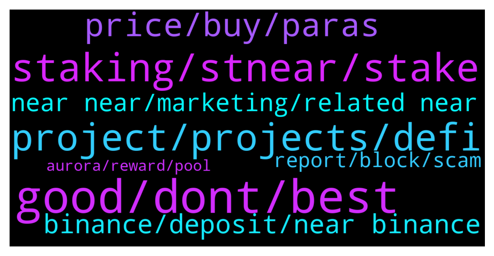

# **@cryptonear**
 ## Analysis for **2022-01-20** - **2022-01-21**.

---

## 📊 **Basic Stats**

**n_messages_sent**: 777

---

---

## 🔝 **Top keywords and related messages**

1. **good, dont, best**

    @JC --- *Asking, “wanna get high?”  Please dont mute me* **--->** [TG Discussion](https://t.me/cryptonear/294674)

    @TheGo1denBull --- *Nah I'm not for that type of weather lol* **--->** [TG Discussion](https://t.me/cryptonear/292759)

    @larry_lang --- *ah shiet they switch from @Kripto_Raptor and @kv9990 to me now=)))* **--->** [TG Discussion](https://t.me/cryptonear/294819)

    @larry_lang --- *lol my place is rainy af* **--->** [TG Discussion](https://t.me/cryptonear/294466)

    @larry_lang --- *Laugh all u want Lambo u sticking with this name now ser=]].* **--->** [TG Discussion](https://t.me/cryptonear/293056)

    @choc0707 --- *How is everything going on today* **--->** [TG Discussion](https://t.me/cryptonear/294649)

2. **staking, stnear, stake**

    @MoioMoon --- *How do I stake? Newbie to crypto. (Scammers, dont dm me)* **--->** [TG Discussion](https://t.me/cryptonear/293735)

    @supersaiyan_goku --- *Do you mean the staking reward in every epoch was calculated based on amount of stNear a user is holding, not Near? 🤔* **--->** [TG Discussion](https://t.me/cryptonear/293690)

    @iwllbel --- *there is something I don’t understand tho. So I staked my near in meta, then I used stnear in ref and staked it in a farm oin-stnear (so I swapped half my stnear to oin)  Do I still earn staking rewards in meta..?* **--->** [TG Discussion](https://t.me/cryptonear/293728)

    @GeorgePro1 --- *yeah totally possible!! that's why stNear price kind of differs on Ref and Metapool(in terms of NEAR token)* **--->** [TG Discussion](https://t.me/cryptonear/293668)

    @oppzsmoKe --- *So if I stake here is there a 5% fee also* **--->** [TG Discussion](https://t.me/cryptonear/294065)

    @GeorgePro1 --- *Your stake near is never lost you can always unstake* **--->** [TG Discussion](https://t.me/cryptonear/294577)

3. **project, projects, defi**

    @GweiSatoshi --- *What If I am not a developer. Say a designer or an ambassador crypto projects.  What are the opportunities???* **--->** [TG Discussion](https://t.me/cryptonear/294944)

    @TheGo1denBull --- *Hey All NEARCOMERS! If you're new to NEAR and want to know more about this revolutionary project you should definitely look at https://near.org/learn/ 🤓 Also if you have NEAR and want to have your assets off an exchange definitely look into sending it to the official wallet at https://wallet.near.org 🧐* **--->** [TG Discussion](https://t.me/cryptonear/293940)

    @TheGo1denBull --- *@salihkite here's a wallet list for you and other projects in the near Ecosystem https://awesomenear.com/categories/wallets/* **--->** [TG Discussion](https://t.me/cryptonear/292534)

    @JonathanCastillo85 --- *I dunno i just like to always give the fault to the chinese...just like every scammer comes from india* **--->** [TG Discussion](https://t.me/cryptonear/294316)

    @TheGo1denBull --- *https://twitter.com/realitychain is one option but more projects related to the metaverse is on the way* **--->** [TG Discussion](https://t.me/cryptonear/293835)

    @TheGo1denBull --- *@oppzsmoKe you could also utilize Defi projects that's on the sidechain/evm of NEAR known as Aurora. They have trisolaris, WannaSwap, nearpad, and others like the yield aggregator vaporware finance https://www.vaporwave.farm/* **--->** [TG Discussion](https://t.me/cryptonear/294072)

4. **price, buy, paras**

    @iamkemoo --- *Hey mate, please move price related dicussions to our unofficial price chat https://t.me/merchantsofnear thank you 🙏* **--->** [TG Discussion](https://t.me/cryptonear/293711)

    @larry_lang --- *ah okie but  let's stop the selling/buying topic here, for that we have the price channel:  https://t.me/merchantsofnear* **--->** [TG Discussion](https://t.me/cryptonear/294332)

    @larry_lang --- *lol but for real we gonna have to move price discussion to this channel: https://t.me/merchantsofnear* **--->** [TG Discussion](https://t.me/cryptonear/294246)

    @TheGo1denBull --- *Check out this price discussion TG https://t.me/merchantsofnear* **--->** [TG Discussion](https://t.me/cryptonear/292840)

    @bailey_12 --- *haha sorry, we don't give financial advices here If you looking for some price action, check out this group https://t.me/merchantsofnear* **--->** [TG Discussion](https://t.me/cryptonear/293612)

    @happyeveryday2368 --- *will NEAR price still goes up in few days?* **--->** [TG Discussion](https://t.me/cryptonear/293155)

5. **binance, deposit, near binance**

    @peuzei --- *or its the binance process ?* **--->** [TG Discussion](https://t.me/cryptonear/294189)

    @BTD111 --- *I sent near from my near wallet to binance (they had the 64 digit address but its been 15min and funds still not there..* **--->** [TG Discussion](https://t.me/cryptonear/294114)

    @kv9990 --- *It's in Binance's wallet, binance takes time *sometimes* to reflect that deposit in your account.* **--->** [TG Discussion](https://t.me/cryptonear/294191)

    @NearFritz --- *If it is taking more... The issue is on the Binance side* **--->** [TG Discussion](https://t.me/cryptonear/294112)

    @larry_lang --- *oh so in this case you would have to check back with the binance support since as u can see, the transaction has already been completed on our network.... it's the Binance end that is having problem showing your fund....* **--->** [TG Discussion](https://t.me/cryptonear/294171)

    @kv9990 --- *Yup,wait for Binance to process your deposit. They take time sometimes.* **--->** [TG Discussion](https://t.me/cryptonear/294186)

6. **near near, marketing, related near**

    @spectre011 --- *He should relocate to your location then* **--->** [TG Discussion](https://t.me/cryptonear/292756)

    @Wdress --- *just a question guys, is "1inch" on NEAR or not?* **--->** [TG Discussion](https://t.me/cryptonear/293406)

    @tragob --- *It should have at least 1 near* **--->** [TG Discussion](https://t.me/cryptonear/294734)

    @marcNear --- *Austria is not near him 🤷‍♂️😄* **--->** [TG Discussion](https://t.me/cryptonear/292757)

    @Darius_Nearinsider --- *Here are useful channels to help you understand NEARProtocol more easily https://twitter.com/near_insider/status/1484200777732456448* **--->** [TG Discussion](https://t.me/cryptonear/294231)

    @Tiberiu16 --- *What are all the learning environments or communities for NEAR?* **--->** [TG Discussion](https://t.me/cryptonear/292950)

7. **report, block, scam**

    @GeorgePro1 --- *These scammers don’t have patient 😂😂* **--->** [TG Discussion](https://t.me/cryptonear/294809)

    @RomanRomanJ --- *Blocked him already, have a good one 🌟* **--->** [TG Discussion](https://t.me/cryptonear/293325)

    @rumparum --- *I got blocked by scammer in the end* **--->** [TG Discussion](https://t.me/cryptonear/294805)

    @iamruark --- *yeah got the whole thing screenshotted before he deleted the chat and blocked me. need to report it somewhere* **--->** [TG Discussion](https://t.me/cryptonear/293649)

    @israel_igboze --- *🤣🤣🤣  For scammers to try use your name, it means you're a figure here* **--->** [TG Discussion](https://t.me/cryptonear/294835)

    @JC --- *Its clean here, no scammer texting me after joining* **--->** [TG Discussion](https://t.me/cryptonear/294376)

