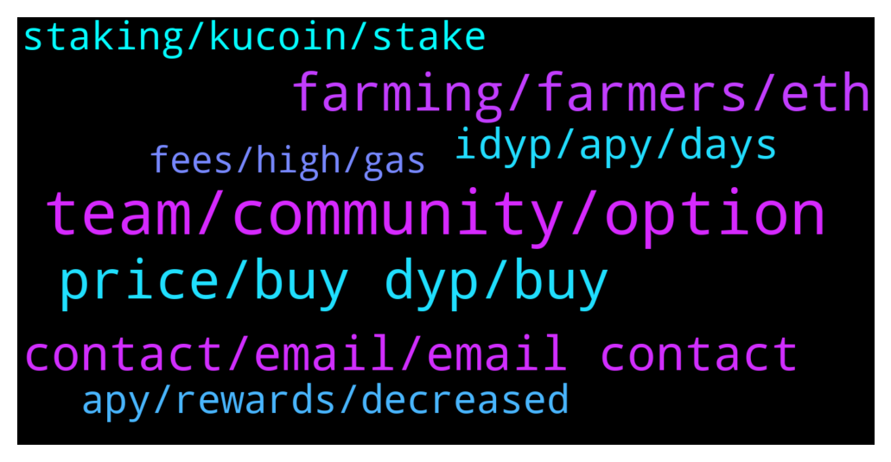

# **@dypfinance**
 ## Analysis for **2022-01-20** - **2022-01-21**.

---

## 📊 **Basic Stats**

**n_messages_sent**: 164

---

---

## 🔝 **Top keywords and related messages**

1. **team, community, option**

    @captain_protein --- *Perhaps the team can just bear this in mind before making such fundamental changes in future.* **--->** [TG Discussion](https://t.me/dypfinance/241574)

    @captain_protein --- *There are definitely ways this could have been avoided* **--->** [TG Discussion](https://t.me/dypfinance/241608)

    @Kaya --- *well, we don't need to do anything when the feature comes, right?* **--->** [TG Discussion](https://t.me/dypfinance/241465)

    @captain_protein --- *Sure, let's hope so. Look, the project is a good one and the team is clearly talented. All I would ask, as someone who has been very negatively affected by this change, is for the team to acknowledge that and learn from it.* **--->** [TG Discussion](https://t.me/dypfinance/241618)

    @Manuel --- *And the team looked for the best possible way* **--->** [TG Discussion](https://t.me/dypfinance/241585)

    @captain_protein --- *It would just be nice if people learned from this going forwards* **--->** [TG Discussion](https://t.me/dypfinance/241607)

2. **price, buy dyp, buy**

    @Nji_jalen --- *Feature for dyp??. I hope see more utility for dyp coming* **--->** [TG Discussion](https://t.me/dypfinance/241829)

    @dulceazucar --- *Hi there , time to buy more and more DYP and iDYP. really cheap price now. Will not see that price anymore in the near future. Bright future for only 24 116 899 DYP max* **--->** [TG Discussion](https://t.me/dypfinance/241520)

    @Sweetejanlla123 --- *On idyp the is juste 20$ difference for swap around 2000 dollars.   Dyp is like 200 dollars. This is x10* **--->** [TG Discussion](https://t.me/dypfinance/241896)

    @RuuneL --- *Thanks. Did dyp get listed on a high tier exchange?* **--->** [TG Discussion](https://t.me/dypfinance/241518)

    @ThunderChaos --- *But since yesterday DYP price actually went down, you can get more DYP for $, not less. Certainly not 30 less.* **--->** [TG Discussion](https://t.me/dypfinance/241339)

    @TuTeVs --- *Guys, can someone kindly explain what the difference is between IDYP and DYP? Can't find any information on IDYP..* **--->** [TG Discussion](https://t.me/dypfinance/241853)

3. **farming, farmers, eth**

    @captain_protein --- *The main benefit seems to have been to crush the value of Eth farmers' LP tokens* **--->** [TG Discussion](https://t.me/dypfinance/241567)

    @captain_protein --- *And to be honest once my eth farm unlocks I will probably be gone, too* **--->** [TG Discussion](https://t.me/dypfinance/241599)

    @Tryitontriton --- *All of this being said, is another event like this happening anytime soon? Just want to be prepared before adding more to ETH farm* **--->** [TG Discussion](https://t.me/dypfinance/241621)

    @timdyp --- *Maximize your Yield Farming Rewards on #Ethereum 9,187 #ETH worth $26,100,083 paid to the farmers!  Join farming by automatically adding liquidity and earn 1075% APY https://dyp.finance/farmv2/eth  #DeFi #DYP #YieldFarming  👉https://twitter.com/dypfinance/status/1484557652550164482* **--->** [TG Discussion](https://t.me/dypfinance/241879)

    @timdyp --- *Maximize your Yield Farming Rewards on #BinanceSmartChain 9,839 #BNB worth $4,545,618 paid to the farmers!  Join farming by automatically adding liquidity and earn 158% APY https://dyp.finance/farmv2/bsc  👉https://twitter.com/dypfinance/status/1484144823208660999* **--->** [TG Discussion](https://t.me/dypfinance/241511)

    @DhoniMSD516 --- *Hey you can check out our Farms or Buyback pools where you can invest WBNB and earn reward watch this Buyback: https://dyp.finance/buybackv2/bsc Tutorial: https://www.youtube.com/watch?v=l3Jka88T308  Farming:https://dyp.finance/farmv2/bsc Tutorial: https://www.youtube.com/watch?v=2pOUmRTMN1o* **--->** [TG Discussion](https://t.me/dypfinance/241890)

4. **contact, email, email contact**

    @jeffanderwood --- *@Tekkol Hello,I'm jeff from DigiFinex,integrated marketing manager. How can I contact with the admin of project party?* **--->** [TG Discussion](https://t.me/dypfinance/241412)

    @Kaya --- *bro you didn't write to me privately did you?* **--->** [TG Discussion](https://t.me/dypfinance/241447)

    @DhoniMSD516 --- *Hey please DM me your address* **--->** [TG Discussion](https://t.me/dypfinance/241816)

    @DhoniMSD516 --- *We admins will never DM you* **--->** [TG Discussion](https://t.me/dypfinance/241449)

    @DhoniMSD516 --- *Hey for marketing purposes please drop an email to contact@dyp.finance* **--->** [TG Discussion](https://t.me/dypfinance/241414)

    @nodayusuke --- *Please send me DM if you are interested in me.* **--->** [TG Discussion](https://t.me/dypfinance/241337)

5. **idyp, apy, days**

    @timdyp --- *The #iDYP bridge is LIVE. The Bridge will help you swap iDYP tokens between Ethereum Network, Binance Smart Chain, and Avalanche Network. Please note that the maximum amount that you can swap per wallet every 24 hours is maximum 50,000 iDYP tokens. https://dyp.finance/bridge   ETH V2 Farming Pools APY BEFORE iDYP price rebalance:  No Lock - 405% APY  3 Days - 326% APY 30 Days - 290% APY 60 Days - 372% APY 90 Days - 387% APY  ETH V2 Farming Pools APY AFTER iDYP price rebalance:  No Lock - 1064% APY  3 Days - 850% APY 30 Days - 750% APY 60 Days - 966% APY 90 Days - 1000% APY* **--->** [TG Discussion](https://t.me/dypfinance/241563)

    @Kaya --- *So, is this bridging a transfer from dyp to idyp?* **--->** [TG Discussion](https://t.me/dypfinance/241469)

    @hemanrock --- *IDYP bridge feature, which helps in moving iDYP between cross chain* **--->** [TG Discussion](https://t.me/dypfinance/241570)

    @DhoniMSD516 --- *Nope to transfer iDYP between different chains like for example moving iDYP from ETH to BSC and vice versa* **--->** [TG Discussion](https://t.me/dypfinance/241470)

    @DhoniMSD516 --- *Nope, unless you want to move iDYP cross chain else you are good* **--->** [TG Discussion](https://t.me/dypfinance/241466)

    @DhoniMSD516 --- *IDYP bridge is upcoming feature, which helps in moving iDYP between cross chain* **--->** [TG Discussion](https://t.me/dypfinance/241463)

6. **apy, rewards, decreased**

    @hemanrock --- *APY can be increased or decreased* **--->** [TG Discussion](https://t.me/dypfinance/241645)

    @Tryitontriton --- *Well now the APY is so high that the difference can be made up in only about 2 weeks of rewards, and then every day afterwards is exponentially better. So if the rebalance did this to the LP value, it seems to make up for it assuming that the Return Calculator is accurate* **--->** [TG Discussion](https://t.me/dypfinance/241571)

    @D0nkeyKong --- *Lockt my DYP for 90 days 495 APY, after 40 day's i lost 60% 😂* **--->** [TG Discussion](https://t.me/dypfinance/241315)

    @hemanrock --- *it can go up or down. you may find more clear answer here https://t.me/dypfinance/233126* **--->** [TG Discussion](https://t.me/dypfinance/241340)

    @hemanrock --- *it was high when pools got launched, so, As more users deposit on the pool, the APY get lower.* **--->** [TG Discussion](https://t.me/dypfinance/241644)

    @vexatuvexx --- *Has decreased too much, a week ago was like 200/300% APY with 1.300.000 dyp locked and now with 1.419.000 has 21.99% APY?* **--->** [TG Discussion](https://t.me/dypfinance/241820)

7. **staking, kucoin, stake**

    @Kamil --- *Hi there,  just bought some dyp on kucoin and would like to stake it,  how can i do it?* **--->** [TG Discussion](https://t.me/dypfinance/241747)

    @fatiherkan --- *Also, why can't we stagink kucoin on exchanges where it is located?* **--->** [TG Discussion](https://t.me/dypfinance/241632)

    @hemanrock --- *there is no Staking available on kucoin at the moment. please wait for further announcement.  you can check https://dyp.finance/stakev2* **--->** [TG Discussion](https://t.me/dypfinance/241637)

    @DhoniMSD516 --- *Hey V1 farming pools are no longer available for new deposits as those contracts expired, you can check our V2 farms  https://dyp.finance/farmv2/bsc https://www.youtube.com/watch?v=2pOUmRTMN1o* **--->** [TG Discussion](https://t.me/dypfinance/241440)

    @DhoniMSD516 --- *Hello. You can stake on our staking dApp https://dyp.finance/stakev2/eth but first, you need to transfer your DYP to a private wallet like metamask .  Staking Tutorial https://youtu.be/D5g19SuQlcI* **--->** [TG Discussion](https://t.me/dypfinance/241748)

    @Muthunayagam3 --- *Hi bro pls share the link for single side staking* **--->** [TG Discussion](https://t.me/dypfinance/241526)

8. **fees, high, gas**

    @eltho5 --- *Yeah, but if my wallet predicts $1166 and the gastracker says $109 for a uniswap swap... so far apart. That's why I was wondering if anybody claimed recently and could give me the amount he/she needed to pay* **--->** [TG Discussion](https://t.me/dypfinance/241686)

    @eltho5 --- *I was wondering what the current actual fees are to claim my ETH-gains. The fees that my wallet predicts are very high ($1,166) but I read here that the actual fee will be lower. Not really feeling like gambling and losing all that money...* **--->** [TG Discussion](https://t.me/dypfinance/241675)

    @fthciftci --- *i checked for claims when my rewards was good gas fee showing 400 usd* **--->** [TG Discussion](https://t.me/dypfinance/241652)

    @hemanrock --- *No it wont be that high gas fees. please check back when less network congestion.  also, please make sure to check https://etherscan.io/gastracker* **--->** [TG Discussion](https://t.me/dypfinance/241679)

    @eltho5 --- *ok, that's some real information. Thanks!* **--->** [TG Discussion](https://t.me/dypfinance/241692)

    @hemanrock --- *It should not be that high. If there is not enough ETH in wallet, then it might show high gas fees.* **--->** [TG Discussion](https://t.me/dypfinance/241655)

