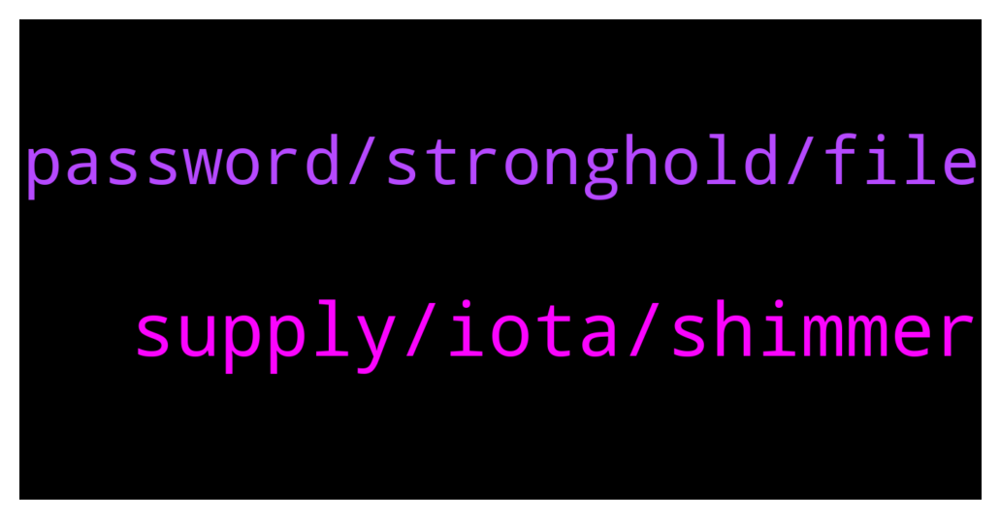

# **@iotatangle**
 ## Analysis for **2022-01-20** - **2022-01-21**.

---

## 📊 **Basic Stats**

**n_messages_sent**: 26

---

---

## 🔝 **Top keywords and related messages**

1. **supply, iota, shimmer**

    @Marklej --- *Hi i'm trying to migrate my iota token by the ledger from Trinity to fire fly. Everything going good iota legacy find my adres and tokens, when i want finalizing bybpushing Burton migrate app show me informatorom someting goes wrong. Aby idea what could happend?* **--->** [TG Discussion](https://t.me/iotatangle/307180)

    @regidosky --- *do u know what apr is?* **--->** [TG Discussion](https://t.me/iotatangle/307163)

    @Tahmis --- *Blockchain for sustainable energy and climate in the Global South Use cases and opportunities  http://www.socialalphafoundation.org/wp-content/uploads/2022/01/saf-blockchain-report-final-2022.pdf* **--->** [TG Discussion](https://t.me/iotatangle/307175)

    @FC --- *Not unless IOTA becomes more widely held and utilized* **--->** [TG Discussion](https://t.me/iotatangle/307200)

    @Zebrin3 --- *Will the value of shimmer and assembly compensate for downtrend* **--->** [TG Discussion](https://t.me/iotatangle/307199)

    @Ilham --- *🆕 [#FAQ /3] What is the max supply of $ASMB and $SMR? A: Max supply @assembly_net tokens: 100 billion w/ 8% inflation per annum Max supply @shimmernet tokens: total supply is defined by the total of staking rewards paid out to users within the current 90-day staking period* **--->** [TG Discussion](https://t.me/iotatangle/307186)

2. **password, stronghold, file**

    @Micky --- *Password and 24 words are in safe custody. But stronghold is in my pc. Any advice on this how I should look forward* **--->** [TG Discussion](https://t.me/iotatangle/307155)

    @Tahmis --- *If they also get your password. Then yes. You should keep them separated* **--->** [TG Discussion](https://t.me/iotatangle/307152)

    @Micky --- *What if stronghold file copied by someone.. is it possible for them to steal* **--->** [TG Discussion](https://t.me/iotatangle/307151)

    @ApolloniusTr --- *They tried, Referred me a website asking seed phrases. Blocked that person and reached peace of mind* **--->** [TG Discussion](https://t.me/iotatangle/307164)

    @Tahmis --- *I must say I'm also super careful with the stronghold file and store it on a hardware encrypted usb stick. Even though it should be safe to be stored almost anywhere as long as the password to it is strong and no one can find the password* **--->** [TG Discussion](https://t.me/iotatangle/307158)

    @Tahmis --- *If you have 24 words you need only that to access your wallet from anywhere* **--->** [TG Discussion](https://t.me/iotatangle/307157)

