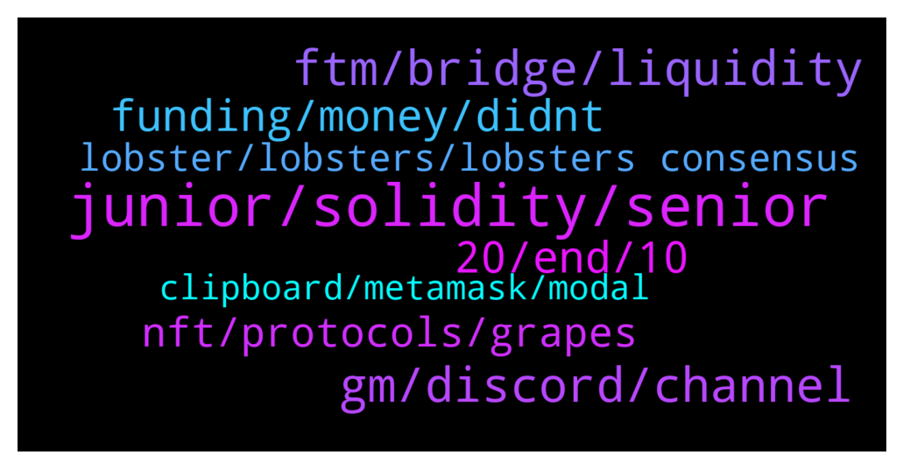

# **@lobsters_chat**
 ## Analysis for **2022-01-20** - **2022-01-21**.

---

## 📊 **Basic Stats**

**n_messages_sent**: 470

---

---

## 🔝 **Top keywords and related messages**

1. **junior, solidity, senior**

    @rocketdev --- *i did some pet projects and worked with one startup , integrating swaps and another defi projects, it went okay, tech stack like hardhat/react/typechain blabla , everything with tests, is it still junior level?* **--->** [TG Discussion](https://t.me/lobsters_chat/317516)

    @rocketdev --- *can anyone describe difference between junior solidity developer and middle solidity developer for example?* **--->** [TG Discussion](https://t.me/lobsters_chat/317445)

    @rocketdev --- *maybe someone can interview me for detect if im senior or junior solidity dev? 😕* **--->** [TG Discussion](https://t.me/lobsters_chat/317487)

    @Edward_F --- *If you have to ask then you are junior* **--->** [TG Discussion](https://t.me/lobsters_chat/317488)

    @joehquak --- *I would classify that as junior dev for sure* **--->** [TG Discussion](https://t.me/lobsters_chat/317524)

    @Figu3 --- *Wait, you can hire solidity devs at 2500$/ month ? 🤣* **--->** [TG Discussion](https://t.me/lobsters_chat/317495)

2. **ftm, bridge, liquidity**

    @Chiminiv9 --- *Almost no liquidity either. Like Mog said it's probably better to swap the FTM into something else to bridge it...* **--->** [TG Discussion](https://t.me/lobsters_chat/317339)

    @yic_alex --- *You got exploited. Looks like the wETH went to a wallet that's exploiting the Multichain exploit: https://etherscan.io/tx/0xc57d154089623364c1935389efeaac8c31d6ce489bff739b8b202bcc8d021836* **--->** [TG Discussion](https://t.me/lobsters_chat/317114)

    @MrHodl1 --- *Hey guys whats the best bridge with liquidity to bridge ftm from eth to fantom?* **--->** [TG Discussion](https://t.me/lobsters_chat/317315)

    @tinnehihi --- *People aped in ftm so hard, drainned the liquidity of ftm from bridge* **--->** [TG Discussion](https://t.me/lobsters_chat/317340)

    @MrHodl1 --- *I ended up bridging some ftm throuigh multichain.xyz but it is taking a long time for my test transaction to make it acreoss* **--->** [TG Discussion](https://t.me/lobsters_chat/317343)

    @Tiarizzi93 --- *https://app.fund.movr.network/ https://li.finance/  Check here, they are bridge aggregators* **--->** [TG Discussion](https://t.me/lobsters_chat/317323)

3. **gm, discord, channel**

    @Irgendwassonstwas --- *Is Daniele in this group? We're currently in development of a similar protocol mechanism and would be helpful to have a chat.* **--->** [TG Discussion](https://t.me/lobsters_chat/317222)

    @Sergelove --- *thank you Alex. now its all clear. 😭* **--->** [TG Discussion](https://t.me/lobsters_chat/317123)

    @trgnbn --- *Agreed. Behind the lol I am all supportive* **--->** [TG Discussion](https://t.me/lobsters_chat/317599)

    @amplice --- *i cant type here and press sell buttons at the same time ser* **--->** [TG Discussion](https://t.me/lobsters_chat/317294)

    @ArkyEvi --- *The evidence is in the code* **--->** [TG Discussion](https://t.me/lobsters_chat/317112)

    @duckdegen --- *who knows what bot on discord removes gm from a general channel to a gm channel, and also, that only allows "gm" or similar in gm ?* **--->** [TG Discussion](https://t.me/lobsters_chat/317614)

4. **20, end, 10**

    @PmRiviere --- *lol only in crypto. Can we consider it a whitehack if they are keeping 20% for themselves?  fun to watch anyway https://etherscan.io/tx/0x877c7f5501d31c2729b0a364dbf4e5913c83387d95ed6043328af5bb4c8d44e8* **--->** [TG Discussion](https://t.me/lobsters_chat/317126)

    @SpikeSpiege1 --- *Curious question. Can they be an end to "curve wars". I mean since everything just gets created out of thin air in crypto is there a stop? Build crv and instigate voting system. Cvx is built to monopolize that.  Creates cvx token. Why can't you just do this infinitely with each new protocol adding a slightly better advantage with higher apy with a new token on top to bribe you? Where does it end?* **--->** [TG Discussion](https://t.me/lobsters_chat/317429)

    @rocketdev --- *congrats , i think good job its 50% of your lucky then 50% skills* **--->** [TG Discussion](https://t.me/lobsters_chat/317545)

    @Sdtsll --- *1% to lobs weighed by lobs count ? or same amount to each address* **--->** [TG Discussion](https://t.me/lobsters_chat/316913)

    @ivangbi --- *More like 0.20 cause I bought ETH before that so got rugged by the fall* **--->** [TG Discussion](https://t.me/lobsters_chat/316990)

    @garethf --- *Do we know if the 1% to farms is spread equally between pools or if it’s total TVL based?* **--->** [TG Discussion](https://t.me/lobsters_chat/316910)

5. **funding, money, didnt**

    @Edward_F --- *They just want to sit on the money and charge 3% p.a.* **--->** [TG Discussion](https://t.me/lobsters_chat/317169)

    @yic_alex --- *The project/person affected? They have the highest stakes in it. Or do you mean someone who can help them to fix it?* **--->** [TG Discussion](https://t.me/lobsters_chat/317562)

    @mrm33seeks --- *So did the value of the assets in it.* **--->** [TG Discussion](https://t.me/lobsters_chat/317603)

    @cactushoes --- *Last I checked was no funding for it on ftx* **--->** [TG Discussion](https://t.me/lobsters_chat/317021)

    @killerkimothy --- *they probably didnt have to pay for gas* **--->** [TG Discussion](https://t.me/lobsters_chat/317046)

    @fozzysbo --- *Funding has been pretty in line with rewards* **--->** [TG Discussion](https://t.me/lobsters_chat/317015)

6. **nft, protocols, grapes**

    @basmag0x --- *do you have horse in race ser? if so disclosure could be good  anyway here is difference…  farm-to-get-NFT: zero-sum game. I get more TVL, you get NFT with less veSOLID. I get NFT with more veSOLID.  grapes: we don’t have a horse in race. the more veSOLID NFTs work with us, the more power all those who come get. this is positive sum. Your NFT does not become less worth than mine. Make sense?* **--->** [TG Discussion](https://t.me/lobsters_chat/317160)

    @alexinlife --- *i hear you but ultimately the crux is the same. you either print a new valueless governance token to directly get the nft or print it to encourage protocols to deposit theirs with you. i think you make references to the tune of "OG protocols of fantom deserve the nft" which I disagree with. The NFT isnt some 1 of 1 mint special thing. Its just a representation of locked tokens which ultimately all convex forks will acquire either by buying on market or getting users/protocols to deposit. So why not just get those tokens from the very beginning.* **--->** [TG Discussion](https://t.me/lobsters_chat/317156)

    @adrianleb --- *who would've thought that nft avenue is the future of the future of france* **--->** [TG Discussion](https://t.me/lobsters_chat/317213)

    @basmag0x --- *many ve(3,3) protocols launched recently - this is fine  but maybe people become confused with grapes  we DO NOT launch token or masterchef farming for making potemkin TVL on fantom to get NFT, NFT belong to real fantom projects working hard, making success for long time  we will work with project when they have NFT they deserve. they gib us NFT, help bootstrap grapes, we gib them ownership of grapes with GRP. positive sum synergy like boiled potato and shot of vodka* **--->** [TG Discussion](https://t.me/lobsters_chat/317138)

    @alexinlife --- *i dont think there's anything good or bad, moral or immoral about trying to get the nft. if anything, that projects are doing this implies the design choice of andre to reward top 20 defi protocols on ftm was arbitrary and new projects are having to rush through to have an equal playing ground in the future* **--->** [TG Discussion](https://t.me/lobsters_chat/317149)

    @alexinlife --- *the approach of grapes to rent the nfts is fine but you cant complain about protocols trying to get ownership of the same* **--->** [TG Discussion](https://t.me/lobsters_chat/317151)

7. **lobster, lobsters, lobsters consensus**

    @Chris_hodl --- *No way not in the lobsters group 🙃* **--->** [TG Discussion](https://t.me/lobsters_chat/317224)

    @ivangbi --- *Jeff s semi-lobster, he has been here for a while* **--->** [TG Discussion](https://t.me/lobsters_chat/317072)

    @Pantani0x --- *So is there a lobsters' consensus on Radial? It's supposed to launch in 30mins but there aren't any smart contracts released among other suspicious things.* **--->** [TG Discussion](https://t.me/lobsters_chat/316849)

    @oxethwhale --- *https://twitter.com/atlantis0x/status/1484308218293542917?s=20  If you're a holder of the lobsterdao nft, be sure to check the Atlantis World Server* **--->** [TG Discussion](https://t.me/lobsters_chat/317314)

    @fozzysbo --- *is radial a lobster person project?* **--->** [TG Discussion](https://t.me/lobsters_chat/317067)

    @enderwiggins1 --- *Any lobster from Seattle area?  going to this one tomorrow.. https://www.meetup.com/seattle-ethereum-meetup-group/ would love to grab beer!* **--->** [TG Discussion](https://t.me/lobsters_chat/316994)

