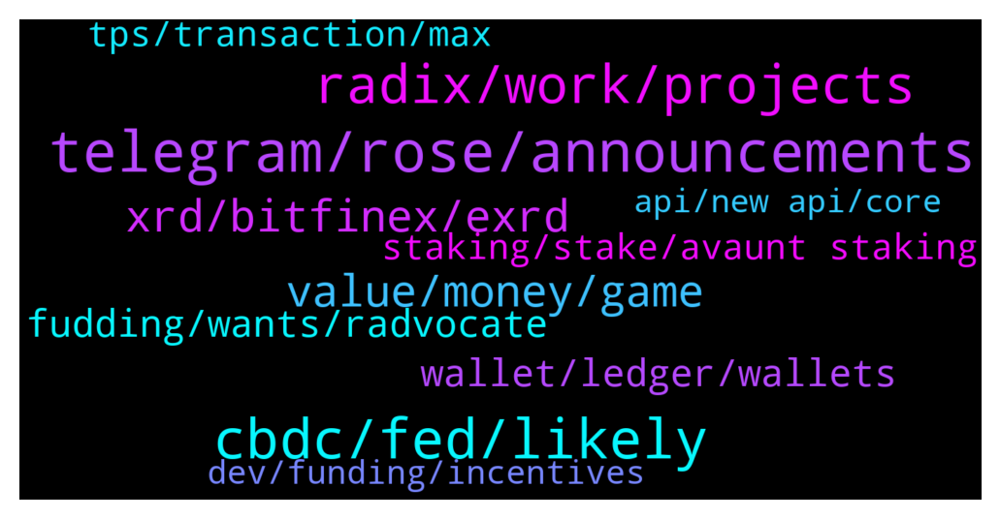

# **@radix_dlt**
 ## Analysis for **2022-01-20** - **2022-01-21**.

---

## 📊 **Basic Stats**

**n_messages_sent**: 676

---

---

## 🔝 **Top keywords and related messages**

1. **telegram, rose, announcements**

    @Avaunt --- *I'm probably stealing someone's thunder but yes. I thought we needed a little positive distraction. On Discord Node Runner Announcements* **--->** [TG Discussion](https://t.me/radix_dlt/343597)

    @Sentient_Sandwich --- *I'm your man... although I know nothing of any use* **--->** [TG Discussion](https://t.me/radix_dlt/343298)

    @Med --- *Thanks guys.. very happy to be part of this* **--->** [TG Discussion](https://t.me/radix_dlt/342978)

    @itsreisen --- *All right, I delete the message* **--->** [TG Discussion](https://t.me/radix_dlt/344007)

    @Cpt_Charles --- *#Podcast request: Cobie (@cobie on twitter) 👀* **--->** [TG Discussion](https://t.me/radix_dlt/343830)

    @Jacob_XRD --- *Nope sorry. It wasn’t a mistake, he saw I deleted his racist comment and doubled down again the 2nd time.* **--->** [TG Discussion](https://t.me/radix_dlt/343556)

2. **cbdc, fed, likely**

    @CryptoRadix --- *I wouldnt be looking at CBDC's as a bad thing guys, the fact that the governments around the world are all talking about this (seriously) is a testament that there is something here that can really improve the world economy. Additionally, CBDC's (or insured stablecoins) open the flood gates to new money into the space. I personally would be putting a lot more money on chain in stablecoins if I knew it had the same kind of FDIC insurance my bank account has...* **--->** [TG Discussion](https://t.me/radix_dlt/344259)

    @CryptoRadix --- *I mean governments are going to find a way to continue to take more of your money CBDC's or otherwise* **--->** [TG Discussion](https://t.me/radix_dlt/344276)

    @CryptoRadix --- *well so there is something to be said for that. A centralized ledger for USD_CBDC does give the fed all the control over transactions which is something the general public and probably corporations do not want. if CBDC was run on public DLT's that changes things I think.* **--->** [TG Discussion](https://t.me/radix_dlt/344261)

    @CryptoRadix --- *yeah agreed. seeing that Fed Now is taking 4 years? to implement and a CBDC is a MUCH larger scope...I doubt we will see it (beyond a trial / prototype) this decade* **--->** [TG Discussion](https://t.me/radix_dlt/344243)

    @CryptoRadix --- *the reality is that, whether we like it or not, CBDC's are probably coming. we should use it to our advantage whether its as simple as being an on ramp or more heavily integrated into the network itself* **--->** [TG Discussion](https://t.me/radix_dlt/344231)

    @CryptoRadix --- *yes but CBDC increases competition across governments. They make it much easier for a country to say "ehhh lets use EUR instead of USD" the Fed will have to compete against this and make sure their CBDC is the most attractive option. thats not happening to the same extent today because of all of the friction in the system. Its very clear that the Feds vision is complementary to the current system not a replacement. there would still be physical cash.* **--->** [TG Discussion](https://t.me/radix_dlt/344267)

3. **radix, work, projects**

    @ABCDEFG --- *Are there any more technically adept people that can respond to this argument against Radix on reddit? I believe there is a 'quick response' telegram group for when technical answers are needed, but I'm not sure what it's called. Thanks.* **--->** [TG Discussion](https://t.me/radix_dlt/343380)

    @Sciwalker --- *It's different thing, just happened to be using the same name. I am more curious on a more technical reply on that reddit comment though. Seemed like pretty big claim about Radix centralization* **--->** [TG Discussion](https://t.me/radix_dlt/343385)

    @Berndonlao --- *I have tried to search in website but not see any outcome yet, Please show it result of Radix work* **--->** [TG Discussion](https://t.me/radix_dlt/344278)

    @BRWTRADING --- *That sound right, but currently Radix isnt faster than Solana yet, till the delivery of Xi'an...* **--->** [TG Discussion](https://t.me/radix_dlt/344092)

    @1000x --- *Hi Jacob. I have a technical support issue about Radix, where should I open a case?* **--->** [TG Discussion](https://t.me/radix_dlt/343959)

    @peterkimkz --- *Sorry but what is Radix Hash Algorithm?* **--->** [TG Discussion](https://t.me/radix_dlt/343465)

4. **xrd, bitfinex, exrd**

    @1000x --- *Is there any way team extraction of XRD can be _good_ news?  I heard someone speculate big exchanges might be on the way. What is the timeframe for that?* **--->** [TG Discussion](https://t.me/radix_dlt/343367)

    @Face000 --- *The price of the xrd is only red color Whats happening with the crypto* **--->** [TG Discussion](https://t.me/radix_dlt/343427)

    @Tamás --- *I am not sure I understand you question, but Bitfinex supports native XRD* **--->** [TG Discussion](https://t.me/radix_dlt/344024)

    @nagybalazs --- *So i have to send my exrd to bitfinex via erc20 then send from bitfinex XRD to the desktop wallet?* **--->** [TG Discussion](https://t.me/radix_dlt/343004)

    @ScottyM05 --- *Thank you, so might it be cheaper to sell my eRDX into USDT, transfer my USDT over to Bitfinex and then just purchase XRD from there?* **--->** [TG Discussion](https://t.me/radix_dlt/343163)

    @shahzaibak --- *so now that the API gateway works we can withdraw from bitfinex using a normal address right* **--->** [TG Discussion](https://t.me/radix_dlt/343924)

5. **value, money, game**

    @PeterFATAss --- *Most of the high value collectibles are just funny for billionaires or money londering. They have 0 value* **--->** [TG Discussion](https://t.me/radix_dlt/344166)

    @aus87 --- *Yeah probably no Art has any value 😏* **--->** [TG Discussion](https://t.me/radix_dlt/344171)

    @Kafkafrate --- *I think the issue with mmorpgs and why they slowly died is because they required a lot of time to invest. The wow generation was growing characters to lvl 60-70 with thousands of hours. And at the end of it they couldn't even sell them. Maybe nfts solve this now but still, suck too much time. Short competitive gaming is more about skill rather than hours collecting stuff, which makes sense because it's closer to a sport.* **--->** [TG Discussion](https://t.me/radix_dlt/343831)

    @RadixMonk --- *I loved playing MMORPGs as a kid. Sadly, all the big ones died out im the 2010s and were replaced by moba/competitive games.* **--->** [TG Discussion](https://t.me/radix_dlt/343809)

    @korone_stan --- *money is fake, it's a corrosive abstraction grafted onto nature, truly perverse stuff. but Beauty is real* **--->** [TG Discussion](https://t.me/radix_dlt/344181)

    @aus87 --- *Imagine the new "wow" launching on radix.  All trade on ledger, all "gold" as tokenized.  all gear tradable and able to sell on "wowswap".  I dont see how this isnt being built as we speak... theres just too much money to be made.* **--->** [TG Discussion](https://t.me/radix_dlt/343835)

6. **wallet, ledger, wallets**

    @Mleekko --- *Not with the official wallet. But if you trust random people on the internet you can use my custom Wallet build: https://github.com/Mleekko/olympia-wallet/releases It still supports only one HW at a time, so to use another HW account, you need to delete the current one and add the new one. to switch back you again delete the acc and add the previous one.* **--->** [TG Discussion](https://t.me/radix_dlt/344050)

    @Zloliver --- *Yeah, thanks! Is there a limit to how many such sub-wallets I can add to my primary wallet and can anyone tell that they are all derived from the same seed phrase? For example, when trading OTC alts with Radix community on Telegram, I don't mind sharing my wallet but don't wanna share it on Twitter for airdrops etc - would prefer to have a couple of these set up.* **--->** [TG Discussion](https://t.me/radix_dlt/344036)

    @Artistizen --- *I thought you were refering to these on Radix ledger. My mistake.* **--->** [TG Discussion](https://t.me/radix_dlt/344161)

    @Alex --- *Hey guys I need help please! Somehow I cant find the radix app on ledger live ( i just updated it today)* **--->** [TG Discussion](https://t.me/radix_dlt/344063)

    @Artistizen --- *You can also have your own ping service on your server. In your case with SVG Nerds - on ledger is a great option, that other formats do not have.* **--->** [TG Discussion](https://t.me/radix_dlt/344200)

    @Matus1682 --- *hi guys, i am looking to setup another wallet address on my wallet, but i want it to be generated from my ledger nano s - have another HW wallet address. i cant seem to be able to do it with the current version of the radix wallet. any thoughts?* **--->** [TG Discussion](https://t.me/radix_dlt/344096)

7. **fudding, wants, radvocate**

    @mx471 --- *Tough measure. His criticism was at least not completely unfounded and it is always interesting to see the opinions of outsiders (as long as they are not pure bashing).* **--->** [TG Discussion](https://t.me/radix_dlt/343128)

    @a00000333 --- *But it’s true tho always some uncessary drama that could easily be avoided. Almost blind to sensibilities. No one wants  unecessary drama at this stage. But booting bc he said someone should be fired (which i also a turn of speech) is OTT* **--->** [TG Discussion](https://t.me/radix_dlt/343300)

    @NotBen --- *He decided to resign as mod* **--->** [TG Discussion](https://t.me/radix_dlt/343215)

    @Christophe --- *Why should someone do if he stacked his radix months ago and the total hasn’t moved?* **--->** [TG Discussion](https://t.me/radix_dlt/343999)

    @a00000333 --- *Sure. Understandable. Legitimate reasons to remove (not considering how much he has done for radix community over the years), but i’d like to know what he was upset about* **--->** [TG Discussion](https://t.me/radix_dlt/343277)

    @Tulzscha --- *Just as round as Karl Pilkingtons head...* **--->** [TG Discussion](https://t.me/radix_dlt/343182)

8. **tps, transaction, max**

    @Sinan_BH --- *Hello, I am trying learn a bit about crypto. It is diffucult for me understanging numbers. Can someone explain how bsc operate 13 million transfers in one day while it has approx 100 tps? Is tps and daily transactions totaly differant concepts? I am questioning it to make sense about radix* **--->** [TG Discussion](https://t.me/radix_dlt/343466)

    @aus87 --- *up to 50 tps for now if I am not mistaken* **--->** [TG Discussion](https://t.me/radix_dlt/344070)

    @BRWTRADING --- *At which speed (TPS) is running Scrypto?* **--->** [TG Discussion](https://t.me/radix_dlt/344069)

    @fpieper --- *Also Dan said in his last AMA that they tested Olympia with up to 150 TPS and just went with a very robust lower value.* **--->** [TG Discussion](https://t.me/radix_dlt/344082)

    @fpieper --- *Meaning if there is a need for more throughput they can increase the TPS if needed.* **--->** [TG Discussion](https://t.me/radix_dlt/344084)

    @Sturlison_98 --- *24h*60min*60sec*100 TPS = 8.64m Transactions per day* **--->** [TG Discussion](https://t.me/radix_dlt/343469)

9. **staking, stake, avaunt staking**

    @Smwau2001 --- *If Radix gets to $5 what do you think the staking APY will be at?* **--->** [TG Discussion](https://t.me/radix_dlt/343420)

    @aus87 --- *What will be the motivations for picking between staking to another node or starting your own node post xi'an?* **--->** [TG Discussion](https://t.me/radix_dlt/343509)

    @ledtdg --- *Does It pays me if i stake 2k radix?* **--->** [TG Discussion](https://t.me/radix_dlt/342998)

    @Tevaun --- *Hey guys. I’ve been staking my radix for a few months now and it hasn’t increased. Anyone experience the same thing?* **--->** [TG Discussion](https://t.me/radix_dlt/343972)

    @ledtdg --- *Hello guys Is a good idea ti put 2k rdx in stake? Has stake some dangerous thinkgs?* **--->** [TG Discussion](https://t.me/radix_dlt/342992)

    @Peter (HAM) --- *Depends on the validators you stake to. https://www.radixscan.io/ValidatorTable.shtml* **--->** [TG Discussion](https://t.me/radix_dlt/343685)

10. **dev, funding, incentives**

    @ITProfligate --- *So we hope, but I don’t know if the incentives are correctly alligned, since no one gives such an analysis. I just find it very odd that there is a $600 mil dev fund, but no business analysis around it eg why this size and not bigger, what will be awarded for what and when? What are the immediate and near time goals or plans? Someone said in a recent message (@tesslerc in another group) there is an infinite amount of new talent. Just not true, all of this world of crypto depends on other areas which depend on other areas … and they all depend on software engineers building, tweeking, debugging. Good devs are a rare talent, they take time to encourage and nuture. If this is going to happen we need to get this right at the very least.* **--->** [TG Discussion](https://t.me/radix_dlt/343105)

    @chrisijoyah --- *This might answer some questions in regards to the developer fund https://youtu.be/HUTBCoz5esE?t=1985* **--->** [TG Discussion](https://t.me/radix_dlt/343923)

    @chrisijoyah --- *My understanding of the funding was based on components. Developers would get some sort of royalty for the fee.* **--->** [TG Discussion](https://t.me/radix_dlt/343127)

    @chrisijoyah --- *Is this dev fund specifically for the rewards system for building components and does it include funding for projects too 👀* **--->** [TG Discussion](https://t.me/radix_dlt/343117)

    @MaximusGirthian --- *This raises some good questions about the dev fund that i think could be answered in the   #Roundtable  There's a reserve of 600m xrd earmarked as dev funds. So far the only dev rewards that i personally have heard about is a small sign up bonus and a fairly small reward for deploying a simple blueprint. This leaves a massive amount of funding.   Bearing in mind that developers can already start building with scrypto, when, and how, will this funding be used?   And as a follow up question, can funds be used for things adjacent to the development of scrypto components. For example, I've been contemplating something that would interact with copyrighted work. To turn it into a functional project i would, at a late stage, need assistance with legal aspects. Would that be eligible for funding?* **--->** [TG Discussion](https://t.me/radix_dlt/343462)

    @chrisijoyah --- *$600M dev funding 😮 Nobody knows for sure what the future may hold, but I have a very strong belief in DAOs, and this is what has inspired me to build Adept. In terms of incentives for software engineers,  not all are driven by money, some just like to build for the tester cause, and I guess that’s why we have lots of open source projects.* **--->** [TG Discussion](https://t.me/radix_dlt/343108)

