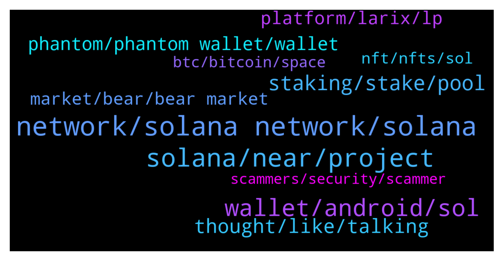

# **@solana**
 ## Analysis for **2022-01-20** - **2022-01-21**.

---

## 📊 **Basic Stats**

**n_messages_sent**: 585

---

---

## 🔝 **Top keywords and related messages**

1. **network, solana network, solana**

    @Gengxin7 --- *Solana is trash 🗑️🗑️ . I can't trade because network always crashing* **--->** [TG Discussion](https://t.me/solana/910425)

    @MrDrowning --- *hi! is solana having some issues? trying to send some SOL to exchange and confirmation is taking ages* **--->** [TG Discussion](https://t.me/solana/910342)

    @ardatug --- *Anyone know what's the problem with solana network or binance? I'm trying to sell a small amount of solana on binance but I'm at waiting for 15minute right now.* **--->** [TG Discussion](https://t.me/solana/910146)

    @Ral_87 --- *damn solana need to fix congestion , swapping is not happening on my end* **--->** [TG Discussion](https://t.me/solana/910472)

    @DeepThoughtFortyTwo --- *6:21 pm Jan 20 - Transactions per second: 361 per Solana . com front page. Nothing is going through, every evening the same thing for weeks now. Good luck with this "Visa of crypto."* **--->** [TG Discussion](https://t.me/solana/910290)

    @DeepThoughtFortyTwo --- *Solana is 100% the fastest network 10% of the time* **--->** [TG Discussion](https://t.me/solana/910475)

2. **solana, near, project**

    @cryptonium93 --- *So Solana can't handle its success?* **--->** [TG Discussion](https://t.me/solana/910535)

    @Gabriele21R --- *What's the problem right on Solana ?* **--->** [TG Discussion](https://t.me/solana/911031)

    @DeepThoughtFortyTwo --- *Proof of Work is dead. Only NEAR and AVAX could compete with Solana* **--->** [TG Discussion](https://t.me/solana/910479)

    @Boragora --- *Francium too, they are one of the winners of past year Solana's competition* **--->** [TG Discussion](https://t.me/solana/909780)

    @MarginCallSbe --- *Solana is not bad, currently Solona is one of the best protocol.* **--->** [TG Discussion](https://t.me/solana/911212)

    @UnknownIdentity --- *Solana is future . This is the time to have it in your bag . Look into the project before buy #SOL* **--->** [TG Discussion](https://t.me/solana/910408)

3. **wallet, android, sol**

    @cryptolover1987 --- *You can try this 👇🏻  List of DEX’s are:  1. https://dex.projectserum.com  2. https://www.dexlab.space  3. https://swap.doce.finance  4. https://dex.bonfida.com  5. https://solible.com  6. https://dex.raydium.io  7. https://bonfida.com  8. https://www.orca.so  9.  https://saber.so* **--->** [TG Discussion](https://t.me/solana/909698)

    @denizalagoz --- *Hi. I'm going to post the Wrapped Sol, but I have to convert it to SOL first. From which site can I do this the easiest? Thank you.* **--->** [TG Discussion](https://t.me/solana/909002)

    @mahib45 --- *Hello 👋 Always do your own research! Solana is a blockchain that anyone can build on!  The latest update can be found here  https://twitter.com/Solana_Mates* **--->** [TG Discussion](https://t.me/solana/910025)

    @Muhammad --- *Hello is trust wallet is safe for solana?* **--->** [TG Discussion](https://t.me/solana/910611)

    @cryptolover1987 --- *Yes it is. Also have a look on other wallets too  https://t.me/solana/910496* **--->** [TG Discussion](https://t.me/solana/910649)

    @thebrokehustler --- *Hey I just saw this too, StrikeX seem to be releasing a mobile wallet which supports the solana blockchain.. seems pretty cool and I like the interface on it myself* **--->** [TG Discussion](https://t.me/solana/909048)

4. **staking, stake, pool**

    @cryptolover1987 --- *Most of people use solflare and phantom  Staking options are:  https://t.me/solana/758519* **--->** [TG Discussion](https://t.me/solana/910654)

    @R --- *I'm not talking about "Cardano"??? I'm talking about where is the best pool to stake my SOL tokens?* **--->** [TG Discussion](https://t.me/solana/910756)

    @cryptolover1987 --- *There is no minimum SOL is required to start staking. But I would say, go with 0.01 or more SOL to ensure you can stake successfully, as well as pay the Solana staking network transaction fee.* **--->** [TG Discussion](https://t.me/solana/908809)

    @cryptolover1987 --- *That means 10% commission fee will be deducted from your every staking reward.* **--->** [TG Discussion](https://t.me/solana/908794)

    @R --- *The name of my current staking pool where my SOL. It's called "Chainflow"* **--->** [TG Discussion](https://t.me/solana/910741)

    @R --- *Which is the best pool to stake your SOL into??* **--->** [TG Discussion](https://t.me/solana/910651)

5. **thought, like, talking**

    @Me --- *Hahaha I’m Me not You 😂😂👻* **--->** [TG Discussion](https://t.me/solana/909960)

    @Monterrey_Rice --- *ha and here I always thought that I was me, and you were you, but it seems like you are me, and I am not. lololol* **--->** [TG Discussion](https://t.me/solana/909961)

    @Henry --- *I was worried earlier. I thought it's just me.* **--->** [TG Discussion](https://t.me/solana/910467)

    @InsaneYinYang --- *I’m just bad at this I think* **--->** [TG Discussion](https://t.me/solana/910268)

    @Emmly I. --- *You just got quick at saying newbies lol !  Mate you can’t skip these process ! You don’t need to deceive yourself .* **--->** [TG Discussion](https://t.me/solana/909434)

    @Emmly I. --- *Why are you agreeing to these now ?   👀* **--->** [TG Discussion](https://t.me/solana/909435)

6. **phantom, phantom wallet, wallet**

    @Young0981 --- *I am not able to transfer Solana from my phantom wallet to any other wallet. I have tried to send it other wallets but seems like nothing is working. It keep loading which results in nothing.* **--->** [TG Discussion](https://t.me/solana/910204)

    @hn155210 --- *i have 100000Uscd need withdrow from  phantom but it cant send why?!* **--->** [TG Discussion](https://t.me/solana/911155)

    @Tannor --- *Hey I was wondering if you can send Solana to Coinbase from Phantom wallet, I sent some Solana 3 days ago and haven't received anything. I talked to coinbase support and they were no help?* **--->** [TG Discussion](https://t.me/solana/908831)

    @Iamdeadlyz --- *Looks sus. Don't proceed @rancid83 ⚠️  You can simply click the NFT on Phantom, then select send. Paste the SOL address then send.* **--->** [TG Discussion](https://t.me/solana/909746)

    @OsmnBr --- *Where can I get txid in phantom wallet?* **--->** [TG Discussion](https://t.me/solana/910026)

    @ahmadupb --- *Hello admin how lond does it take to transfer funds. Its been 2 hours I sent SOL and still not recieved in phantom wallet.* **--->** [TG Discussion](https://t.me/solana/909806)

7. **platform, larix, lp**

    @Monterrey_Rice --- *Hey fam, try step finance or bonfida* **--->** [TG Discussion](https://t.me/solana/909011)

    @Kaybaba2 --- *Yh, it's safe and I'm taking advantage of that. Larix is a lending and borrowing platform on solana audited by a reputable firm. With Larix you can enjoy auto compound rewards* **--->** [TG Discussion](https://t.me/solana/909358)

    @Kaybaba2 --- *Yh, very amazing APY Use larix you will definitely love them.  And yes you can borrow after lending💪* **--->** [TG Discussion](https://t.me/solana/909366)

    @Kaybaba2 --- *Very useful 😁✅ Larix is the way to go in lending and borrowing on solana* **--->** [TG Discussion](https://t.me/solana/909541)

    @CallMeAlanWalker --- *I have looked through their site. You are right sir. I can lend LP and borrow other assets. It’s quite useful.* **--->** [TG Discussion](https://t.me/solana/909473)

    @Kaybaba2 --- *I have been using the Larix platform for awhile and it's been awesome🚀🥂* **--->** [TG Discussion](https://t.me/solana/909359)

8. **market, bear, bear market**

    @Omer --- *Wath happening With thé market today* **--->** [TG Discussion](https://t.me/solana/910912)

    @Rob --- *Any idea how long it(market) can remain bearish?* **--->** [TG Discussion](https://t.me/solana/910673)

    @lyliageisha --- *The market isn’t good that much these days* **--->** [TG Discussion](https://t.me/solana/909587)

    @Javier --- *Good to see some green in the market today* **--->** [TG Discussion](https://t.me/solana/909769)

    @V --- *Market up after daily tsunami s* **--->** [TG Discussion](https://t.me/solana/909773)

    @Emmly I. --- *Yeah ! The market is still downtrends* **--->** [TG Discussion](https://t.me/solana/910009)

9. **nft, nfts, sol**

    @gracesmi21 --- *How many sol did you add for what about of nft ?* **--->** [TG Discussion](https://t.me/solana/910668)

    @AltcoinFacts --- *Been trying to purchase NFT, but nothing goes through. This happened a few days ago, my orders failed and I was still charged 10 Sol. You really need to fix this. Ty* **--->** [TG Discussion](https://t.me/solana/911191)

    @Jsph15 --- *Do ya'll have a good sol nft project  that you can share?* **--->** [TG Discussion](https://t.me/solana/909606)

    @Fz66981 --- *Hi I tried to upload nft to arweave-sol But it keep saying not enough funds, which I have put enough sol in the wallet..  Anyone knows to solve urgent🙏* **--->** [TG Discussion](https://t.me/solana/910663)

    @Fz66981 --- *just 2 nfts, i put 1 sol in the wallet* **--->** [TG Discussion](https://t.me/solana/910669)

    @elizabeth_baker --- *So sad. Big Daddy Ape Nft ended as a Rug pull. I always had my doubts 💆‍♀* **--->** [TG Discussion](https://t.me/solana/910532)

10. **btc, bitcoin, space**

    @likewinni --- *BTC fell to $38,000 and will fall in the future* **--->** [TG Discussion](https://t.me/solana/910584)

    @Basara333 --- *What’s the FUD why is BTC going below 40k?* **--->** [TG Discussion](https://t.me/solana/910508)

    @Abhinav552 --- *Whales and institutional investors are creating a panic in market so that they get coins at cheap price for future profit 🤬* **--->** [TG Discussion](https://t.me/solana/909564)

    @DmitrSS --- *Nasdaq and sp500 down and bitcoin down* **--->** [TG Discussion](https://t.me/solana/911097)

    @marthinae --- *And hence the BTC $ slide may not be taken with huge concern and sensitivity in the upcoming days.* **--->** [TG Discussion](https://t.me/solana/909282)

    @jin_n_nnnn --- *Bitcoin's drop in the first ten days of 2022 is still less disappointing than some of its top crypto rivals that have slide much harder.* **--->** [TG Discussion](https://t.me/solana/909229)

