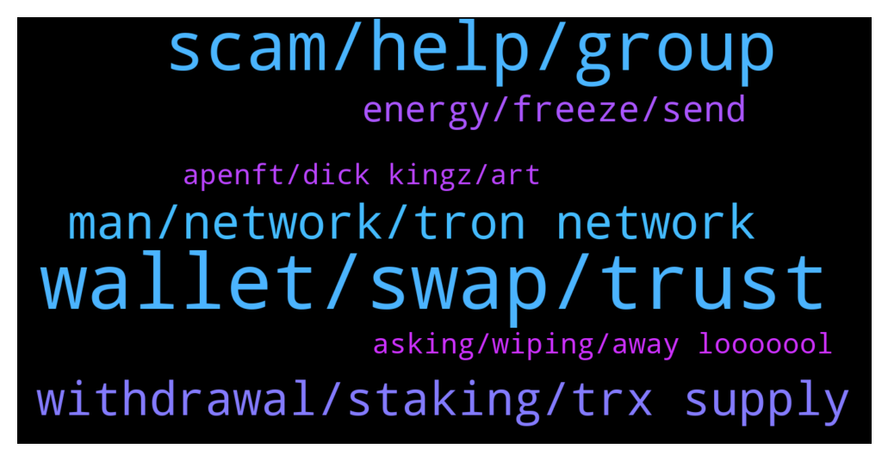

# **@tronnetworkEN**
 ## Analysis for **2022-01-20** - **2022-01-21**.

---

## 📊 **Basic Stats**

**n_messages_sent**: 242

---

---

## 🔝 **Top keywords and related messages**

1. **wallet, swap, trust**

    @Developed_United_Company --- *I shared my wallet address in Link and I was surprised after a week that my balance was withdrawn from the wallet. Can I get my money back?* **--->** [TG Discussion](https://t.me/tronnetworkEN/3844655)

    @Sam --- *How it possible??!? I can send you a sc shot from my wallet  You can see my transaction history  I didnt get anything* **--->** [TG Discussion](https://t.me/tronnetworkEN/3844281)

    @ENIGMA --- *Add all btt token and close and reopen the app* **--->** [TG Discussion](https://t.me/tronnetworkEN/3844320)

    @Sam --- *I do it many time  Even I deleted my trust and recover it again but not different.* **--->** [TG Discussion](https://t.me/tronnetworkEN/3844322)

    @Sam --- *Yes  Sure  Because its not only for mine  One of my friend has a exactly same problem  And we learn that is problem of many guys  I have 3 transactions with this problem* **--->** [TG Discussion](https://t.me/tronnetworkEN/3844239)

    @Jeffrey PCS --- *I did that but it’s not showing the balance I have on my wallets on the PancakeSwap* **--->** [TG Discussion](https://t.me/tronnetworkEN/3845343)

2. **scam, help, group**

    @boureima Amadou --- *Who Can send le the link of the groupe i Will joi* **--->** [TG Discussion](https://t.me/tronnetworkEN/3845728)

    @MilNoslen --- *Doesnt matter. Could be malicious website, a smart contract approval, etc.* **--->** [TG Discussion](https://t.me/tronnetworkEN/3844792)

    @iammdtopor --- *There’s a f🤬ckn scammer in this group trying to get your secret recovery phrase* **--->** [TG Discussion](https://t.me/tronnetworkEN/3843638)

    @lETHEREUM --- *Also I want to point out a website which he sent to me* **--->** [TG Discussion](https://t.me/tronnetworkEN/3843268)

    @jarcola --- *Can an administrator message me I need to verify a link to see If it is legit* **--->** [TG Discussion](https://t.me/tronnetworkEN/3844941)

    @simon866 --- *unfortunately there is a concentrated effort to scam investors with mining offerings  Even the ecosystem is on a rewards basis so hopefully investors avoid these scams* **--->** [TG Discussion](https://t.me/tronnetworkEN/3844054)

3. **man, network, tron network**

    @Sam --- *Guys  Im old holder of Tron and Btt  and And it's very painful for me to have been holding a currency all this time, but now that I have a problem I can not find a team to talk to.  This is a big weakness for this network.  It is true that Tron is decentralized, but it definitely needs a support team.  If you have access to higher layers, please raise this issue with them, even as a suggestion* **--->** [TG Discussion](https://t.me/tronnetworkEN/3844299)

    @Wendys --- *Is this same as tron 24* **--->** [TG Discussion](https://t.me/tronnetworkEN/3845298)

    @Sam --- *This support was very valuable to me because I had not received any response for several days. And it was really annoying* **--->** [TG Discussion](https://t.me/tronnetworkEN/3844336)

    @SchooleyD --- *I think the confusion with Tron mining is TRX and the tron ecosystem* **--->** [TG Discussion](https://t.me/tronnetworkEN/3844052)

    @Carlos_TRX --- *Hi, explain me your problem pls, there is no TRON support* **--->** [TG Discussion](https://t.me/tronnetworkEN/3844248)

    @Carlos_TRX --- *https://tronwiki.com <—— check this to know more about TRON ecosystem* **--->** [TG Discussion](https://t.me/tronnetworkEN/3845794)

4. **withdrawal, staking, trx supply**

    @Nkeonyemetalu --- *Yes  TRX With BUSD on pancake swap* **--->** [TG Discussion](https://t.me/tronnetworkEN/3843194)

    @A_JarsLife_Thomas --- *Hi guys! Does anyone have TRX on staking in JustLend?* **--->** [TG Discussion](https://t.me/tronnetworkEN/3842415)

    @Moneyversac --- *Next time better buy on an exchange so you get the orginal TRX, but it's not a problem since price is 1:1 no matter which Blockchain you use* **--->** [TG Discussion](https://t.me/tronnetworkEN/3843211)

    @Fabs_trx --- *Or let 50-60 trx on the side* **--->** [TG Discussion](https://t.me/tronnetworkEN/3843032)

    @A_JarsLife_Thomas --- *I got them! I cannot unstake my jTrx even if I have enough TRX, Bandwith and Energy* **--->** [TG Discussion](https://t.me/tronnetworkEN/3842982)

    @KingsDove_TRX --- *TRX is in a dip 👀* **--->** [TG Discussion](https://t.me/tronnetworkEN/3846036)

5. **energy, freeze, send**

    @xPommepote --- *No, it will gain energy time after time but not reset every 24h* **--->** [TG Discussion](https://t.me/tronnetworkEN/3844455)

    @simon866 --- *When you freeze for energy select freeze to another address option 👍* **--->** [TG Discussion](https://t.me/tronnetworkEN/3844319)

    @Severian_8 --- *Will the energy replenish in the wallet I send the energy to every 24hrs?* **--->** [TG Discussion](https://t.me/tronnetworkEN/3844450)

    @Severian_8 --- *why will the 2nd wallet I send energy to gain energy time after time but not every 24hrs?* **--->** [TG Discussion](https://t.me/tronnetworkEN/3844509)

    @Severian_8 --- *Can Energy & Bandwidth be transferred to another wallet without renting it?  I want to send 400,000 energy from one wallet to another so I can interact with a smart contract. Is there a way to do that without renting it for 36 trx?* **--->** [TG Discussion](https://t.me/tronnetworkEN/3844315)

    @agentpiki --- *The energy consumed seems too low, and I think it is just the "approval" phase.* **--->** [TG Discussion](https://t.me/tronnetworkEN/3845595)

6. **asking, wiping, away looooool**

    @simon866 --- *Yeah starting to seem that way 🤔* **--->** [TG Discussion](https://t.me/tronnetworkEN/3844306)

    @simon866 --- *Yep stay away from it 👍* **--->** [TG Discussion](https://t.me/tronnetworkEN/3845660)

    @MilNoslen --- *Looooool what did you expect. No of course not* **--->** [TG Discussion](https://t.me/tronnetworkEN/3844656)

    @agentpiki --- *Hey, you have been learning 👌👌 that's good sign* **--->** [TG Discussion](https://t.me/tronnetworkEN/3842721)

    @Officialsuko --- *You're asking people to connect their seed phrase, that's not cool, you're wiping them of their hard earned 💰.* **--->** [TG Discussion](https://t.me/tronnetworkEN/3842378)

    @Hamedtx --- *Thank you . I'm aware 👍* **--->** [TG Discussion](https://t.me/tronnetworkEN/3843475)

7. **apenft, dick kingz, art**

    @PiterSpain --- *APENFT AMA is coming tomorrow! Let's take a tour of the APENFT Foundation's heirloom art treasures worth more than $150 million with @sydney_xiong!   ✅Guest:  Syndey Xiong (Chief Art Director of APENFT)  ⏰Time：Jan 21th, 2022 3pm（GMT+8） Live here：https://t.me/tronnetworkCN  https://twitter.com/apenftorg/status/1484047789659406338* **--->** [TG Discussion](https://t.me/tronnetworkEN/3843336)

    @agentpiki --- *Buy tron and freeze!!! And you will be rewarded nicely 🤑🤑🤑* **--->** [TG Discussion](https://t.me/tronnetworkEN/3845119)

    @agentpiki --- *Yes best time to invest! Tron has strong support* **--->** [TG Discussion](https://t.me/tronnetworkEN/3845114)

    @guo_r_av --- *Tron is doing well on Feb* **--->** [TG Discussion](https://t.me/tronnetworkEN/3842391)

    @Mulrabbit --- *Will tron goes over 10$ What Do you think?* **--->** [TG Discussion](https://t.me/tronnetworkEN/3844236)

    @Gomer77777 --- *Please connect ILV  to TRC-20 🔥  Ethereum is very expensive !!  Dick Kingz: Maybe in the future if the dao wishes so   And what is needed for dao tron to launch ILV tokens ?  Dick Kingz: A proper proposal and the community to agree with it and then the council to vote on it and approve* **--->** [TG Discussion](https://t.me/tronnetworkEN/3843952)

