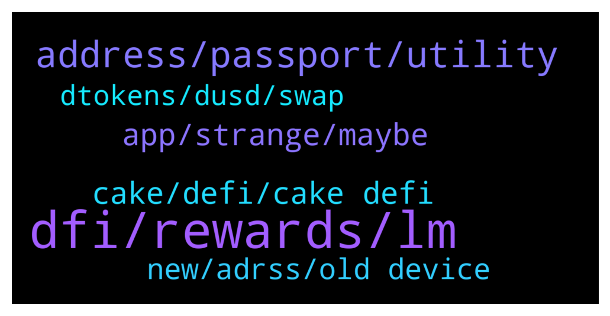

# **@CakeDeFi_EN**
 ## Analysis for **2022-01-21** - **2022-01-22**.

---

## 📊 **Basic Stats**

**n_messages_sent**: 125

---

---

## 🔝 **Top keywords and related messages**

1. **dfi, rewards, lm**

    @Stephan --- *Thanks for the answer, but in that case I would have to add all up right? I meant to have an Overview like on the main page where I can see how many DFI I have earned in the last week/month etc* **--->** [TG Discussion](https://t.me/CakeDeFi_EN/167270)

    @Stephan --- *That makes sense, so receiving less DFI as reward does not correlate with actual Dollar price of DFI, but rather with how many ppl are in the LM pool correct?* **--->** [TG Discussion](https://t.me/CakeDeFi_EN/166971)

    @rhodium219 --- *Thanks, I'm aware of that and I seldom bother to look at the estimate APR as this is indeed an estimate. I'm asking from experience, what has changed since last week that would cause a 10% reduction in the LM rewards? Do you know? Can I find out? For example it could be that we now have 10% more investment in the LM pool. Which would be great. It could be that the LM rewards have been reduced because they have been diverted to other schemes. I was just interested in understanding what has happened so I can manage my own expectations.* **--->** [TG Discussion](https://t.me/CakeDeFi_EN/167002)

    @Nazhadi57 --- *May I know what the LP mining reward APRs depend on? Token prices? Or liquidity volume* **--->** [TG Discussion](https://t.me/CakeDeFi_EN/166902)

    @Stephan --- *Is there any possiblity to see how much DFI one has earned? (not USD)* **--->** [TG Discussion](https://t.me/CakeDeFi_EN/167263)

    @Nazhadi57 --- *LM APRs keep doing down and down.. based on past experience, how long can they go? Need evaluate if it’s worth staking the LPs if the rewards are too low* **--->** [TG Discussion](https://t.me/CakeDeFi_EN/167257)

2. **address, passport, utility**

    @Rahatox --- *Yest .but they are wanting the utility bill also .Please dont offend ,But what shoul i do* **--->** [TG Discussion](https://t.me/CakeDeFi_EN/166940)

    @Rahatox --- *But you have to understand ,Not every people dont stay at their hometown,as i provide my passport and other documents .it should better be verified* **--->** [TG Discussion](https://t.me/CakeDeFi_EN/166937)

    @Michael_Schredl --- *The addresses have to match on all documents* **--->** [TG Discussion](https://t.me/CakeDeFi_EN/166934)

    @Rahatox --- *I tried to verify my id but they rejected it .My passport address is my hometown address ..and i also submitted the utility bill of my present address ..is it okay* **--->** [TG Discussion](https://t.me/CakeDeFi_EN/166933)

    @random43210 --- *How can I re-verify my residence if I move to another country?* **--->** [TG Discussion](https://t.me/CakeDeFi_EN/167075)

    @mm_phoenix --- *Cake Pte Ltd, registered in Singapore 201918368M https://www.cakedefi.com/imprint/* **--->** [TG Discussion](https://t.me/CakeDeFi_EN/167197)

3. **app, strange, maybe**

    @Michael_Schredl --- *Yep, that is disabled for them :)* **--->** [TG Discussion](https://t.me/CakeDeFi_EN/167026)

    @Brian --- *Yea.. really weird. But I am now able to login through the website thanks to you😊* **--->** [TG Discussion](https://t.me/CakeDeFi_EN/166899)

    @DmgBautista --- *Hi! No, everything working fine, just entered to try it. Have you tried other browsers? Try and clear your cache, sometimes it may help. Also, maintenances are announced in our announcement channel. Join it to be up to date with the latest news! 🙂* **--->** [TG Discussion](https://t.me/CakeDeFi_EN/166889)

    @DmgBautista --- *That's strange. Never heard that from any user, if there was any problem with the IOS app, more than garanteed that half of the telegram group would have been making quite a fuss on that. Maybe some update that went less well? I am sorry, but if you could not use the app since like forever, that is really strange, and to my best knowledge, quite unique 😕* **--->** [TG Discussion](https://t.me/CakeDeFi_EN/166894)

    @DmgBautista --- *That's strange. Let me check my app to see if there is some bug at the moment. BRB!* **--->** [TG Discussion](https://t.me/CakeDeFi_EN/166833)

    @Wanshare111 --- *You can chek whu i cantnot login?* **--->** [TG Discussion](https://t.me/CakeDeFi_EN/166800)

4. **cake, defi, cake defi**

    @Brian --- *Thanks for replying! Yea, I joined that channel too. So it’s a lil weird that cake defi website keep showing me it’s on maintenance.. I will try what you advised and see how it goes* **--->** [TG Discussion](https://t.me/CakeDeFi_EN/166891)

    @Brian --- *Is cake defi undergoing maintenance? I couldn’t log in these past few days due to maintenance on the website* **--->** [TG Discussion](https://t.me/CakeDeFi_EN/166888)

    @Brian --- *Funny thing is I couldn’t login using the cake defi app since forever.. I am using IOS* **--->** [TG Discussion](https://t.me/CakeDeFi_EN/166893)

    @fadfunky --- *I am waiting for its license from MAS. It will make me safer.  Goodluck cakedefi. Wishing you approved by MAS* **--->** [TG Discussion](https://t.me/CakeDeFi_EN/167220)

    @fabioandreatta --- *🔊 Cake - Announcements 🔊  Missed an Announcement?  No Problem: Just join our Announcement-Channel and never miss important Updates again  https://t.me/CakeDeFi_EN_announcements* **--->** [TG Discussion](https://t.me/CakeDeFi_EN/167256)

    @Michael_Schredl --- *Start your DeFi Journey Here: Cake  DeFi Services Simply Explained https://support.cakedefi.com/hc/en-us/articles/900003427506-Cake-Service-simply-explained* **--->** [TG Discussion](https://t.me/CakeDeFi_EN/167214)

5. **new, adrss, old device**

    @MOHIT --- *How can I use this platform* **--->** [TG Discussion](https://t.me/CakeDeFi_EN/167213)

    @mm_phoenix --- *what exactly do you want to know?* **--->** [TG Discussion](https://t.me/CakeDeFi_EN/167201)

    @Loyd --- *Please i am interested. If you to promote my career musical.i sign up for you* **--->** [TG Discussion](https://t.me/CakeDeFi_EN/167121)

    @Loyd --- *Hello there.i am a new man there.i want to have monitor personnal* **--->** [TG Discussion](https://t.me/CakeDeFi_EN/167114)

    @fabioandreatta --- *Just ask here in Chat please* **--->** [TG Discussion](https://t.me/CakeDeFi_EN/167048)

    @ini_adams --- *hi am new here.  how do I go* **--->** [TG Discussion](https://t.me/CakeDeFi_EN/166989)

6. **dtokens, dusd, swap**

    @Dorian R. 1204 --- *The thing i can’t even select the dtoken from the drop down menu when i click on swap* **--->** [TG Discussion](https://t.me/CakeDeFi_EN/166832)

    @Dorian R. 1204 --- *Can you try from dtesla to dusd?you will see that dtokens are not part of the currencies available in the drop down menu. @DmgBautista* **--->** [TG Discussion](https://t.me/CakeDeFi_EN/166846)

    @DmgBautista --- *You need to change the dtokens into dusd first, ir you want to swap them for a different dtoken. Dtokens are created through dusd, so you need to make that conversion, a direct route that does that in the background is not yet implemented. Maybe it can eventually exist, but for now, you must go the full route* **--->** [TG Discussion](https://t.me/CakeDeFi_EN/166830)

    @Dorian R. 1204 --- *Yeah i thought i could do that but i am not offered the option to swap from dtokens to other. Maybe because i am using the phone app. Will try on the website* **--->** [TG Discussion](https://t.me/CakeDeFi_EN/166829)

    @Dorian R. 1204 --- *Hi, how do i sell/swap my dtokens (e.g. Tesla) ? Thanks* **--->** [TG Discussion](https://t.me/CakeDeFi_EN/166826)

    @Dorian R. 1204 --- *Thanks for looking into it. I really hope the team can work on that quickly. This is a big deal if we can’t sell our dtokens...* **--->** [TG Discussion](https://t.me/CakeDeFi_EN/166857)

