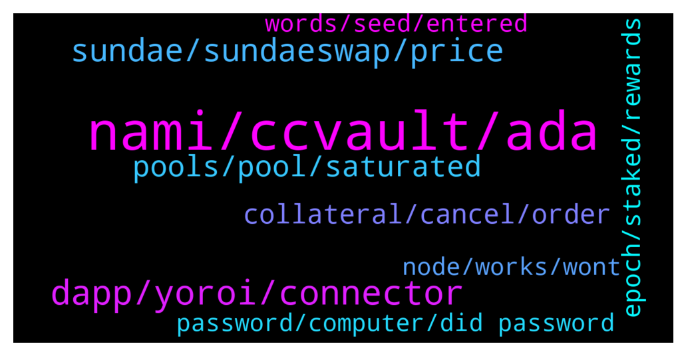

# **@Cardano**
 ## Analysis for **2022-01-21** - **2022-01-22**.

---

## 📊 **Basic Stats**

**n_messages_sent**: 418

---

---

## 🔝 **Top keywords and related messages**

1. **nami, ccvault, ada**

    @Agarta --- *DO NOT USE NAMI WALLET!! It’s not allowing people to withdraw their ADA. The wallet might be stealing your ADA!!   Share so we can stop them. And try your self so you know that am not lying. Ur Ada is really stuck!!* **--->** [TG Discussion](https://t.me/Cardano/773536)

    @Niro01 --- *Hello, I have sent some ADA from nami wallet to another account within the same wallet. I got the green banner sayng transaction submitted but it does not show up on cardano scan.It has been more than 15 hours. Will it go through eventually? Or I need to send my ADA again?* **--->** [TG Discussion](https://t.me/Cardano/773817)

    @myholosma --- *This Nami wallet is the worst cant even take the ADA out* **--->** [TG Discussion](https://t.me/Cardano/773335)

    @brzi987 --- *nami to Ccvault or nami to yoroi... everytime transaction failed.* **--->** [TG Discussion](https://t.me/Cardano/773594)

    @MrQuyen34 --- *Hello, please help me. I made a transaction on Sundaeswap, but the transaction failed. and since then, i want to send ADA number from my nami wallet to another wallet, but the transaction failed, i tried many times, but cant send, help me* **--->** [TG Discussion](https://t.me/Cardano/773566)

    @ExInfernis --- *Does someone know if the cardano veritree trees are planted or they are still not, and where we can check such information and details about our tree tokens* **--->** [TG Discussion](https://t.me/Cardano/773563)

2. **dapp, yoroi, connector**

    @apex_pool_spo --- *you go in your wallet and you click on "Enable DApp Account"* **--->** [TG Discussion](https://t.me/Cardano/773963)

    @ExInfernis --- *I think yoroi will have very soon also dapp connector* **--->** [TG Discussion](https://t.me/Cardano/773127)

    @nonsub --- *Thanks George! Will try DApp connector... this works with SS?* **--->** [TG Discussion](https://t.me/Cardano/773134)

    @Agarta --- *The one wallet we use to login on sundaswap* **--->** [TG Discussion](https://t.me/Cardano/773304)

    @ExInfernis --- *I have seen it as test wallet before several days on sundae swap so maybe it already has it 😉. Or it is in final testing* **--->** [TG Discussion](https://t.me/Cardano/773139)

    @apex_pool_spo --- *ccvault. there is also typhonwallet which is very similar, but it does not have yet DApp connector.* **--->** [TG Discussion](https://t.me/Cardano/773153)

3. **sundae, sundaeswap, price**

    @Wellsy89 --- *Is there a link to live price action on Sundae finance?* **--->** [TG Discussion](https://t.me/Cardano/773598)

    @Agilmore77 --- *Can we still earn the sundaeswap rewards for staking to their iso scoopers?* **--->** [TG Discussion](https://t.me/Cardano/773414)

    @Henokappan --- *You will get $SUNDAE from Round 1 since they are looking at the live stake.* **--->** [TG Discussion](https://t.me/Cardano/773627)

    @JonSmith007 --- *Are you able to provide liquidity on sundaeswap yet?* **--->** [TG Discussion](https://t.me/Cardano/773156)

    @NguyentuanTommy --- *Why does mint have 2 prices on sundae?  can anyone explain?  If it's not a mistake, isn't this a speculative opportunity between 2 pools on sundae?* **--->** [TG Discussion](https://t.me/Cardano/773511)

    @CryptoM22 --- *sundae price is going to pop, yes.* **--->** [TG Discussion](https://t.me/Cardano/773302)

4. **pools, pool, saturated**

    @Tustyrusty --- *I've gone through the 30 participating pools ALL (bar1) are OVER 100% saturation. No-one seems to be concerned/ bothered.* **--->** [TG Discussion](https://t.me/Cardano/774343)

    @Tustyrusty --- *+1 great question, no-one seems to be able to answer the pool saturated problem. The obvious thing to do is ADD pools from the reserve list* **--->** [TG Discussion](https://t.me/Cardano/774218)

    @adacath --- *30 pools? I think there are 80-90 pools. Maybe 30 individual but many have multiple pools. I just redelegated yesterday and there were many non-saturated pools.* **--->** [TG Discussion](https://t.me/Cardano/774389)

    @CryptoM22 --- *that's right, or they say full is full.  that's it I've switched pools just to be sure, even though my old pool is number 2 on the waiting list.  I can't take that risk.🙈* **--->** [TG Discussion](https://t.me/Cardano/774231)

    @MattyIce2100 --- *use the twitter link on the weblink and when you type the name in search it will have multiple pools is normal. pick one that isn't saturated* **--->** [TG Discussion](https://t.me/Cardano/773348)

    @Bkauii --- *Can someone clear something up. I am staked to a pool for sundaeswap that now has 66mil ada staked to it. I went to the pools website and it says the pool is 97% full. The SPO then tells me that the saturation point is 68mil. Am I missing something here?* **--->** [TG Discussion](https://t.me/Cardano/773330)

5. **collateral, cancel, order**

    @gauthamnag --- *Two time my collateral is also done, but still can't cancell the order* **--->** [TG Discussion](https://t.me/Cardano/774377)

    @Thirty5000Feet --- *Collateral issue? I just did it 5 times in a row, quickly and it worked. I have been trying for the last 4 hours!* **--->** [TG Discussion](https://t.me/Cardano/773049)

    @nita_NFtart --- *hello, i want to make collateral but failed* **--->** [TG Discussion](https://t.me/Cardano/774123)

    @brzi987 --- *same here... can't cancel order bcs they have taken my collateral 5ada...and now again have to send ada for collateral. I'm so pissed off 🤦 btw slippage was set 15%* **--->** [TG Discussion](https://t.me/Cardano/774375)

    @Cryptobeek --- *Did you fund collateral with 5 ada? I did that but still failing to cancel* **--->** [TG Discussion](https://t.me/Cardano/774259)

    @mihhai0 --- *Transaction Error Your wallet doesn't have collateral. Read More: "What is collateral, and how do I set it?" You don't have the necessary funds to create a collateral* **--->** [TG Discussion](https://t.me/Cardano/774015)

6. **epoch, staked, rewards**

    @Michael --- *If your wallet is already staked and earning rewards, then yes, the next epoch* **--->** [TG Discussion](https://t.me/Cardano/773975)

    @glitch04 --- *You just have to have the funds staked before the snapshot window each epoch* **--->** [TG Discussion](https://t.me/Cardano/773430)

    @Michael --- *I've never tried so im not 100% sure. Maybe it would be the epoch after?* **--->** [TG Discussion](https://t.me/Cardano/773978)

    @perplex --- *so in theory, i could buy ada 5min before the epoch starts, send to my wallet, 5 mins after new epoch sell it and get full rewards?* **--->** [TG Discussion](https://t.me/Cardano/773976)

    @Agarta --- *If you staked to a listed pool provided by S-swap then your profit will be shown in 5 days. But ur Ada is still their (if it’s daudlaus Wallet)* **--->** [TG Discussion](https://t.me/Cardano/773267)

    @JR --- *question... how can I determine which stake pool I've stake my ADA with? I don't remember, and having sync issues with Daedalus to check.  Looking for an alternate way to see which pool my ADA is staked with to see if I qualify for Sundae Swap drop on Tuesday.  Thanks* **--->** [TG Discussion](https://t.me/Cardano/774026)

7. **password, computer, did password**

    @mihhai0 --- *can they find out my password ?* **--->** [TG Discussion](https://t.me/Cardano/773783)

    @mihhai0 --- *they have that password and that password is used also on metamask* **--->** [TG Discussion](https://t.me/Cardano/773802)

    @apex_pool_spo --- *if you did not give them that password, they cannot discover it from the receovery words.* **--->** [TG Discussion](https://t.me/Cardano/773796)

    @mihhai0 --- *but if they find the password maybe they can go into some others accounts on my email* **--->** [TG Discussion](https://t.me/Cardano/773787)

    @apex_pool_spo --- *or you are worried about the password that your wallet had on your computer?* **--->** [TG Discussion](https://t.me/Cardano/773794)

    @apex_pool_spo --- *they don't need a password if they have the recovery phrase.* **--->** [TG Discussion](https://t.me/Cardano/773784)

8. **node, works, wont**

    @Gr33nSun --- *Not working for me , Any suggestions?* **--->** [TG Discussion](https://t.me/Cardano/773079)

    @RobertKi --- *Thanks for helping. I solved the problem. I found out that it was the Browser on my Mac that caused the problem. Safari doesn't do the trick, but Chrome worked!* **--->** [TG Discussion](https://t.me/Cardano/773519)

    @Dr --- *anybody having troubble with daeadlus allet? it hsent been working yesterday or today.it wont verify the blockchain. been waiting for hour and restarting node but wont work* **--->** [TG Discussion](https://t.me/Cardano/774138)

    @glitch04 --- *Mine works fine but you can get help in the #support channel listed below* **--->** [TG Discussion](https://t.me/Cardano/774139)

    @glitch04 --- *awesome thanks for the update 👍 glad it now works* **--->** [TG Discussion](https://t.me/Cardano/773521)

    @myholosma --- *Works fine xd.        Not* **--->** [TG Discussion](https://t.me/Cardano/773248)

