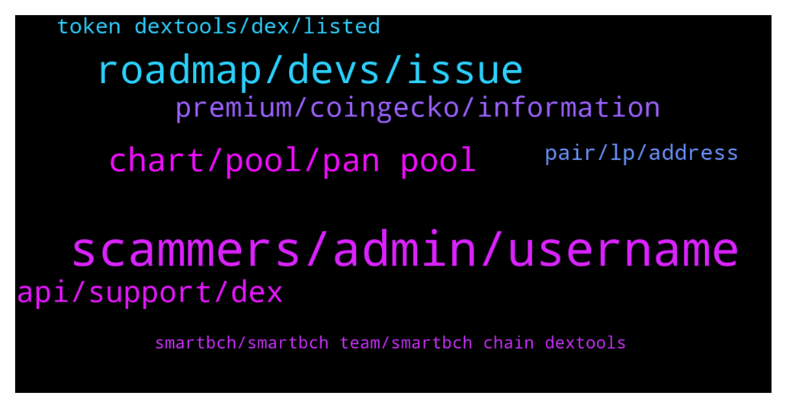

# **@DEXToolsCommunity**
 ## Analysis for **2022-01-20** - **2022-01-22**.

---

## 📊 **Basic Stats**

**n_messages_sent**: 263

---

---

## 🔝 **Top keywords and related messages**

1. **scammers, admin, username**

    @hmk18990 --- *For the news, advertisements, sponsorships please DM @guillermorodriguez78 he's the only in charge (and he'll never DM you first)* **--->** [TG Discussion](https://t.me/DEXToolsCommunity/326896)

    @stanes --- *I don't have any message from you. Be aware of scammers.* **--->** [TG Discussion](https://t.me/DEXToolsCommunity/327696)

    @JoanJunior --- *Nope. I am suggesting you now, because I have a problem that needs your advice.* **--->** [TG Discussion](https://t.me/DEXToolsCommunity/327697)

    @TheModBoss --- *Second referred me to the first one so they work together* **--->** [TG Discussion](https://t.me/DEXToolsCommunity/327114)

    @resn0ta --- *I already sent one scam guy dirty picture for asking me about promo...* **--->** [TG Discussion](https://t.me/DEXToolsCommunity/326906)

    @bastardganpunk --- *no, he can’t, he’s a scammer* **--->** [TG Discussion](https://t.me/DEXToolsCommunity/327660)

2. **roadmap, devs, issue**

    @FredericDEXT --- *Ok, thanks for confirming ,it's already reported to the devs* **--->** [TG Discussion](https://t.me/DEXToolsCommunity/326562)

    @stanes --- *That's what you will know thanks to the roadmap 😄 + some surprises because team likes keeping secrets 😉* **--->** [TG Discussion](https://t.me/DEXToolsCommunity/327537)

    @un_defi_ned_F --- *Info are updated on FTMscan, I'm waiting for CMC/CG approval.* **--->** [TG Discussion](https://t.me/DEXToolsCommunity/327334)

    @bastardganpunk --- *Yes you’re right! Thank you for reporting, you’re very helpful 🙂* **--->** [TG Discussion](https://t.me/DEXToolsCommunity/327404)

    @nimrod620 --- *Hey do we have a roadmap or something* **--->** [TG Discussion](https://t.me/DEXToolsCommunity/327500)

    @JoeyDieleman --- *Team is working on an update of the roadmap* **--->** [TG Discussion](https://t.me/DEXToolsCommunity/327503)

3. **chart, pool, pan pool**

    @nate102 --- *Normally it’s okay but at times like that it makes it look like chart is at all time high when it’s not even close* **--->** [TG Discussion](https://t.me/DEXToolsCommunity/327403)

    @TBGOATOFFICIAL --- *Whenever you try go on the chart* **--->** [TG Discussion](https://t.me/DEXToolsCommunity/327497)

    @bastardganpunk --- *It’s because you’re looking at pan pool, so it shows the chart from this pool* **--->** [TG Discussion](https://t.me/DEXToolsCommunity/327387)

    @nate102 --- *I’m confused is it not the same pool?* **--->** [TG Discussion](https://t.me/DEXToolsCommunity/327389)

    @nate102 --- *It’s just the launch of tokens doesn’t sync correctly to the chart* **--->** [TG Discussion](https://t.me/DEXToolsCommunity/327397)

    @nate102 --- *Thank you, the odd part I noticed as well is on launch the actual trade history has the correct price even when the chart bugs out like it did for that example.* **--->** [TG Discussion](https://t.me/DEXToolsCommunity/327405)

4. **api, support, dex**

    @hani_disclosed --- *How come? The dex launch yesterday* **--->** [TG Discussion](https://t.me/DEXToolsCommunity/327473)

    @hmk18990 --- *this is dextools support guys so better to talk in https://t.me/DEXTtraderslounge for your other needs @GrowSilent* **--->** [TG Discussion](https://t.me/DEXToolsCommunity/326913)

    @Godsonisstilldamademan --- *They must have bridge dextools algorythms i guess then. Or someone is not been sincere in your team just saying.* **--->** [TG Discussion](https://t.me/DEXToolsCommunity/327529)

    @MOONLIGGHTTT --- *CAN DEXT SUPPORT DO ANYTHING ABOUT IT* **--->** [TG Discussion](https://t.me/DEXToolsCommunity/327258)

    @stanes --- *You are probably thinking about what was called Dextshare. But this program ended months ago: https://dextools.medium.com/dextshare-update-6c2a2b87c73b* **--->** [TG Discussion](https://t.me/DEXToolsCommunity/327695)

    @hmk18990 --- *this is dextools support for other talks you can use https://t.me/DEXTtraderslounge* **--->** [TG Discussion](https://t.me/DEXToolsCommunity/326586)

5. **premium, coingecko, information**

    @Cathy7717 --- *Hello, I would like to ask how to apply for the token's social networking software.* **--->** [TG Discussion](https://t.me/DEXToolsCommunity/327414)

    @MoonstellarMoe --- *@admins can I list my token on your official website???* **--->** [TG Discussion](https://t.me/DEXToolsCommunity/327791)

    @JoeyDieleman --- *Can you give the token contract address?* **--->** [TG Discussion](https://t.me/DEXToolsCommunity/327621)

    @bastardganpunk --- *About social Information for your token, please update etherscan.io, bscscan.com or the blockchain explorer from the chain your coin is built on or coingecko.com/ coinmarketcap We pull info from there.* **--->** [TG Discussion](https://t.me/DEXToolsCommunity/327333)

    @bastardganpunk --- *please ask in the support group of the token* **--->** [TG Discussion](https://t.me/DEXToolsCommunity/327227)

    @MOONLIGGHTTT --- *the token name is robo herp* **--->** [TG Discussion](https://t.me/DEXToolsCommunity/327204)

6. **pair, lp, address**

    @AbdoMelody --- *This pair is down can you chec plz https://www.dextools.io/app/bsc/pair-explorer/0xcdf0ae9dcdcadb4949338feb7ea7684ddc47c130* **--->** [TG Discussion](https://t.me/DEXToolsCommunity/327753)

    @rpoole69 --- *Good morning, yesterday I had asked about a screen which showed all transactions for a token no matter which pool.  Which I know would take some time.  How hard to add a drop down next to the current pair address specified, giving quick access to all available LP's for the current token on the pair explorer screen?* **--->** [TG Discussion](https://t.me/DEXToolsCommunity/327186)

    @hmk18990 --- *it's working per-pair. that's why the page named "pair explorer". we can ask the devs if this can be possible in the future for us or not. if enough demand comes from community they can consider it. @FredericDEXT this is a request to show all txes for a contract instead of pair. thank you for the suggestion.* **--->** [TG Discussion](https://t.me/DEXToolsCommunity/326942)

    @stanes --- *They didn't pay for trending. Nobody can.* **--->** [TG Discussion](https://t.me/DEXToolsCommunity/327526)

    @quadraziD --- *Hello! What is the price list for placing an ads banner in pair explorer section?* **--->** [TG Discussion](https://t.me/DEXToolsCommunity/326698)

    @mohammad721372 --- *Who should i contact with for advertising my project on DEXTools?* **--->** [TG Discussion](https://t.me/DEXToolsCommunity/327585)

7. **token dextools, dex, listed**

    @MoonstellarMoe --- *I mean how can I get to have folks go on the dextools. io and view my token on there sir?* **--->** [TG Discussion](https://t.me/DEXToolsCommunity/327795)

    @tehkosongpeng --- *hi, can i check whats the process for getting a token listed on dextools?* **--->** [TG Discussion](https://t.me/DEXToolsCommunity/327087)

    @FredericDEXT --- *We have all the tokens listed on any supported DEX* **--->** [TG Discussion](https://t.me/DEXToolsCommunity/327792)

    @ryadav707 --- *Hey Admin can i sell our Metawar token from Dextools ..?* **--->** [TG Discussion](https://t.me/DEXToolsCommunity/327169)

    @big_wolf_bad --- *hello, quick question. how does DexTools calculate token volume number that is displayed on the token page? Does it include only trades with DEX, or all the transfers made (all Transfer events)?* **--->** [TG Discussion](https://t.me/DEXToolsCommunity/327296)

    @Training_Day_HNW --- *So if we buy Dex tools token we just hold it, there are no rewards?* **--->** [TG Discussion](https://t.me/DEXToolsCommunity/327700)

