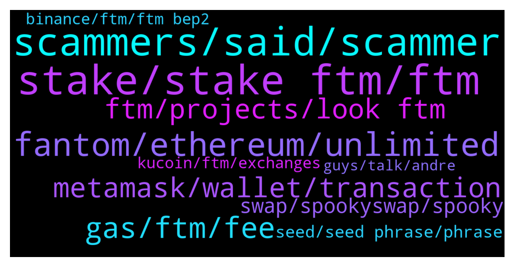

# **@Fantom_English**
 ## Analysis for **2022-01-21** - **2022-01-22**.

---

## 📊 **Basic Stats**

**n_messages_sent**: 456

---

---

## 🔝 **Top keywords and related messages**

1. **stake, stake ftm, ftm**

    @Mcjig --- *yes, you can only stake with fwallet* **--->** [TG Discussion](https://t.me/Fantom_English/637055)

    @timthompson --- *Is bridging FTM a taxable event* **--->** [TG Discussion](https://t.me/Fantom_English/637313)

    @mighty_flyt --- *Unfortunately, can't stake anything because the balance shows 0, however I have more than 10 in my wallet* **--->** [TG Discussion](https://t.me/Fantom_English/637666)

    @tonytang11 --- *So can tokens from other non-mainnet chains be stake?* **--->** [TG Discussion](https://t.me/Fantom_English/638217)

    @mighty_flyt --- *so if I have like 10, I definitely can't stake like 5?* **--->** [TG Discussion](https://t.me/Fantom_English/637673)

    @J --- *hello. Best plase to Stake FTM for Solid rewards?  thank oyu* **--->** [TG Discussion](https://t.me/Fantom_English/638699)

2. **scammers, said, scammer**

    @zenkert --- *👆👆👆  WOW scammers really took that bait. Stupid asses.* **--->** [TG Discussion](https://t.me/Fantom_English/637043)

    @pajamasfreak --- *There is a reason we put will not dm first and some warn info for users upon entry. Beware* **--->** [TG Discussion](https://t.me/Fantom_English/638512)

    @Disfunkd86 --- *@Johnnyfantom hey boss! You should have a scammer warning message you post every hour or so to protect the folks in here* **--->** [TG Discussion](https://t.me/Fantom_English/637753)

    @Okasian --- *I wanna share some of my conversations with some scammers, but i canr* **--->** [TG Discussion](https://t.me/Fantom_English/638085)

    @Timmy --- *Are you in Australia? I noticed the use of mate, or was that the scammer saying mate?* **--->** [TG Discussion](https://t.me/Fantom_English/638574)

    @realmarvino --- *Hell yeah, lots of scammers here on tg  Be careful guys.* **--->** [TG Discussion](https://t.me/Fantom_English/638531)

3. **fantom, ethereum, unlimited**

    @<UNK> --- *1.Hello can u tell me what is the best way to move usdt /usdc to fantom network from other network less fees /high safe  2.Any exchange supporting native stable coins?  3. And best dex on fantom (highest liquidity)* **--->** [TG Discussion](https://t.me/Fantom_English/637098)

    @David_Mass --- *Hey guys what’s the best bridge to avoid slippage and fees to Fantom* **--->** [TG Discussion](https://t.me/Fantom_English/637971)

    @JC --- *Whats the price target for FANTOM* **--->** [TG Discussion](https://t.me/Fantom_English/638108)

    @RYTHM_ISMYGOAL --- *I seek to learn, not to compare and contrast. My question has no bad meaning. The question I have is that the Fantom ecosystem can very easily support DEFI projects that work on the Ethereum, but we see that in this time the acceptance of the Fantom ecosystem is very slow, while it is both faster and more cost-effective. Well, the reason is that the use of these new ecosystems, which are much faster and more economical than previous ecosystems, is slow. Is it lack of credibility and security? 🙏🙏🙏* **--->** [TG Discussion](https://t.me/Fantom_English/637822)

    @Johnnyfantom --- *Can find everything you need at Fantom.foundation* **--->** [TG Discussion](https://t.me/Fantom_English/637752)

    @DastardlyDude --- *No i mean the actual dapps on the fantom chain* **--->** [TG Discussion](https://t.me/Fantom_English/638614)

4. **gas, ftm, fee**

    @Antwon133 --- *so you think 3 ftm for gas was too low?* **--->** [TG Discussion](https://t.me/Fantom_English/638298)

    @MJayCrypto --- *Unfortunately 0.2 FTM is not enough for one transaction right now, is there another faucet for 0.1 FTM?* **--->** [TG Discussion](https://t.me/Fantom_English/638157)

    @Janevietani --- *its not how much ftm you have but the gwei gas fee you are using* **--->** [TG Discussion](https://t.me/Fantom_English/638300)

    @DastardlyDude --- *I'm fine with the price but can dev do something about these fucking gas fees lol* **--->** [TG Discussion](https://t.me/Fantom_English/638599)

    @Mr. --- *Who can send me some FTM for gas purpose, I only need 1 FTM or like 0.5 FTM I have MIM a a lot* **--->** [TG Discussion](https://t.me/Fantom_English/638122)

    @Janevietani --- *i think its depend on current gas price , so lets take 10 FTM as minimum* **--->** [TG Discussion](https://t.me/Fantom_English/637676)

5. **metamask, wallet, transaction**

    @Antwon133 --- *"Transaction <your transaction # here> failed! Error: [ethjs-query] while formatting outputs from RPC '{"value": {"code":-32000,"message":"transaction underpriced"}}'"  thats the error code from metamask* **--->** [TG Discussion](https://t.me/Fantom_English/638283)

    @Janevietani --- *i think there is an error , how about try it on metamask* **--->** [TG Discussion](https://t.me/Fantom_English/638275)

    @Nino --- *I need some help sending my FTM from trust wallet to Metamask It keeps saying invalid address.* **--->** [TG Discussion](https://t.me/Fantom_English/637266)

    @Janevietani --- *you can get keystore from fwallet. it will be much more easier if you import with keystore file* **--->** [TG Discussion](https://t.me/Fantom_English/638425)

    @Timmy --- *On Fwallet I have one wallet and where it would say Keystore it says MetaMask.  So I find no place get get Mnemonics or keystore.* **--->** [TG Discussion](https://t.me/Fantom_English/638423)

    @Both --- *Hi there; I hope someone will be able to help me. I have 2 different ETH addresses connected to Metamask in hardward (ledger). When I want to connect to Fantom Wallet using my LEDGER and not Metamask = I can only see appearing one of my 2 Eth addresses in the "Pick ledger account" section.. Do you know why and have you any solution for me ??? Many thanks in advance for your time ! (will not reply to mp messages)* **--->** [TG Discussion](https://t.me/Fantom_English/637482)

6. **ftm, projects, look ftm**

    @fieldBruce --- *@pajamasfreak I'd like to have FTM t-shirt or goodies. Is that possible ?* **--->** [TG Discussion](https://t.me/Fantom_English/637452)

    @David_Mass --- *But there isn’t an in-house solution from the FTM team right?* **--->** [TG Discussion](https://t.me/Fantom_English/637981)

    @pajamasfreak --- *Should be enough,  check on ftm.guru* **--->** [TG Discussion](https://t.me/Fantom_English/638158)

    @Removsk --- *Well, considering the general bloodbath, ftm is doing allright* **--->** [TG Discussion](https://t.me/Fantom_English/637298)

    @Swagger664 --- *Which is famous Dex on FTM* **--->** [TG Discussion](https://t.me/Fantom_English/637635)

    @fieldBruce --- *I'm a big fan of FTM, I need to show off* **--->** [TG Discussion](https://t.me/Fantom_English/637456)

7. **swap, spookyswap, spooky**

    @Toesy --- *Does the spooky swap bridge count? Doesn’t it use that* **--->** [TG Discussion](https://t.me/Fantom_English/638027)

    @Chip --- *anyswap and xpollinate work fine for me* **--->** [TG Discussion](https://t.me/Fantom_English/637977)

    @mkong888 --- *Yes it does.  Any bridge interface that uses any swap is vulnerable.  Please check carefully by following the instructions as it could impact you.* **--->** [TG Discussion](https://t.me/Fantom_English/638030)

    @reandrisaja --- *Why i cant swap on spookyswap?* **--->** [TG Discussion](https://t.me/Fantom_English/637207)

    @Janevietani --- *have you tried swap it today ?* **--->** [TG Discussion](https://t.me/Fantom_English/638255)

    @Janevietani --- *try ask it on spookyswap https://t.me/SpookySwapCommunity* **--->** [TG Discussion](https://t.me/Fantom_English/637264)

8. **seed, seed phrase, phrase**

    @Janevietani --- *Please dont tell me you have put your seed phrase on those phissing websites* **--->** [TG Discussion](https://t.me/Fantom_English/638482)

    @Cryptonigt --- *Is everyone else getting rekt like me in crypto and stocks?* **--->** [TG Discussion](https://t.me/Fantom_English/637933)

    @Disfunkd86 --- *If you have anything left create a new MetaMask and NEEEEVVVVVEEEERRR GIVE OUT YOUR SEED PHRASE!* **--->** [TG Discussion](https://t.me/Fantom_English/638519)

    @Disfunkd86 --- *Once they have your seed phrase they have the keys to the castle* **--->** [TG Discussion](https://t.me/Fantom_English/638515)

    @Disfunkd86 --- *Game over man… you should have known NEVER give your seed phrase out ma Jesus* **--->** [TG Discussion](https://t.me/Fantom_English/638507)

    @Disfunkd86 --- *If you gave you seed phrase out you’ve lost and won’t get your coins back* **--->** [TG Discussion](https://t.me/Fantom_English/638503)

9. **kucoin, ftm, exchanges**

    @jd2143 --- *Hello!  I something wrong with the network? Several exchanges have disabled FTM withdrawals* **--->** [TG Discussion](https://t.me/Fantom_English/638435)

    @pajamasfreak --- *Nope, node under update progress tho. Better ask  kucoin* **--->** [TG Discussion](https://t.me/Fantom_English/637372)

    @corleon123 --- *I sent my funds from ftm on metamask to my ftm on kucoin and hasn’t arrived since last night is there somthing happen?* **--->** [TG Discussion](https://t.me/Fantom_English/638360)

    @sefroth77 --- *Hi Ive sent FTM tokens using FTM network to Kucoin exchange FTM deposit, the tokens havent arrived, is there some network congestion ?* **--->** [TG Discussion](https://t.me/Fantom_English/637370)

    @Captain --- *that's just how it is when fomo pushes a project so fast you just need to accept that you will not be able to make onchain transaction when market is moving quickly like today with btc crash* **--->** [TG Discussion](https://t.me/Fantom_English/637248)

    @Janevietani --- *Send message to Kucoin live support* **--->** [TG Discussion](https://t.me/Fantom_English/638362)

10. **binance, ftm, ftm bep2**

    @Janevietani --- *try BinanceUS, Bitfinex, Huobi and Binance if you can use it* **--->** [TG Discussion](https://t.me/Fantom_English/637596)

    @Mcjig --- *binance.us has 4.5 mil ftm and i see out transactions* **--->** [TG Discussion](https://t.me/Fantom_English/637083)

    @Cryptonigt --- *Damn that sucks man...too dangerous of a market to play margins* **--->** [TG Discussion](https://t.me/Fantom_English/637938)

    @zenkert --- *(can I use Trust wallet to hodl FTM?)* **--->** [TG Discussion](https://t.me/Fantom_English/637041)

    @pgngm --- *Bro, buy from the binance exchange... Very low txn fees* **--->** [TG Discussion](https://t.me/Fantom_English/638603)

    @Janevietani --- *if i am not mistaken BinanceUS support FTM BEP2 , please check it your self* **--->** [TG Discussion](https://t.me/Fantom_English/637270)

