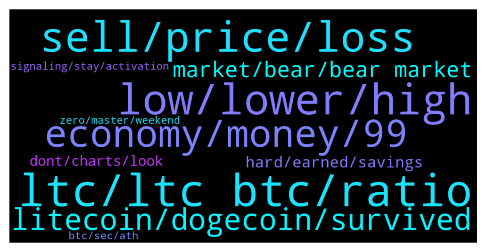

# **@Litecoin**
 ## Analysis for **2022-01-21** - **2022-01-22**.

---

## 📊 **Basic Stats**

**n_messages_sent**: 437

---

---

## 🔝 **Top keywords and related messages**

1. **ltc, ltc btc, ratio**

    @K_arlso_n --- *LTC not have support. Dead coin.* **--->** [TG Discussion](https://t.me/Litecoin/2050420)

    @kevinvik --- *LTC will bounce at 90$. The ratio LTC/BTC seems low* **--->** [TG Discussion](https://t.me/Litecoin/2051511)

    @KisakiTetta39 --- *Wondering 200 ltc can make me millionaire in 10 years 😂* **--->** [TG Discussion](https://t.me/Litecoin/2050200)

    @LemuelE03 --- *Maybe Ltc/btc needs a wick likes that of 2017's .00001 or similar to trigger an uptrend* **--->** [TG Discussion](https://t.me/Litecoin/2050351)

    @zxCuahdF --- *Any indicator is meaningless. If you like you can see a lot of candlestick charts on twitter, and mark LTC is about to rise to 1K 2K 3K....* **--->** [TG Discussion](https://t.me/Litecoin/2051069)

    @Bigcfidolla --- *ripple wants the title but ltc is close* **--->** [TG Discussion](https://t.me/Litecoin/2051149)

2. **low, lower, high**

    @ck42069 --- *I still have40% of my short position open from 149* **--->** [TG Discussion](https://t.me/Litecoin/2050538)

    @Bigcfidolla --- *should of reversed and recovered at 105* **--->** [TG Discussion](https://t.me/Litecoin/2051208)

    @CoinLoin --- *Insane! How low can it go!?* **--->** [TG Discussion](https://t.me/Litecoin/2051036)

    @ck42069 --- *I panicked a bit at 137.5* **--->** [TG Discussion](https://t.me/Litecoin/2050542)

    @BennyBennyBlanco --- *Probably much lower than that. Job data did poorly today* **--->** [TG Discussion](https://t.me/Litecoin/2050163)

    @Bigcfidolla --- *lol its not the first time it got this low.  7 months ago it crashed* **--->** [TG Discussion](https://t.me/Litecoin/2051001)

3. **sell, price, loss**

    @Cezto --- *You will never be able to buy at all time low and sell at top* **--->** [TG Discussion](https://t.me/Litecoin/2051420)

    @Z --- *I bought in at avg price of $370 🙃* **--->** [TG Discussion](https://t.me/Litecoin/2050965)

    @crypto_charlie_b --- *Can see  another drop coming….. next stop $80.21* **--->** [TG Discussion](https://t.me/Litecoin/2051536)

    @Macro5674 --- *Yeah seriously,  only thing I know is hodl and wait till price goes up !* **--->** [TG Discussion](https://t.me/Litecoin/2051280)

    @casualness121 --- *so now he have to sell* **--->** [TG Discussion](https://t.me/Litecoin/2050793)

    @AdventureSD --- *Never sell for a loss just hold it will come back up* **--->** [TG Discussion](https://t.me/Litecoin/2050957)

4. **economy, money, 99**

    @RorschachTesst --- *Look at the demand for automobiles and electronics. Demand outpaced supply and not the other way around. You still think only 100M people increased their wealth?* **--->** [TG Discussion](https://t.me/Litecoin/2050444)

    @RorschachTesst --- *Homeless people are not a gauge for the economy. While the pandemic has pushed more people below the poverty line, it has vastly increased the wealth divide compared to the 2008 recession. People in skilled jobs have become richer. The gdp has grown. More companies are entering the trillion $ mcap benchmark* **--->** [TG Discussion](https://t.me/Litecoin/2050424)

    @BennyBennyBlanco --- *Walking around New York so much homeless compared to before the shutdown. Many can’t afford to pay their rent and is living in shelters. Some shelters may not have space for everyone, so a lot live under the bridge trying to get food* **--->** [TG Discussion](https://t.me/Litecoin/2050170)

    @RorschachTesst --- *The top 10 did become richer but to claim nearly everyone became poorer is stupid. Why is there so much money in speculative assets if everyone is poor?* **--->** [TG Discussion](https://t.me/Litecoin/2050436)

    @RabbitL0v3r --- *Doesnt mean every speculator became richer* **--->** [TG Discussion](https://t.me/Litecoin/2050440)

    @RorschachTesst --- *If indeed we were facing a historical poverty wave the demand would take years to pick up.* **--->** [TG Discussion](https://t.me/Litecoin/2050447)

5. **litecoin, dogecoin, survived**

    @JohnTheApostle --- *Joke aside  "Litecoin is a peer-to-peer Internet currency that enables instant, near-zero cost payments to anyone in the world. Litecoin is an open source, global payment network that is fully decentralized without any central authorities. Mathematics secures the network and empowers individuals to control their own finances. Litecoin features faster transaction confirmation times and improved storage efficiency than the leading math-based currency. With substantial industry support, trade volume and liquidity, Litecoin is a proven medium of commerce complementary to Bitcoin."  https://litecoin.org/* **--->** [TG Discussion](https://t.me/Litecoin/2050891)

    @Macro5674 --- *After bip and eth , the third most accepted coin is litecoin I guess ! Even the 2nd most 🏧  atms around is of litecoin !* **--->** [TG Discussion](https://t.me/Litecoin/2050396)

    @@bamboo --- *hi litecoin fam, was anyone here approached by some member of this chat to join capital-enterprise and invest in them. to me it reeks of scam, just wanted to know if anyone had the pleasure. thanks for the replies* **--->** [TG Discussion](https://t.me/Litecoin/2051437)

    @professional --- *Litecoin is Very fast in down trand* **--->** [TG Discussion](https://t.me/Litecoin/2050190)

    @Macro5674 --- *There were days when dogecoin survived due to litecoin. Now due to elon musk, litecoin surviving due to dogecoin ? Nope I don't think so 🤔! Litecoin as survived without dogecoin for so many years and as new value kept on added on litecoin, it would survive without dogecoin again !* **--->** [TG Discussion](https://t.me/Litecoin/2050379)

    @Macro5674 --- *Transactions are at all time high in litecoin but yeah I got the point everything also can be faked !* **--->** [TG Discussion](https://t.me/Litecoin/2050390)

6. **market, bear, bear market**

    @Jim --- *It is not bear market now. It is general problem cause of fed.* **--->** [TG Discussion](https://t.me/Litecoin/2050939)

    @Augusto --- *I cant understand, that value will not save us from the bear market* **--->** [TG Discussion](https://t.me/Litecoin/2050937)

    @LemuelE03 --- *Hope the bear market does not last long this time* **--->** [TG Discussion](https://t.me/Litecoin/2050334)

    @zxCuahdF --- *Market research: In a bear market, will you choose LTC as an investment currency again* **--->** [TG Discussion](https://t.me/Litecoin/2051063)

    @K_arlso_n --- *David is a slow man.... ))) Waiting bearish market... HAHAHA* **--->** [TG Discussion](https://t.me/Litecoin/2050201)

    @RorschachTesst --- *You closed your short position at 137 in a bear market?* **--->** [TG Discussion](https://t.me/Litecoin/2050551)

7. **hard, earned, savings**

    @K_arlso_n --- *Need more $ for government. )))* **--->** [TG Discussion](https://t.me/Litecoin/2050165)

    @Bigcfidolla --- *im my own boss buddy been that way foe a long time now* **--->** [TG Discussion](https://t.me/Litecoin/2051173)

    @Yhtrcgtfv566 --- *Dude, your 'hard' work is paid in FED notes, they're your boss* **--->** [TG Discussion](https://t.me/Litecoin/2051172)

    @Yhtrcgtfv566 --- *Thanks for confirming you buy your coffee with FED notes* **--->** [TG Discussion](https://t.me/Litecoin/2051167)

    @Yhtrcgtfv566 --- *We're all paid by the FED* **--->** [TG Discussion](https://t.me/Litecoin/2051162)

    @Bigcfidolla --- *theres only 11k members here and half of us is getting paid* **--->** [TG Discussion](https://t.me/Litecoin/2051161)

8. **dont, charts, look**

    @Mozzi111 --- *Actually if u check my recent posts they all been spot on* **--->** [TG Discussion](https://t.me/Litecoin/2050632)

    @Bigcfidolla --- *i fail asleep on this sell but if you back test my chart this what happens when those red and blue stochastic lines cross.* **--->** [TG Discussion](https://t.me/Litecoin/2051542)

    @Bigcfidolla --- *nobody post charts and signals so i had to step in* **--->** [TG Discussion](https://t.me/Litecoin/2051282)

    @Bigcfidolla --- *its all on my charts take a good look other then listneng to haters* **--->** [TG Discussion](https://t.me/Litecoin/2051279)

    @jericho2411 --- *the wawes dont realy do y any good just cinfuse think. atlest dont start with theme* **--->** [TG Discussion](https://t.me/Litecoin/2050838)

    @ck42069 --- *I m not a social influencer or anything* **--->** [TG Discussion](https://t.me/Litecoin/2050655)

9. **signaling, stay, activation**

    @Bigcfidolla --- *crypto is and always will be a liquidity asset* **--->** [TG Discussion](https://t.me/Litecoin/2051165)

    @Yhtrcgtfv566 --- *Instead of signaling for mimble wimble activation, market is signaling for crypto deactivation* **--->** [TG Discussion](https://t.me/Litecoin/2050521)

    @jericho2411 --- *one more scamner go. bitcoin still ok* **--->** [TG Discussion](https://t.me/Litecoin/2050806)

    @RabbitL0v3r --- *And akshually merchant adoption through bitpay is also faked, for ltc narrative, as they provide a multitude of crypto, including tru shitcoin token with a dog logo* **--->** [TG Discussion](https://t.me/Litecoin/2050389)

    @Bigcfidolla --- *crypto is here to stay it go up it go don gotta know when to get out and when to get in thats all im tring to show stay humble no regrets no greed no foolish pride* **--->** [TG Discussion](https://t.me/Litecoin/2051276)

    @CoinLoin --- *At this point we will be lucky if crypto survives* **--->** [TG Discussion](https://t.me/Litecoin/2051243)

10. **btc, sec, ath**

    @Cezto --- *Btc has never retraced back to previous cycle ath, do you know that?* **--->** [TG Discussion](https://t.me/Litecoin/2051493)

    @jericho2411 --- *think y goldy count tis third wawe for btc comeing. what yo think of that?* **--->** [TG Discussion](https://t.me/Litecoin/2050839)

    @Notbiden --- *The SEC didn't like the way btc showed on their balance sheet thats all* **--->** [TG Discussion](https://t.me/Litecoin/2050873)

    @TonyNakamoto --- *only if u consider the largest drop in BTC history and a nearly 2-year recovery period part of Cycle 1* **--->** [TG Discussion](https://t.me/Litecoin/2050720)

    @Mozzi111 --- *Which is why btc been dropping* **--->** [TG Discussion](https://t.me/Litecoin/2050717)

    @Mozzi111 --- *Btc not going to new ath’s with stocks topped  out* **--->** [TG Discussion](https://t.me/Litecoin/2050702)

