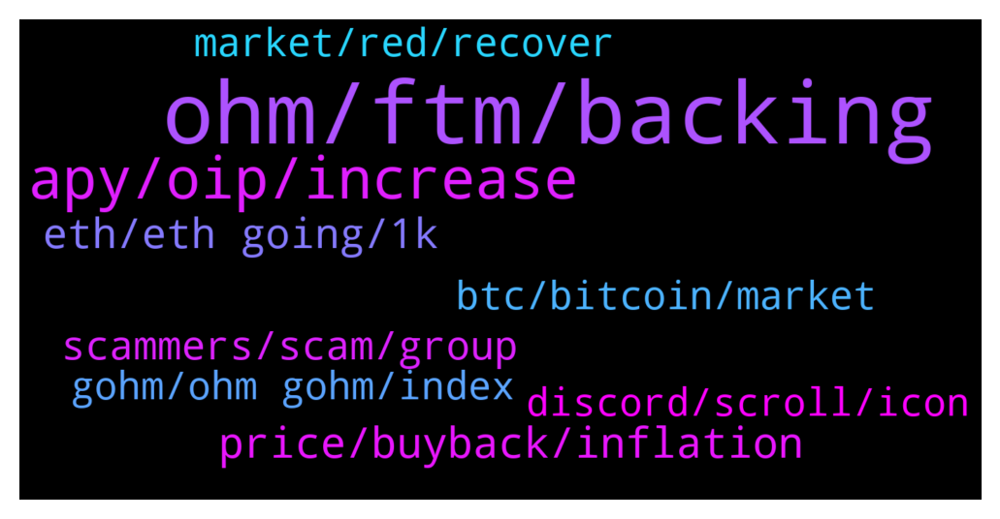

# **@OlympusTG**
 ## Analysis for **2022-01-21** - **2022-01-22**.

---

## 📊 **Basic Stats**

**n_messages_sent**: 1606

---

---

## 🔝 **Top keywords and related messages**

1. **ohm, ftm, backing**

    @Decothegreat --- *ohm has left me with no money to afford steak* **--->** [TG Discussion](https://t.me/OlympusTG/165226)

    @bike4peace --- *That will happen one day too, for sure. But what I was saying is, that if we hit 50 Dollar OHM, I gonna use my last FTM bag for buying more OHM* **--->** [TG Discussion](https://t.me/OlympusTG/164620)

    @bike4peace --- *would be nice, I promised myself, that I will sell all my FTM if we hit 50 and go full on OHM haha* **--->** [TG Discussion](https://t.me/OlympusTG/164524)

    @nadirswork1 --- *hello i was selected for a giveaway of 70 OHM and when i connect it to my wallet it dosnt work* **--->** [TG Discussion](https://t.me/OlympusTG/163873)

    @SecuriTech24 --- *They are rebasing so strong holders who understand the fundamentals will ride out a bear market and rebase - same with OHM. Why ohm will not go under then by your theory?* **--->** [TG Discussion](https://t.me/OlympusTG/164779)

    @Marco --- *Guys I bought in at 1k and ohm is now at around 95 dollars   How long until I get my return back?* **--->** [TG Discussion](https://t.me/OlympusTG/163497)

2. **apy, oip, increase**

    @Ap0l1o --- *No, it means that after that the APY may decrease even further or stop altogether* **--->** [TG Discussion](https://t.me/OlympusTG/162353)

    @sbackes --- *Ultimately the APY is why everyone buys into this project… right?* **--->** [TG Discussion](https://t.me/OlympusTG/165709)

    @Host_Matt --- *Ohm is complicated because all people see is the APY* **--->** [TG Discussion](https://t.me/OlympusTG/163204)

    @K --- *Apy is like 1k so in best case you get your money back in a year* **--->** [TG Discussion](https://t.me/OlympusTG/163501)

    @TWebb34 --- *When do I load up on the bottom here? What’s current apy?* **--->** [TG Discussion](https://t.me/OlympusTG/164081)

    @Marco --- *Is APY just a stock split?* **--->** [TG Discussion](https://t.me/OlympusTG/164822)

3. **price, buyback, inflation**

    @Shot caller --- *Guys what's is happening? I'm down $140k now. Is Zeus just sitting on his behind?* **--->** [TG Discussion](https://t.me/OlympusTG/164652)

    @MrMann89 --- *@nfwaple so the price can not fall below $75 because it is backed* **--->** [TG Discussion](https://t.me/OlympusTG/163355)

    @Host_Matt --- *its increasing, meaning price is being diluted* **--->** [TG Discussion](https://t.me/OlympusTG/163187)

    @SinisterCyclops --- *It increases in value, but does it also increase in amount?* **--->** [TG Discussion](https://t.me/OlympusTG/165410)

    @NsMiscar --- *Yes and my case price always goes down after i ape in and goes up after i ape out..lol* **--->** [TG Discussion](https://t.me/OlympusTG/162231)

    @nfwaple --- *one person asking why price down = -1%* **--->** [TG Discussion](https://t.me/OlympusTG/162789)

4. **eth, eth going, 1k**

    @nfwaple --- *i want to sleep but I am afraid that we wake up with ETH below $2000* **--->** [TG Discussion](https://t.me/OlympusTG/165439)

    @nfwaple --- *would love 1k ETH but also owning some ETH now, not sure what to feel* **--->** [TG Discussion](https://t.me/OlympusTG/164117)

    @NsMiscar --- *Maker is liquidating 600m worth of ETH starting now. Will be fun to watch!* **--->** [TG Discussion](https://t.me/OlympusTG/164105)

    @Willow --- *And it's stuck on Eth > Avalanche* **--->** [TG Discussion](https://t.me/OlympusTG/163534)

    @Ap0l1o --- *love 1k eth purchase but after that to go to 10k :D* **--->** [TG Discussion](https://t.me/OlympusTG/164120)

    @nfwaple --- *ETH going to $1000, maybe 😂😂* **--->** [TG Discussion](https://t.me/OlympusTG/162845)

5. **scammers, scam, group**

    @nfwaple --- *scammer still be scamming when everyone is already hurting* **--->** [TG Discussion](https://t.me/OlympusTG/164504)

    @Host_Matt --- *so far they're hilariously stupid and bad at scamming* **--->** [TG Discussion](https://t.me/OlympusTG/162879)

    @Host_Matt --- *3 dms in the past 45 mins* **--->** [TG Discussion](https://t.me/OlympusTG/162761)

    @Ap0l1o --- *But write it from here, so you avoid scammers* **--->** [TG Discussion](https://t.me/OlympusTG/163765)

    @NsMiscar --- *lol...20 Billion dude! At least make it believable if you want to scam people!* **--->** [TG Discussion](https://t.me/OlympusTG/162479)

    @Host_Matt --- *a lot of scammers today huh* **--->** [TG Discussion](https://t.me/OlympusTG/162759)

6. **btc, bitcoin, market**

    @Cixex --- *BTC support has been broken. Kiss bull run a good bye* **--->** [TG Discussion](https://t.me/OlympusTG/162998)

    @malmsta --- *Dont listen too much to the doom and gloomers because it doesn't matter... So what if btc drops to 12k. it isn't going to stay there... It will go up again. The only variable that has changed is time. There is a delay. My experience with people who call the apocalypse is that they just want to sound smart... If they are positive then they are just considered naïve so better to be negative about it, then you won't look so dumb... You'll be fine...* **--->** [TG Discussion](https://t.me/OlympusTG/163566)

    @brucoo --- *You know what happens... This is worse than when btc crash 60k to 30k. At least from my point of view. The thing is a new people enter at the market in bull run... (Anyway not only cryptos are going down)* **--->** [TG Discussion](https://t.me/OlympusTG/164699)

    @Ahmad --- *If Bitcoin go to 10k, ppl will go bonkers.* **--->** [TG Discussion](https://t.me/OlympusTG/164261)

    @Valihora --- *It's hard to say now. I believe BTC is still a good value saver, but now the situation can be even worse. S&P and other indexes did big dump today, so BTC has followed. And I hope it's not just a beginning of bear market...* **--->** [TG Discussion](https://t.me/OlympusTG/163563)

    @Sammysnail --- *Ye like he controls the price ......market shit at the moment so everyone has panic sold causkngbthe price to drop more !! I'm expecting more pain afte btc confirms a weekly bear market trend* **--->** [TG Discussion](https://t.me/OlympusTG/164654)

7. **market, red, recover**

    @cdp279 --- *Are you wathcing the market? Or are you just being salty* **--->** [TG Discussion](https://t.me/OlympusTG/164738)

    @abe1738384 --- *ive never seen such a fast sell off of a billion dollar market cap coin. like 85% down in just about 2weeks with little signs of bidding* **--->** [TG Discussion](https://t.me/OlympusTG/164597)

    @GordonTheGecko --- *However long it takes for market to recover* **--->** [TG Discussion](https://t.me/OlympusTG/163332)

    @NsMiscar --- *meme time...the entire market rt now* **--->** [TG Discussion](https://t.me/OlympusTG/164145)

    @Host_Matt --- *will be very interesting to see what happens when market starts to recover, need fed to reactivate printer in late feb/march* **--->** [TG Discussion](https://t.me/OlympusTG/164551)

    @Host_Matt --- *yeah whole market taking a beating* **--->** [TG Discussion](https://t.me/OlympusTG/162840)

8. **gohm, ohm gohm, index**

    @nfwaple --- *if people can get gOHM for the price of 69 OHM, of course they will buy it, unwrap to 70 OHM, then sell to the OHM liquidity pool* **--->** [TG Discussion](https://t.me/OlympusTG/163309)

    @GordonTheGecko --- *Where would the buy pressure for ohm come from in the market, if its now cheaper to buy directly gohm.  Only people looking for arbitrage opportunities?* **--->** [TG Discussion](https://t.me/OlympusTG/163270)

    @nfwaple --- *yes gOHM is index adjusted, OHM is not* **--->** [TG Discussion](https://t.me/OlympusTG/164956)

    @CryptoAlex1 --- *Isn't it the same since you can just wrack ohm to gohm?* **--->** [TG Discussion](https://t.me/OlympusTG/164953)

    @nfwaple --- *does it matter if OHM is $1 but gOHM is $10k?* **--->** [TG Discussion](https://t.me/OlympusTG/164191)

    @Andrew --- *Same.  I thought that sOHM pruce or amt is supposed to increase if OHM price decreases, working as a hedge. Can anyone explain? Im now out a lot of money. Feels a lot like a scam.* **--->** [TG Discussion](https://t.me/OlympusTG/163349)

