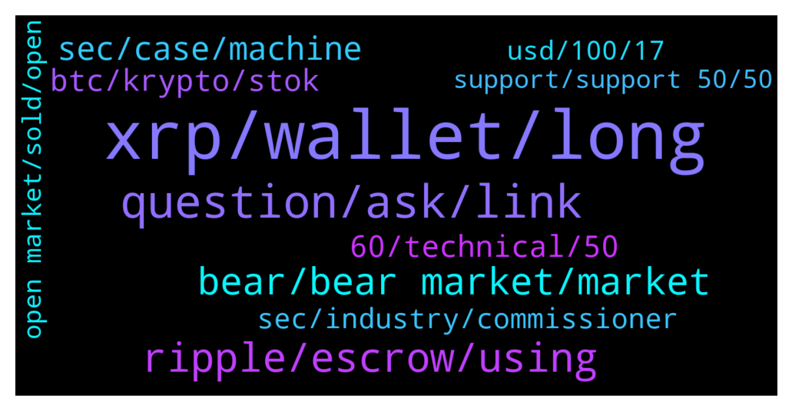

# **@Ripple**
 ## Analysis for **2022-01-21** - **2022-01-22**.

---

## 📊 **Basic Stats**

**n_messages_sent**: 473

---

---

## 🔝 **Top keywords and related messages**

1. **xrp, wallet, long**

    @CasperLayer1 --- *So i called the months long downtrend november. Then i called the 58k down, after that the 44k down(a bit later then thought). I called the drop for xrp top 68 when we were 1,10 and told to sell and buy back  So till now got every one right even though people calling me fudder Just because i made the observation that xrp price is shit and behaving like shit. We are like 1600 days! without ATH.  So whats next? As i said after Breaking 44k down which  i said was certain coming in like 2 weeks i would take another look.  Wellllll here it Comes! Were ruined! Bear market 100 procent no Breaking 1.00 this year. Or 50k btc* **--->** [TG Discussion](https://t.me/Ripple/3043467)

    @xrp211 --- *Best way to buy xrp in uk?* **--->** [TG Discussion](https://t.me/Ripple/3043079)

    @forzudo --- *I'm just worried that XRP's potential to moon after SEC will be hindered by this bear market* **--->** [TG Discussion](https://t.me/Ripple/3044141)

    @Catcher256 --- *And Xumm is a hot wallet like Trust wallet, where you can also buy und swap your crypto currencies?* **--->** [TG Discussion](https://t.me/Ripple/3044157)

    @fadfunky --- *I think the best way to buy/send/received xrp in UK is luno. Check their fees, https://www.luno.com/en/countries/GB* **--->** [TG Discussion](https://t.me/Ripple/3043198)

    @Tinkabellagal --- *All I have Delete xrp wallet account  https://m.youtube.com/watch?v=QJVg_b_O9_k* **--->** [TG Discussion](https://t.me/Ripple/3044154)

2. **question, ask, link**

    @Tetsuya15 --- *I thought you will be sharing you t.a. Now, I realized that you asking for help. Sorry, my bad. 😅✌️* **--->** [TG Discussion](https://t.me/Ripple/3042862)

    @JustNNM --- *@kenyiofficial You made it as per your previous post, stop reposting the same thing to get views or you will be warned/banned for spamming* **--->** [TG Discussion](https://t.me/Ripple/3043053)

    @nephiasah --- *I said It a million times and all i got was being called a stupid pessimist* **--->** [TG Discussion](https://t.me/Ripple/3043929)

    @CasperLayer1 --- *Never once said that stop misleading people with your nonsense* **--->** [TG Discussion](https://t.me/Ripple/3043682)

    @iNakazumi --- *Can you please link the pinned message?* **--->** [TG Discussion](https://t.me/Ripple/3042993)

    @MOVEMENTGOD --- *Could you pls send me a direkt Link?* **--->** [TG Discussion](https://t.me/Ripple/3044296)

3. **ripple, escrow, using**

    @iNakazumi --- *No worries. Thanks bud. I am writing an article about Ripple. If you know anyone who knows these things, please let me know* **--->** [TG Discussion](https://t.me/Ripple/3042863)

    @iNakazumi --- *So i understand that the money might not be spent bad and that Ripple is very careful of what it's used for* **--->** [TG Discussion](https://t.me/Ripple/3043003)

    @iNakazumi --- *I am writing an educational article about Ripple and I need to understand how it works. And there are not so many resources that explain what happens to new tokens that come intro circulation* **--->** [TG Discussion](https://t.me/Ripple/3043005)

    @iNakazumi --- *Ripple has different products and services* **--->** [TG Discussion](https://t.me/Ripple/3042852)

    @JustNNM --- *I have not gone through all Escrow sales or tracked wallets, but I’m sure some of their partners would be acquiring from Escrow releases as well, thats a guess.   But i very much doubt Ripple would entertain small(srimp) buyers from Escrow releases.* **--->** [TG Discussion](https://t.me/Ripple/3043025)

    @JustNNM --- *Its not like others, Ripple has escrow which distributes* **--->** [TG Discussion](https://t.me/Ripple/3042991)

4. **bear, bear market, market**

    @GULUacityinUganda --- *Are we in the bear market now* **--->** [TG Discussion](https://t.me/Ripple/3043668)

    @fudding --- *Could be a bear market, repeating 2018 pattern* **--->** [TG Discussion](https://t.me/Ripple/3043655)

    @jarilitmanen1 --- *Been in a bear market since last may.* **--->** [TG Discussion](https://t.me/Ripple/3043927)

    @richcryto --- *Any experts on here think we are in Bear market for a while?* **--->** [TG Discussion](https://t.me/Ripple/3044121)

    @Ebrahimaldashti --- *I'm not sure still.. It's it bear market or is it just a correction?* **--->** [TG Discussion](https://t.me/Ripple/3043679)

    @Voltaire123 --- *Good for you if you think bearmarket is started. Sell in that case and short it down. I am holding my long leverage because it is going up again in coming days.* **--->** [TG Discussion](https://t.me/Ripple/3043475)

5. **sec, case, machine**

    @Keiko_Izumi --- *I dont think its really going to go up for good till case is over* **--->** [TG Discussion](https://t.me/Ripple/3044280)

    @ghostTownXXX --- *OMG sEC not giving up docs* **--->** [TG Discussion](https://t.me/Ripple/3043707)

    @ThomasM_90 --- *I mean, every technical line in the chart has been broken to the downside, we have a massive delayed lawsuit which will not end before august/september* **--->** [TG Discussion](https://t.me/Ripple/3043351)

    @Wahemmelie --- *In april lawsuit will be over and price will go up, just hold* **--->** [TG Discussion](https://t.me/Ripple/3043142)

    @Top_of_mind --- *this is a good attempt, I agree, but the state machine is merciless.* **--->** [TG Discussion](https://t.me/Ripple/3043069)

    @azmeer929 --- *The case being dragged too long..* **--->** [TG Discussion](https://t.me/Ripple/3042896)

6. **60, technical, 50**

    @ReiTeh --- *Now buying in at 0.50. 🤓* **--->** [TG Discussion](https://t.me/Ripple/3044327)

    @anuj90322 --- *I think u won't have 0.5 until we get to Monday* **--->** [TG Discussion](https://t.me/Ripple/3044328)

    @iNakazumi --- *I have a technical question, anyone here that can help?* **--->** [TG Discussion](https://t.me/Ripple/3042841)

    @azmeer929 --- *0.50 please..then will buy all money that i left* **--->** [TG Discussion](https://t.me/Ripple/3043991)

    @ReiTeh --- *I feel 0.76 or lower is good to buy* **--->** [TG Discussion](https://t.me/Ripple/3044256)

    @Hendrikhaverkamp22 --- *Me too 😅 most 1.23 euro. .89  .86  .67 .45* **--->** [TG Discussion](https://t.me/Ripple/3044084)

7. **btc, krypto, stok**

    @Qi3883 --- *but it looks more like we are all following btc* **--->** [TG Discussion](https://t.me/Ripple/3042902)

    @marianmp --- *If we survive this weekend and BTC holds 30k  suport and Monday a good sentiment on wall Street ....then we can be semi bullish* **--->** [TG Discussion](https://t.me/Ripple/3044310)

    @marianmp --- *Market is down because of news on WALL STREET and because Krypto hasn't decouple from stock market* **--->** [TG Discussion](https://t.me/Ripple/3042960)

    @saca_rolhas --- *That is the main key resistance for BTC… this will be coming fast, wick format. There is still hunger, almost no shorts were closed.* **--->** [TG Discussion](https://t.me/Ripple/3044069)

    @JustNNM --- *Please stay on topic, a few BTC posts on trend/movements is fine but no analysis or BTC price discussion.* **--->** [TG Discussion](https://t.me/Ripple/3044032)

    @marianmp --- *Remember you need to take in consideration every news in wall Street that affects stocks ....because Its directly correlated to krypto ,even though in krypto you don't have bad news ...Stok market pull BTC down with it and then every alts* **--->** [TG Discussion](https://t.me/Ripple/3042967)

8. **sec, industry, commissioner**

    @SJ --- *Who ever can afford to buy more  all cryptos are a steal ryt now* **--->** [TG Discussion](https://t.me/Ripple/3044055)

    @Qawakib --- *Bro its just market manipulation at his finest crypto cant die they just will regulate* **--->** [TG Discussion](https://t.me/Ripple/3043847)

    @anuj90322 --- *Ok, but have u ever been surprised by the crypto market?* **--->** [TG Discussion](https://t.me/Ripple/3043471)

    @Andrew --- *Anybody watch George on Crypto r us....hell probably be like guys...don't panic...we are still in a bull market* **--->** [TG Discussion](https://t.me/Ripple/3042942)

    @philip_218 --- *Not sure if this is healthy for the crypto industry. Crypto will always fight with howie test and similar structure against crypt* **--->** [TG Discussion](https://t.me/Ripple/3043902)

    @Bodb_Derg --- *Crypto winter was long expected anyway....that's basically a normal thing* **--->** [TG Discussion](https://t.me/Ripple/3043829)

9. **usd, 100, 17**

    @nephiasah --- *Indeed. When people Say we going to 100 dollars its fine. When i Said 6 months ago we would go to 0.17 this year i got flamed at* **--->** [TG Discussion](https://t.me/Ripple/3043944)

    @nephiasah --- *Is It more realistic 0.17 or 100 USD?* **--->** [TG Discussion](https://t.me/Ripple/3043946)

    @underciverman --- *Will we see 1.00 usd again?* **--->** [TG Discussion](https://t.me/Ripple/3042777)

    @theblokchainbaker --- *Maybe a little burst to $1 that's it* **--->** [TG Discussion](https://t.me/Ripple/3042915)

    @underciverman --- *guys, do you think that today, 01/21/2022, we will see the $0.70? please leave your opinion* **--->** [TG Discussion](https://t.me/Ripple/3042844)

    @anuj90322 --- *Always new salary coming in though..isn't it?* **--->** [TG Discussion](https://t.me/Ripple/3044102)

10. **support, support 50, 50**

    @azmeer929 --- *Base on my analisyst it will reach at strong support 0.50 DYOR* **--->** [TG Discussion](https://t.me/Ripple/3043994)

    @CasperLayer1 --- *There is no support at 0,50 this is going down to 0,3 atleast* **--->** [TG Discussion](https://t.me/Ripple/3043903)

    @Jacksone747 --- *22.01.2022/  Where is my SOLO?😡😡* **--->** [TG Discussion](https://t.me/Ripple/3044031)

    @ApoIIyon --- *It's bs what your saying though @Top_of_mind because you can read here the ratio.. https://www.binance.com/en/support/announcement/4acc20ea6da14660a61f84b862afc1ed if it's not enough what you received contact support..* **--->** [TG Discussion](https://t.me/Ripple/3043093)

    @ReiTeh --- *Doubt that would matters now. This week I don't see no support anywhere* **--->** [TG Discussion](https://t.me/Ripple/3044344)

    @anuj90322 --- *I think it is holding support at this point..I saw on trading view chart* **--->** [TG Discussion](https://t.me/Ripple/3044315)

