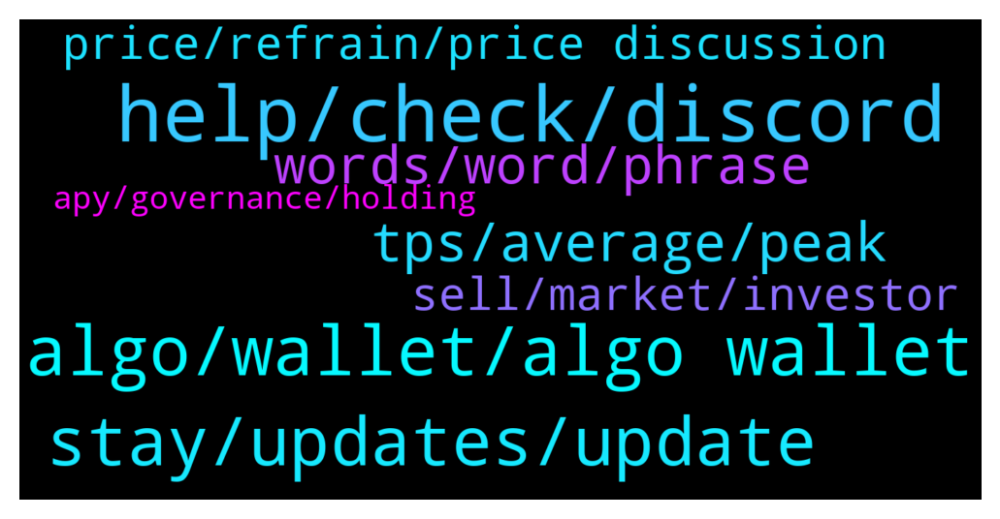

# **@algorand**
 ## Analysis for **2022-01-21** - **2022-01-22**.

---

## 📊 **Basic Stats**

**n_messages_sent**: 147

---

---

## 🔝 **Top keywords and related messages**

1. **help, check, discord**

    @defirlkp --- *does anyone have the name of an admin for that tg channel? i haven't  been able to join that channel for months* **--->** [TG Discussion](https://t.me/algorand/334207)

    @Martin --- *Be very careful. Telegram is full of people pretending to be admins. They are all scammer. Never click a link or give any info. Ban and report asap* **--->** [TG Discussion](https://t.me/algorand/334174)

    @mcmaxims --- *I posted the link to the group and the Blackpaper here but it was deleted for ... a reason? A bit unfair but nothing to do bout that* **--->** [TG Discussion](https://t.me/algorand/334588)

    @nguyenthai8888 --- *Did you ask the team to help me with the answer yesterday?* **--->** [TG Discussion](https://t.me/algorand/334245)

    @Hkkrhnli --- *There are those who write to help me. Is there anyone who sends a special massage? or is it a scammer?* **--->** [TG Discussion](https://t.me/algorand/334159)

    @MackDenver --- *I'm not sure. You can check the page here to see if you can find one  https://www.algorand.com/ecosystem/use-cases* **--->** [TG Discussion](https://t.me/algorand/334320)

2. **algo, wallet, algo wallet**

    @NightAlgorand --- *Algorand does not have Contract address as it is not ERC. Did you send your funds to the wrong address? If so, there is nothing we can do to retrieve my funds unfortunately.* **--->** [TG Discussion](https://t.me/algorand/334139)

    @NightAlgorand --- *Hi there, you can use Algorand Wallet for mobile or MyAlgo wallet :)* **--->** [TG Discussion](https://t.me/algorand/334254)

    @creptotronox --- *How many times hold algo 3x bull token* **--->** [TG Discussion](https://t.me/algorand/334516)

    @Emre --- *Who can help me with recovery my myalgo wallet* **--->** [TG Discussion](https://t.me/algorand/334273)

    @MeemBhai --- *Is there a minimum amount of ALGOs required to be  maintained in the wallet corresponding to the number of ASA present?* **--->** [TG Discussion](https://t.me/algorand/334547)

    @MuratArkan --- *Algo must explain this to investors* **--->** [TG Discussion](https://t.me/algorand/334377)

3. **stay, updates, update**

    @Dennis --- *Is there any news, update, what’s juicy in Algorand these days* **--->** [TG Discussion](https://t.me/algorand/334453)

    @Bugzy_Pinnacle --- *May I get algorand 2022 roadmap?* **--->** [TG Discussion](https://t.me/algorand/334344)

    @Tiny_Philosopher_784 --- *Some good news, if anyone is interested.  https://twitter.com/headline_crypto/status/1484741732696739840?s=20* **--->** [TG Discussion](https://t.me/algorand/334447)

    @NightAlgorand --- *Hi there, there no update yet, please stay tuned 🙂* **--->** [TG Discussion](https://t.me/algorand/334247)

    @theyanco --- *cool, hope everyone is having fun* **--->** [TG Discussion](https://t.me/algorand/334465)

    @angelo9007 --- *Please stay tuned to our announcement channel for the latest updates* **--->** [TG Discussion](https://t.me/algorand/334457)

4. **tps, average, peak**

    @Kaypacha --- *How is it possible that the average is 23 and highest is 1100?* **--->** [TG Discussion](https://t.me/algorand/334530)

    @Kaypacha --- *Can someone explain to me what's the difference between Peak TPS and Average TPS that I found on Algorand Metrics? The peak is 1100 TPS, the average is 23 TPS. How is it possible such a big difference?* **--->** [TG Discussion](https://t.me/algorand/334508)

    @MackDenver --- *Hello Giuseppe, Peak TPS is the highest TPS and average is the average one.* **--->** [TG Discussion](https://t.me/algorand/334515)

    @Malvo --- *Greetings can anyone tell me has algorand upgraded the network to 46,000 TPS as was told to happen* **--->** [TG Discussion](https://t.me/algorand/334431)

    @Cecco --- *Giuseppe man!! Sveglia raga!! I think that algorand can handle a maximum of 1100 transaction per second, but right now it is doing an average of 23 TPS because that's the traffic, i think they are not hurry to made algorand with the possibility of 46000tps because we don't need it right now, right now i think is better to try to let grow the ecosystem and number of people involved, still we have plenty of space for new people before the need of such a big tsp number.* **--->** [TG Discussion](https://t.me/algorand/334534)

    @Cecco --- *I don't know really, but i think that that peak (if it's ever been reached) it's been reached just as a test (maybe in the testnet?) Anyway should be interesting an answer from somebody that knows it for sure from Algorand* **--->** [TG Discussion](https://t.me/algorand/334546)

5. **words, word, phrase**

    @RalphCraig --- *The BIP 39 word list contains 2048 English words. The first four characters are unique. That is, the list has "act" and  "action" but not "acting" since the latter two words share the same first four characters.* **--->** [TG Discussion](https://t.me/algorand/334304)

    @Emre --- *I write everything in dutch also* **--->** [TG Discussion](https://t.me/algorand/334279)

    @RalphCraig --- *Do I understand that you have the Dutch translations of the 25 words but not the English?  If so, this task should be possible.* **--->** [TG Discussion](https://t.me/algorand/334307)

    @ArabianCoder --- *very good, so you can limit your translations within those 2048 words :D* **--->** [TG Discussion](https://t.me/algorand/334305)

    @Emre --- *I found the 2800 words phrase* **--->** [TG Discussion](https://t.me/algorand/334277)

    @asirshahid --- *Look through the linked list and translate what you wrote word by word* **--->** [TG Discussion](https://t.me/algorand/334319)

6. **price, refrain, price discussion**

    @MackDenver --- *Hi creptotronox, We don't talk about the market or price prediction on this chat. Please join the price chat to discuss about this @algorand_price* **--->** [TG Discussion](https://t.me/algorand/334517)

    @khunpon --- *for price and meme, come here guys https://t.me/algorand_price* **--->** [TG Discussion](https://t.me/algorand/334494)

    @NightAlgorand --- *Gentle reminder that we have a price channel https://t.me/algorand_price* **--->** [TG Discussion](https://t.me/algorand/334356)

    @NightAlgorand --- *Hi everyone, please refer to https://t.me/algorand_price for price discussion 🙂* **--->** [TG Discussion](https://t.me/algorand/334244)

    @NightAlgorand --- *Price discussion to https://t.me/algorand_price, thank you 😄* **--->** [TG Discussion](https://t.me/algorand/334424)

    @angelo9007 --- *Please refrain from discussing about price here* **--->** [TG Discussion](https://t.me/algorand/334489)

7. **sell, market, investor**

    @JJ --- *Sell at loss and ruin the value… here is another half ass trader with $2000 and “crypto investor” in his IG bio* **--->** [TG Discussion](https://t.me/algorand/334240)

    @Chocoim --- *Many newbie can literally lose money because of ur dumbness* **--->** [TG Discussion](https://t.me/algorand/334236)

    @PlutoNettuno --- *is not forst crypto drop ad it will not be the last .. high gain opportunity requites RISK.. resist!* **--->** [TG Discussion](https://t.me/algorand/334505)

    @Morde --- *Yeah the whole crypto is a scam, market being red since december. All coins down. And who made money? Whales and rich people that control the whole market.* **--->** [TG Discussion](https://t.me/algorand/334480)

    @MuratArkan --- *Big investor sold near 3$ with spekülatif news* **--->** [TG Discussion](https://t.me/algorand/334376)

    @domioo911 --- *Im really sad but its bear market* **--->** [TG Discussion](https://t.me/algorand/334339)

8. **apy, governance, holding**

    @MackDenver --- *Yes but the APY is small. Governance has a better APY* **--->** [TG Discussion](https://t.me/algorand/334556)

    @mfocus1 --- *does anyone know if we are still getting paid by holding algorand in our wallets without participating in the governance?* **--->** [TG Discussion](https://t.me/algorand/334554)

    @dt702 --- *Hey ALGO fam, is there someone here familiar with how staking works who could answer a few questions I have?* **--->** [TG Discussion](https://t.me/algorand/334144)

    @Wurzelbear --- *Do the grant recipients have selling restrictions? Oh, I think we can answer that now.* **--->** [TG Discussion](https://t.me/algorand/334518)

    @K --- *Algorand developer do something for your holders.atleast give 20percent relief rally to all your holder* **--->** [TG Discussion](https://t.me/algorand/334394)

    @dt702 --- *On behalf of a random Staker, from their wallet, for example* **--->** [TG Discussion](https://t.me/algorand/334153)

