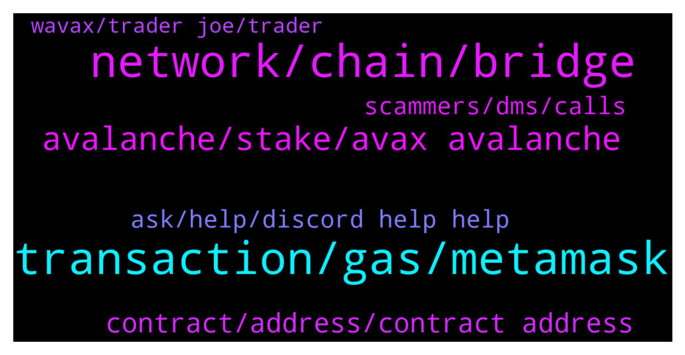

# **@avalancheavax**
 ## Analysis for **2022-01-21** - **2022-01-22**.

---

## 📊 **Basic Stats**

**n_messages_sent**: 149

---

---

## 🔝 **Top keywords and related messages**

1. **transaction, gas, metamask**

    @W --- *Gas price seem like it went up* **--->** [TG Discussion](https://t.me/avalancheavax/323940)

    @lukasschafer1 --- *I don’t know if it’s the avanlanche Mainet that I installed in my metamask wallet that’s causing the issues or if there was just insufficient funds for gas fee when I did the wrapping.* **--->** [TG Discussion](https://t.me/avalancheavax/323648)

    @bagdasarExca --- *Is there a problem with the c chain? Seems like transactions are not going through regardless of gas limit (Even at 300K)* **--->** [TG Discussion](https://t.me/avalancheavax/323923)

    @Don_Difuntorum --- *Hello i am trying to wrap my  Memo in Time wonderland. However the transaction is Not going through and i get a approve memo spend limit message in My metamask wallet. So How Can i fix this? TIA* **--->** [TG Discussion](https://t.me/avalancheavax/323750)

    @oathtobarbatos --- *Try restarting your Metamask account Settings -> Advanced -> Reset just in case* **--->** [TG Discussion](https://t.me/avalancheavax/323906)

    @Christopher --- *Yes my transactions have been closer to the 5 minute mark* **--->** [TG Discussion](https://t.me/avalancheavax/323677)

2. **network, chain, bridge**

    @Global_Defi --- *https://bridge.avax.network/   <— is this avax's official bridge ?  it says beta at the top left of the web page.   is there another bridge that we could move big money  ?* **--->** [TG Discussion](https://t.me/avalancheavax/323649)

    @neirenoir --- *Are there any plans on releasing docs for spacesvm or at least commenting the code? 😅* **--->** [TG Discussion](https://t.me/avalancheavax/323756)

    @hrbooms --- *Question about finding wallet addresses on snowtrace or avascan. Can We not see AVAX holders on the X or C chain? Only wrapped AVAX holders? I know its is a nit picky distinction but I feel like I should be able to see AVAX holders on the c-Chain* **--->** [TG Discussion](https://t.me/avalancheavax/323867)

    @oathtobarbatos --- *Yeah, that's the official one. bridge.avax.network* **--->** [TG Discussion](https://t.me/avalancheavax/323650)

    @Flo (Don't pm) --- *Hey I have a question. Want to send Avax from MetaMask to Binance. I copied my adress in MM and it's not possible. The notification is: " No ETH- network, small writing"* **--->** [TG Discussion](https://t.me/avalancheavax/323733)

    @hrbooms --- *Can I get the results of the AVAX public sale? seems to be conflicting information out there* **--->** [TG Discussion](https://t.me/avalancheavax/323833)

3. **avalanche, stake, avax avalanche**

    @geekmidget --- *isn't avalanche time to finalization supposed to be seconds?* **--->** [TG Discussion](https://t.me/avalancheavax/323684)

    @jk00124 --- *What’s the best way to stake AVAX* **--->** [TG Discussion](https://t.me/avalancheavax/323912)

    @bestcoderna --- *Join us for our Avalanche Weekly Wrapup  https://twitter.com/i/spaces/1MYGNnBvVbyGw* **--->** [TG Discussion](https://t.me/avalancheavax/323829)

    @pipodeclown123 --- *I thought the avalanche could scale* **--->** [TG Discussion](https://t.me/avalancheavax/323811)

    @-/\Felix/\- --- *You’re trying to promote Avalanche with some influencers lmao like avax need that* **--->** [TG Discussion](https://t.me/avalancheavax/323607)

    @christiankakesa --- *Very good news for the Avalanche ecosystem ✅️* **--->** [TG Discussion](https://t.me/avalancheavax/323594)

4. **contract, address, contract address**

    @heyslt --- *Hi, how the subnets with 0 gas fees will be protected against bots / spam attacks?* **--->** [TG Discussion](https://t.me/avalancheavax/323762)

    @Nicolas_A --- *If the contract is verified and it has such a function yeah* **--->** [TG Discussion](https://t.me/avalancheavax/323974)

    @Nicolas_A --- *depends on use cases. A subnet with smart contracts will have fees for sure* **--->** [TG Discussion](https://t.me/avalancheavax/323767)

    @TheSEOdude --- *You would need the contract address.* **--->** [TG Discussion](https://t.me/avalancheavax/323978)

    @oathtobarbatos --- *I think you can, I mean, if you got the address it's possible I guess* **--->** [TG Discussion](https://t.me/avalancheavax/323870)

    @neirenoir --- *Well, there are client-side contract models that can be gasless. Check ArWeave contracts* **--->** [TG Discussion](https://t.me/avalancheavax/323775)

5. **ask, help, discord help help**

    @Sunny_V1 --- *Hey guys is there a dev here* **--->** [TG Discussion](https://t.me/avalancheavax/323855)

    @JDrocket93 --- *https://medium.com/stakingbits/setting-up-metamask-for-avalanche-fec7cd898040  If questions feel free to ask* **--->** [TG Discussion](https://t.me/avalancheavax/323892)

    @oathtobarbatos --- *You can discuss it here: https://t.me/avalanche_trading* **--->** [TG Discussion](https://t.me/avalancheavax/323874)

    @Nicolas_A --- *Probably at some point. Best to ask in Discord though ^^* **--->** [TG Discussion](https://t.me/avalancheavax/323760)

    @Global_Defi --- *is it ok that i dm you btw ? there is one more question tho.* **--->** [TG Discussion](https://t.me/avalancheavax/323656)

    @oathtobarbatos --- *I'm not sure, I'll do a research* **--->** [TG Discussion](https://t.me/avalancheavax/323899)

6. **scammers, dms, calls**

    @oathtobarbatos --- *This is a scammer, be careful* **--->** [TG Discussion](https://t.me/avalancheavax/323640)

    @ericds1 --- *Has anyone claimed? Any idea how to do it? https://twitter.com/_patrickogrady/status/1484221404111245312?s=21* **--->** [TG Discussion](https://t.me/avalancheavax/323654)

    @azamega85 --- *Be careful of scammers DMing your. Bryan White* **--->** [TG Discussion](https://t.me/avalancheavax/323956)

    @Cryptechfps --- *Lol got spammed by like 7 scammers* **--->** [TG Discussion](https://t.me/avalancheavax/323902)

    @hrbooms --- *and scammers seriously fuck off I am not replying to your DMs or video calls* **--->** [TG Discussion](https://t.me/avalancheavax/323869)

    @Eminet --- *Sorry if you think it’s a scam* **--->** [TG Discussion](https://t.me/avalancheavax/323644)

7. **wavax, trader joe, trader**

    @oathtobarbatos --- *Try using a DEX. Trader Joe or Pangolin should be enough to swap AVAX for WAVAX* **--->** [TG Discussion](https://t.me/avalancheavax/323646)

    @lukasschafer1 --- *I’m trying to find the best way to get avax into wavax.* **--->** [TG Discussion](https://t.me/avalancheavax/323643)

    @Nanonano8844 --- *Hi I swapped some USDC to WAVAX on pangolin , and now I looked at the wallet and the WAVAX seems to be gone ... any idea what is going on ?* **--->** [TG Discussion](https://t.me/avalancheavax/323757)

    @lukasschafer1 --- *Hello, I tried to swap avax for wavax through trader joe but it didn’t work out as expected.  Any suggestion on how I can make that happen?* **--->** [TG Discussion](https://t.me/avalancheavax/323636)

    @lukasschafer1 --- *Try to start the swapping process again but instead reverse the process.  The wavax can be there but it won’t show so try and do a reverse process on pangolin* **--->** [TG Discussion](https://t.me/avalancheavax/323761)

    @lukasschafer1 --- *I used trader joe and the balance funds left but when I checked the wavax, it’s still empty.  So I had to unwrap it through trader joe back to avax.* **--->** [TG Discussion](https://t.me/avalancheavax/323647)

