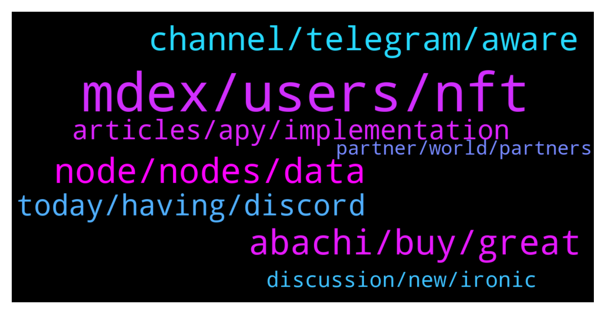

# **@chainlinkofficial**
 ## Analysis for **2022-01-21** - **2022-01-22**.

---

## 📊 **Basic Stats**

**n_messages_sent**: 197

---

---

## 🔝 **Top keywords and related messages**

1. **mdex, users, nft**

    @Joypokkamol --- *In 2021, MDEX launched the DAO proposal and voting function, entered an era when the community is governed for shared benefits, and approved the first decentralized proposal. Does MDEX have other deployment plans? What are the future development directions for MDEX?* **--->** [TG Discussion](https://t.me/chainlinkofficial/367459)

    @Joypokkamol --- *How does MDEX retain users and ensure user loyalty?* **--->** [TG Discussion](https://t.me/chainlinkofficial/367405)

    @Joypokkamol --- *You just mentioned that MDEX had released NFT. Could you please give us more details?* **--->** [TG Discussion](https://t.me/chainlinkofficial/367433)

    @Joypokkamol --- *Here we come to an exciting question, what benefits will users in our community get when they use MDEX?* **--->** [TG Discussion](https://t.me/chainlinkofficial/367470)

    @Joypokkamol --- *Over the past six months, the center stage in the blockchain industry has been undoubtedly GameFi and Metaverse. So, what is MDEX’s plan for Metaverse?* **--->** [TG Discussion](https://t.me/chainlinkofficial/367422)

    @Joypokkamol --- *After talking about NFT and the Metaverse, now let's talk about the cooperation of MDEX with other projects. MDEX released the Hunter program a few months ago: $10 million to support ecological projects. Can you give us a detailed introduction to this program?* **--->** [TG Discussion](https://t.me/chainlinkofficial/367445)

2. **node, nodes, data**

    @AriKiry --- *"The ultimate long term goal is that all Chainlink services become self-sustaining through user paid fees. Many services already achieve this today.  Chainlink Price Feeds are designed to be sustainable through user fees at scale.  User fees are aggregated together, generating an economies of scale effect, where no user is paying the full cost, rather it's shared across many users. As more paying users join a network, the costs of every existing and future user decreases.  The additional fee revenue could also go towards greater security (more nodes, sources, etc.) Or a mix, such as lowering costs some for users while increasing some security.  But there is a chicken or egg problem before reaching this scale.  Nodes won't put Price Feed data on-chain regularly if there are not enough user fees, and early users are not going to want to pay the full costs before there are already paying users to share costs with. This is where the role of the subsidy comes into play.  A subsidy solves the bootstrapping problem by lowering the costs of early users so they are not paying the full costs." This is from a CLG thread which I believe to be quite accurate.  Also, Sergey shared on the Chainlink 2022 Kickoff video that many feeds where already profitable.* **--->** [TG Discussion](https://t.me/chainlinkofficial/367887)

    @unertq --- *Just a correction though: it's that some DONs are now profitable without subsidisation, rather than some nodes* **--->** [TG Discussion](https://t.me/chainlinkofficial/367267)

    @suity59 --- *Thanks Ari, that beautifully explains my question. So to sum-up, essentially the link tokens will be used: - to subsidy and motivate nodes and users in the early stage - in later stage when nodes are self sustaining then link tokens will be only used to become a node on the blockchain.* **--->** [TG Discussion](https://t.me/chainlinkofficial/367890)

    @Rpatel1443 --- *The top link holder is node operators, making up 35% of the supply—this was supposed to be for rewards in the ecosystem but none of the funds have outflowed yet. Do you know how and when these tokens will be spent? This is important because it makes up a large % of supply that could soon enter circulation, diluting the rest of the holders and potentially driving down price.* **--->** [TG Discussion](https://t.me/chainlinkofficial/367178)

    @Rpatel1443 --- *what is being subsidized? gas payments for submitting price data on-chain, paying data providers, or both?* **--->** [TG Discussion](https://t.me/chainlinkofficial/367273)

    @Rpatel1443 --- *right so node operator incentives are essentially additional rewards paid to nodes for providing their oracle services?* **--->** [TG Discussion](https://t.me/chainlinkofficial/367188)

3. **abachi, buy, great**

    @Thetatooth --- *Thank you for sharing, these are great services to secure your project. I'm happy to hear your future plans are bright too!   Now, I know we have some fans in here today... So my next question would have to be: what is the best way for someone watching today to get started with Abachi?* **--->** [TG Discussion](https://t.me/chainlinkofficial/367709)

    @electo_abachi --- *Abachi is building tools & sdks to enable permissioned and compliant lending products to work within the Defi space. This essentially means bridging TradFi and DeFi. Abachi also acquires any companies or technology that will help it do that.  To Start we will build permissioned & authenticated lending pools and offer buy now pay later services to businesses. We already have partnership in place to do this via our partner LUCA Plus. We plan to expand this service 10x each month and then add more products for real-world yields on chain.* **--->** [TG Discussion](https://t.me/chainlinkofficial/367680)

    @Thetatooth --- *That's awesome! Congratulations! Can you tell us more about how Abachi and Chainlink work together?* **--->** [TG Discussion](https://t.me/chainlinkofficial/367702)

    @TheGreatestShowPig --- *Whilst I’m not a team member I am a community member - my personal suggestion would be to jump into the Abachi Discord server and get to know us all. The team spend a lot of time talking to us there, particularly Electo :) , and it’s a wonderful community to be a part of.* **--->** [TG Discussion](https://t.me/chainlinkofficial/367719)

    @AmunRaGOC --- *Looking forward to the Abachi AMA* **--->** [TG Discussion](https://t.me/chainlinkofficial/367571)

    @bryons --- *GM everyone. Abachi's other founder is Steve (Rand / 0x01 on Discord), Steve is mainly responsible for the development side (writing smart contracts, integrations, testing etc). Hello from Steve! 👋* **--->** [TG Discussion](https://t.me/chainlinkofficial/367690)

4. **channel, telegram, aware**

    @bunchofatoms --- *is there an official(ish) Telegram channel for Chainlink news?* **--->** [TG Discussion](https://t.me/chainlinkofficial/367568)

    @KostasZrk --- *How do I check for verified chainlink members?* **--->** [TG Discussion](https://t.me/chainlinkofficial/367297)

    @Sylvarantt --- *Please be aware that there is no price, market, trading, or yield farming discussions allowed here. Please find an unofficial channel if that is what you want to talk about. You can find some groups by searching Telegram for "Chainlink Community" but be aware that they are not operated or endorsed by the Chainlink team or admins of this chat.* **--->** [TG Discussion](https://t.me/chainlinkofficial/367285)

    @SpyrosPai --- *Anyone deposited there link in vesper finance?* **--->** [TG Discussion](https://t.me/chainlinkofficial/367283)

    @marcromeron --- *Chainlink have the Advocates program: https://chain.link/community/advocates* **--->** [TG Discussion](https://t.me/chainlinkofficial/367262)

    @Sylvarantt --- *In the pinned post you can find a list of Chainlink Labs team members that may reach out to you for business development reasons. Please feel free to verify it and make sure that the person that is DM'ing you has an exact match with the Telegram handles outlined there.* **--->** [TG Discussion](https://t.me/chainlinkofficial/367298)

5. **today, having, discord**

    @Thetatooth --- *Thank you Electo, Rand, Bryon for coming out and sharing with us today. It was a pleasure having you here today! Best of luck on your project!* **--->** [TG Discussion](https://t.me/chainlinkofficial/367727)

    @electo_abachi --- *Thank you so much everyone. It was a pleasure.* **--->** [TG Discussion](https://t.me/chainlinkofficial/367734)

    @bryons --- *Thank you for having us today! We enjoyed sharing the project with the community!* **--->** [TG Discussion](https://t.me/chainlinkofficial/367731)

    @kikomdex2021 --- *Thanks for having me here today* **--->** [TG Discussion](https://t.me/chainlinkofficial/367492)

    @Joypokkamol --- *Fantastic! 👍🏼 Thank you very much, Kiko, for your time today.* **--->** [TG Discussion](https://t.me/chainlinkofficial/367487)

    @Joypokkamol --- *We’re happy to have you with us today.* **--->** [TG Discussion](https://t.me/chainlinkofficial/367382)

6. **articles, apy, implementation**

    @Linkederic --- *Corect, staking is not yet live  https://t.me/chainlinkofficial/366377* **--->** [TG Discussion](https://t.me/chainlinkofficial/367112)

    @zermoise --- *To confirm...contracts are not collateralised currently? rather than use the word staking.* **--->** [TG Discussion](https://t.me/chainlinkofficial/367117)

    @zermoise --- *hello team. i constantly see that staking is involved in the current implementation from a variety of articles, even if it isnt explicit staking. i confirmed yesterday that no staking (whether node/data provider to work contracts or passive holder to node) exists currently. whats the truth? why do i see so many articles referencing staking in the current implementation?* **--->** [TG Discussion](https://t.me/chainlinkofficial/367101)

    @electo_abachi --- *Staking is launching on Jan 28th, currently pending audits from Paladin sec.  APY is an incorrect metric to measure, however the reward rates will start at 0.45%.The APY you usually see on the rebasing apps is based off current people staking and reward rate. As an indication though, if 80%+ are staked, this reward rate will translate to a 100k - 10k APY as supply expands from 117300 to 1 million tokens in circulation.* **--->** [TG Discussion](https://t.me/chainlinkofficial/367700)

    @Cryptic --- *Wow! When does the staking starts? And is the APY announced yet?* **--->** [TG Discussion](https://t.me/chainlinkofficial/367693)

    @zermoise --- *Thanks Eric, have read the article and watched the video - but so many external sources to chainlink mention that staking is currently live. It is very confusing.* **--->** [TG Discussion](https://t.me/chainlinkofficial/367123)

7. **discussion, new, ironic**

    @marcromeron --- *You could complain about token price if you wish, not here, but not about how is running the company with their achievements and developments. Obviously community sentiment is better in other market situation but we’re working very hard 24/7 on new integrations, new services, new hires, etc…* **--->** [TG Discussion](https://t.me/chainlinkofficial/367351)

    @Tofugitive --- *Totally understand. My point is that in none of those groups will you find members of the team discussing price, which is fantastically ironic because if hodlers hadn’t believed in them, price wouldn’t have held long enough and high enough for them to unleash their billions to pay themselves and fund operations. Anyway I’ll stop now. The project has huge potential, but it’s been a terrible investment, which the team should acknowledge and address IMHO. That is all.* **--->** [TG Discussion](https://t.me/chainlinkofficial/367350)

    @Sylvarantt --- *The benefit of forbidding price discussion in this chat to the signal:noise ratio vastly outweights the possible disadvantages. A lot of people come in here because they want to learn, build useful hybrid smart contracts and applications with real world use cases and basically educate themselves on what the blockchain is. That is a huge opportunity for everyone involved in this group to grow together.  If price, trading and token value is the thing you want to talk about there are dozens of other non-official groups that allow that sort of discussion. You can find them by searching in Telegram "Chainlink Community"* **--->** [TG Discussion](https://t.me/chainlinkofficial/367348)

    @Tofugitive --- *The irony is thick. The team refuses to discuss price while relying on a certain price to unleash a tsunami of tokens on the market in order to pay themselves and fund their operations. Feel free to ban me. Been here since day 1, but enough is enough already.* **--->** [TG Discussion](https://t.me/chainlinkofficial/367347)

    @marcromeron --- *There is no irony in real metrics.* **--->** [TG Discussion](https://t.me/chainlinkofficial/367357)

    @Tofugitive --- *You miss the point. The team has made themselves above talking about price anywhere on any platform at any time. That’s ironic. That is all.* **--->** [TG Discussion](https://t.me/chainlinkofficial/367353)

8. **partner, world, partners**

    @electo_abachi --- *Yes - we do plan to partner in the DeFi space. We are talking to Olympus DAO currently (have been for a couple of weeks) regarding partnership opportunities, and have also been in talks with mstable  Additionally once the first staking apps go live, we will be reaching out to Aave for their permissioned pools launch and Centrifuge for their real-world assets yields.* **--->** [TG Discussion](https://t.me/chainlinkofficial/367686)

    @TheGreatestShowPig --- *Are you looking to partner with anyone within the DeFi space, such as Olympus DAO?* **--->** [TG Discussion](https://t.me/chainlinkofficial/367684)

    @electo_abachi --- *Absolutely one of the core things we will need to do is acquire or partner with many more Luca plus like platforms. As the lending pools increase in size, we need to scale partner acquisition also. This will mean we will either seed & invest in other partners around the world, or help existing ones onboard our tech. We plan to expand into India and Singapore after Australia.* **--->** [TG Discussion](https://t.me/chainlinkofficial/367733)

    @ads1337 --- *We have real world partners who are already in the TradFi space and enable payments and lending for real-world small businesses. As the minimal viable product we will start with them and try to scale it up. We are also a team of professionals that has worked on integrations with major enterprise systems so we are confident we can help bridge some of the gaps.* **--->** [TG Discussion](https://t.me/chainlinkofficial/367698)

    @TheGreatestShowPig --- *You mentioned you already run some activities through one of your partners, Luca Plus, will you be looking to expand into other partnerships possibly globally to increase your potential reach?* **--->** [TG Discussion](https://t.me/chainlinkofficial/367728)

    @manhhhg --- *Have been there any projects using ccip for now?* **--->** [TG Discussion](https://t.me/chainlinkofficial/367299)

