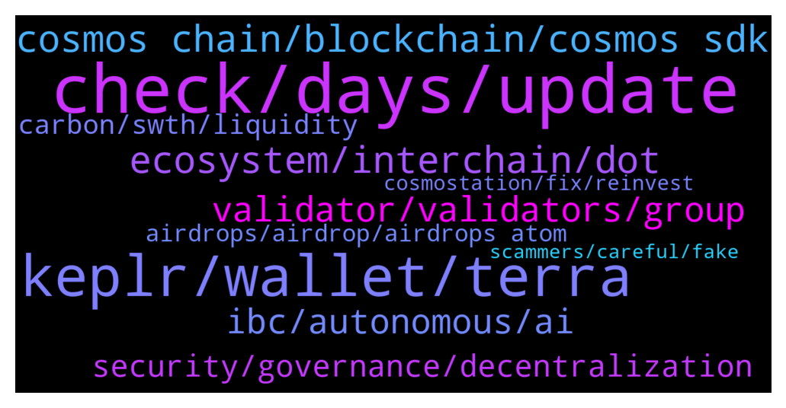

# **@cosmosproject**
 ## Analysis for **2022-01-21** - **2022-01-22**.

---

## 📊 **Basic Stats**

**n_messages_sent**: 310

---

---

## 🔝 **Top keywords and related messages**

1. **check, days, update**

    @Doddy1994 --- *Just seen other people having that problem as well least its not just me* **--->** [TG Discussion](https://t.me/cosmosproject/478311)

    @Cordtus --- *Probably but it isn't the guys dming you right now.* **--->** [TG Discussion](https://t.me/cosmosproject/479134)

    @vladc1 --- *We moved it to @citadelvotebot. Try again please* **--->** [TG Discussion](https://t.me/cosmosproject/478384)

    @SannPaa --- *Osmosis and Carbon are working on a dual-benefit ‘thing’. Listing each other, but there was more. Didn’t catch it. Was a very nice AMA, with a good host (John 🙌)* **--->** [TG Discussion](https://t.me/cosmosproject/478547)

    @Doddy1994 --- *Yeah just checked the play store* **--->** [TG Discussion](https://t.me/cosmosproject/478615)

    @Cordtus --- *I like to imagine that just points you to a page that reads 'maybe' and nothing more.* **--->** [TG Discussion](https://t.me/cosmosproject/479178)

2. **keplr, wallet, terra**

    @morekek19 --- *whats the best luna wallet? terra station?* **--->** [TG Discussion](https://t.me/cosmosproject/479043)

    @AtomJazz --- *Keplr is for chrome browser https://medium.com/chainapsis/how-to-use-keplr-wallet-40afc80907f6?source=user_profile---------0----------------------------* **--->** [TG Discussion](https://t.me/cosmosproject/479216)

    @apjfausd89a --- *but if you wanted to stake it, i think you need to use Forbole X extension* **--->** [TG Discussion](https://t.me/cosmosproject/478529)

    @nita_NFtart --- *yes im use keplr extension and tokenpocket , but not work* **--->** [TG Discussion](https://t.me/cosmosproject/479209)

    @AtomJazz --- *Keplr wallet. You can find tutorials in the pinned message* **--->** [TG Discussion](https://t.me/cosmosproject/479208)

    @matthew4you --- *Kelpr wallet u can stake through the wallet* **--->** [TG Discussion](https://t.me/cosmosproject/479204)

3. **cosmos chain, blockchain, cosmos sdk**

    @Nitroape --- *https://twitter.com/CryptoApe0/status/1484916641171488773?s=20 check this out cosmonauts !!* **--->** [TG Discussion](https://t.me/cosmosproject/479253)

    @Gxxin --- *Since the creation of its virtual currency ATOM, the Cosmos platform has been bringing many innovations to the blockchain world. Cosmos focuses its efforts on creating an ecosystem that could solve the 3 main problems of blockchain technology to make it less complex for developers and users, Scalability, Usability, and Interoperability. Let's take a deep dive and understand everything you need to know about Cosmos in 2022.  https://sgstockmarketinvestor.com/everything-you-need-to-know-about-cosmos-atom-in-2022/* **--->** [TG Discussion](https://t.me/cosmosproject/478650)

    @DrDaxx --- *So binance was created for cosmos chain?* **--->** [TG Discussion](https://t.me/cosmosproject/478922)

    @ZoltanAtom --- *You are a Cosmonaut ! Please Join @ATOMCosmonauts* **--->** [TG Discussion](https://t.me/cosmosproject/478766)

    @DAD_DEFI --- *hi cosmonaut OGs! can you send me an article where in i can deep dive on the difference between EVMs and COSMOS SDK in terms of Security? Like in cosmos no need to revoke every dAPP we have interacted with or no scams in the LP pools since there are no contract address....   Need more info so i can explain better to my fellow BSC degens as to why farming in COSMOS is more lucrative and safer* **--->** [TG Discussion](https://t.me/cosmosproject/478725)

    @AtomJazz --- *Cosmos SDK is a toolkit to start your own sovereign L1 blockchain. You can run Smart contracts engine on top of any cosmos based blockchain so we have L1 native tokens in cosmos and smart contracts tokens like ERC20 for example* **--->** [TG Discussion](https://t.me/cosmosproject/478728)

4. **ecosystem, interchain, dot**

    @ascuoladibitcoin --- *I don t want discuss about price......i want only to know if the role of atom is higher than the other cosmos hub chain or are at the same level......* **--->** [TG Discussion](https://t.me/cosmosproject/478433)

    @Sajbarkat --- *How to compare Dot ecosystem Vs Atom ecosystem* **--->** [TG Discussion](https://t.me/cosmosproject/478941)

    @Cryptomeyt --- *Thanks, I joined now :) btw I believe atom is a pretty small ecosystem now, I can't believe it has such a large mcap. I guess these are some very smart investors.* **--->** [TG Discussion](https://t.me/cosmosproject/478768)

    @NikoDMT --- *That is indeed glorious value capture. I was referring to more "traditional methods" but as it stands it's obvious to me that Atom will become the main collateral on the Cosmos web of blockchains and that alone will push price into uncharted territories .* **--->** [TG Discussion](https://t.me/cosmosproject/478782)

    @NikoDMT --- *I mean half the community barely even cares about price or listings or marketing or any other bullshit apart from development and still Atom's price is handling it's self spectacularly* **--->** [TG Discussion](https://t.me/cosmosproject/478779)

    @ZoltanAtom --- *But if you talk just Atom marketcap,yes it’s still very small if you compare with others. Hopefully this CosmosYear will see Atom firstly At TOP10 and after Top5! 😉* **--->** [TG Discussion](https://t.me/cosmosproject/478771)

5. **validator, validators, group**

    @ZoltanAtom --- *We keep advising members to choose validators wisely and keep decentralization safe. But no one can control anyone’s choices. Also every chain has their own governance token and validator set,it’s impossible to control communities and their choices.* **--->** [TG Discussion](https://t.me/cosmosproject/478833)

    @AtomJazz --- *Also each chain is sovereign with independent validator set* **--->** [TG Discussion](https://t.me/cosmosproject/478822)

    @AtomJazz --- *If you think it's too high you can always restake to another validator* **--->** [TG Discussion](https://t.me/cosmosproject/479149)

    @MREXwhale --- *Criteria To Select Validators  Should be the following criteria: + Rank should be out of top 10 (to decentralize the network) + Higher voting power + Uptime should be from 95% to 100% + Commission from 5% to 10% (percentage you share rewards with validators) + Validator contributed for cosmos community + Nice logo, nice name, love at first sight + Avoid to delegate into CEX validators (i.e. Binance Staking)* **--->** [TG Discussion](https://t.me/cosmosproject/478807)

    @NikoDMT --- *We were actually working on improving selection criteria for validators and an interesting approach was proposed. Essentially a "proof of contribution to system integrity metric" which incorporates uptime, slash protection, node security, participation in governance  as well as social presence.* **--->** [TG Discussion](https://t.me/cosmosproject/478826)

    @AtomJazz --- *Make sure you avoid exchange validators! Other than that...The best validator is always subjective, here are some factors that might help:   - Commission Rate:  This is the % of earned rewards that go to the validator. Not the % of your total stake, just to eliminate that confusion.   - Self-Bonded rate:  This is the % of bonded ATOM that belong to the validator. Think of this as their skin in the game.   - Decentralization:  Choosing the smaller validators helps to decentralize the network which improves security overall. Again, decentralization should be a priority. On this point, centralized exchanges are not the best choice as they don't really support the network at all.   You can learn more about each validator in their profiles on the wallets and explorers.  The 8-10% is almost for everyone, feel free to use this reward calculator  https://www.stakingrewards.com/earn/cosmos  Commissions can be changed anytime so keep an eye on your validator via telegram or twitter* **--->** [TG Discussion](https://t.me/cosmosproject/479157)

6. **ibc, autonomous, ai**

    @AtomJazz --- *Usually we have some issues during and right after Osmosis epochs. Teams are working really hard to improve IBC performance during these heavy traffic events* **--->** [TG Discussion](https://t.me/cosmosproject/478309)

    @Mordrew --- *@AtomJazz are you pretty familiar with the IBC protocol?* **--->** [TG Discussion](https://t.me/cosmosproject/478787)

    @Cryptomeyt --- *But bnb is not in ibc right, so I don't think it really counts* **--->** [TG Discussion](https://t.me/cosmosproject/478774)

    @NikoDMT --- *Well I just happened to see this. But a Fetch.ai developer portal as well as community fund will soon be available. We're POS chain with some modifications to the typical tendermint based consensus and COSMOS SDK based. However we're still not IBC enabled (hopefully pretty soon, it's been in last year and is in this quarter's roadmap) and the tech stack allows for the creation and deployment of AI across various blockchains. You can create and deploy your own AI in the form of an Autonomous economic agent or you can take part in the collective learning module which allows for collectively trained AI models without sharing the underlying data source.* **--->** [TG Discussion](https://t.me/cosmosproject/478818)

    @Mordrew --- *okay, thanks.  I do have some specific questions but they are mainly conceptual and oriented around possibilities, but that can be a bit tricky with IBC because even though it's a fantastic open protocol that will speed up interconnecting chains, channels and id's for assets moved through them make things much more difficult than just thinking of a bridge over which one can drive something, since the newly minted onchain assets after transfer are not fungible across channels.* **--->** [TG Discussion](https://t.me/cosmosproject/478792)

    @AtomJazz --- *Yes correct. You can do that with IBC* **--->** [TG Discussion](https://t.me/cosmosproject/478925)

7. **security, governance, decentralization**

    @NikoDMT --- *Control is impossible but inspiring communities by example is very much on the table. As long as one chain nails the specific approach , other chains will quickly follow.* **--->** [TG Discussion](https://t.me/cosmosproject/478834)

    @NLL_CommunityStaking_validator --- *True, but would be good to have some good practice in place that can be educated to the community and validators. This will adhere to a sort of social governance on this matter. But in the end it's a free place for everyone to do as they like within the limits the environment allows them to.* **--->** [TG Discussion](https://t.me/cosmosproject/478828)

    @NikoDMT --- *Banking taught people they can just sit on their hands and everything will be taken care of. So we're kind of dealing with the lack of responsibility that, that entire culture/industry essentially propagated. As soon as we substitute the "Gives us your money and you're good" with " Handle your fucking investments like a boss not from a purely financial perspective but from a network security perspective as well"  we've won. At that point all that's left is, creating the memes and propagating a more empowering counter culture.* **--->** [TG Discussion](https://t.me/cosmosproject/478846)

    @RhuaLeon --- *https://twitter.com/i/spaces/1gqxvlArykWGB Sunny, Federico, Jack Zampolin, Commonwealth... Discussing Governance if anyone s interested* **--->** [TG Discussion](https://t.me/cosmosproject/478375)

    @NikoDMT --- *It's obvious monetary remuneration is critical, however minding your own security (and by extension the security of the network) is also critical. So I'm exploring ways of popularizing a strategy where specific actions such as:  (redelegating, security checks, participating in governance etc.) are all active components of the strategy as opposed to just: Buy hodl and hope for the best.* **--->** [TG Discussion](https://t.me/cosmosproject/478844)

    @NikoDMT --- *A combination of "educating the community with respect to responsible staking" and proper game theoretic incentives can constitute an implementable solution that benefits everyone.* **--->** [TG Discussion](https://t.me/cosmosproject/478831)

8. **carbon, swth, liquidity**

    @LeBastian7 --- *Guys, do s anyone know when liquid stacking is comming?* **--->** [TG Discussion](https://t.me/cosmosproject/478720)

    @AtomJazz --- *Gravity bridge tokens? We will see. Nothing official has been communicated yet* **--->** [TG Discussion](https://t.me/cosmosproject/478954)

    @Cryptomeyt --- *Ok I got it now. So I guess the tokens I have on one chain has to be bridged to another chain first if I want to use there* **--->** [TG Discussion](https://t.me/cosmosproject/478759)

    @Gnolang --- *It seems like a liquidity token ngl* **--->** [TG Discussion](https://t.me/cosmosproject/478956)

    @william28619 --- *does Gravity Dex have a token?* **--->** [TG Discussion](https://t.me/cosmosproject/479188)

    @Gnolang --- *Hey jazz what ever happen to the gravity tokens?* **--->** [TG Discussion](https://t.me/cosmosproject/478952)

9. **airdrops, airdrop, airdrops atom**

    @LBankAdam --- *Where can $ATOM be pledged for airdrops of other coins？* **--->** [TG Discussion](https://t.me/cosmosproject/479261)

    @AtomJazz --- *Your ATOM address is eligible yes but you'll need Keplr sooner or later to claim those airdrops* **--->** [TG Discussion](https://t.me/cosmosproject/478357)

    @BeeBeeBee09 --- *For Sommelier airdrop, can i do some stake to get it now ?  https://airdrop.sommelier.finance/  >>> claim before 31 Mar* **--->** [TG Discussion](https://t.me/cosmosproject/479106)

    @NLL_CommunityStaking_validator --- *I can copy paste some thoughts on that from the airdrop chat* **--->** [TG Discussion](https://t.me/cosmosproject/478817)

    @AtomJazz --- *Evmos will be airdropping tokens to ATOM community among others* **--->** [TG Discussion](https://t.me/cosmosproject/478964)

    @mlats4 --- *so if im staking on trust wallet, am i eligible for airdrops?* **--->** [TG Discussion](https://t.me/cosmosproject/478356)

10. **cosmostation, fix, reinvest**

    @Doddy1994 --- *Cosmostation hot fix? I can't reinvest* **--->** [TG Discussion](https://t.me/cosmosproject/478612)

    @TJ --- *Hey everyone, new here. Loving Cosmos and the ecosystem. Overall the best experience by far. But having my first issues now. Getting error messages that I don't have enough gas, when I have 1+ of every token in my wallet. Then randomly I'll try again and one will go through. Anyone know why that would be happening?* **--->** [TG Discussion](https://t.me/cosmosproject/478307)

    @ZoltanAtom --- *You should get your txs hash from Cosmos explorers and contact to exchange costumer support* **--->** [TG Discussion](https://t.me/cosmosproject/478825)

    @AtomJazz --- *Thanks for reaching out. I'm sure the Cosmostation team will fix this quickly* **--->** [TG Discussion](https://t.me/cosmosproject/478314)

    @Doddy1994 --- *Reinvest button not working for osmo on CosmoStation* **--->** [TG Discussion](https://t.me/cosmosproject/478308)

    @ZoltanAtom --- *Hi there,did you check if your app has latest update of Cosmostation ?* **--->** [TG Discussion](https://t.me/cosmosproject/478614)

