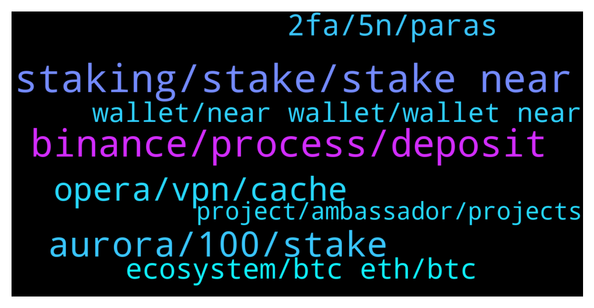

# **@cryptonear**
 ## Analysis for **2022-01-21** - **2022-01-22**.

---

## 📊 **Basic Stats**

**n_messages_sent**: 587

---

---

## 🔝 **Top keywords and related messages**

1. **staking, stake, stake near**

    @NearFritz --- *each 12 hours you will receive the reward, and I will recommend metapool.app* **--->** [TG Discussion](https://t.me/cryptonear/294050)

    @rahulgoel007 --- *On Metapool you can liquid stake $NEAR and get $NEAR(~11% APY) + $META {Liquid staking --> Instant Unstake by paying extra fees} Guide--> https://www.producthunt.com/posts/meta-pool  What's $META? Here's the answer! https://twitter.com/Nearius_/status/1431208822895374337?s=19* **--->** [TG Discussion](https://t.me/cryptonear/295466)

    @rahulgoel007 --- *You can stake via metapool or near wallet Check below links https://t.me/cryptonear/289255* **--->** [TG Discussion](https://t.me/cryptonear/295482)

    @Taurus990 --- *Where can i stake my NEAR ?* **--->** [TG Discussion](https://t.me/cryptonear/295481)

    @GeorgePro1 --- *Your stake near is never lost you can always unstake* **--->** [TG Discussion](https://t.me/cryptonear/294577)

    @oppzsmoKe --- *Why here instead of the official near wallet for staking* **--->** [TG Discussion](https://t.me/cryptonear/294051)

2. **binance, process, deposit**

    @Limtf --- *Withdrawal from wallet deposit to binance* **--->** [TG Discussion](https://t.me/cryptonear/295402)

    @BTD111 --- *I sent near from my near wallet to binance (they had the 64 digit address but its been 15min and funds still not there..* **--->** [TG Discussion](https://t.me/cryptonear/294114)

    @peuzei --- *or its the binance process ?* **--->** [TG Discussion](https://t.me/cryptonear/294189)

    @BTD111 --- *also how long do transactions take? how long does it take for my near to hit binance after I withdrew it from my near wallet, 5 confirmations.its been 13mins and still not there..* **--->** [TG Discussion](https://t.me/cryptonear/294107)

    @iforbusiness2 --- *hey mate, I guess binance is doing some update so the appropriate reply can be only given by Binance but you can use some alternative exchanges like gate/huobi/okex* **--->** [TG Discussion](https://t.me/cryptonear/295633)

    @Jill_9999 --- *Have any of you had problems with Binance not being able to transfer Eth (ERC-20) to your wallet today? I have just used Binance and found that I am unable to transfer Eth (ERC-20) to my wallet. It says "The address does not match the currently selected primary network".* **--->** [TG Discussion](https://t.me/cryptonear/295285)

3. **aurora, 100, stake**

    @BizAndro --- *how much total apy can i get and how to see apy ?* **--->** [TG Discussion](https://t.me/cryptonear/295538)

    @larry_lang --- *aurora is a side L2 chain on NEAR^^* **--->** [TG Discussion](https://t.me/cryptonear/294488)

    @kv9990 --- *I don't think you can stake Aurora as of now but you can stake your $NEAR on Aurora Validator and receive $AURORA as Staking rewards and since it's recently introduced,Rewards are juicy :3 wouldn't say more as Stake Farming isn't audited yet so won't recommend staking huge amount there. #dyor   Read more here* **--->** [TG Discussion](https://t.me/cryptonear/295188)

    @Wilderem --- *can you still stake on nearwallet for aurora rewards* **--->** [TG Discussion](https://t.me/cryptonear/294420)

    @GeorgePro1 --- *I don’t know the exact amount they charge as fees but top it up it will work* **--->** [TG Discussion](https://t.me/cryptonear/294725)

    @GeorgePro1 --- *You won’t get any near only Aurora* **--->** [TG Discussion](https://t.me/cryptonear/294573)

4. **opera, vpn, cache**

    @saulscotland --- *I just tried with firefox but I continue with the same problem, it stays loading when I want to send.* **--->** [TG Discussion](https://t.me/cryptonear/295446)

    @saulscotland --- *chrome and opera, from the computer and the cell phone* **--->** [TG Discussion](https://t.me/cryptonear/295441)

    @rahulgoel007 --- *Can you please try firefox once.* **--->** [TG Discussion](https://t.me/cryptonear/295442)

    @NEARverse_xd --- *Working fine here. Please close your tab and re-load it again* **--->** [TG Discussion](https://t.me/cryptonear/295428)

    @Taurus990 --- *I use apple, it doesn’t have such options* **--->** [TG Discussion](https://t.me/cryptonear/295643)

    @rahulgoel007 --- *Or try a different browser, I checked for me too it's working fine* **--->** [TG Discussion](https://t.me/cryptonear/295431)

5. **2fa, 5n, paras**

    @thanano46 --- *If i have only 3n available in my near Wallet dn i can't enable 2fa??* **--->** [TG Discussion](https://t.me/cryptonear/294201)

    @larry_lang --- *https://explorer.mainnet.near.org/transactions/Cv9VQs2PadfLnNuj2qXCPiWSrN5SsC1hMeuC9Qx2bkTD  well it said here u swapped 15N to Skyward tokens....* **--->** [TG Discussion](https://t.me/cryptonear/294746)

    @kv9990 --- *Nope that should be same =) but 4N are locked out of total balance in account with 2FA Enabled.* **--->** [TG Discussion](https://t.me/cryptonear/294200)

    @larry_lang --- *but then after that u deposited another 10N and now u have 15N, after that u swapped 15N for Skyward tokens: https://explorer.mainnet.near.org/transactions/Cv9VQs2PadfLnNuj2qXCPiWSrN5SsC1hMeuC9Qx2bkTD* **--->** [TG Discussion](https://t.me/cryptonear/294736)

    @Anuipk74 --- *when I Swap I have 5wNear* **--->** [TG Discussion](https://t.me/cryptonear/294752)

    @Anuipk74 --- *Hello admin. I changed my 5Near to Paras in Skyward but I don't get Paras in my wallet (Near -5, Paras 0) . Please help me. hongoc_son661126near.near wallet address* **--->** [TG Discussion](https://t.me/cryptonear/294697)

6. **ecosystem, btc eth, btc**

    @happyeveryday2368 --- *I just worried about if the whole ecosystem is influenced by Bitcoin* **--->** [TG Discussion](https://t.me/cryptonear/294355)

    @saylentrader --- *so auorora is part of near? but it has their own ecosystem?* **--->** [TG Discussion](https://t.me/cryptonear/294638)

    @masstahcoiner --- *just a chat about new world order with crypto blockchain and ecosystem* **--->** [TG Discussion](https://t.me/cryptonear/295072)

    @masstahcoiner --- *good entry point  but it's lame  if btc and eth falls  everything drops like a rock* **--->** [TG Discussion](https://t.me/cryptonear/295058)

    @larry_lang --- *https://medium.com/nearprotocol/how-oindaos-new-stablecoin-will-accelerate-defi-on-near-f2b69c106b02 for those who havent aware of the Oin.finance, what is it and how do it linked to NEAR ecosystem, i think this article is a great way to start^^* **--->** [TG Discussion](https://t.me/cryptonear/294160)

    @masstahcoiner --- *so everything won't be so conn. to btc and eth* **--->** [TG Discussion](https://t.me/cryptonear/295061)

7. **wallet, near wallet, wallet near**

    @GatMatH --- *My Near wallet is giving heart ach* **--->** [TG Discussion](https://t.me/cryptonear/295472)

    @b70valkyrie --- *Anybody facing issues with the NEAR wallet web frontend? Not being able to transfer any tokens for the whole day.* **--->** [TG Discussion](https://t.me/cryptonear/295313)

    @ᅠ ᅠ --- *The account has two-factor authentication. why can't I transfer the full amount of my nears on another wallet. error "not enough funds on the wallet"* **--->** [TG Discussion](https://t.me/cryptonear/294195)

    @lMamii --- *I can not withdraw my near from near wallet. Wallet say to me "An error occurred. Your send transaction was canceled". But all of steps is true.* **--->** [TG Discussion](https://t.me/cryptonear/295159)

    @Limtf --- *But what about the withdrawal from near wallet?* **--->** [TG Discussion](https://t.me/cryptonear/295407)

    @Masceker --- *It worked. It's weird that i required to  have minimum of 1 NEAR on wallet, even though the gas is much lower 😅* **--->** [TG Discussion](https://t.me/cryptonear/294754)

