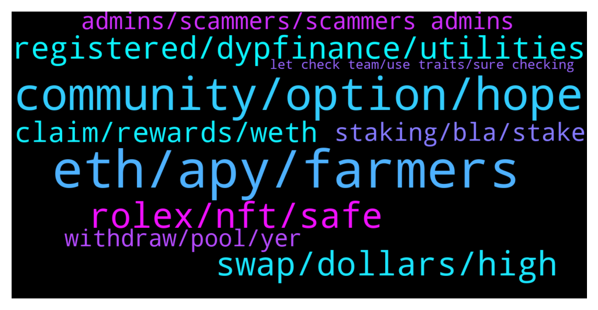

# **@dypfinance**
 ## Analysis for **2022-01-21** - **2022-01-22**.

---

## 📊 **Basic Stats**

**n_messages_sent**: 167

---

---

## 🔝 **Top keywords and related messages**

1. **eth, apy, farmers**

    @captain_protein --- *And to be honest once my eth farm unlocks I will probably be gone, too* **--->** [TG Discussion](https://t.me/dypfinance/241599)

    @captain_protein --- *The main benefit seems to have been to crush the value of Eth farmers' LP tokens* **--->** [TG Discussion](https://t.me/dypfinance/241567)

    @Tryitontriton --- *Well now the APY is so high that the difference can be made up in only about 2 weeks of rewards, and then every day afterwards is exponentially better. So if the rebalance did this to the LP value, it seems to make up for it assuming that the Return Calculator is accurate* **--->** [TG Discussion](https://t.me/dypfinance/241571)

    @hemanrock --- *APY can be increased or decreased* **--->** [TG Discussion](https://t.me/dypfinance/241645)

    @fthciftci --- *How is it possible dyp stake on eth apy was %400 now %22!* **--->** [TG Discussion](https://t.me/dypfinance/241643)

    @v1ruzz --- *You guys have completely ignored, BSC, only promote/increase apy on eth and avax!* **--->** [TG Discussion](https://t.me/dypfinance/242100)

2. **community, option, hope**

    @DhoniMSD516 --- *If anything is needed team will take all the steps nothing to worry* **--->** [TG Discussion](https://t.me/dypfinance/242070)

    @captain_protein --- *Sure, let's hope so. Look, the project is a good one and the team is clearly talented. All I would ask, as someone who has been very negatively affected by this change, is for the team to acknowledge that and learn from it.* **--->** [TG Discussion](https://t.me/dypfinance/241618)

    @captain_protein --- *Perhaps the team can just bear this in mind before making such fundamental changes in future.* **--->** [TG Discussion](https://t.me/dypfinance/241574)

    @iamJubi --- *You can check about the team here https://dyp.finance/about* **--->** [TG Discussion](https://t.me/dypfinance/241959)

    @captain_protein --- *There are definitely ways this could have been avoided* **--->** [TG Discussion](https://t.me/dypfinance/241608)

    @Nji_jalen --- *Hope can finish all like on roadmap😊* **--->** [TG Discussion](https://t.me/dypfinance/241836)

3. **rolex, nft, safe**

    @iamJubi --- *🔥Join Cats and Watches Society #NFTs Whitelist 🎉One Brand New Rolex Daytona Ceramic 116500LN worth $40k Giveaway  To win the watch: ✅Join dyp.finance/whitelist ✅Mint one #NFT once available ✅Like & Retweet this post ✅Join discord.gg/dypcaws ✅Tag 3 friends  👉https://twitter.com/dypfinance/status/1480623073208549380* **--->** [TG Discussion](https://t.me/dypfinance/242018)

    @timdyp --- *Did you know that the CAWS owners will be eligible to receive 10% of minting fees and 2.5% royalties of all secondary sales?  Join Whitelist Now👇 https://dyp.finance/whitelist  #NFTCommunity #NFTs #DYP  👉https://twitter.com/dypfinance/status/1484508148518076417* **--->** [TG Discussion](https://t.me/dypfinance/241845)

    @Richcal --- *yes I just really made sure that it was safe before I bought it, I'm afraid one day we will be sued by rolex for not asking permission to use their brand in our nft.  but if you can make sure it's safe, then I'll buy it* **--->** [TG Discussion](https://t.me/dypfinance/242074)

    @Richcal --- *okay dhon, so the conclusion is it's safe to buy right? when can we buy this nft dhon? is there an exact date?* **--->** [TG Discussion](https://t.me/dypfinance/242078)

    @DhoniMSD516 --- *If there in any issues like such in first case we will never do that so you are safe to mint* **--->** [TG Discussion](https://t.me/dypfinance/242076)

    @Richcal --- *so DYP team will be fully responsible for the use of this rolex brand right?* **--->** [TG Discussion](https://t.me/dypfinance/242071)

4. **swap, dollars, high**

    @Sweetejanlla123 --- *Yes. I juste ask why the price for buy and sell dyp for around 2000dollars on pancake swap are a big difference of 200dollars. There is not the same idyp.* **--->** [TG Discussion](https://t.me/dypfinance/241907)

    @Treasure --- *Where is 1980 dollars coming from* **--->** [TG Discussion](https://t.me/dypfinance/241900)

    @eltho5 --- *Yeah, but if my wallet predicts $1166 and the gastracker says $109 for a uniswap swap... so far apart. That's why I was wondering if anybody claimed recently and could give me the amount he/she needed to pay* **--->** [TG Discussion](https://t.me/dypfinance/241686)

    @Sweetejanlla123 --- *On idyp the is juste 20$ difference for swap around 2000 dollars.   Dyp is like 200 dollars. This is x10* **--->** [TG Discussion](https://t.me/dypfinance/241896)

    @hemanrock --- *No it wont be that high gas fees. please check back when less network congestion.  also, please make sure to check https://etherscan.io/gastracker* **--->** [TG Discussion](https://t.me/dypfinance/241679)

    @hemanrock --- *i think all coins in DeX sites has this kind in swap difference.* **--->** [TG Discussion](https://t.me/dypfinance/241909)

5. **registered, dypfinance, utilities**

    @nkemboxoffice --- *Good day admin Pls how do this help the growth of Dyp tokens? It’s alway confusing to me* **--->** [TG Discussion](https://t.me/dypfinance/241564)

    @Nji_jalen --- *Feature for dyp??. I hope see more utility for dyp coming* **--->** [TG Discussion](https://t.me/dypfinance/241829)

    @TuTeVs --- *Guys, can someone kindly explain what the difference is between IDYP and DYP? Can't find any information on IDYP..* **--->** [TG Discussion](https://t.me/dypfinance/241853)

    @Richcal --- *guys sorry to ask here, but i cant find any clue about What company behind of dypfinance? or where is the dypfinance registered? is dypfinance is a registered company? if yes, in which country? thank you* **--->** [TG Discussion](https://t.me/dypfinance/241958)

    @iamJubi --- *DYP is decentralized. As far as I know it is not registered. But if you are concerned with security, DYP is audited with 3 reputable Audit Companies https://dyp.finance/audit* **--->** [TG Discussion](https://t.me/dypfinance/241961)

    @Richcal --- *im not asking about team, but is dyp was registered?* **--->** [TG Discussion](https://t.me/dypfinance/241960)

6. **claim, rewards, weth**

    @iamJubi --- *The last claim transaction was 2 days ago. For the reward to show, someone on the pool must claim first. Reward on the pool are readily claimable so if you want to claim, feel free to do it. :)* **--->** [TG Discussion](https://t.me/dypfinance/241989)

    @eltho5 --- *I have claimable WETH that I left stacking because the fees are so high, but I would like to claim them to reinvest* **--->** [TG Discussion](https://t.me/dypfinance/241689)

    @fthciftci --- *i checked for claims when my rewards was good gas fee showing 400 usd* **--->** [TG Discussion](https://t.me/dypfinance/241652)

    @Tryitontriton --- *But it shows 0.000 WETH for the rewards, so if I click Claim and pay for the transaction, I am only to guess how much I’m claiming until somebody else claims?* **--->** [TG Discussion](https://t.me/dypfinance/241991)

    @Implemrnt --- *Can anyone help me with the bridge? I can't claim my tokens since yesterday* **--->** [TG Discussion](https://t.me/dypfinance/241815)

    @iamJubi --- *If you are not in rush, you can wait for someone to claim. Claim transaction will trigger the reward distribution.* **--->** [TG Discussion](https://t.me/dypfinance/241992)

7. **staking, bla, stake**

    @Ali pajoo --- *Hi .I want to add Cake from my metamask to farm v2 but it shows my balance 0 .what should I do?* **--->** [TG Discussion](https://t.me/dypfinance/242039)

    @Kamil --- *Hi there,  just bought some dyp on kucoin and would like to stake it,  how can i do it?* **--->** [TG Discussion](https://t.me/dypfinance/241747)

    @Ali pajoo --- *I think my Cakes are on PancakeSwap not in my Metamask* **--->** [TG Discussion](https://t.me/dypfinance/242041)

    @Kriptomatom --- *i dont understand your staking system. I waited on stake about 1 month for nothing. also i totaly lost money. what a interesting thing if you dont claim your reward, increase or decrease. depend of bla bla bla bla.  now bearish season but also my rewards bearish. totally disappointment for me. change project name DYP swamp protocol please.* **--->** [TG Discussion](https://t.me/dypfinance/241965)

    @DhoniMSD516 --- *Hello. You can stake on our staking dApp https://dyp.finance/stakev2/eth but first, you need to transfer your DYP to a private wallet like metamask .  Staking Tutorial https://youtu.be/D5g19SuQlcI* **--->** [TG Discussion](https://t.me/dypfinance/241748)

    @hemanrock --- *there is no Staking available on kucoin at the moment. please wait for further announcement.  you can check https://dyp.finance/stakev2* **--->** [TG Discussion](https://t.me/dypfinance/241637)

8. **admins, scammers, scammers admins**

    @captain_protein --- *Causing your users such massive losses is unlikely to be the best business approach.* **--->** [TG Discussion](https://t.me/dypfinance/241575)

    @Hosein --- *Hello friends Is there a Persian language group for this project?* **--->** [TG Discussion](https://t.me/dypfinance/242020)

    @DhoniMSD516 --- *❗️ BEWARE OF SCAMMERS ❗️  ❌Admins will NOT take the initiative to message you privately to solve problems. Never give your private keys to anyone, send tokens to addresses that they offer, or click on any links that they provide. ❌Don’t share confidential personal information in private chats, and don't make transactions of any kind at all.  ❗️ Be cautious of anyone who claims to be an admin! ❗️ DeFi Yield Protocol admins are @DhoniMSD516, @Tekkol, @timdyp, @iamJubi, @kleopatrad, and @hemanrock !* **--->** [TG Discussion](https://t.me/dypfinance/242051)

    @iamJubi --- *Can you dm me your public address? Please be aware of scammers, admins don’t dm first.* **--->** [TG Discussion](https://t.me/dypfinance/241978)

    @DhoniMSD516 --- *Hey please DM me your address* **--->** [TG Discussion](https://t.me/dypfinance/241816)

    @DhoniMSD516 --- *Please keep the chat in English* **--->** [TG Discussion](https://t.me/dypfinance/241868)

9. **withdraw, pool, yer**

    @iamJubi --- *Hello. Unpair on pcs after you withdraw form the pool https://pancakeswap-v1.dyp.finance/#/remove/0x961C8c0B1aaD0c0b10a51FeF6a867E3091BCef17/BNB* **--->** [TG Discussion](https://t.me/dypfinance/241964)

    @TaylorSwift360rekt --- *yer it has all my details to the right but shows nothing to withdraw* **--->** [TG Discussion](https://t.me/dypfinance/241975)

    @captain_protein --- *I'm not asking for my money back - its gone* **--->** [TG Discussion](https://t.me/dypfinance/241596)

    @TaylorSwift360rekt --- *how to remove DYP/WBNB LP tokens on V1?* **--->** [TG Discussion](https://t.me/dypfinance/241963)

    @iamJubi --- *Kindly withdraw your LP first https://app-bsc.dyp.finance/staking-bnb-30* **--->** [TG Discussion](https://t.me/dypfinance/241973)

    @TaylorSwift360rekt --- *yer i cant withdraw from pool* **--->** [TG Discussion](https://t.me/dypfinance/241967)

10. **let check team, use traits, sure checking**

    @hemanrock --- *please make sure you are checking right   https://www.coingecko.com/en/coins/defi-yield-protocol  https://www.coingecko.com/en/coins/idefiyieldprotocol* **--->** [TG Discussion](https://t.me/dypfinance/241901)

    @DhoniMSD516 --- *It is ok to use traits we are not copyrighting anything here, I think you asked same questions before and also got answers 😀* **--->** [TG Discussion](https://t.me/dypfinance/242072)

    @timdyp --- *Are you sure? Check this message that was sent two days ago ;) https://t.me/dypannouncements/850* **--->** [TG Discussion](https://t.me/dypfinance/242102)

    @iamJubi --- *Hello. Let me check with the team. Thanks* **--->** [TG Discussion](https://t.me/dypfinance/241980)

    @timdyp --- *Hey @eltho5, sorry. He made a mistake. You can put again your question.* **--->** [TG Discussion](https://t.me/dypfinance/241674)

    @DhoniMSD516 --- *Sure just hold on screenshots coming through* **--->** [TG Discussion](https://t.me/dypfinance/241905)

