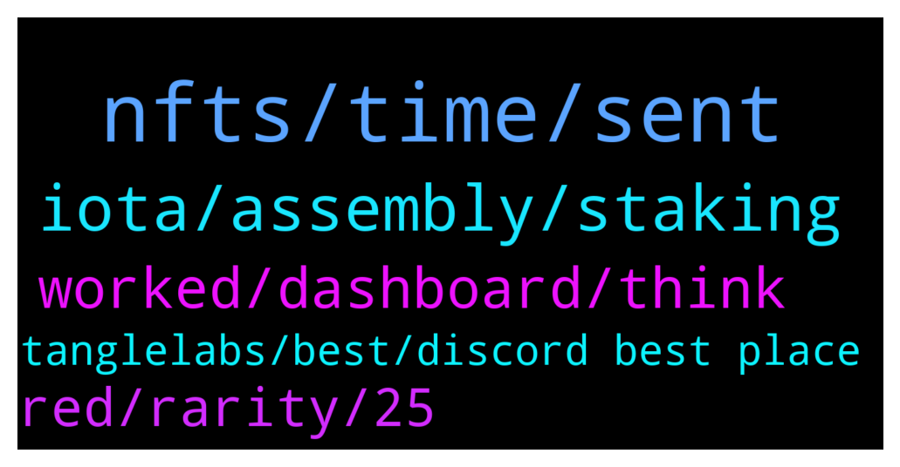

# **@iotatangle**
 ## Analysis for **2022-01-21** - **2022-01-22**.

---

## 📊 **Basic Stats**

**n_messages_sent**: 78

---

---

## 🔝 **Top keywords and related messages**

1. **nfts, time, sent**

    @lbenheilo --- *But it is not in my NFTs* **--->** [TG Discussion](https://t.me/iotatangle/307232)

    @lbenheilo --- *I am stucking at awaiting payment? What should I do now?* **--->** [TG Discussion](https://t.me/iotatangle/307221)

    @raulgudiez --- *Thanks, what I have not been able to see is the other NFT in the Dashboard* **--->** [TG Discussion](https://t.me/iotatangle/307265)

    @raulgudiez --- *The white list contains my address with NTF Minted.  But I don't see it in Metamask.  I enter: https://nft.tanglelabs.io/buy  And it appears for me to resend 100 Mi.  But I already sent them and they haven't returned them.  What should I do? I think I don't understand something.* **--->** [TG Discussion](https://t.me/iotatangle/307260)

    @davicico94 --- *If i have 3 nfts, can i sell one ?* **--->** [TG Discussion](https://t.me/iotatangle/307318)

    @DidroBlake --- *can you still get nft?  at the very beginning I could not, the page did not open* **--->** [TG Discussion](https://t.me/iotatangle/307287)

2. **iota, assembly, staking**

    @Brypto --- *Haven't been on in a while, and didn't see it in last few pinned mwssages, did staking function in wallet ever happen?* **--->** [TG Discussion](https://t.me/iotatangle/307352)

    @DidroBlake --- *And how long will the event last?* **--->** [TG Discussion](https://t.me/iotatangle/307295)

    @Tahmis --- *Yes. There is still few months of staking left* **--->** [TG Discussion](https://t.me/iotatangle/307354)

    @Tahmis --- *Iota is needed for being able to use assembly* **--->** [TG Discussion](https://t.me/iotatangle/307284)

    @YomanTt --- *Assembly 100bil supply so 0,1cost means 1b market cap  mby it will be like that mby no. Who knows depends on Bitcoin and depend on how this will make iota network more popular* **--->** [TG Discussion](https://t.me/iotatangle/307204)

    @YomanTt --- *When shimmer will be launched there will be some nft which give bonus staking and other options* **--->** [TG Discussion](https://t.me/iotatangle/307279)

3. **worked, dashboard, think**

    @raulgudiez --- *Thanks, now it doesn't connect well with the page.  I will try it later.* **--->** [TG Discussion](https://t.me/iotatangle/307262)

    @raulgudiez --- *I think everything is fine although I have not yet access the dashboard* **--->** [TG Discussion](https://t.me/iotatangle/307291)

    @Tahmis --- *For some reason Chromium based browsers don't work so well* **--->** [TG Discussion](https://t.me/iotatangle/307289)

    @solgnar --- *ya it keeps crashing right now and is freaking out. it works like 20% of the time for me* **--->** [TG Discussion](https://t.me/iotatangle/307263)

    @itsmedev --- *Yeah server response is super bad now* **--->** [TG Discussion](https://t.me/iotatangle/307259)

    @Tahmis --- *I think it's because the site is slow* **--->** [TG Discussion](https://t.me/iotatangle/307237)

4. **red, rarity, 25**

    @davicico94 --- *And what is rarity? Cause says 25?* **--->** [TG Discussion](https://t.me/iotatangle/307332)

    @itsmedev --- *Did you buy one earlier and one now?* **--->** [TG Discussion](https://t.me/iotatangle/307266)

    @Jason --- *4 coloured rarities and each is number also* **--->** [TG Discussion](https://t.me/iotatangle/307337)

    @lbenheilo --- *when I checked it, the color is red, but rarity show 7/25. I was surprised, went to check color rarity again. haha* **--->** [TG Discussion](https://t.me/iotatangle/307253)

    @lbenheilo --- *I got the red one. ☺️* **--->** [TG Discussion](https://t.me/iotatangle/307249)

    @itsmedev --- *Not lucky enough to get rare ones* **--->** [TG Discussion](https://t.me/iotatangle/307241)

5. **tanglelabs, best, discord best place**

    @Tahmis --- *I recommend joining their discord. That is the best place to get information about these* **--->** [TG Discussion](https://t.me/iotatangle/307322)

    @itsmedev --- *These are nft launched by community lead team tanglelabs* **--->** [TG Discussion](https://t.me/iotatangle/307274)

    @itsmedev --- *Discord is the best place to connect with tanglelabs folks* **--->** [TG Discussion](https://t.me/iotatangle/307222)

    @davicico94 --- *Only i can see going tangle labs?* **--->** [TG Discussion](https://t.me/iotatangle/307317)

    @itsmedev --- *Did anyone else buy tanglelabs NFT?* **--->** [TG Discussion](https://t.me/iotatangle/307243)

