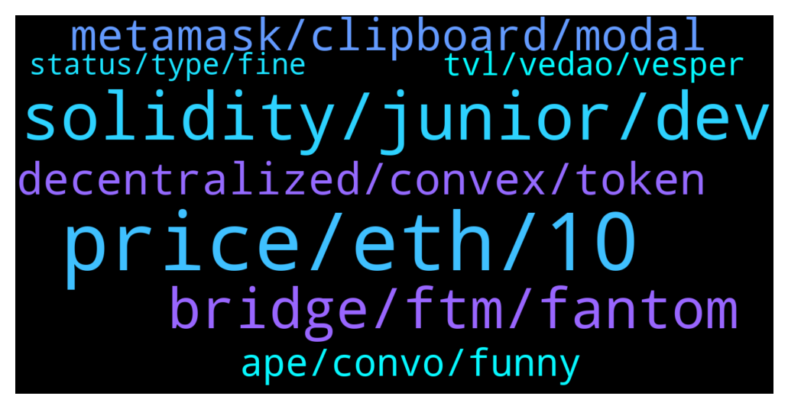

# **@lobsters_chat**
 ## Analysis for **2022-01-21** - **2022-01-22**.

---

## 📊 **Basic Stats**

**n_messages_sent**: 388

---

---

## 🔝 **Top keywords and related messages**

1. **price, eth, 10**

    @Felix --- *What about organizing a liquidation of all short sellers?   If each person of this group buys for $100k of stable on Binance at a similar time, that’s $1.7bn. that would basically liquidate all short sellers and bring BTC to $65k* **--->** [TG Discussion](https://t.me/lobsters_chat/317864)

    @ivangbi --- *Please tell my lusd curve deposit is fine, and gonna be okay? Please say so.* **--->** [TG Discussion](https://t.me/lobsters_chat/317910)

    @Cryptoaq --- *Have to be ultra coder for get those prices?* **--->** [TG Discussion](https://t.me/lobsters_chat/317777)

    @SC --- *Uniswap almost has same stablecoin swap market share as Curve? That's interesting https://twitter.com/PandaJackson42/status/1484596500978143234* **--->** [TG Discussion](https://t.me/lobsters_chat/317902)

    @mrm33seeks --- *So did the value of the assets in it.* **--->** [TG Discussion](https://t.me/lobsters_chat/317603)

    @sonicblend --- *Price starts higher than market price to try screw noobs over first* **--->** [TG Discussion](https://t.me/lobsters_chat/317883)

2. **solidity, junior, dev**

    @rocketdev --- *can anyone describe difference between junior solidity developer and middle solidity developer for example?* **--->** [TG Discussion](https://t.me/lobsters_chat/317445)

    @rocketdev --- *i did some pet projects and worked with one startup , integrating swaps and another defi projects, it went okay, tech stack like hardhat/react/typechain blabla , everything with tests, is it still junior level?* **--->** [TG Discussion](https://t.me/lobsters_chat/317516)

    @Figu3 --- *Wait, you can hire solidity devs at 2500$/ month ? 🤣* **--->** [TG Discussion](https://t.me/lobsters_chat/317495)

    @rocketdev --- *maybe someone can interview me for detect if im senior or junior solidity dev? 😕* **--->** [TG Discussion](https://t.me/lobsters_chat/317487)

    @joehquak --- *I would classify that as junior dev for sure* **--->** [TG Discussion](https://t.me/lobsters_chat/317524)

    @rocketdev --- *i can interpret php in mind, should i do same with sol?* **--->** [TG Discussion](https://t.me/lobsters_chat/317531)

3. **bridge, ftm, fantom**

    @Chiminiv9 --- *Almost no liquidity either. Like Mog said it's probably better to swap the FTM into something else to bridge it...* **--->** [TG Discussion](https://t.me/lobsters_chat/317339)

    @MrHodl1 --- *I ended up bridging some ftm throuigh multichain.xyz but it is taking a long time for my test transaction to make it acreoss* **--->** [TG Discussion](https://t.me/lobsters_chat/317343)

    @MrHodl1 --- *Hey guys whats the best bridge with liquidity to bridge ftm from eth to fantom?* **--->** [TG Discussion](https://t.me/lobsters_chat/317315)

    @zeThrouzz --- *https://twitter.com/ivangbi_/status/1484544559363379202  was it the ultra rekt signal for FTM?🥲* **--->** [TG Discussion](https://t.me/lobsters_chat/317855)

    @Tiarizzi93 --- *https://app.fund.movr.network/ https://li.finance/  Check here, they are bridge aggregators* **--->** [TG Discussion](https://t.me/lobsters_chat/317323)

    @wugamlo --- *I used Rubic Multichain-bridge to bridge ETH to USDC on FTM. Worked well. https://app.rubic.exchange/* **--->** [TG Discussion](https://t.me/lobsters_chat/317351)

4. **metamask, clipboard, modal**

    @APMINERR --- *does opensea support other eth testnet other than rinkerby?* **--->** [TG Discussion](https://t.me/lobsters_chat/317283)

    @cavkie --- *Isn't it a standard permission? Think metamask has it* **--->** [TG Discussion](https://t.me/lobsters_chat/317243)

    @sonicblend --- *Seems like it's possible to disable clipboard access and just battle with the UI.* **--->** [TG Discussion](https://t.me/lobsters_chat/317242)

    @APMINERR --- *so they can look into it* **--->** [TG Discussion](https://t.me/lobsters_chat/317564)

    @coine_r --- *So the claim goes. Whether they can actually get away from it is another question* **--->** [TG Discussion](https://t.me/lobsters_chat/317791)

    @sonicblend --- *Not according to my Chrome settings. I use MetaMask* **--->** [TG Discussion](https://t.me/lobsters_chat/317244)

5. **decentralized, convex, token**

    @SpikeSpiege1 --- *10+ years ago I traded stocks and worked with Wall Street guys. Today I try explain the immense advantage of decentralized finance (Removing bank ceos, share payouts etc) to show how capital is easily dispersed back to the ppl putting up capital. The past year its gotten decisively more murky about where revenue is generated and how it's paid out. So many layers built upon 1 base layer of revenue be it aave, cuvre, etc* **--->** [TG Discussion](https://t.me/lobsters_chat/317434)

    @hugeshoe --- *No fully decentralised perps yet bro* **--->** [TG Discussion](https://t.me/lobsters_chat/317583)

    @amplice --- *in what way is perp v2 not decentralized* **--->** [TG Discussion](https://t.me/lobsters_chat/317584)

    @amplice --- *if governance is decentralized and governance chooses tokens that are listed —> token listing in decentralized too, u cant beat the DAO meme ser* **--->** [TG Discussion](https://t.me/lobsters_chat/317591)

    @amplice --- *decentralized means u cannot close it, nice try to shill ur project tho ser, good hustle* **--->** [TG Discussion](https://t.me/lobsters_chat/317589)

    @hugeshoe --- *Fully decentralised means permissionless listing and permissionless risk management.* **--->** [TG Discussion](https://t.me/lobsters_chat/317585)

6. **ape, convo, funny**

    @fozzysbo --- *people dont give big V enough credit for how normal / down to earth he is* **--->** [TG Discussion](https://t.me/lobsters_chat/317256)

    @laconeat --- *I think the best thing I read for a while 🫂  https://link.medium.com/u7kRqJHy0mb* **--->** [TG Discussion](https://t.me/lobsters_chat/317707)

    @joehquak --- *He's an interesting one to get you started https://www.paradigm.xyz/2021/08/the-dangers-of-surprising-code/* **--->** [TG Discussion](https://t.me/lobsters_chat/317546)

    @unchainedoneawoken --- *very nice, love the content from chadass.  I've been a ZNN boy for a while now.* **--->** [TG Discussion](https://t.me/lobsters_chat/317663)

    @Tiarizzi93 --- *You are now one of my favorite human being 😁* **--->** [TG Discussion](https://t.me/lobsters_chat/317682)

    @Darrenlautf --- *Fren said to ape so i ape no questions asked 😂* **--->** [TG Discussion](https://t.me/lobsters_chat/317681)

7. **tvl, vedao, vesper**

    @priyeshu --- *vampire attack about to hit a 1b TVL at https://www.oxdao.fi/* **--->** [TG Discussion](https://t.me/lobsters_chat/317700)

    @ivangbi --- *Questionable rushed launch with almost no security repercussions from their efforts in cream (not condoning, nobody is safe, but after such history you might wanna pay attention to more security content of some sort, and be more careful).* **--->** [TG Discussion](https://t.me/lobsters_chat/317892)

    @xylophonez --- *what's the timeline now on the ve (3,3) launch, is it public?* **--->** [TG Discussion](https://t.me/lobsters_chat/317384)

    @Gyunikuchan --- *Shouldn't there be a veDAO2 where u can lock up weve to farm more TVL?* **--->** [TG Discussion](https://t.me/lobsters_chat/317411)

    @mattygoal --- *the '18 flashbacks get servere now* **--->** [TG Discussion](https://t.me/lobsters_chat/317369)

    @FMan489 --- *Maybe I just took your comment out of context? Looks neat - BUT vesper team.* **--->** [TG Discussion](https://t.me/lobsters_chat/317944)

