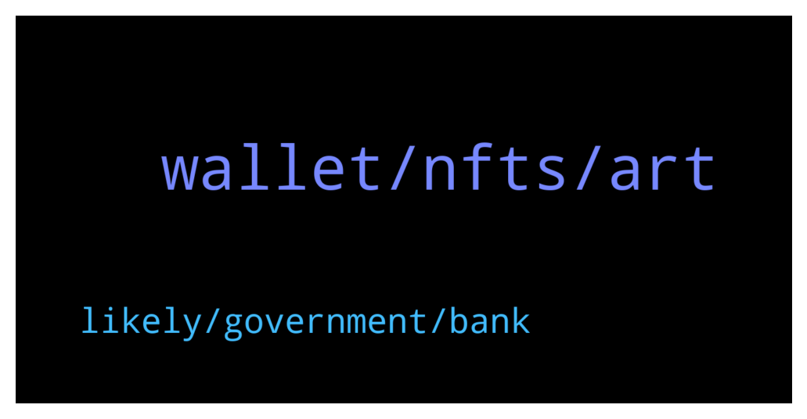

# **@radix_dlt**
 ## Analysis for **2022-01-21** - **2022-01-22**.

---

## 📊 **Basic Stats**

**n_messages_sent**: 404

---

---

## 🔝 **Top keywords and related messages**

1. **wallet, nfts, art**

    @PeterFATAss --- *Your scorps are not even worth 1 cent dude. Buy a tulip my advice* **--->** [TG Discussion](https://t.me/radix_dlt/344154)

    @ahsimon --- *The core, System and gateway API refactor were released today.  An introduction to the documentation is at https://docs.radixdlt.com/main/apis/api-specification.html* **--->** [TG Discussion](https://t.me/radix_dlt/343801)

    @JohnwhaleOG --- *https://thedefiant.io/cyberkongz-soaring-own-to-earn-nfts/ have a read on the cyberkongz part. this is my favourite example* **--->** [TG Discussion](https://t.me/radix_dlt/343885)

    @chrisijoyah --- *Seems like Coinbase is jumping on the NFT bandwagon https://www.coinbase.com/nft/announce* **--->** [TG Discussion](https://t.me/radix_dlt/344321)

    @Mleekko --- *Not with the official wallet. But if you trust random people on the internet you can use my custom Wallet build: https://github.com/Mleekko/olympia-wallet/releases It still supports only one HW at a time, so to use another HW account, you need to delete the current one and add the new one. to switch back you again delete the acc and add the previous one.* **--->** [TG Discussion](https://t.me/radix_dlt/344050)

    @Ben_XRD --- *Under the old architecture, the desktop wallet obtained its information from archive nodes, i.e. it would connect to an archive node to obtain the state of the ledger - for example to display your balance. This was not the most scalable architecture as additional archive nodes had to be manually spun up if we saw an increase in demand. If we weren’t quick enough for your region, then that may have manifested as your wallet responding slowly.  The new Gateway API should completely resolve this. The Gateway API, which now feeds your wallet, is served by the Network Gateway. Network Gateway is a cloud based service and thus gains the elasticity you would expect from that, i.e. it can automatically increase its capacity to respond to spikes in demand.* **--->** [TG Discussion](https://t.me/radix_dlt/344392)

2. **likely, government, bank**

    @CryptoRadix --- *I wouldnt be looking at CBDC's as a bad thing guys, the fact that the governments around the world are all talking about this (seriously) is a testament that there is something here that can really improve the world economy. Additionally, CBDC's (or insured stablecoins) open the flood gates to new money into the space. I personally would be putting a lot more money on chain in stablecoins if I knew it had the same kind of FDIC insurance my bank account has...* **--->** [TG Discussion](https://t.me/radix_dlt/344259)

    @fpieper --- *Well it is more whether they want to. They could deploy a token in a short amount of time like USDC. But yeah I think issueing permissioned tokens (like USD) on a permissionless ledger like Radix will be the way to go.  This is a great on point interview with Piers (talking about CBDCs): https://www.youtube.com/watch?v=pJ3G-DeAKoo* **--->** [TG Discussion](https://t.me/radix_dlt/344252)

    @aus87 --- *Maybe you are right, maybe I should embrace CBDCs so that USD can end up like the bolivar and BTC price will be measured with x10^xx USD* **--->** [TG Discussion](https://t.me/radix_dlt/344299)

    @CryptoRadix --- *well so there is something to be said for that. A centralized ledger for USD_CBDC does give the fed all the control over transactions which is something the general public and probably corporations do not want. if CBDC was run on public DLT's that changes things I think.* **--->** [TG Discussion](https://t.me/radix_dlt/344261)

    @CryptoRadix --- *yes but CBDC increases competition across governments. They make it much easier for a country to say "ehhh lets use EUR instead of USD" the Fed will have to compete against this and make sure their CBDC is the most attractive option. thats not happening to the same extent today because of all of the friction in the system. Its very clear that the Feds vision is complementary to the current system not a replacement. there would still be physical cash.* **--->** [TG Discussion](https://t.me/radix_dlt/344267)

    @CryptoRadix --- *the reality is that, whether we like it or not, CBDC's are probably coming. we should use it to our advantage whether its as simple as being an on ramp or more heavily integrated into the network itself* **--->** [TG Discussion](https://t.me/radix_dlt/344231)

