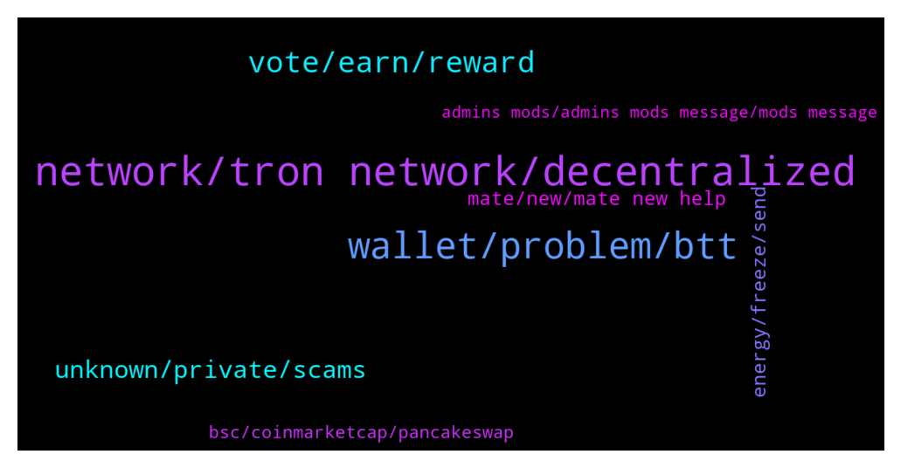

# **@tronnetworkEN**
 ## Analysis for **2022-01-21** - **2022-01-22**.

---

## 📊 **Basic Stats**

**n_messages_sent**: 242

---

---

## 🔝 **Top keywords and related messages**

1. **network, tron network, decentralized**

    @Carlos_TRX --- *Import your wallet to tronlink, Trustwallet is the worst wallet to TRON ecosystem* **--->** [TG Discussion](https://t.me/tronnetworkEN/3844283)

    @Sam --- *Guys  Im old holder of Tron and Btt  and And it's very painful for me to have been holding a currency all this time, but now that I have a problem I can not find a team to talk to.  This is a big weakness for this network.  It is true that Tron is decentralized, but it definitely needs a support team.  If you have access to higher layers, please raise this issue with them, even as a suggestion* **--->** [TG Discussion](https://t.me/tronnetworkEN/3844299)

    @Sam --- *This support was very valuable to me because I had not received any response for several days. And it was really annoying* **--->** [TG Discussion](https://t.me/tronnetworkEN/3844336)

    @Carlos_TRX --- *TRX is the main crypto #TRON crypto but it has been replicated on BSC as BEP20    The official TRX token contract address on Binance Smart Chain is: https://bscscan.com/address/0x85eac5ac2f758618dfa09bdbe0cf174e7d574d5b  I recommend you buy the real TRX in TRON blockchain, faster and cheaper chain* **--->** [TG Discussion](https://t.me/tronnetworkEN/3847930)

    @Farabi --- *the address he shared with isn't TRX one* **--->** [TG Discussion](https://t.me/tronnetworkEN/3847951)

    @SchooleyD --- *I think the confusion with Tron mining is TRX and the tron ecosystem* **--->** [TG Discussion](https://t.me/tronnetworkEN/3844052)

2. **wallet, problem, btt**

    @ENIGMA --- *Add all btt token and close and reopen the app* **--->** [TG Discussion](https://t.me/tronnetworkEN/3844320)

    @Sam --- *I do it many time  Even I deleted my trust and recover it again but not different.* **--->** [TG Discussion](https://t.me/tronnetworkEN/3844322)

    @Sam --- *Yes  Sure  Because its not only for mine  One of my friend has a exactly same problem  And we learn that is problem of many guys  I have 3 transactions with this problem* **--->** [TG Discussion](https://t.me/tronnetworkEN/3844239)

    @Sam --- *How it possible??!? I can send you a sc shot from my wallet  You can see my transaction history  I didnt get anything* **--->** [TG Discussion](https://t.me/tronnetworkEN/3844281)

    @cirilojose --- *i thought blockchain were impossible to hack. educate me bro..* **--->** [TG Discussion](https://t.me/tronnetworkEN/3844819)

    @Sam --- *Its exactly problem of tron  Why I didnt get my funds on this network?  This is not only my problem  I can send you a several TXid that has a same problem* **--->** [TG Discussion](https://t.me/tronnetworkEN/3844287)

3. **vote, earn, reward**

    @agentpiki --- *The default reward is trx. You can vote for any of top 27 (super representatives)* **--->** [TG Discussion](https://t.me/tronnetworkEN/3847676)

    @agentpiki --- *You don't get USDT for rewards usually.   Default is TRX, unless the group you voted for gives otherwise* **--->** [TG Discussion](https://t.me/tronnetworkEN/3847608)

    @agentpiki --- *It is up to you really 👌 if you go for the money then vote for highest APR.* **--->** [TG Discussion](https://t.me/tronnetworkEN/3847711)

    @agentpiki --- *Oh, i use tronlink. Sorry. I don't know how klever voting works.* **--->** [TG Discussion](https://t.me/tronnetworkEN/3847687)

    @Vijai Kumar --- *want to know about voting frequency , is it to vote every six hour or its auto calculated ?* **--->** [TG Discussion](https://t.me/tronnetworkEN/3846811)

    @alpha0247 --- *hello, i staked my trx and i voted KLV and i get the reward everyday. please what can i vote to receive usdt ? you have an idea ?* **--->** [TG Discussion](https://t.me/tronnetworkEN/3847603)

4. **unknown, private, scams**

    @simon866 --- *unfortunately there is a concentrated effort to scam investors with mining offerings  Even the ecosystem is on a rewards basis so hopefully investors avoid these scams* **--->** [TG Discussion](https://t.me/tronnetworkEN/3844054)

    @MilNoslen --- *Doesnt matter. Could be malicious website, a smart contract approval, etc.* **--->** [TG Discussion](https://t.me/tronnetworkEN/3844792)

    @فيراس --- *Those scammer trying real hard to scam...* **--->** [TG Discussion](https://t.me/tronnetworkEN/3847779)

    @agentpiki --- *And pls check legitimacy of the investment platform.  It was you who engaged in scam, we can't do anything* **--->** [TG Discussion](https://t.me/tronnetworkEN/3847697)

    @Carlos_TRX --- *because is scam, nothing to do with us mate* **--->** [TG Discussion](https://t.me/tronnetworkEN/3847403)

    @Kakoshemy --- *It seems to me that they already scammed you brother…..* **--->** [TG Discussion](https://t.me/tronnetworkEN/3846501)

5. **energy, freeze, send**

    @xPommepote --- *No, it will gain energy time after time but not reset every 24h* **--->** [TG Discussion](https://t.me/tronnetworkEN/3844455)

    @simon866 --- *When you freeze for energy select freeze to another address option 👍* **--->** [TG Discussion](https://t.me/tronnetworkEN/3844319)

    @Severian_8 --- *why will the 2nd wallet I send energy to gain energy time after time but not every 24hrs?* **--->** [TG Discussion](https://t.me/tronnetworkEN/3844509)

    @Severian_8 --- *Will the energy replenish in the wallet I send the energy to every 24hrs?* **--->** [TG Discussion](https://t.me/tronnetworkEN/3844450)

    @Severian_8 --- *Can Energy & Bandwidth be transferred to another wallet without renting it?  I want to send 400,000 energy from one wallet to another so I can interact with a smart contract. Is there a way to do that without renting it for 36 trx?* **--->** [TG Discussion](https://t.me/tronnetworkEN/3844315)

    @xPommepote --- *Because it works like this. If you want to reset the energy, unfreeze after 3 days and freeze again* **--->** [TG Discussion](https://t.me/tronnetworkEN/3844535)

6. **mate, new, mate new help**

    @boureima Amadou --- *Who Can send le the link of the groupe i Will joi* **--->** [TG Discussion](https://t.me/tronnetworkEN/3845728)

    @Ali --- *Your group is not available in Urdu language ?????🇵🇰🇵🇰🇵🇰🇵🇰* **--->** [TG Discussion](https://t.me/tronnetworkEN/3846565)

    @Neurologist2 --- *Hi I'm new  Help me with this group* **--->** [TG Discussion](https://t.me/tronnetworkEN/3845132)

    @Bala --- *Hi am happy to join you people in this legitimate group.* **--->** [TG Discussion](https://t.me/tronnetworkEN/3844357)

    @Hissa --- *Sorry I’m new to this group tho* **--->** [TG Discussion](https://t.me/tronnetworkEN/3846490)

    @Carlos_TRX --- *you're welcome to share you the link mate* **--->** [TG Discussion](https://t.me/tronnetworkEN/3847963)

7. **bsc, coinmarketcap, pancakeswap**

    @Farabi --- *Hi everybody,  Someone can help me with the TRX contrat address fof BSC?* **--->** [TG Discussion](https://t.me/tronnetworkEN/3847928)

    @Fabs_trx --- *Maybe you tried to copy paste the url in bsc scam search bar?  https://bscscan.com/address/0x85eac5ac2f758618dfa09bdbe0cf174e7d574d5b* **--->** [TG Discussion](https://t.me/tronnetworkEN/3847957)

    @agentpiki --- *go to coinmarketcap.com and get the BSC contract there* **--->** [TG Discussion](https://t.me/tronnetworkEN/3847929)

    @agentpiki --- *Get the contract from coinmarketcap.com (BSC contract)  Add to pancakeswap* **--->** [TG Discussion](https://t.me/tronnetworkEN/3845342)

    @Hamedtx --- *Are u sure your Tron is on BSC?* **--->** [TG Discussion](https://t.me/tronnetworkEN/3845356)

    @agentpiki --- *Huh. Do you own a BSC wrapped version of TRX in pancakeswap?* **--->** [TG Discussion](https://t.me/tronnetworkEN/3845344)

8. **admins mods, admins mods message, mods message**

    @agentpiki --- *Block them all. Admins and mods do not message first* **--->** [TG Discussion](https://t.me/tronnetworkEN/3846966)

    @Samsonioc --- *You are insane. ../admin get this person off here* **--->** [TG Discussion](https://t.me/tronnetworkEN/3845963)

    @agentpiki --- *Good.   Block them all scammers and let them die of hunger.  Admins and mods never message first.  Also, you can send proof of messages to me.  Will ban them 👌* **--->** [TG Discussion](https://t.me/tronnetworkEN/3845609)

    @Bala --- *Someone chats me that he is the group moderator that i should tell him my problem* **--->** [TG Discussion](https://t.me/tronnetworkEN/3845245)

    @simon866 --- *No begging here, all members must earn there way  Do it again and instant ban* **--->** [TG Discussion](https://t.me/tronnetworkEN/3844428)

    @joem123tel --- *dont want to be banned again* **--->** [TG Discussion](https://t.me/tronnetworkEN/3844171)

