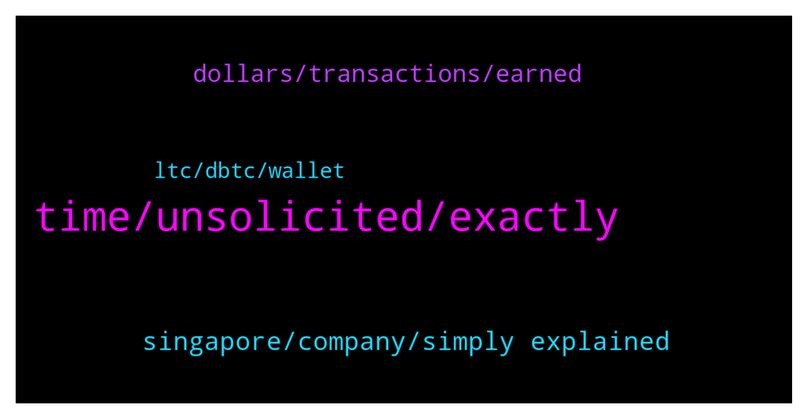

# **@CakeDeFi_EN**
 ## Analysis for **2022-01-22** - **2022-01-23**.

---

## 📊 **Basic Stats**

**n_messages_sent**: 125

---

---

## 🔝 **Top keywords and related messages**

1. **time, unsolicited, exactly**

    @DmgBautista --- *Indeed! For the ones that started its crypto journey with Cake and Defichain, I believe they started in the best way possible :) Communities are amazing and providing good services and future. Will be an amaizing journey 😃* **--->** [TG Discussion](https://t.me/CakeDeFi_EN/167504)

    @gottagrabthere --- *Micheal messaged me as here is proof of that I would ask to make community profiles hidden. Thanks* **--->** [TG Discussion](https://t.me/CakeDeFi_EN/167208)

    @Cammy2904 --- *Yeah my account has only pennies lol compared to the hacked crypto.com accounts 😭 damn I would go mad if anything like that happened to me. I've followed it on Twitter, people reported amounts of 35ETH missing from their accounts that's a lot for me 😱* **--->** [TG Discussion](https://t.me/CakeDeFi_EN/167492)

    @Chigo1991 --- *Please i want to start trading now how do i start now* **--->** [TG Discussion](https://t.me/CakeDeFi_EN/167392)

    @Chigo1991 --- *Please how do i start trading now please am confuse here* **--->** [TG Discussion](https://t.me/CakeDeFi_EN/167395)

    @muhsinn42 --- *staked finished but not unlocked today* **--->** [TG Discussion](https://t.me/CakeDeFi_EN/167428)

2. **singapore, company, simply explained**

    @soulsensei --- *In light of the recent crypto.com hack, what are the cyber security measures adopted by Cake DeFi to prevent similar hacks from happening?* **--->** [TG Discussion](https://t.me/CakeDeFi_EN/167464)

    @mm_phoenix --- *Cake Pte Ltd, registered in Singapore 201918368M https://www.cakedefi.com/imprint/* **--->** [TG Discussion](https://t.me/CakeDeFi_EN/167197)

    @Chigo1991 --- *I have not understand dis cake defl en i need explaintion* **--->** [TG Discussion](https://t.me/CakeDeFi_EN/167317)

    @ExPwr --- *Team, what is the current TVL of cake.defi?* **--->** [TG Discussion](https://t.me/CakeDeFi_EN/167347)

    @Michael_Schredl --- *Start your DeFi Journey Here: Cake  DeFi Services Simply Explained https://support.cakedefi.com/hc/en-us/articles/900003427506-Cake-Service-simply-explained* **--->** [TG Discussion](https://t.me/CakeDeFi_EN/167331)

    @Kassius84 --- *Start your DeFi Journey Here: Cake  DeFi Services Simply Explained https://support.cakedefi.com/hc/en-us/articles/900003427506-Cake-Service-simply-explained* **--->** [TG Discussion](https://t.me/CakeDeFi_EN/167319)

3. **dollars, transactions, earned**

    @Stephan --- *Thanks for the answer, but in that case I would have to add all up right? I meant to have an Overview like on the main page where I can see how many DFI I have earned in the last week/month etc* **--->** [TG Discussion](https://t.me/CakeDeFi_EN/167270)

    @Stephan --- *Is there any possiblity to see how much DFI one has earned? (not USD)* **--->** [TG Discussion](https://t.me/CakeDeFi_EN/167263)

    @ExPwr --- *I mean value of all DFI locked and on the platform now.* **--->** [TG Discussion](https://t.me/CakeDeFi_EN/167352)

    @n01r77 --- *Hi, is this learn and earn 5$ Dfi is withdrawal or not?* **--->** [TG Discussion](https://t.me/CakeDeFi_EN/167516)

    @muhammedbyrkn --- *hello, my reference will make a deposit of 50 dollars, will he receive 30 dollars dfi tokens?* **--->** [TG Discussion](https://t.me/CakeDeFi_EN/167471)

    @jezzkng --- *minium is 1DFI, i'd suggest keep it as $2-$3 DFI, to ease the process by experience* **--->** [TG Discussion](https://t.me/CakeDeFi_EN/167402)

4. **ltc, dbtc, wallet**

    @John --- *Yes Jess I transferred DFI from cake to desktop DEFI walled, well received the amount then transferred to dBTC and now want to send the dBTC to cake for Lending. I have 22 DFI in UTXO not sure what I am missing here 😬* **--->** [TG Discussion](https://t.me/CakeDeFi_EN/167415)

    @DoEvtgInLove --- *Hi friends, if I send dBTC to Cake to unwrap I will get BTC at Oracle price?* **--->** [TG Discussion](https://t.me/CakeDeFi_EN/167420)

    @gpkiefer --- *Question: if I wished to utilize the LM on the Defi desktop wallet for say, LTC-DFI pair, do I transfer my LTC from say Ledger wallet first to Cake to be wrapped/converted to dLTC and afterwards, transfer back to the Defi wallet in order to initiate the LM for the LTC-DFI pair?  Also if I wanted to convert back to LTC do I then transfer the dLTC back to Cake so I can withdraw LTC back to Ledger once I am done with LM?* **--->** [TG Discussion](https://t.me/CakeDeFi_EN/167281)

    @gpkiefer --- *Thanks for clarification.  So the reverse is also true.  When converting back to the native coin, LTC from the tokenized form, dLTC, it is done on Cake and afterwards can transfer out to any CEX or wallet like Ledger ?* **--->** [TG Discussion](https://t.me/CakeDeFi_EN/167285)

    @Michael_Schredl --- *Yes, you can send the dLTC to Cake and withdraw real LTC from Cake* **--->** [TG Discussion](https://t.me/CakeDeFi_EN/167286)

    @Kassius84 --- *You will change your dBTC 1=1 in BTC 👍* **--->** [TG Discussion](https://t.me/CakeDeFi_EN/167426)

