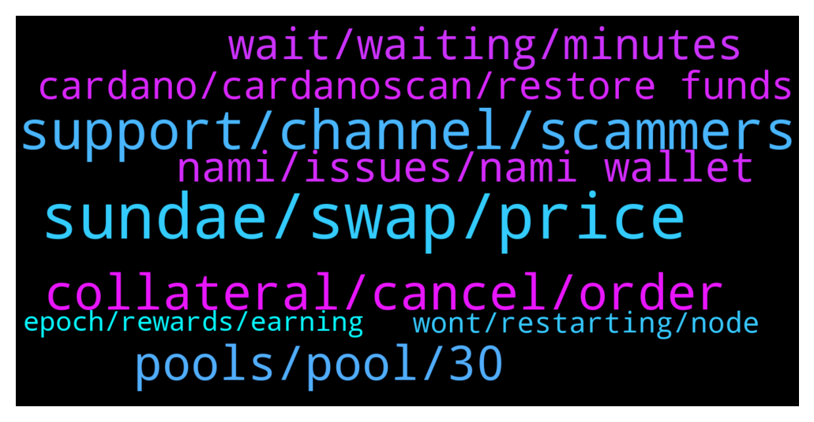

# **@Cardano**
 ## Analysis for **2022-01-22** - **2022-01-23**.

---

## 📊 **Basic Stats**

**n_messages_sent**: 206

---

---

## 🔝 **Top keywords and related messages**

1. **sundae, swap, price**

    @JonSmith007 --- *Let’s be real sundae swap is wank…… I can do a transaction on Cardano no problem but try do anything on sundaeswap and it doesn’t work. Load of bollocks* **--->** [TG Discussion](https://t.me/Cardano/773853)

    @gauthamnag --- *Did a swap from Ada to sundae, but status is showing as price outside range ? What does it mean* **--->** [TG Discussion](https://t.me/Cardano/774245)

    @MikeAlano --- *will cardstarter (CARDS) be swappable in SundaeSwap soon?  thanks* **--->** [TG Discussion](https://t.me/Cardano/774253)

    @JonSmith007 --- *Yeah mines got 2659 confirmations but still no sundae….. very poor* **--->** [TG Discussion](https://t.me/Cardano/773919)

    @Thirty5000Feet --- *I am switching wallets from Nami to CCVault to use on Sundae swap. I keep getting an error when connecting to Sundae swap. "select an account in your wallet before connecting to Sundaeswap". How do you do this? Any suggestions?* **--->** [TG Discussion](https://t.me/Cardano/773959)

    @Cryptobeek --- *It means the price has moved outside the slippage you set* **--->** [TG Discussion](https://t.me/Cardano/774255)

2. **support, channel, scammers**

    @glitch04 --- *Your best bet would be to talk directly with their support https://discord.gg/sundae* **--->** [TG Discussion](https://t.me/Cardano/774124)

    @glitch04 --- *Remember nobody that dm's you is support or admins they are scammers the only support is available in the channel above* **--->** [TG Discussion](https://t.me/Cardano/774141)

    @Gr33nSun --- *Do not DM me. Answer in main chat only* **--->** [TG Discussion](https://t.me/Cardano/774502)

    @Lgbeano --- *You should reach out to them and demand better 😉* **--->** [TG Discussion](https://t.me/Cardano/773862)

    @glitch04 --- *👆 if you want answers ask in their official support discord* **--->** [TG Discussion](https://t.me/Cardano/774265)

    @DrNo8910 --- *Can sumone post the report channel. The scammers r back on youtube* **--->** [TG Discussion](https://t.me/Cardano/774102)

3. **collateral, cancel, order**

    @nita_NFtart --- *hello, i want to make collateral but failed* **--->** [TG Discussion](https://t.me/Cardano/774123)

    @brzi987 --- *I cancelled the order and they took the collateral again🤦 5ada collateral for submit order( price is outside range) and 5ada collateral for cancel* **--->** [TG Discussion](https://t.me/Cardano/774444)

    @gauthamnag --- *Two time my collateral is also done, but still can't cancell the order* **--->** [TG Discussion](https://t.me/Cardano/774377)

    @gauthamnag --- *I tried but still can't cancell* **--->** [TG Discussion](https://t.me/Cardano/774445)

    @brzi987 --- *same here... can't cancel order bcs they have taken my collateral 5ada...and now again have to send ada for collateral. I'm so pissed off 🤦 btw slippage was set 15%* **--->** [TG Discussion](https://t.me/Cardano/774375)

    @Cryptobeek --- *Did you fund collateral with 5 ada? I did that but still failing to cancel* **--->** [TG Discussion](https://t.me/Cardano/774259)

4. **pools, pool, 30**

    @Tustyrusty --- *I've gone through the 30 participating pools ALL (bar1) are OVER 100% saturation. No-one seems to be concerned/ bothered.* **--->** [TG Discussion](https://t.me/Cardano/774343)

    @adacath --- *30 pools? I think there are 80-90 pools. Maybe 30 individual but many have multiple pools. I just redelegated yesterday and there were many non-saturated pools.* **--->** [TG Discussion](https://t.me/Cardano/774389)

    @Tustyrusty --- *+1 great question, no-one seems to be able to answer the pool saturated problem. The obvious thing to do is ADD pools from the reserve list* **--->** [TG Discussion](https://t.me/Cardano/774218)

    @glitch04 --- *that depends on pool performance and amount staked it's variable* **--->** [TG Discussion](https://t.me/Cardano/774075)

    @UleC0 --- *Dudes, one question.... How much does Yoroi pay you when you give yours adas in a pool?* **--->** [TG Discussion](https://t.me/Cardano/774065)

    @CryptoM22 --- *I think those 30 pools are so full but does that also affect how many sundae tokens you get?* **--->** [TG Discussion](https://t.me/Cardano/774213)

5. **wait, waiting, minutes**

    @glitch04 --- *That means the network is under high load but there is nothing can be done but wait for a place in line* **--->** [TG Discussion](https://t.me/Cardano/774129)

    @Vitalino73 --- *Sorry leave it, it came up just needed to be patience 😂* **--->** [TG Discussion](https://t.me/Cardano/774358)

    @JACK_SKILLS --- *took about 10 minutes for the transaction to complete but i did it!* **--->** [TG Discussion](https://t.me/Cardano/774235)

    @JACK_SKILLS --- *ive been waiting for 5+ minutes now. :P* **--->** [TG Discussion](https://t.me/Cardano/774229)

    @DrNo8910 --- *Dang it willint let me post* **--->** [TG Discussion](https://t.me/Cardano/774105)

    @vechain4life --- *i think i’m at 18-19hours waiting* **--->** [TG Discussion](https://t.me/Cardano/773885)

6. **nami, issues, nami wallet**

    @nita_NFtart --- *what happen with nami, now i cant send my balance* **--->** [TG Discussion](https://t.me/Cardano/774151)

    @nita_NFtart --- *yes i have balance in nami* **--->** [TG Discussion](https://t.me/Cardano/774134)

    @Chinerians --- *you guys able to send ADA without issues? taking ages for a transaction* **--->** [TG Discussion](https://t.me/Cardano/774511)

    @glitch04 --- *Not sure what that means if you are having issues with Nami you may want to contact their support* **--->** [TG Discussion](https://t.me/Cardano/774602)

    @brzi987 --- *i had a problem withdrawal ada to NAMI* **--->** [TG Discussion](https://t.me/Cardano/774490)

    @jvahut_ada --- *Why are you still using nami. It doesn’t work that’s been established. Reload it it too ccvault and you should be good to go mostly* **--->** [TG Discussion](https://t.me/Cardano/774395)

7. **cardano, cardanoscan, restore funds**

    @Zyroxa --- *Yes you can restore your funds in any other wallet that supports Cardano 😊 Like Typhon, Yoroi, ccvault or adalite* **--->** [TG Discussion](https://t.me/Cardano/774176)

    @Bartleby --- *Hello,i cannot send any transaction on cardano ,is network congested now ?* **--->** [TG Discussion](https://t.me/Cardano/774666)

    @Apath00 --- *🎼🎹🎧Charles Hoskinson lofi beats to relax/stake on Cardano  https://www.youtube.com/watch?v=K3x1eYgHClk* **--->** [TG Discussion](https://t.me/Cardano/774480)

    @A --- *Ccvault is the best cardano wallet* **--->** [TG Discussion](https://t.me/Cardano/774427)

    @glitch04 --- *Cardanoscan.io if you have a receive wallet address for your wallet you can pull it up* **--->** [TG Discussion](https://t.me/Cardano/774049)

    @Reco --- *Is anybody seeking a project based on Cardano to support and uplift* **--->** [TG Discussion](https://t.me/Cardano/774718)

8. **wont, restarting, node**

    @Dr --- *anybody having troubble with daeadlus allet? it hsent been working yesterday or today.it wont verify the blockchain. been waiting for hour and restarting node but wont work* **--->** [TG Discussion](https://t.me/Cardano/774138)

    @Dr --- *is there a way to use the seedphase from daedalus wallet to another wallet? daedalus wont work. been verifing blockchain for hours and ndoe just crashes evenwhen restarting it* **--->** [TG Discussion](https://t.me/Cardano/774173)

    @Dr --- *yeah trying the sae but i cant get acess to daeddalus wallet it wont work!* **--->** [TG Discussion](https://t.me/Cardano/774205)

    @Dr --- *usally it works when restarting node but not today* **--->** [TG Discussion](https://t.me/Cardano/773956)

    @Dr --- *onyine else having troubble with daedalus awllet? it wont verifying the blockchain, node just crashes over and ove* **--->** [TG Discussion](https://t.me/Cardano/773955)

    @Dr --- *blockchain wont verify even when restarting node* **--->** [TG Discussion](https://t.me/Cardano/773947)

