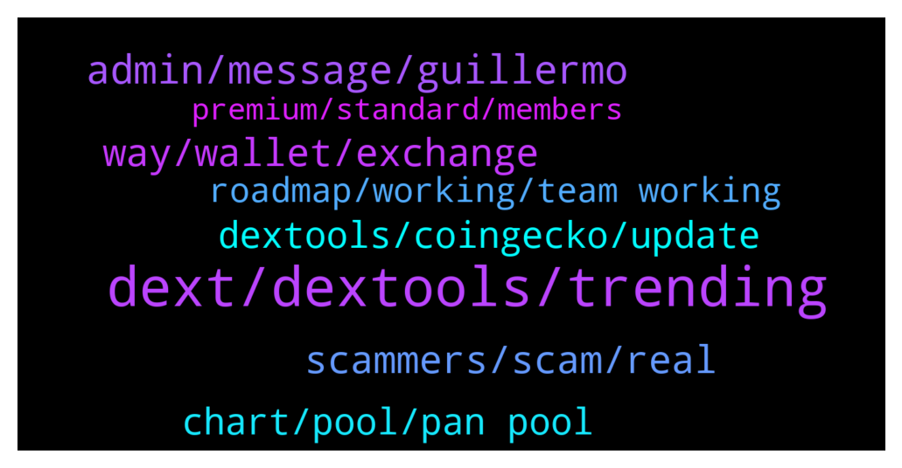

# **@DEXToolsCommunity**
 ## Analysis for **2022-01-21** - **2022-01-23**.

---

## 📊 **Basic Stats**

**n_messages_sent**: 255

---

---

## 🔝 **Top keywords and related messages**

1. **dext, dextools, trending**

    @hani_disclosed --- *How come? The dex launch yesterday* **--->** [TG Discussion](https://t.me/DEXToolsCommunity/327473)

    @thorex30 --- *DEXT is available on matic too?* **--->** [TG Discussion](https://t.me/DEXToolsCommunity/328094)

    @Dannie970 --- *How do I apply for dextool trending?* **--->** [TG Discussion](https://t.me/DEXToolsCommunity/327922)

    @Godsonisstilldamademan --- *When is Saitama paid ad for trending will runs out? Asking for a friend* **--->** [TG Discussion](https://t.me/DEXToolsCommunity/327524)

    @nate102 --- *this is the dextools verison, you can see theres candles where it stays flat, and the prices are completely off (although current price is now current), you can also see the green line above the chart making it look like its currently above all the time high when its not even half of it* **--->** [TG Discussion](https://t.me/DEXToolsCommunity/327366)

    @Bandolero1986 --- *If i launch a project how can i add the project to dextools and to have a dextools chart* **--->** [TG Discussion](https://t.me/DEXToolsCommunity/327944)

2. **admin, message, guillermo**

    @stanes --- *Just read the message above your 😉* **--->** [TG Discussion](https://t.me/DEXToolsCommunity/327759)

    @JoeyDieleman --- *Hi please ask these questions in Velox channel* **--->** [TG Discussion](https://t.me/DEXToolsCommunity/327021)

    @bastardganpunk --- *Please send a dm to @FredericDEXT referring this* **--->** [TG Discussion](https://t.me/DEXToolsCommunity/327275)

    @napascual --- *No spamming here, that should be asked in Dms* **--->** [TG Discussion](https://t.me/DEXToolsCommunity/327283)

    @JoanJunior --- *Hi, can i send you a DM* **--->** [TG Discussion](https://t.me/DEXToolsCommunity/327665)

    @bastardganpunk --- *i got no dm from you* **--->** [TG Discussion](https://t.me/DEXToolsCommunity/327590)

3. **way, wallet, exchange**

    @bastardganpunk --- *correct, then you will be able to get the standard version just connecting your wallet* **--->** [TG Discussion](https://t.me/DEXToolsCommunity/327891)

    @MOONLIGGHTTT --- *any other way to do it* **--->** [TG Discussion](https://t.me/DEXToolsCommunity/327217)

    @MOONLIGGHTTT --- *there might be a way to exchange* **--->** [TG Discussion](https://t.me/DEXToolsCommunity/327222)

    @IceManCrypton --- *how do you bring the favorites tab back up* **--->** [TG Discussion](https://t.me/DEXToolsCommunity/327959)

    @Snodes88 --- *And so I must connect with the wallet which holds the tokens. I assume I can transfer between my wallets too?* **--->** [TG Discussion](https://t.me/DEXToolsCommunity/327893)

    @rpoole69 --- *Unless it can already do that, I just am unaware* **--->** [TG Discussion](https://t.me/DEXToolsCommunity/326934)

4. **scammers, scam, real**

    @bastardganpunk --- *no, he can’t, he’s a scammer* **--->** [TG Discussion](https://t.me/DEXToolsCommunity/327660)

    @stanes --- *I don't have any message from you. Be aware of scammers.* **--->** [TG Discussion](https://t.me/DEXToolsCommunity/327696)

    @Mad4mp3z --- *perfect bud, thanks, the amount of people in here trying ot money out of you is mad haha* **--->** [TG Discussion](https://t.me/DEXToolsCommunity/327163)

    @MoonstellarMoe --- *Also I have been scammed a lot by people claiming to be your workers really so I decided to come here and DYOR 😔* **--->** [TG Discussion](https://t.me/DEXToolsCommunity/327798)

    @bastardganpunk --- *have you checked the token you bought is not a scam?* **--->** [TG Discussion](https://t.me/DEXToolsCommunity/327218)

    @bastardganpunk --- *Same here, be aware of scammers! Please watch the video referring crypto scams!!!* **--->** [TG Discussion](https://t.me/DEXToolsCommunity/327244)

5. **chart, pool, pan pool**

    @TBGOATOFFICIAL --- *Whenever you try go on the chart* **--->** [TG Discussion](https://t.me/DEXToolsCommunity/327497)

    @nate102 --- *Normally it’s okay but at times like that it makes it look like chart is at all time high when it’s not even close* **--->** [TG Discussion](https://t.me/DEXToolsCommunity/327403)

    @bastardganpunk --- *It’s because you’re looking at pan pool, so it shows the chart from this pool* **--->** [TG Discussion](https://t.me/DEXToolsCommunity/327387)

    @nate102 --- *Thank you, the odd part I noticed as well is on launch the actual trade history has the correct price even when the chart bugs out like it did for that example.* **--->** [TG Discussion](https://t.me/DEXToolsCommunity/327405)

    @nate102 --- *I’m confused is it not the same pool?* **--->** [TG Discussion](https://t.me/DEXToolsCommunity/327389)

    @nate102 --- *It’s just the launch of tokens doesn’t sync correctly to the chart* **--->** [TG Discussion](https://t.me/DEXToolsCommunity/327397)

6. **dextools, coingecko, update**

    @MoonstellarMoe --- *I mean how can I get to have folks go on the dextools. io and view my token on there sir?* **--->** [TG Discussion](https://t.me/DEXToolsCommunity/327795)

    @big_wolf_bad --- *hello, quick question. how does DexTools calculate token volume number that is displayed on the token page? Does it include only trades with DEX, or all the transfers made (all Transfer events)?* **--->** [TG Discussion](https://t.me/DEXToolsCommunity/327296)

    @tehkosongpeng --- *hi, can i check whats the process for getting a token listed on dextools?* **--->** [TG Discussion](https://t.me/DEXToolsCommunity/327087)

    @Mad4mp3z --- *Hello, im part of the team at $rickmortydoxx , we have gone through a rebrand and would like the links on the dextools page to reflect the changes rather than going to dead link which they currently do, its not a great image as you can imagine, we lost access to our old socials when a team member left and took the logins with him and the website got migrated from wordpress to azure and we let the old link die thus we cant just forward the page to the new one unfortnatly, how would i go about getting the new socials and websiite updated on dextools* **--->** [TG Discussion](https://t.me/DEXToolsCommunity/327159)

    @bastardganpunk --- *You just need to update the socials on cmc or coingecko. Dextools fetches all info from there* **--->** [TG Discussion](https://t.me/DEXToolsCommunity/327162)

    @benc2c --- *Any idea how to update the token's website and other info on dex or it's automated?* **--->** [TG Discussion](https://t.me/DEXToolsCommunity/327913)

7. **roadmap, working, team working**

    @stanes --- *New roadmap will be out soon, stay tuned!* **--->** [TG Discussion](https://t.me/DEXToolsCommunity/327527)

    @nimrod620 --- *Just curious what the plan is for 2022 and what the team is working on to get us to the next level* **--->** [TG Discussion](https://t.me/DEXToolsCommunity/327525)

    @JoeyDieleman --- *Team is working on an update of the roadmap* **--->** [TG Discussion](https://t.me/DEXToolsCommunity/327503)

    @nimrod620 --- *Hey do we have a roadmap or something* **--->** [TG Discussion](https://t.me/DEXToolsCommunity/327500)

    @stanes --- *That's what you will know thanks to the roadmap 😄 + some surprises because team likes keeping secrets 😉* **--->** [TG Discussion](https://t.me/DEXToolsCommunity/327537)

    @nimrod620 --- *So putting the roadmap aside, what is the team working on?* **--->** [TG Discussion](https://t.me/DEXToolsCommunity/327535)

