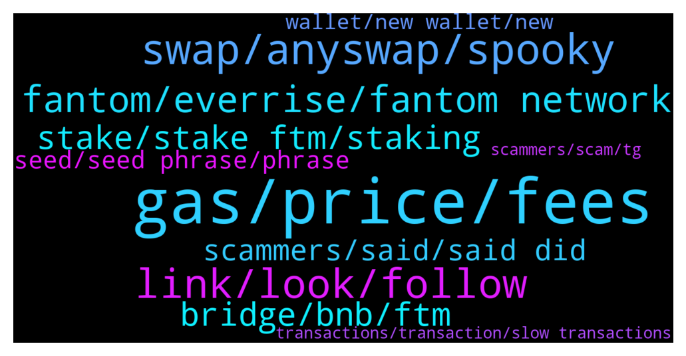

# **@Fantom_English**
 ## Analysis for **2022-01-22** - **2022-01-23**.

---

## 📊 **Basic Stats**

**n_messages_sent**: 568

---

---

## 🔝 **Top keywords and related messages**

1. **gas, price, fees**

    @vvpreetham --- *Gas fees is differnt from cost per transfer. For example Eth gas fee right now is at 89 while FTM shows 389* **--->** [TG Discussion](https://t.me/Fantom_English/639212)

    @Janevietani --- *check current gas price too https://ftm.guru/fantomscan.html* **--->** [TG Discussion](https://t.me/Fantom_English/638258)

    @Janevietani --- *check current gas price vs gas price that you have now https://ftm.guru/fantomscan.html* **--->** [TG Discussion](https://t.me/Fantom_English/638297)

    @pgngm --- *GWEI is the metric to measure the gas fees bro* **--->** [TG Discussion](https://t.me/Fantom_English/639218)

    @jabamun01 --- *there doesn't seem to be a way to get the gas price here... :(* **--->** [TG Discussion](https://t.me/Fantom_English/639648)

    @pajamasfreak --- *Some indeed like to pay on lower side, when gas spike up they just come out* **--->** [TG Discussion](https://t.me/Fantom_English/639206)

2. **swap, anyswap, spooky**

    @Toesy --- *Does the spooky swap bridge count? Doesn’t it use that* **--->** [TG Discussion](https://t.me/Fantom_English/638027)

    @KingMaozer --- *.... this is Anyswap... This is the most incompetent rusbish swap, they lost so many people funds and 50% of the bridges don't work ( All the tokens that were involved in the hack dont actually work for almost 1 month now) ... FYI, you really should not be recommending this to ANYONE, like really negligent on your behalf....* **--->** [TG Discussion](https://t.me/Fantom_English/638988)

    @mkong888 --- *Yes it does.  Any bridge interface that uses any swap is vulnerable.  Please check carefully by following the instructions as it could impact you.* **--->** [TG Discussion](https://t.me/Fantom_English/638030)

    @Chip --- *anyswap and xpollinate work fine for me* **--->** [TG Discussion](https://t.me/Fantom_English/637977)

    @Johnnyfantom --- *THIRD-PARTY CRITICAL VULNERABILITY WARNING If you have ever used Multichain/Anyswap, visit their page and check/revoke approvals for vulnerable tokens: https://app.multichain.org/#/approvals  Make sure to check all chains! Full instructions here: https://medium.com/multichainorg/action-required-critical-vulnerability-for-six-tokens-6b3cbd22bfc0  app.multichain.org Multichain APP Unified cross-chain interface, average transaction speed within 100 secs, no-slippage swap* **--->** [TG Discussion](https://t.me/Fantom_English/638022)

    @Janevietani --- *have you tried swap it today ?* **--->** [TG Discussion](https://t.me/Fantom_English/638255)

3. **link, look, follow**

    @pajamasfreak --- *Can you check up here @anyswaphelperbot* **--->** [TG Discussion](https://t.me/Fantom_English/638074)

    @vvpreetham --- *I got the answer I was looking for.* **--->** [TG Discussion](https://t.me/Fantom_English/639238)

    @Crème brûlée --- *And follow the instructions in the article?* **--->** [TG Discussion](https://t.me/Fantom_English/639066)

    @pajamasfreak --- *You can look at those links above or read what Pascal said.* **--->** [TG Discussion](https://t.me/Fantom_English/639208)

    @francieslee --- *Ya i saw this link but how to see recently new project?* **--->** [TG Discussion](https://t.me/Fantom_English/639291)

    @pajamasfreak --- *Yeah they changed in name only* **--->** [TG Discussion](https://t.me/Fantom_English/639064)

4. **fantom, everrise, fantom network**

    @DastardlyDude --- *No i mean the actual dapps on the fantom chain* **--->** [TG Discussion](https://t.me/Fantom_English/638614)

    @callmeElontheFirst --- *Hey guys! I am from everrise, we are joining tomorrow to fantom, sorry to bother, can anyone dm me groups of talks abojt projects so i can explain everrise there? Thank you, usually a bsc, poly guy but excited now to be on fantom and the native coin swap will allow to swap natives for fantom so will be able to invest on projects on ftm 🙂* **--->** [TG Discussion](https://t.me/Fantom_English/639106)

    @MichaelRosenberg --- *But buy getting onto the Fantom Opera network I can access Tomb and Spooky etc. And I'm not paying stupidly ridiculous gas fees - And you are supporting the network that you are investing in - Its stupid not to get into the Fantom system - Also once in the network its really easy and fun* **--->** [TG Discussion](https://t.me/Fantom_English/639622)

    @jabamun01 --- *Does gas price fluctuate on Fantom or is it always the same?* **--->** [TG Discussion](https://t.me/Fantom_English/639623)

    @JC --- *Whats the price target for FANTOM* **--->** [TG Discussion](https://t.me/Fantom_English/638108)

    @vvpreetham --- *Hi Team, QQ. Which launchpads are supporting Fantom today. Also what is the finality and cost per transaction.* **--->** [TG Discussion](https://t.me/Fantom_English/639178)

5. **stake, stake ftm, staking**

    @Mcjig --- *Fantom (FTM) Tokenomics The total supply of Fantom (FTM) tokens is 3.175 billion. A total of 2.1 billion FTM tokens are currently in circulation. The rest of the FTM tokens are reserved for providing staking rewards to the FTM holders. The rewards depend on governance decisions; however, as of now, it may take 2 years for the FTM token to reach full circulation and distribute all the rewards to staked FTM holders.* **--->** [TG Discussion](https://t.me/Fantom_English/639683)

    @altay_ftm --- *On which wallet can i stake my FTM? Apart of Fantom wallet (I don’t like its design)* **--->** [TG Discussion](https://t.me/Fantom_English/639650)

    @smart_boy77188 --- *and then what would happen? no reward for stakeing? cuz fees are so low* **--->** [TG Discussion](https://t.me/Fantom_English/639687)

    @Mcjig --- *thats it, only stake on fwallet* **--->** [TG Discussion](https://t.me/Fantom_English/639654)

    @WedgeTailCrypto --- *Hi guys, can I ask a question about wFTM. Why is the that protocols like 0x only allow you to stake wFTM and not FTM. And if I have FTM in my wallet how do I turn that into wFTM?* **--->** [TG Discussion](https://t.me/Fantom_English/639358)

    @Xunobita --- *Hi there. I can't stake all of my Fantom (-2ftm) on pwallet, it require around 13 lesser, need advices please* **--->** [TG Discussion](https://t.me/Fantom_English/639422)

6. **bridge, bnb, ftm**

    @Mgsre --- *then please tell me about bridge  bep20 to ftm polygon to ftm* **--->** [TG Discussion](https://t.me/Fantom_English/639685)

    @J --- *hello. If  I have FTM erc-20 and and want to bridge bridge the FTM erc-20 to Ftm chain  what is the best protocal today to do this? Wasnt Multichain having issues?* **--->** [TG Discussion](https://t.me/Fantom_English/638622)

    @encryptedhashfunction --- *Hi there !! Any help or suggestions are highly appreciated !! I´m stuck after bridging BNB to my Fantom wallet. Now I got BNB in my Fantom wallet but no FTM. I tried that gas fee faucet from Mentasuave01 twice but didn´t recieve it. Is there another faucet ? Thanks in advance !!* **--->** [TG Discussion](https://t.me/Fantom_English/639588)

    @Mcjig --- *Helpful tip: if you want a cheaper alternative than bridging ftm and paying eth gas From binance or kucoin, get bnb and withdraw as bep20, then use a bridge To bridge bnb bep20 to bnb fantom. Then use spiritswap to swap bnb to ftm spiritswap send 0.4 ftm for 1st time users and https://www.mentasuave01-tools.com/ sends you if you use spooky/multichain* **--->** [TG Discussion](https://t.me/Fantom_English/639693)

    @MichaelRosenberg --- *I just did that, I did have FTM, go to spookyswap I think that you can swap your BNB for FTM* **--->** [TG Discussion](https://t.me/Fantom_English/639590)

    @Mcjig --- *https://app.multichain.org/ you can choose 2 different ftms/ 1 is bridge 1 is router/ choose which one has liquidty* **--->** [TG Discussion](https://t.me/Fantom_English/639531)

7. **scammers, said, said did**

    @pajamasfreak --- *There is a reason we put will not dm first and some warn info for users upon entry. Beware* **--->** [TG Discussion](https://t.me/Fantom_English/638512)

    @Fjody --- *So delete and report each DM you will get. Many scammers will try to contact you now, offering you help.* **--->** [TG Discussion](https://t.me/Fantom_English/639525)

    @Timmy --- *I think kit is you that is asking me to DM, but I do not even know what DM is or where to go to do it. I assume that means a private msg. Remember I am 72* **--->** [TG Discussion](https://t.me/Fantom_English/638444)

    @Johnnyfantom --- *Admins will never DM you first* **--->** [TG Discussion](https://t.me/Fantom_English/638775)

    @Timmy --- *It said you would not DM first. But someone said please DM me and I did not even know what it meant* **--->** [TG Discussion](https://t.me/Fantom_English/638496)

    @Janevietani --- *Like i said , i will never dm you* **--->** [TG Discussion](https://t.me/Fantom_English/638492)

8. **seed, seed phrase, phrase**

    @Janevietani --- *Please dont tell me you have put your seed phrase on those phissing websites* **--->** [TG Discussion](https://t.me/Fantom_English/638482)

    @Timmy --- *with my old seed or new?* **--->** [TG Discussion](https://t.me/Fantom_English/639340)

    @Janevietani --- *They will send you some link and you need to put seed phrase. That is scammer wanna steal your coin* **--->** [TG Discussion](https://t.me/Fantom_English/638495)

    @Disfunkd86 --- *If you have anything left create a new MetaMask and NEEEEVVVVVEEEERRR GIVE OUT YOUR SEED PHRASE!* **--->** [TG Discussion](https://t.me/Fantom_English/638519)

    @Disfunkd86 --- *Once they have your seed phrase they have the keys to the castle* **--->** [TG Discussion](https://t.me/Fantom_English/638515)

    @J92AF --- *It is time metamask renames seed phrase as Password* **--->** [TG Discussion](https://t.me/Fantom_English/638514)

9. **wallet, new wallet, new**

    @pajamasfreak --- *Make a new wallet and send your tokens from previous wallet to new one* **--->** [TG Discussion](https://t.me/Fantom_English/639341)

    @pajamasfreak --- *Get new wallet and send it there* **--->** [TG Discussion](https://t.me/Fantom_English/639339)

    @Mcjig --- *we will have a new wallet coming* **--->** [TG Discussion](https://t.me/Fantom_English/639670)

    @bYhIsSpIrIt --- *Trying to restore my wallet with the right Mnemonic but after opening the wallet i find out it empty. Anyone with this same challenge?* **--->** [TG Discussion](https://t.me/Fantom_English/638925)

    @Gia020 --- *"What’s your wallet address, so I can use that to know how to help you"* **--->** [TG Discussion](https://t.me/Fantom_English/638938)

    @olsad44 --- *Tell me please! I accidentally sent solani to the address of this wallet in the Huobi network. How can I return them?* **--->** [TG Discussion](https://t.me/Fantom_English/639486)

10. **transactions, transaction, slow transactions**

    @Antwon133 --- *also, i get a txid but no transaction goes through* **--->** [TG Discussion](https://t.me/Fantom_English/638294)

    @CarlosB1988 --- *Hi guys. Anybody manages to make a tx? I have tried to speed up, cancel... but nothing works, it is stuck...  Thanks for any feedback* **--->** [TG Discussion](https://t.me/Fantom_English/637834)

    @AhmadAlfadhli --- *Ok after 2 transactions same problem now* **--->** [TG Discussion](https://t.me/Fantom_English/638469)

    @EazyEBzh --- *the transaction is recorded but does not show up in my assets* **--->** [TG Discussion](https://t.me/Fantom_English/638072)

    @JumanjiBK --- *All my transactions are pending for long periods. None going through* **--->** [TG Discussion](https://t.me/Fantom_English/637794)

    @Removsk --- *Too slow. Transactions are not even shown on ftmscan. Wat happened?* **--->** [TG Discussion](https://t.me/Fantom_English/638388)

