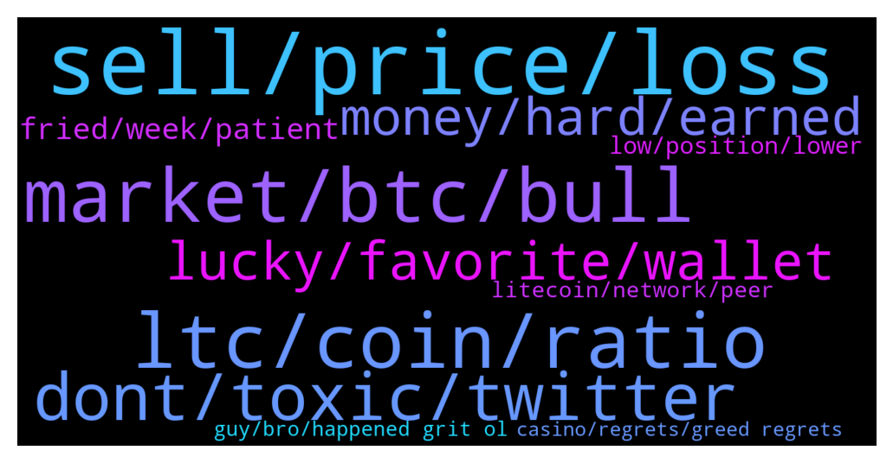

# **@Litecoin**
 ## Analysis for **2022-01-22** - **2022-01-23**.

---

## 📊 **Basic Stats**

**n_messages_sent**: 494

---

---

## 🔝 **Top keywords and related messages**

1. **sell, price, loss**

    @d. --- *I put 3x leverage at $160* **--->** [TG Discussion](https://t.me/Litecoin/2051877)

    @Z --- *I bought in at avg price of $370 🙃* **--->** [TG Discussion](https://t.me/Litecoin/2050965)

    @ck42069 --- *I think ill close as we go lower to 80 and 40 bucks* **--->** [TG Discussion](https://t.me/Litecoin/2051741)

    @Cezto --- *You will never be able to buy at all time low and sell at top* **--->** [TG Discussion](https://t.me/Litecoin/2051420)

    @ck42069 --- *35 mil is nothing in this market* **--->** [TG Discussion](https://t.me/Litecoin/2051556)

    @finitemaz --- *it's not a realized loss until you sell, by definition.  But I understand, I realize that the price goes down sometimes too lol* **--->** [TG Discussion](https://t.me/Litecoin/2051819)

2. **ltc, coin, ratio**

    @nikg83 --- *Holding ltc has been a realized loss 😅* **--->** [TG Discussion](https://t.me/Litecoin/2051796)

    @zxCuahdF --- *Any indicator is meaningless. If you like you can see a lot of candlestick charts on twitter, and mark LTC is about to rise to 1K 2K 3K....* **--->** [TG Discussion](https://t.me/Litecoin/2051069)

    @kevinvik --- *LTC will bounce at 90$. The ratio LTC/BTC seems low* **--->** [TG Discussion](https://t.me/Litecoin/2051511)

    @WaLsh_P --- *hold, you have good quantity of LTC* **--->** [TG Discussion](https://t.me/Litecoin/2050961)

    @Bigcfidolla --- *ripple wants the title but ltc is close* **--->** [TG Discussion](https://t.me/Litecoin/2051149)

    @ck42069 --- *chilling my LTC stack gro sionce Im on a coin margined trade* **--->** [TG Discussion](https://t.me/Litecoin/2051553)

3. **market, btc, bull**

    @Cezto --- *Btc has never retraced back to previous cycle ath.* **--->** [TG Discussion](https://t.me/Litecoin/2051646)

    @BennyBennyBlanco --- *There’s other factors behind this fall like if u considered looking at the stock market. Stock market affects everything* **--->** [TG Discussion](https://t.me/Litecoin/2051517)

    @Jim --- *It is not bear market now. It is general problem cause of fed.* **--->** [TG Discussion](https://t.me/Litecoin/2050939)

    @wealth0102 --- *Will the coin market keep falling?😓* **--->** [TG Discussion](https://t.me/Litecoin/2051465)

    @Augusto --- *I cant understand, that value will not save us from the bear market* **--->** [TG Discussion](https://t.me/Litecoin/2050937)

    @ck42069 --- *People like you who believe in cycles or the protocol or the supply and demand lost a collective of 5 billin usd since the start of the retracement* **--->** [TG Discussion](https://t.me/Litecoin/2051649)

4. **dont, toxic, twitter**

    @Soldierdad1977 --- *Fuck you scrubs and this toxic ass group* **--->** [TG Discussion](https://t.me/Litecoin/2051852)

    @ck42069 --- *Ok Mozzi111 I think since you have made so many wrong calls its time to turn off that twitter mate* **--->** [TG Discussion](https://t.me/Litecoin/2050630)

    @Mozzi111 --- *Actually if u check my recent posts they all been spot on* **--->** [TG Discussion](https://t.me/Litecoin/2050632)

    @Soldierdad1977 --- *I was only asking for advice and help.* **--->** [TG Discussion](https://t.me/Litecoin/2051848)

    @Bigcfidolla --- *i fail asleep on this sell but if you back test my chart this what happens when those red and blue stochastic lines cross.* **--->** [TG Discussion](https://t.me/Litecoin/2051542)

    @Soldierdad1977 --- *This group is toxic and I have only been here a short time.* **--->** [TG Discussion](https://t.me/Litecoin/2051850)

5. **lucky, favorite, wallet**

    @Bigcfidolla --- *crypto is and always will be a liquidity asset* **--->** [TG Discussion](https://t.me/Litecoin/2051165)

    @Carlos_PRO_Holder --- *I am in a loss of 5 millioN BRL, damn scam crypto* **--->** [TG Discussion](https://t.me/Litecoin/2051773)

    @ck42069 --- *Crypto has not decoupled from stocks* **--->** [TG Discussion](https://t.me/Litecoin/2050695)

    @SirMix --- *Look at every other crypto dive in the last 6 years* **--->** [TG Discussion](https://t.me/Litecoin/2051841)

    @scratchticket --- *At this point we will be lucky if crypto survives* **--->** [TG Discussion](https://t.me/Litecoin/2051243)

    @Bigcfidolla --- *crypto is here to stay it go up it go don gotta know when to get out and when to get in thats all im tring to show stay humble no regrets no greed no foolish pride* **--->** [TG Discussion](https://t.me/Litecoin/2051276)

6. **money, hard, earned**

    @Bigcfidolla --- *im my own boss buddy been that way foe a long time now* **--->** [TG Discussion](https://t.me/Litecoin/2051173)

    @Shawnoder --- *if not for everyone I won't get reward?* **--->** [TG Discussion](https://t.me/Litecoin/2051892)

    @Bigcfidolla --- *lol nah thats the cash out* **--->** [TG Discussion](https://t.me/Litecoin/2051304)

    @Veronica --- *Lolll u have lost money then* **--->** [TG Discussion](https://t.me/Litecoin/2051689)

    @ck42069 --- *so you are still in profits mate* **--->** [TG Discussion](https://t.me/Litecoin/2051591)

    @ck42069 --- *oh so you are playing with funny money? thats the money which belongs to the market sir* **--->** [TG Discussion](https://t.me/Litecoin/2051583)

7. **fried, week, patient**

    @Jim --- *Well thats true at least lets take a breath 😂 those 🐻 killed us last 1.5 month!* **--->** [TG Discussion](https://t.me/Litecoin/2051770)

    @cloudlite15 --- *Been lining up at the meal sites lately* **--->** [TG Discussion](https://t.me/Litecoin/2051845)

    @cloudlite15 --- *Haven't had fine dining for a while* **--->** [TG Discussion](https://t.me/Litecoin/2051843)

    @cloudlite15 --- *I at least had a upscale dinner tonight at KFC. I ordered the 6 piece Beyond Fried Chicken for $8.75. It tasted like fried tofu!* **--->** [TG Discussion](https://t.me/Litecoin/2051842)

    @Bigcfidolla --- *just go home and feed the children* **--->** [TG Discussion](https://t.me/Litecoin/2051274)

    @RorschachTesst --- *Well no more food for the next 6 months* **--->** [TG Discussion](https://t.me/Litecoin/2050975)

8. **low, position, lower**

    @scratchticket --- *Insane! How low can it go!?* **--->** [TG Discussion](https://t.me/Litecoin/2051036)

    @professional --- *I set short position at 116* **--->** [TG Discussion](https://t.me/Litecoin/2051751)

    @crypto_charlie_b --- *Can you think it could go this low?* **--->** [TG Discussion](https://t.me/Litecoin/2051986)

    @finitemaz --- *with only 36% of your position, you must actually think we go that low* **--->** [TG Discussion](https://t.me/Litecoin/2051742)

    @RorschachTesst --- *Yes sar ready to short all the way down. Go low low low* **--->** [TG Discussion](https://t.me/Litecoin/2051479)

    @ck42069 --- *Or maybe not even set lower high* **--->** [TG Discussion](https://t.me/Litecoin/2051316)

9. **litecoin, network, peer**

    @JohnTheApostle --- *Joke aside  "Litecoin is a peer-to-peer Internet currency that enables instant, near-zero cost payments to anyone in the world. Litecoin is an open source, global payment network that is fully decentralized without any central authorities. Mathematics secures the network and empowers individuals to control their own finances. Litecoin features faster transaction confirmation times and improved storage efficiency than the leading math-based currency. With substantial industry support, trade volume and liquidity, Litecoin is a proven medium of commerce complementary to Bitcoin."  https://litecoin.org/* **--->** [TG Discussion](https://t.me/Litecoin/2050891)

    @nikg83 --- *It’s same like litecoin a extension 😅* **--->** [TG Discussion](https://t.me/Litecoin/2052003)

    @Shawnoder --- *where can i have the litecoin node program? litecoin.* **--->** [TG Discussion](https://t.me/Litecoin/2051914)

    @JohnTheApostle --- *You know that's not true at all for Litecoin* **--->** [TG Discussion](https://t.me/Litecoin/2051264)

    @ck42069 --- *Sir, what was the reason why you decided to enter the Crypto market and why litecoin?* **--->** [TG Discussion](https://t.me/Litecoin/2051575)

    @BlueVanDyck --- *Is there some sort of heat map, database, or network that I can see all merchants small to large that accepts litecoin?* **--->** [TG Discussion](https://t.me/Litecoin/2051610)

10. **guy, bro, happened grit ol**

    @Macro5674 --- *Lol there were so many of that cup n handle and Adam n eve charts going around 🤣* **--->** [TG Discussion](https://t.me/Litecoin/2051245)

    @cloudlite15 --- *He was the backbone of the chat* **--->** [TG Discussion](https://t.me/Litecoin/2051856)

    @Bigcfidolla --- *what happened to tru grit and the ol ways of war.* **--->** [TG Discussion](https://t.me/Litecoin/2051334)

    @RabbitL0v3r --- *And so we never saw James again 😔😔😔* **--->** [TG Discussion](https://t.me/Litecoin/2051176)

    @jericho2411 --- *he did same wit dodcom bubble. still not relevant.* **--->** [TG Discussion](https://t.me/Litecoin/2050764)

    @ck42069 --- *They were all rong and rekt brother* **--->** [TG Discussion](https://t.me/Litecoin/2050638)

