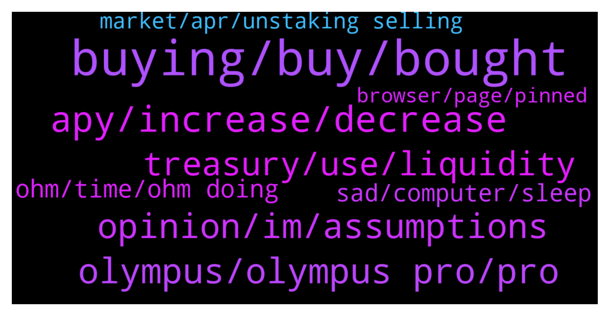

# **@OlympusTG**
 ## Analysis for **2022-01-22** - **2022-01-23**.

---

## 📊 **Basic Stats**

**n_messages_sent**: 1570

---

---

## 🔝 **Top keywords and related messages**

1. **buying, buy, bought**

    @SecuriTech24 --- *I did this with TIME,  thank F I took out most of it, I was tempted to hold for the lambo in 6 months lol - but now I can;t lose* **--->** [TG Discussion](https://t.me/OlympusTG/167051)

    @B --- *Lol. I have been hearing this all the way from 1600* **--->** [TG Discussion](https://t.me/OlympusTG/163825)

    @VincentStatic --- *Could we see below 50$? That would be so insane* **--->** [TG Discussion](https://t.me/OlympusTG/167170)

    @chitangxxx --- *Whoa people that bought at 120 and thought it was a bargain lol* **--->** [TG Discussion](https://t.me/OlympusTG/165382)

    @abe1738384 --- *well i want to buy in size at 25* **--->** [TG Discussion](https://t.me/OlympusTG/165947)

    @SecuriTech24 --- *Careful with a $6 investment lol* **--->** [TG Discussion](https://t.me/OlympusTG/164412)

2. **apy, increase, decrease**

    @cdp279 --- *In 1 year you make 10x just on apy. So not too bad* **--->** [TG Discussion](https://t.me/OlympusTG/165903)

    @sbackes --- *Ultimately the APY is why everyone buys into this project… right?* **--->** [TG Discussion](https://t.me/OlympusTG/165709)

    @Marco --- *I keep getting muted by the TIME discord when I ask , “does the APY still apply with wmemo?”* **--->** [TG Discussion](https://t.me/OlympusTG/166809)

    @mitesh_harivadan --- *how long is the 1000% APY fpr* **--->** [TG Discussion](https://t.me/OlympusTG/166024)

    @cdp279 --- *Sustainability, community voted for the apy drop* **--->** [TG Discussion](https://t.me/OlympusTG/165734)

    @sticks_na_beany --- *Should apy not be increasing at the moment to try increase price ?* **--->** [TG Discussion](https://t.me/OlympusTG/165560)

3. **olympus, olympus pro, pro**

    @nadirswork1 --- *By the way that link was headed to olympus website* **--->** [TG Discussion](https://t.me/OlympusTG/163891)

    @nfwaple --- *IMO there should be a premium as Olympus as a protocol can generate revenue* **--->** [TG Discussion](https://t.me/OlympusTG/166481)

    @nfwaple --- *highly recommend the pinned message, the article about Olympus12* **--->** [TG Discussion](https://t.me/OlympusTG/166498)

    @OGCryptoo --- *Olympus' Ohm will not be $1000, it will be $100,000 in the next 5 years ... then everyone will be crying as it is the organization of the people, by the people for the people. It is not like Bitcoin which does not earn anything... it is earning money everyday.* **--->** [TG Discussion](https://t.me/OlympusTG/166157)

    @nfwaple --- *it is very obvious to me that all the forks are not going to survive, then Olympus at that time will have an advantage* **--->** [TG Discussion](https://t.me/OlympusTG/164229)

    @k3ind9 --- *Between treasury, bonding, and Olympus pro, along with all the other new ways Olympus will be used throughout defi (0% loans Vesta etc), Fiat dao etc we have many channels of revenue* **--->** [TG Discussion](https://t.me/OlympusTG/163861)

4. **opinion, im, assumptions**

    @RecoDedon --- *I didn't get that. Can you explain it the way normal people understand?* **--->** [TG Discussion](https://t.me/OlympusTG/163880)

    @Ap0l1o --- *did not ask for opinion, thank you* **--->** [TG Discussion](https://t.me/OlympusTG/166178)

    @vdt153 --- *yea i know, because whatever has been said itself isnt been reflected in reality. so lets see* **--->** [TG Discussion](https://t.me/OlympusTG/165113)

    @aurora2792 --- *Right, but they’re all technically the same fundamentals.. or am I wrong?* **--->** [TG Discussion](https://t.me/OlympusTG/165341)

    @theMagicUnicorn --- *well this is a deep discussion certainly* **--->** [TG Discussion](https://t.me/OlympusTG/166838)

    @Ap0l1o --- *but that is just my opinion* **--->** [TG Discussion](https://t.me/OlympusTG/164463)

5. **treasury, use, liquidity**

    @Removsk --- *What use is the treasury of it can't help us right now, I wonder!* **--->** [TG Discussion](https://t.me/OlympusTG/164799)

    @NsMiscar --- *It trades independently of the treasury right ...i mean in the event of liquidation you are guatanteed at the treasury stable valur* **--->** [TG Discussion](https://t.me/OlympusTG/163988)

    @vdt153 --- *lets see if the treasury is really going to be distributed as you say. no point selling at these prices* **--->** [TG Discussion](https://t.me/OlympusTG/165109)

    @jack_hearts --- *Agree, but what keeps players from taking short term profits, sacrificing long term potential of treasury?* **--->** [TG Discussion](https://t.me/OlympusTG/166497)

    @k3ind9 --- *Treasury is like 500M deployed with yielding farming strategies, tetra is part of the treasury* **--->** [TG Discussion](https://t.me/OlympusTG/163860)

    @nfwaple --- *the treasury was never meant to help in this kind of situation lol* **--->** [TG Discussion](https://t.me/OlympusTG/164800)

6. **ohm, time, ohm doing**

    @sbackes --- *Man TiME’s MC is like 25% higher than OHM I was hoping we would be able to stabilize above TIME* **--->** [TG Discussion](https://t.me/OlympusTG/165600)

    @aurora2792 --- *Ok.. So what category would ohm fall into vs something that’s obviously a ponzi* **--->** [TG Discussion](https://t.me/OlympusTG/165344)

    @SecuriTech24 --- *Not fudding here, I am holding ohm but I don't see how people can claim only ohm will survive* **--->** [TG Discussion](https://t.me/OlympusTG/164785)

    @Kbuxton90 --- *To be fair, I did it with HEC, not sure why I didn't with OHM. Live and learn.* **--->** [TG Discussion](https://t.me/OlympusTG/167052)

    @Xander --- *We can keep it positive but ohm is doing bad.* **--->** [TG Discussion](https://t.me/OlympusTG/166058)

    @andywang1 --- *But OHM dumps no less than time* **--->** [TG Discussion](https://t.me/OlympusTG/167054)

7. **sad, computer, sleep**

    @Thor024 --- *the sooner this happens the better it is* **--->** [TG Discussion](https://t.me/OlympusTG/166309)

    @Ap0l1o --- *we have not stopped at all* **--->** [TG Discussion](https://t.me/OlympusTG/166119)

    @BROHMZ --- *We are still far from this scenario* **--->** [TG Discussion](https://t.me/OlympusTG/166049)

    @nfwaple --- *is when we should turn off the computer and phone* **--->** [TG Discussion](https://t.me/OlympusTG/164021)

    @cdp279 --- *Don’t sleep ser. We need your attention.* **--->** [TG Discussion](https://t.me/OlympusTG/165441)

    @Host_Matt --- *if you do come back to breakeven likely means we're moving in the right direction* **--->** [TG Discussion](https://t.me/OlympusTG/166623)

8. **market, apr, unstaking selling**

    @ishaqniz --- *Dont worry guys entire market  is down* **--->** [TG Discussion](https://t.me/OlympusTG/166702)

    @cdp279 --- *Are you wathcing the market? Or are you just being salty* **--->** [TG Discussion](https://t.me/OlympusTG/164738)

    @vdt153 --- *what happened to the 3,3 when people unstake and sell the other who are holding get more apr? that was one of the reasons i choose to stay in. seems like that has fallen on its face* **--->** [TG Discussion](https://t.me/OlympusTG/164668)

    @optiklass --- *Well, well, well, looks like the market has finally shaken out all the fudsters that were so nauseating this chat for so many days.* **--->** [TG Discussion](https://t.me/OlympusTG/164235)

    @SinisterCyclops --- *Whole market is crashing. Don't worry, it's not exclusive* **--->** [TG Discussion](https://t.me/OlympusTG/165848)

    @cdp279 --- *The whole market is crashing ser* **--->** [TG Discussion](https://t.me/OlympusTG/165808)

