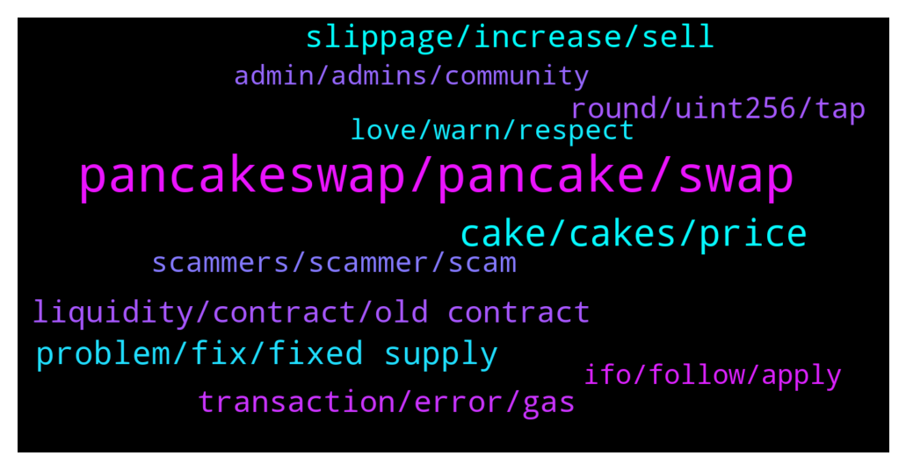

# **@PancakeSwap**
 ## Analysis for **2022-01-22** - **2022-01-23**.

---

## 📊 **Basic Stats**

**n_messages_sent**: 952

---

---

## 🔝 **Top keywords and related messages**

1. **pancakeswap, pancake, swap**

    @raghav_bedi --- *Pancake should reward its loyal holders who are still standing even in loss 😇* **--->** [TG Discussion](https://t.me/PancakeSwap/2294929)

    @Yousefstar --- *Who should i contact about AMA for PancakeSwap?* **--->** [TG Discussion](https://t.me/PancakeSwap/2295749)

    @Vinayy9876 --- *Hi, i had purchased around 20-30 coins in pancake swap, but now i’m not able to sell those coins as they are not in my wallet. Admin pls help* **--->** [TG Discussion](https://t.me/PancakeSwap/2293620)

    @roeerr --- *#PancakeBunnies Holders, Im inviting you to our Family 💕 https://t.me/Pancake_Bunnies_Collectors_Club* **--->** [TG Discussion](https://t.me/PancakeSwap/2295838)

    @CakeCompounder --- *Good things are coming to PancakeSwap in Q1 (Now-31st March)* **--->** [TG Discussion](https://t.me/PancakeSwap/2295018)

    @DonLuann --- *Okay, guys im not hating on the project or anything, id just like to make sure that its a good long term hold before i invest in it. I am aware that Binance needs Pancakeswap since it is its dex and all. But cool thanks for your opinions* **--->** [TG Discussion](https://t.me/PancakeSwap/2295371)

2. **cake, cakes, price**

    @Patwarboys --- *I haven't sold anything... holding strong... nothing changed.. just want chefs to make cake declamatory* **--->** [TG Discussion](https://t.me/PancakeSwap/2295414)

    @alexsoh1 --- *You never know when cake will announce for max supply. So don’t need to make this assumption prematurely* **--->** [TG Discussion](https://t.me/PancakeSwap/2294649)

    @Shayan --- *Dude, see CMC, Cake have no max supply, and burned every month, but thats not enough. today circulating supply is 260Million Maybe next year 400Million, and its not good,  Idk buy more in dump, or buy another like Luna or Solana & ... .* **--->** [TG Discussion](https://t.me/PancakeSwap/2294662)

    @DonLuann --- *But cakes inflation outweighs the amount they burn does it not? To push up Cakes price it would take insanes amount of buy pressure, anyways thats what i keep hearing* **--->** [TG Discussion](https://t.me/PancakeSwap/2295362)

    @raghav_bedi --- *Cake needs to maintain at least $11 price,why so undervalued,can’t understand* **--->** [TG Discussion](https://t.me/PancakeSwap/2293739)

    @SemperFi69 --- *Trade of the day. Guy sells 10000 Cakes at the lowest point.🤦‍♂️* **--->** [TG Discussion](https://t.me/PancakeSwap/2297894)

3. **problem, fix, fixed supply**

    @HAITIENLK --- *dev is fixing. pls wait bro* **--->** [TG Discussion](https://t.me/PancakeSwap/2295268)

    @asen --- *ok custumer support took care of my problem ty* **--->** [TG Discussion](https://t.me/PancakeSwap/2293496)

    @SteelReign --- *Well that could be my problem 🤣* **--->** [TG Discussion](https://t.me/PancakeSwap/2293714)

    @buddyvin --- *ah, i'm aware of that opts. so everything is happen automatically 👍* **--->** [TG Discussion](https://t.me/PancakeSwap/2296698)

    @Ceddi200 --- *Well,  based on my experience. That’s one of the first things to do. And actually works for previous users who complained.* **--->** [TG Discussion](https://t.me/PancakeSwap/2296982)

    @QV_zz --- *if u need help. ask here* **--->** [TG Discussion](https://t.me/PancakeSwap/2294828)

4. **slippage, increase, sell**

    @SecuestPcs --- *1) Increase your slippage, the higher the better  2) Increase your gas (15, 350000)  3) Remove any decimals, use whole numbers and round down (e.g. if you are trying to sell 592038493.20395, type in the amount 592038492 manually)   4) Use a different wallet (safepal, trustwallet, metamask)  5)Try lowering the amount you sell. Some coins got max transaction limit.  6)Ask the coin issuer to either lower the auto liquidity adding threshold or turn off automatic liquidity adding completely.   🚨🚨🚨🚨🚨🚨🚨🚨🚨🚨 7)If none of the above work, you've probably bought a coin you cant sell. 🚨🚨🚨🚨🚨🚨🚨🚨🚨🚨  Here you can check whether the token you bought is a scam. Paste the smart contract address! 👇👇👇👇👇 https://honeypot.rugdoc.io/* **--->** [TG Discussion](https://t.me/PancakeSwap/2297994)

    @QV_zz --- *1) Increase your slippage, the higher the better  2) Increase your gas (15, 350000)  3) Remove any decimals, use whole numbers and round down (e.g. if you are trying to sell 592038493.20395, type in the amount 592038492 manually)   4) Use a different wallet (safepal, trustwallet, metamask)  5)Try lowering the amount you sell. Some coins got max transaction limit.  6)Ask the coin issuer to either lower the auto liquidity adding threshold or turn off automatic liquidity adding completely.   🚨🚨🚨🚨🚨🚨🚨🚨🚨🚨 7)If none of the above work, you've probably bought a coin you cant sell. 🚨🚨🚨🚨🚨🚨🚨🚨🚨🚨  Here you can check whether the token you bought is a scam. Paste the smart contract address! 👇👇👇👇👇 https://honeypot.rugdoc.io/* **--->** [TG Discussion](https://t.me/PancakeSwap/2296874)

    @Ceddi200 --- *1) Increase your slippage, the higher the better  2) Increase your gas (15, 350000)  3) Remove any decimals, use whole numbers and round down (e.g. if you are trying to sell 592038493.20395, type in the amount 592038492 manually)   4) Use a different wallet (safepal, trustwallet, metamask)  5)Try lowering the amount you sell. Some coins got max transaction limit.  6)Ask the coin issuer to either lower the auto liquidity adding threshold or turn off automatic liquidity adding completely.   🚨🚨🚨🚨🚨🚨🚨🚨🚨🚨 7)If none of the above work, you've probably bought a coin you cant sell. 🚨🚨🚨🚨🚨🚨🚨🚨🚨🚨  Here you can check whether the token you bought is a scam. Paste the smart contract address! 👇👇👇👇👇 https://honeypot.rugdoc.io/* **--->** [TG Discussion](https://t.me/PancakeSwap/2295656)

    @Aosh1ma --- *1) Increase your slippage, the higher the better  2) Increase your gas (15, 350000)  3) Remove any decimals, use whole numbers and round down (e.g. if you are trying to sell 592038493.20395, type in the amount 592038492 manually)   4) Use a different wallet (safepal, trustwallet, metamask)  5)Try lowering the amount you sell. Some coins got max transaction limit.  6)Ask the coin issuer to either lower the auto liquidity adding threshold or turn off automatic liquidity adding completely.   🚨🚨🚨🚨🚨🚨🚨🚨🚨🚨 7)If none of the above work, you've probably bought a coin you cant sell. 🚨🚨🚨🚨🚨🚨🚨🚨🚨🚨  Here you can check whether the token you bought is a scam. Paste the smart contract address! 👇👇👇👇👇 https://honeypot.rugdoc.io/* **--->** [TG Discussion](https://t.me/PancakeSwap/2296079)

    @Mallory_vic --- *Am unable to withdraw my transition from a coin despite high slippage, what should I do?* **--->** [TG Discussion](https://t.me/PancakeSwap/2296068)

    @ajj2882 --- *Did you check if there is any liquidity or enough?  You may have to up slippage.  Liquidity is if people provide no one has to provide so if not enough or high slippage you need to go ask that project to provide more or ask proper slippage to trade it.* **--->** [TG Discussion](https://t.me/PancakeSwap/2296302)

5. **liquidity, contract, old contract**

    @FeeDeuspi --- *I genuinely have 0 experience with liquidity providing on PCS sorry :/* **--->** [TG Discussion](https://t.me/PancakeSwap/2295546)

    @inuwars --- *Well, but old contract will still be live and liquidity will be able to be drained? As I understand we have to add these features and migrate smart contract, but we will have to provide liquidity (btw all tokens are locked and we simply don't have so much tokens) in BNB and token. And only unlock (in 1year) we will be able to complete migration?* **--->** [TG Discussion](https://t.me/PancakeSwap/2293597)

    @EmmyNazi --- *How to add liquidity?  Any one help me?* **--->** [TG Discussion](https://t.me/PancakeSwap/2294703)

    @Kuuaay --- *The problem is that no liquidity ?* **--->** [TG Discussion](https://t.me/PancakeSwap/2295009)

    @ManBlyat --- *did you got stuck when you try remove ur Liquidity ?* **--->** [TG Discussion](https://t.me/PancakeSwap/2293516)

    @inuwars --- *what do you mean? No, liquidity is locked. Some other issue.* **--->** [TG Discussion](https://t.me/PancakeSwap/2293517)

6. **transaction, error, gas**

    @hamedord81 --- *"The transaction cannot succeed due to error: cannot estimate gas; transaction may fail or may require manual gas limit."* **--->** [TG Discussion](https://t.me/PancakeSwap/2296076)

    @mnaseri13 --- *Hi again.  Can u please add this the id change::::   Naseri#3809* **--->** [TG Discussion](https://t.me/PancakeSwap/2295960)

    @SORODAVID --- *Error 1020  I can’t access to the website* **--->** [TG Discussion](https://t.me/PancakeSwap/2296220)

    @Rakesh_pij --- *I am getting transaction error can you help please* **--->** [TG Discussion](https://t.me/PancakeSwap/2295652)

    @Tonito --- *i always  transferred to the same address but it could be* **--->** [TG Discussion](https://t.me/PancakeSwap/2294818)

    @sailingdan --- *which transaction is it interact with the router ?* **--->** [TG Discussion](https://t.me/PancakeSwap/2295472)

7. **round, uint256, tap**

    @Ceddi200 --- *Have you cleared cache and cookies and try again* **--->** [TG Discussion](https://t.me/PancakeSwap/2296978)

    @yeusheng --- *I clear history in chrome.. still the same issue.. the “Confirm Supply” button is not clickable* **--->** [TG Discussion](https://t.me/PancakeSwap/2296986)

    @Vinayy9876 --- *Already done, but i’m not able to see them* **--->** [TG Discussion](https://t.me/PancakeSwap/2293624)

    @inuwars --- *thank you man, will figure it out* **--->** [TG Discussion](https://t.me/PancakeSwap/2293647)

    @FeeDeuspi --- *There is no iOS app AFAIK 🤔* **--->** [TG Discussion](https://t.me/PancakeSwap/2293712)

    @SteelReign --- *I see there is no official technical support team, but is there anyone that may be able to help answer a couple questions about the iOS app?* **--->** [TG Discussion](https://t.me/PancakeSwap/2293711)

8. **scammers, scammer, scam**

    @Alan --- *Don’t call me please stay away from me scammers* **--->** [TG Discussion](https://t.me/PancakeSwap/2296270)

    @BitJosh47 --- *anyone knows if this is a genuine guy?* **--->** [TG Discussion](https://t.me/PancakeSwap/2293431)

    @Dockters --- *stop scamming ppl dude, get the job okay* **--->** [TG Discussion](https://t.me/PancakeSwap/2294158)

    @forc3r --- *That's not a proof of scam* **--->** [TG Discussion](https://t.me/PancakeSwap/2297966)

    @ajj2882 --- *No they can easily scam people like you who don’t know what they are doing or how to research.  They can’t scam me and millions of others.  So don’t say they can scam anyone haha* **--->** [TG Discussion](https://t.me/PancakeSwap/2294189)

    @M --- *hey please help me I am on the line with a scammer* **--->** [TG Discussion](https://t.me/PancakeSwap/2296385)

9. **love, warn, respect**

    @J --- *Dun be so cruel, show us some love* **--->** [TG Discussion](https://t.me/PancakeSwap/2294713)

    @vicchong1983 --- *Nice a couple of kind and polite scammers😘* **--->** [TG Discussion](https://t.me/PancakeSwap/2297898)

    @SemperFi69 --- *Eerily quiet in here today. 🧐* **--->** [TG Discussion](https://t.me/PancakeSwap/2293783)

    @CakeCompounder --- *Rule number 1.   Respect everyone in the community. ❤️* **--->** [TG Discussion](https://t.me/PancakeSwap/2296822)

    @NDUBUISI --- *Hi good people nice being here ❤️* **--->** [TG Discussion](https://t.me/PancakeSwap/2294254)

    @KrzRod --- *Terrible in here after I have asked question 6 PM me lol* **--->** [TG Discussion](https://t.me/PancakeSwap/2295160)

10. **ifo, follow, apply**

    @Goga Gogaladge --- *Bro you know when upcoming ifo?* **--->** [TG Discussion](https://t.me/PancakeSwap/2295184)

    @celhack --- *thanks. when will be new ifo?* **--->** [TG Discussion](https://t.me/PancakeSwap/2293769)

    @celhack --- *documentations for ifo? where I can read?* **--->** [TG Discussion](https://t.me/PancakeSwap/2293736)

    @CakeCompounder --- *Please sir. No more fishing 🎣🙏🏽🙏🏽🙏🏽🙏🏽* **--->** [TG Discussion](https://t.me/PancakeSwap/2293421)

    @Nicos --- *UI/UX upgrades + regular good IFOs* **--->** [TG Discussion](https://t.me/PancakeSwap/2295865)

    @n0ps777 --- *How do I apply for an IFO as a dev.* **--->** [TG Discussion](https://t.me/PancakeSwap/2296489)

