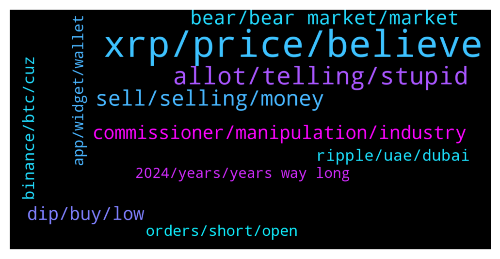

# **@Ripple**
 ## Analysis for **2022-01-22** - **2022-01-23**.

---

## 📊 **Basic Stats**

**n_messages_sent**: 434

---

---

## 🔝 **Top keywords and related messages**

1. **xrp, price, believe**

    @Pelawatsemesta --- *give me a reason why should i buy xrp coins* **--->** [TG Discussion](https://t.me/Ripple/3044362)

    @CasperLayer1 --- *So i called the months long downtrend november. Then i called the 58k down, after that the 44k down(a bit later then thought). I called the drop for xrp top 68 when we were 1,10 and told to sell and buy back  So till now got every one right even though people calling me fudder Just because i made the observation that xrp price is shit and behaving like shit. We are like 1600 days! without ATH.  So whats next? As i said after Breaking 44k down which  i said was certain coming in like 2 weeks i would take another look.  Wellllll here it Comes! Were ruined! Bear market 100 procent no Breaking 1.00 this year. Or 50k btc* **--->** [TG Discussion](https://t.me/Ripple/3043467)

    @Tinkabellagal --- *Example to use xrptoolkit  How to use xrpl dex  https://m.youtube.com/watch?v=MivQ6SWRGXo* **--->** [TG Discussion](https://t.me/Ripple/3044159)

    @Cointh88 --- *Ripple’s “biggest victory” triggers XRP Holders’ request for unprivileged SEC meetings  “The biggest victory for Ripple and XRPHolders, from Judge Netburn’s recent decision, isn’t necessarily the email with the Draft version of the Hinman speech.”  https://financefeeds.com/ripples-biggest-victory-triggers-xrp-holders-request-unprivileged-sec-meetings/* **--->** [TG Discussion](https://t.me/Ripple/3043754)

    @Jakes1993 --- *Question: if I bought 2000 coins at 80c and another 2000 at 60c will my coin value be 70c?* **--->** [TG Discussion](https://t.me/Ripple/3043699)

    @JustNNM --- *As in their group. This is the XRP group, we have nothing to do with Solo* **--->** [TG Discussion](https://t.me/Ripple/3044035)

2. **allot, telling, stupid**

    @anandpatel600 --- *Mark my words...you will get more pain 😂* **--->** [TG Discussion](https://t.me/Ripple/3044459)

    @Jakes1993 --- *Thanks brilliant strategy to keep emotions in check👍* **--->** [TG Discussion](https://t.me/Ripple/3043705)

    @DeltaOMI --- *Tell me u r fuddwr without telling me 🤨* **--->** [TG Discussion](https://t.me/Ripple/3043882)

    @Voltaire123 --- *No you are a fudder! Without prove* **--->** [TG Discussion](https://t.me/Ripple/3044457)

    @CasperLayer1 --- *Never once said that stop misleading people with your nonsense* **--->** [TG Discussion](https://t.me/Ripple/3043682)

    @nephiasah --- *I said It a million times and all i got was being called a stupid pessimist* **--->** [TG Discussion](https://t.me/Ripple/3043929)

3. **sell, selling, money**

    @sand_une --- *Selling now is loss it will not get worse than that ATM* **--->** [TG Discussion](https://t.me/Ripple/3044065)

    @marianmp --- *Miners don't sell anymore they hodll* **--->** [TG Discussion](https://t.me/Ripple/3044317)

    @Hendrikhaverkamp22 --- *Is just dont look at the price anymore 🤣 its all on my ledger so cant sell* **--->** [TG Discussion](https://t.me/Ripple/3044098)

    @XRP_Saitama --- *I’m not shilling. I’m asking to get insight I don’t even own any* **--->** [TG Discussion](https://t.me/Ripple/3043972)

    @ApoIIyon --- *i just filled my bags with the muppets who sold ^^* **--->** [TG Discussion](https://t.me/Ripple/3044232)

    @philip_218 --- *Thinking to buy back later 😂😂* **--->** [TG Discussion](https://t.me/Ripple/3043912)

4. **bear, bear market, market**

    @jarilitmanen1 --- *Been in a bear market since last may.* **--->** [TG Discussion](https://t.me/Ripple/3043927)

    @GULUacityinUganda --- *Are we in the bear market now* **--->** [TG Discussion](https://t.me/Ripple/3043668)

    @fudding --- *Could be a bear market, repeating 2018 pattern* **--->** [TG Discussion](https://t.me/Ripple/3043655)

    @richcryto --- *Any experts on here think we are in Bear market for a while?* **--->** [TG Discussion](https://t.me/Ripple/3044121)

    @Ebrahimaldashti --- *I'm not sure still.. It's it bear market or is it just a correction?* **--->** [TG Discussion](https://t.me/Ripple/3043679)

    @gharry1 --- *I’m not sure if we are in bear that price could rise?* **--->** [TG Discussion](https://t.me/Ripple/3044751)

5. **commissioner, manipulation, industry**

    @anuj90322 --- *Ok, but have u ever been surprised by the crypto market?* **--->** [TG Discussion](https://t.me/Ripple/3043471)

    @Qawakib --- *Bro its just market manipulation at his finest crypto cant die they just will regulate* **--->** [TG Discussion](https://t.me/Ripple/3043847)

    @SJ --- *Who ever can afford to buy more  all cryptos are a steal ryt now* **--->** [TG Discussion](https://t.me/Ripple/3044055)

    @philip_218 --- *SEC Commissioner Says Crypto Doesn’t Require Special Regulatory Framework  One SEC Commissioner says that the watchdog’s regulatory policy is enough to oversee the cryptocurrency industry. While there have been calls by the cryptocurrency community for the SEC to provide clearer regulation for the industry, one of the agency’s commissioners thinks otherwise.  SEC Does Not Need to Re-Invent the Wheel. Allison Lee, a Commissioner for the U.S. Securities and Exchange Commission (SEC), while appearing at a D.C. bar event on crypto regulation, has said that cryptocurrencies do not need a special set of rules.  Source  https://t.me/Bitcoin_Ethereum_Trading* **--->** [TG Discussion](https://t.me/Ripple/3043901)

    @anuj90322 --- *The other crypto have nothing to change their outlook as much* **--->** [TG Discussion](https://t.me/Ripple/3044727)

    @TripleMIX --- *'They' want to annihilate Crypto because 'they' want us to use their nwo CBDC'S for mass Control in a Cashless Society. Obey or they will freeze your assets...  👁️=🔑* **--->** [TG Discussion](https://t.me/Ripple/3044672)

6. **dip, buy, low**

    @ReiTeh --- *But but.. I want more dips 😢* **--->** [TG Discussion](https://t.me/Ripple/3044335)

    @Jai_Rambo --- *Alot are scared now. Thinking that the price is gg down.. then it raise up.. people fomo.. then it will drop.. thats how u end up losing.. buy the dip.. and wait.. no fear* **--->** [TG Discussion](https://t.me/Ripple/3044172)

    @Petjuuuh --- *For now nothing is happening for me @ 0.20 it starts to tingle if it does for some people now you bougth to high and you just need to wait* **--->** [TG Discussion](https://t.me/Ripple/3044520)

    @chuckwagon --- *After the end of this dip, you’ll never see these prices again. ISO20022 coins will go parabolic in the coming months.* **--->** [TG Discussion](https://t.me/Ripple/3044407)

    @Chinoe14 --- *I'm buying more of the dip* **--->** [TG Discussion](https://t.me/Ripple/3044693)

    @marianmp --- *Teh dipes dip of the dipely dip 😁* **--->** [TG Discussion](https://t.me/Ripple/3044260)

7. **binance, btc, cuz**

    @NialPial --- *Well therefore i’m confused u dont see what Binance is doing. They’re literally playing with their future holdings, to manipulatethe BTC price lmao* **--->** [TG Discussion](https://t.me/Ripple/3044484)

    @NialPial --- *I mean the overal holdings in futures Binance owns. No offense at all, but do you know what Future trading is? (Again, no offense, really)* **--->** [TG Discussion](https://t.me/Ripple/3044476)

    @NialPial --- *Futures on binance are tanking on shorts, ya’ll dont even check the orderbook enough, you can litrly see what they doin rn😂 just wait till the FED comes with their stupid plan on new crypto policy* **--->** [TG Discussion](https://t.me/Ripple/3044460)

    @NialPial --- *Look at the spikes last 2 hrs. 700€+ in 20 minutes on btc.. and at the same time u see Binance BTC liquidity going up lol* **--->** [TG Discussion](https://t.me/Ripple/3044468)

    @NialPial --- *And thats where binance is manipulating in propoganda by posting stuff about “BTC WILL GO DOWN” and creating faultive orderbooks. (Which is legal)* **--->** [TG Discussion](https://t.me/Ripple/3044496)

    @NialPial --- *Its cuz they wanna win money, on people shorting on BTC. And since now all those people in short, lose, cuz btc went up a bit, binance makes shtloads of money in only 20 minutes.* **--->** [TG Discussion](https://t.me/Ripple/3044470)

8. **ripple, uae, dubai**

    @Vincent758 --- *The biggest mistake ripple labs will make is to have their central office in Dubai UAE.  I've lived in Dubai for over 10 year's & their law changes like the weather.  I would totally avoid UAE & the rest of the middle east. The only reason why UAE is encouraging Crypto is because they are heavily in debt due to the Expo 2020 disaster.  Most people trading crypto will have their Crypto & assets seized in UAE. Mark it* **--->** [TG Discussion](https://t.me/Ripple/3044659)

    @Jodxb2311 --- *Ripple have had offices in Dubai for some time.  ODL hub for them with alot of remittances.* **--->** [TG Discussion](https://t.me/Ripple/3044612)

    @Cezto --- *Ripple is the only safe bet at this moment, the coin which is resisting most you wanna sell. Then please go on.* **--->** [TG Discussion](https://t.me/Ripple/3044443)

    @arianaparker --- *Jay I wouldn’t say it’s a bad idea but the truth is that those that have spare are buying ripple because once the case is settled you might be surprised to see 10$ and that’s the end of its dump* **--->** [TG Discussion](https://t.me/Ripple/3044147)

    @FiloB80 --- *You can use Binance savings instead of staking, for example. Not high %, but better than zero.* **--->** [TG Discussion](https://t.me/Ripple/3044300)

    @XRP_Saitama --- *To reverse this market it’s gonna take for Ripple to win the SEC case. That will be the catalyst.* **--->** [TG Discussion](https://t.me/Ripple/3043899)

9. **app, widget, wallet**

    @Catcher256 --- *And Xumm is a hot wallet like Trust wallet, where you can also buy und swap your crypto currencies?* **--->** [TG Discussion](https://t.me/Ripple/3044157)

    @Jakes1993 --- *Is there any working widgets I can use for android* **--->** [TG Discussion](https://t.me/Ripple/3044176)

    @anuj90322 --- *Remove widget, Go to app settings and clear data and cache... uninstall app and reinstall app then..login on coinmarket cap app then.. create new widget and refresh widget* **--->** [TG Discussion](https://t.me/Ripple/3044181)

    @anuj90322 --- *Yes u can use coinmarketcap widget like the one shown below* **--->** [TG Discussion](https://t.me/Ripple/3044177)

    @Catcher256 --- *So its not a hot wallet? I'm confused 😅* **--->** [TG Discussion](https://t.me/Ripple/3044163)

    @Briggslet --- *Meta trader 4.. the one for mobile phone.. not desktop* **--->** [TG Discussion](https://t.me/Ripple/3043825)

10. **orders, short, open**

    @anuj90322 --- *I hope the short sellers get liquidated as soon as possible* **--->** [TG Discussion](https://t.me/Ripple/3044338)

    @SaveYourSelf2 --- *If you watch the order books long enough, a majority large orders are drop ceilings and floors. Watch for completion of the orders for true volume.* **--->** [TG Discussion](https://t.me/Ripple/3044466)

    @SaveYourSelf2 --- *By liquidity do you mean at the sell point or the overall open orders?* **--->** [TG Discussion](https://t.me/Ripple/3044475)

    @SaveYourSelf2 --- *That is normal for an exchange to manipulate order books. Keeps them hot. I thought you where refering to the completed orders not just open.* **--->** [TG Discussion](https://t.me/Ripple/3044488)

    @SaveYourSelf2 --- *I see where you are coming from but if 70% of completed future trades are short, you would get that ratio. The open orders book can say whatever ratio it'd like, it is not a true value of volume.* **--->** [TG Discussion](https://t.me/Ripple/3044500)

    @NialPial --- *Its not even possible that 70%+ is shorting rn.* **--->** [TG Discussion](https://t.me/Ripple/3044494)

