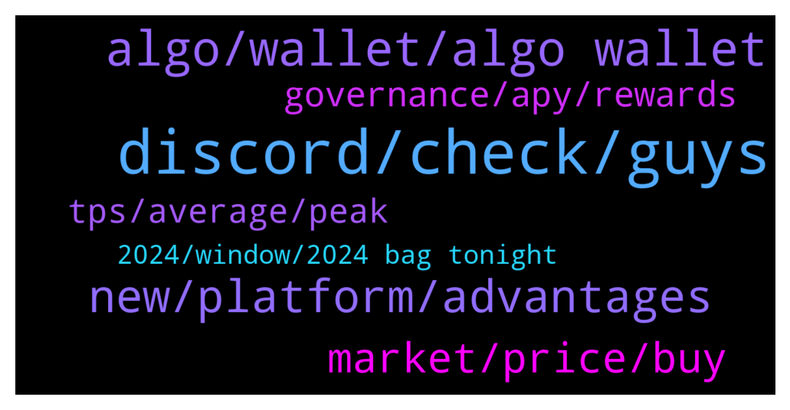

# **@algorand**
 ## Analysis for **2022-01-22** - **2022-01-23**.

---

## 📊 **Basic Stats**

**n_messages_sent**: 152

---

---

## 🔝 **Top keywords and related messages**

1. **discord, check, guys**

    @Olowore --- *Have you guys heard about HeedFinance? They look amazing* **--->** [TG Discussion](https://t.me/algorand/334751)

    @MackDenver --- *It would be best if you reach out to our discord about this  https://discord.gg/84AActu3at* **--->** [TG Discussion](https://t.me/algorand/334570)

    @MeritRichard --- *I was unable to join the discord* **--->** [TG Discussion](https://t.me/algorand/334386)

    @traderbrew --- *Thanks for the suggestion. I'll have to check out the discord when I am on my laptop.* **--->** [TG Discussion](https://t.me/algorand/334670)

    @MackDenver --- *Maybe you should talk to our tech team regarding it. Please feel free to head over to our Discord.* **--->** [TG Discussion](https://t.me/algorand/334531)

    @Adders28 --- *There are some here but you would be better on discord* **--->** [TG Discussion](https://t.me/algorand/334668)

2. **algo, wallet, algo wallet**

    @MackDenver --- *1. https://www.algorand.com/ecosystem/use-cases  2. Mobile Wallet: https://algorandwallet.com/support/  Web wallet: https://wallet.myalgo.com/  Extension: https://chrome.google.com/webstore/detail/algosigner/kmmolakhbgdlpkjkcjkebenjheonagdm   3. We don't have an L2 right now.* **--->** [TG Discussion](https://t.me/algorand/334726)

    @NightAlgorand --- *You just need to hold it in official algo wallet and you are golden :)* **--->** [TG Discussion](https://t.me/algorand/334592)

    @MuratArkan --- *Algo must explain this to investors* **--->** [TG Discussion](https://t.me/algorand/334377)

    @Cryptothefuture2022 --- *Can i a question...is algo bot connected  on this coin* **--->** [TG Discussion](https://t.me/algorand/334692)

    @Nicksof --- *1. Just hold your algo in wallet  2. I sure know Algorandwallet and myalgo work 3. 5-6% apy 4. Yes 5. it’s not locked so 0  6. Answered by 5* **--->** [TG Discussion](https://t.me/algorand/334734)

    @creptotronox --- *How many times hold algo 3x bull token* **--->** [TG Discussion](https://t.me/algorand/334516)

3. **new, platform, advantages**

    @traderbrew --- *I just wanted to talk to some algorand developers to discover if this is the right crypto for me to develop on.* **--->** [TG Discussion](https://t.me/algorand/334661)

    @MackDenver --- *That would be a great news if happens. The planet needs Algorand.* **--->** [TG Discussion](https://t.me/algorand/334713)

    @Dennis --- *Is there any news, update, what’s juicy in Algorand these days* **--->** [TG Discussion](https://t.me/algorand/334453)

    @traderbrew --- *I am new to dapp development. I was wondering what advantages there is to algorand over other crypto platforms.* **--->** [TG Discussion](https://t.me/algorand/334671)

    @Foxstot --- *is this the right group for algorand testnet quries* **--->** [TG Discussion](https://t.me/algorand/334569)

    @Sem --- *Hi guys, Iam new here Iam interested in both algorand and radix. They seem both very promising projects. Which project do you guys think will have more chances to succeed in the future?* **--->** [TG Discussion](https://t.me/algorand/334730)

4. **market, price, buy**

    @terphlil2 --- *it seems they start to grow a little, maybe now is the time. What to buy? I want to long-term invest into some cmc top coin* **--->** [TG Discussion](https://t.me/algorand/334739)

    @MackDenver --- *Hi creptotronox, We don't talk about the market or price prediction on this chat. Please join the price chat to discuss about this @algorand_price* **--->** [TG Discussion](https://t.me/algorand/334517)

    @kramercrypto --- *We have been in a consistent downtrend for 3+ months. Bear market's don't have to be multi year etc* **--->** [TG Discussion](https://t.me/algorand/334703)

    @terphlil2 --- *hey everyone, the market stopped falling? when is time to buy?* **--->** [TG Discussion](https://t.me/algorand/334735)

    @paulinhoa1 --- *not the time yet, wait for a few days then buy* **--->** [TG Discussion](https://t.me/algorand/334736)

    @khunpon --- *for price and meme, come here guys https://t.me/algorand_price* **--->** [TG Discussion](https://t.me/algorand/334494)

5. **governance, apy, rewards**

    @juquinbu --- *All rewards will all be based on Governance voting now. Check “Governance”* **--->** [TG Discussion](https://t.me/algorand/334719)

    @MackDenver --- *Yes but the APY is small. Governance has a better APY* **--->** [TG Discussion](https://t.me/algorand/334556)

    @mfocus1 --- *does anyone know if we are still getting paid by holding algorand in our wallets without participating in the governance?* **--->** [TG Discussion](https://t.me/algorand/334554)

    @LoLo3PK2 --- *Regarding staking: 1. How to delegate/stake? 2. Is it possible to do it through any of the wallets? 3. Estimate APR/APY 4. Is it autocompund? 5. How long does unstake take? 6. While unstaking, do I still receive rewards?  Thabks again!!!* **--->** [TG Discussion](https://t.me/algorand/334733)

    @mawa73 --- *Have the rewards become much less than they were a few months ago?* **--->** [TG Discussion](https://t.me/algorand/334689)

    @mawa73 --- *Ahhh ok i am All In in Governance Voting, thanks for the Info* **--->** [TG Discussion](https://t.me/algorand/334722)

6. **tps, average, peak**

    @MackDenver --- *Hello Giuseppe, Peak TPS is the highest TPS and average is the average one.* **--->** [TG Discussion](https://t.me/algorand/334515)

    @Kaypacha --- *How is it possible that the average is 23 and highest is 1100?* **--->** [TG Discussion](https://t.me/algorand/334530)

    @Kaypacha --- *Can someone explain to me what's the difference between Peak TPS and Average TPS that I found on Algorand Metrics? The peak is 1100 TPS, the average is 23 TPS. How is it possible such a big difference?* **--->** [TG Discussion](https://t.me/algorand/334508)

    @Malvo --- *Greetings can anyone tell me has algorand upgraded the network to 46,000 TPS as was told to happen* **--->** [TG Discussion](https://t.me/algorand/334431)

    @Cecco --- *Giuseppe man!! Sveglia raga!! I think that algorand can handle a maximum of 1100 transaction per second, but right now it is doing an average of 23 TPS because that's the traffic, i think they are not hurry to made algorand with the possibility of 46000tps because we don't need it right now, right now i think is better to try to let grow the ecosystem and number of people involved, still we have plenty of space for new people before the need of such a big tsp number.* **--->** [TG Discussion](https://t.me/algorand/334534)

    @Cecco --- *I don't know really, but i think that that peak (if it's ever been reached) it's been reached just as a test (maybe in the testnet?) Anyway should be interesting an answer from somebody that knows it for sure from Algorand* **--->** [TG Discussion](https://t.me/algorand/334546)

7. **2024, window, 2024 bag tonight**

    @Insecurity_Romania --- *We buy the dip not your nudes 😉* **--->** [TG Discussion](https://t.me/algorand/334615)

    @Tinammmo --- *Happy weekend is over again, keep working tomorrow😂* **--->** [TG Discussion](https://t.me/algorand/334728)

    @Nosiemprefunciona --- *Start? Are you sleeping this months?😅* **--->** [TG Discussion](https://t.me/algorand/334618)

    @wdave6659 --- *Just hold and Relax babe 😂* **--->** [TG Discussion](https://t.me/algorand/334617)

    @Happy --- *It happend😁...thank you see u at 2024...my bag already fill..* **--->** [TG Discussion](https://t.me/algorand/334532)

    @xM3Dx --- *Tonight... U should look on the window 🤓* **--->** [TG Discussion](https://t.me/algorand/334365)

