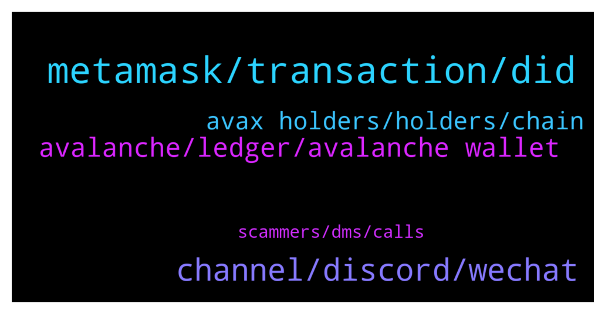

# **@avalancheavax**
 ## Analysis for **2022-01-22** - **2022-01-23**.

---

## 📊 **Basic Stats**

**n_messages_sent**: 134

---

---

## 🔝 **Top keywords and related messages**

1. **metamask, transaction, did**

    @Cryptechfps --- *Slippage also increased to 5-10%, I'm trying to do a swap btw* **--->** [TG Discussion](https://t.me/avalancheavax/323909)

    @oathtobarbatos --- *Try restarting your Metamask account Settings -> Advanced -> Reset just in case* **--->** [TG Discussion](https://t.me/avalancheavax/323906)

    @Anabeli2 --- *What are your opinion on the market movement* **--->** [TG Discussion](https://t.me/avalancheavax/323873)

    @bagdasarExca --- *Is there a problem with the c chain? Seems like transactions are not going through regardless of gas limit (Even at 300K)* **--->** [TG Discussion](https://t.me/avalancheavax/323923)

    @CryptoPapitv --- *Can anyone help me solve this (Swap Failed: Ledger device Unknown Error. It’s been happening for the last 2 hours. I did all of the trouble shooting as well. Please help* **--->** [TG Discussion](https://t.me/avalancheavax/324088)

    @W --- *Gas price seem like it went up* **--->** [TG Discussion](https://t.me/avalancheavax/323940)

2. **channel, discord, wechat**

    @oathtobarbatos --- *I think this could be useful for what you are asking https://avascan.info/stats/genesis* **--->** [TG Discussion](https://t.me/avalancheavax/323835)

    @oathtobarbatos --- *I'm not sure what WeChat means but, there's a channel for the Chinese community https://t.me/avalanche_zh* **--->** [TG Discussion](https://t.me/avalancheavax/324070)

    @hrbooms --- *Thank you very much! this is exactly what I was looking for* **--->** [TG Discussion](https://t.me/avalancheavax/323836)

    @YuYuHakusho22 --- *do you have the links or will they come up like that from searching* **--->** [TG Discussion](https://t.me/avalancheavax/324087)

    @HIT9PROJECT --- *any tuto somewhere to help me to find this out ?* **--->** [TG Discussion](https://t.me/avalancheavax/323976)

    @TheSEOdude --- *I really wanna talk about solana , it's been down from 3 days lol* **--->** [TG Discussion](https://t.me/avalancheavax/324092)

3. **avalanche, ledger, avalanche wallet**

    @iwouldbediogenes --- *Fake news. Competitors are scared.. Avalanche tech is the N. 1* **--->** [TG Discussion](https://t.me/avalancheavax/324049)

    @M_OEZ --- *Hi guys. When I talk to people outside of the Avalanche world I often hear saying Avalanche is also not capable to proceed very high volume of transactions so they will get to a limit at some time. Do you maybe have a paper or an article etc. where these concerns are clarified ?* **--->** [TG Discussion](https://t.me/avalancheavax/324047)

    @Cody_0x --- *My understanding is Avalanche actually solves scalability issues with its 3 tier blockchain technology. If I search avalanche scalability issues I only find information on how it solves this problem.   It makes me think these concerns may come from competitors who are scared?* **--->** [TG Discussion](https://t.me/avalancheavax/324048)

    @Kazue --- *Hey guys a question about avalanche wallet + ledger. I want create multiple avalanche addresses and link them to one ledger. I read some stuff on reddit  but this is not clear (hd addresses). Scammers stay away my dm* **--->** [TG Discussion](https://t.me/avalancheavax/324040)

    @jk00124 --- *What’s the best way to stake AVAX* **--->** [TG Discussion](https://t.me/avalancheavax/323912)

    @YuYuHakusho22 --- *what are the best and most active avax defi communities to find out about new projects with utilities on the chain? best social media outlets. tg Twitter etc? thanks in advance* **--->** [TG Discussion](https://t.me/avalancheavax/324082)

4. **avax holders, holders, chain**

    @hrbooms --- *Can I get the results of the AVAX public sale? seems to be conflicting information out there* **--->** [TG Discussion](https://t.me/avalancheavax/323833)

    @Soulbratha --- *Hey guys, is there anyone who can help me out with $0.5 of AVAX for gas? Really appreciate.* **--->** [TG Discussion](https://t.me/avalancheavax/323944)

    @hrbooms --- *Are these AVAX tokens on Moonriver scam tokens?* **--->** [TG Discussion](https://t.me/avalancheavax/323887)

    @MJayCrypto --- *Is there a site where i can swap coins without the need for holding AVAX token?* **--->** [TG Discussion](https://t.me/avalancheavax/323932)

    @hrbooms --- *Question about finding wallet addresses on snowtrace or avascan. Can We not see AVAX holders on the X or C chain? Only wrapped AVAX holders? I know its is a nit picky distinction but I feel like I should be able to see AVAX holders on the c-Chain* **--->** [TG Discussion](https://t.me/avalancheavax/323867)

    @alicancelik88 --- *guys what do u think about this avax mint? https://marketplace.kalao.io/token/xdirect_e7897e1e8c13dc18e6d368024f5f92441f4b8bb* **--->** [TG Discussion](https://t.me/avalancheavax/323979)

5. **scammers, dms, calls**

    @Feina_777 --- *LoL kafi SCAMMERs muze DM kar rhe hai how can I stop this DM is there any option like who can DM me or not?* **--->** [TG Discussion](https://t.me/avalancheavax/324127)

    @azamega85 --- *Be careful of scammers DMing your. Bryan White* **--->** [TG Discussion](https://t.me/avalancheavax/323956)

    @Cryptechfps --- *Lol got spammed by like 7 scammers* **--->** [TG Discussion](https://t.me/avalancheavax/323902)

    @hrbooms --- *Or maybe coingecko just doesn't know what they are talking about* **--->** [TG Discussion](https://t.me/avalancheavax/323888)

    @hrbooms --- *and scammers seriously fuck off I am not replying to your DMs or video calls* **--->** [TG Discussion](https://t.me/avalancheavax/323869)

    @Nicolas_A --- *Not DMs but you can block calls and getting invited into groups in the privacy settings* **--->** [TG Discussion](https://t.me/avalancheavax/324128)

