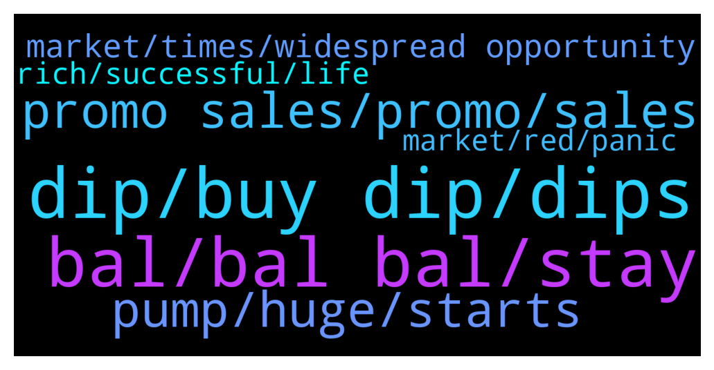

# **@balancer_officialchat**
 ## Analysis for **2022-01-22** - **2022-01-23**.

---

## 📊 **Basic Stats**

**n_messages_sent**: 588

---

---

## 🔝 **Top keywords and related messages**

1. **dip, buy dip, dips**

    @Yest --- *What bothers me the most is that most of the time I do not have the money to buy the dip.* **--->** [TG Discussion](https://t.me/balancer_officialchat/23867)

    @Richard --- *This dip Shouldn't change our sentiment, in fact this is an opportunity to buy the dip, and accumulate more tokens. The Promo sales make it even better.* **--->** [TG Discussion](https://t.me/balancer_officialchat/23917)

    @Jennifer T --- *We all just have to be patient to take advantage of the dip* **--->** [TG Discussion](https://t.me/balancer_officialchat/24425)

    @Richard --- *it's always a good time to buy it when it's in a dip or pull back.* **--->** [TG Discussion](https://t.me/balancer_officialchat/24417)

    @Scott42135 --- *A lot of people taking advantage of the dip recently, this is a good  entry point* **--->** [TG Discussion](https://t.me/balancer_officialchat/23732)

    @Yest --- *That's one good thing, Buy the dip and earn rewards guys* **--->** [TG Discussion](https://t.me/balancer_officialchat/23783)

2. **bal, bal bal, stay**

    @alanshawn399 --- *BAL is a good investment at it's current market cap, no doubt.* **--->** [TG Discussion](https://t.me/balancer_officialchat/24416)

    @AH7377373 --- *BAL is one of the biggest project of the year, everybody is expected to be a holder of BAL* **--->** [TG Discussion](https://t.me/balancer_officialchat/24419)

    @Tinez --- *ATH may come sooner or later. Keep hodl.BAL is the future* **--->** [TG Discussion](https://t.me/balancer_officialchat/23700)

    @dg23334 --- *Once again BAL is delivering  I saw so many early investors losing faith so early. We still early lfgggggggg* **--->** [TG Discussion](https://t.me/balancer_officialchat/23719)

    @xcv258 --- *This BAL is going to be huge...once people discover its true potential* **--->** [TG Discussion](https://t.me/balancer_officialchat/23730)

    @Jennifer T --- *Don't give up yet on BAL guys* **--->** [TG Discussion](https://t.me/balancer_officialchat/23778)

3. **promo sales, promo, sales**

    @CS63RD --- *Recovery is coming guys, and the Promo sales might end soon due to the amount of people buy everyday* **--->** [TG Discussion](https://t.me/balancer_officialchat/23983)

    @Danie24579 --- *To those who bought especially from the promo sales* **--->** [TG Discussion](https://t.me/balancer_officialchat/23953)

    @Yest --- *The promo sales is still open to keep us going💯🚀💰* **--->** [TG Discussion](https://t.me/balancer_officialchat/23782)

    @harley1174 --- *For those who have been participating in the promo sales* **--->** [TG Discussion](https://t.me/balancer_officialchat/23795)

    @GGG11321 --- *Each time i see you guys talking about a lot of people getting in, it make me feel like the promo sales will end soon. And then I FOMO and make higher purchase then my previous ones* **--->** [TG Discussion](https://t.me/balancer_officialchat/24283)

    @ဩ༂࿙Ƙོ нོ яོ з ོъོ࿚༃ဩ --- *Especially now that the promo sales is on* **--->** [TG Discussion](https://t.me/balancer_officialchat/24260)

4. **pump, huge, starts**

    @shhdd12334 --- *Its expected that Attempts will be made to shake out weak hands for sure. Hodlers who ignore short term noises will make it when the pump starts.* **--->** [TG Discussion](https://t.me/balancer_officialchat/23971)

    @ဩ༂࿙Ƙོ нོ яོ з ོъོ࿚༃ဩ --- *Wil be nice if the stockmarket pump we can do we with a little green candles* **--->** [TG Discussion](https://t.me/balancer_officialchat/24016)

    @Yest --- *It'll most likely see a pump soon* **--->** [TG Discussion](https://t.me/balancer_officialchat/24019)

    @shhdd12334 --- *It'll most likely see a pump soon* **--->** [TG Discussion](https://t.me/balancer_officialchat/24225)

    @Ryanlawson --- *Sellers will regret leaving their positions once the huge pump starts* **--->** [TG Discussion](https://t.me/balancer_officialchat/24208)

    @ann111112 --- *The pump will be so huge* **--->** [TG Discussion](https://t.me/balancer_officialchat/24307)

5. **market, times, widespread opportunity**

    @Tinez --- *Because everyday,  there are new person who join the crypto space. Majority not knowing what exactly they are getting into* **--->** [TG Discussion](https://t.me/balancer_officialchat/24431)

    @shhdd12334 --- *Just to have a much better thinking about what crypto is, you plan is to get the right knowledge and mind You'll be good to go, and scale through really well* **--->** [TG Discussion](https://t.me/balancer_officialchat/24215)

    @Lobertsmith --- *Definitely, the cryptospace is much more educated than it was few years ago, only those new to the cryptoworld panic sell based on baseless fuds* **--->** [TG Discussion](https://t.me/balancer_officialchat/23927)

    @leo1111012 --- *Yeah, braveness is needed in the world of crypto* **--->** [TG Discussion](https://t.me/balancer_officialchat/23966)

    @ÑÑÑÑÑÑ --- *Truly Crypto ain't really for the weak* **--->** [TG Discussion](https://t.me/balancer_officialchat/24043)

    @Scott42135 --- *Making money in crypto is hard... But keeping it is the hardest.* **--->** [TG Discussion](https://t.me/balancer_officialchat/23915)

6. **rich, successful, life**

    @Danie24579 --- *What hurts the most is when you see others succeeding from what you were scared to get involved in, fear factor plays a big role on success rates. Successful people are brave people* **--->** [TG Discussion](https://t.me/balancer_officialchat/23920)

    @maria00217 --- *But again you know, having chances like this to become rich is one thing, but to utilize the same opportunity is another* **--->** [TG Discussion](https://t.me/balancer_officialchat/24385)

    @Tinez --- *The goal shouldn't be to get wealthy, since it only benefits you.  The goal should be for the world to be less reliant on centralized authorities, which benefits everyone.* **--->** [TG Discussion](https://t.me/balancer_officialchat/23958)

    @ဩ༂࿙Ƙོ нོ яོ з ོъོ࿚༃ဩ --- *It's important to grasp opportunity with both hands if you are willing to create wealth.* **--->** [TG Discussion](https://t.me/balancer_officialchat/23941)

    @mabrick40 --- *Grasping opportunity is also a  key to wealth 👌🏻* **--->** [TG Discussion](https://t.me/balancer_officialchat/23942)

    @mabrick40 --- *Taking advantage of little opportunity gives the huge breakout🤗* **--->** [TG Discussion](https://t.me/balancer_officialchat/24309)

