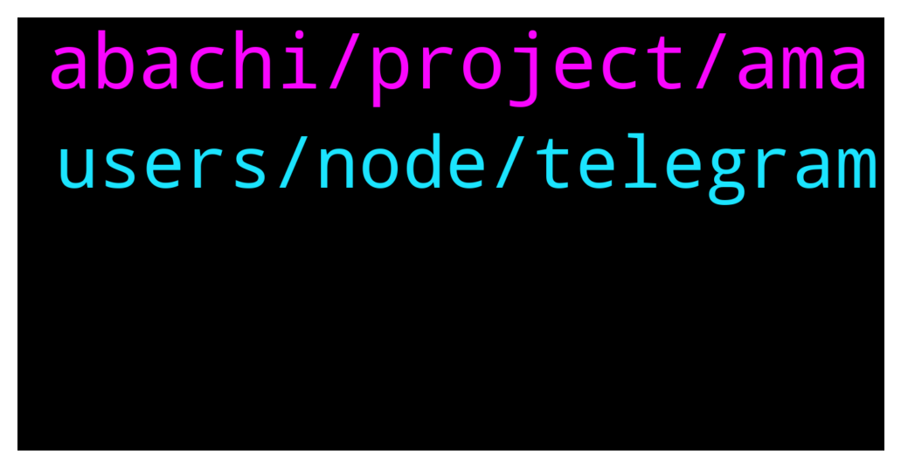

# **@chainlinkofficial**
 ## Analysis for **2022-01-22** - **2022-01-23**.

---

## 📊 **Basic Stats**

**n_messages_sent**: 95

---

---

## 🔝 **Top keywords and related messages**

1. **abachi, project, ama**

    @Thetatooth --- *Thank you Electo, Rand, Bryon for coming out and sharing with us today. It was a pleasure having you here today! Best of luck on your project!* **--->** [TG Discussion](https://t.me/chainlinkofficial/367727)

    @electo_abachi --- *Abachi is building tools & sdks to enable permissioned and compliant lending products to work within the Defi space. This essentially means bridging TradFi and DeFi. Abachi also acquires any companies or technology that will help it do that.  To Start we will build permissioned & authenticated lending pools and offer buy now pay later services to businesses. We already have partnership in place to do this via our partner LUCA Plus. We plan to expand this service 10x each month and then add more products for real-world yields on chain.* **--->** [TG Discussion](https://t.me/chainlinkofficial/367680)

    @electo_abachi --- *Yes - we do plan to partner in the DeFi space. We are talking to Olympus DAO currently (have been for a couple of weeks) regarding partnership opportunities, and have also been in talks with mstable  Additionally once the first staking apps go live, we will be reaching out to Aave for their permissioned pools launch and Centrifuge for their real-world assets yields.* **--->** [TG Discussion](https://t.me/chainlinkofficial/367686)

    @ValerieElash2 --- *Who the right person for discuss ama proposal?* **--->** [TG Discussion](https://t.me/chainlinkofficial/368233)

    @Thetatooth --- *Thank you for sharing, these are great services to secure your project. I'm happy to hear your future plans are bright too!   Now, I know we have some fans in here today... So my next question would have to be: what is the best way for someone watching today to get started with Abachi?* **--->** [TG Discussion](https://t.me/chainlinkofficial/367709)

    @Thetatooth --- *That's awesome! Congratulations! Can you tell us more about how Abachi and Chainlink work together?* **--->** [TG Discussion](https://t.me/chainlinkofficial/367702)

2. **users, node, telegram**

    @davidgokhshtein --- *Hey — who works on partnerships for ChainLink?* **--->** [TG Discussion](https://t.me/chainlinkofficial/368057)

    @marcromeron --- *Chainlink is a decentralized network of oracles that enables smart contracts to securely interact with real-world data and services that exist outside of blockchain networks. We're not a blockchain.  Chainlink is blockchain agnostic and is available on several leading blockchains now. It aims to be available wherever developers are.* **--->** [TG Discussion](https://t.me/chainlinkofficial/367998)

    @TheNavigator6 --- *Is anyone running a chainlink node? Is it profitable? Any help is very much welcome* **--->** [TG Discussion](https://t.me/chainlinkofficial/368259)

    @Cryptodjens --- *Hello guys 😎 bought back in. Link/BTC seems juicy* **--->** [TG Discussion](https://t.me/chainlinkofficial/367808)

    @AriKiry --- *"The ultimate long term goal is that all Chainlink services become self-sustaining through user paid fees. Many services already achieve this today.  Chainlink Price Feeds are designed to be sustainable through user fees at scale.  User fees are aggregated together, generating an economies of scale effect, where no user is paying the full cost, rather it's shared across many users. As more paying users join a network, the costs of every existing and future user decreases.  The additional fee revenue could also go towards greater security (more nodes, sources, etc.) Or a mix, such as lowering costs some for users while increasing some security.  But there is a chicken or egg problem before reaching this scale.  Nodes won't put Price Feed data on-chain regularly if there are not enough user fees, and early users are not going to want to pay the full costs before there are already paying users to share costs with. This is where the role of the subsidy comes into play.  A subsidy solves the bootstrapping problem by lowering the costs of early users so they are not paying the full costs." This is from a CLG thread which I believe to be quite accurate.  Also, Sergey shared on the Chainlink 2022 Kickoff video that many feeds where already profitable.* **--->** [TG Discussion](https://t.me/chainlinkofficial/367887)

    @suity59 --- *Thanks Ari, that beautifully explains my question. So to sum-up, essentially the link tokens will be used: - to subsidy and motivate nodes and users in the early stage - in later stage when nodes are self sustaining then link tokens will be only used to become a node on the blockchain.* **--->** [TG Discussion](https://t.me/chainlinkofficial/367890)

