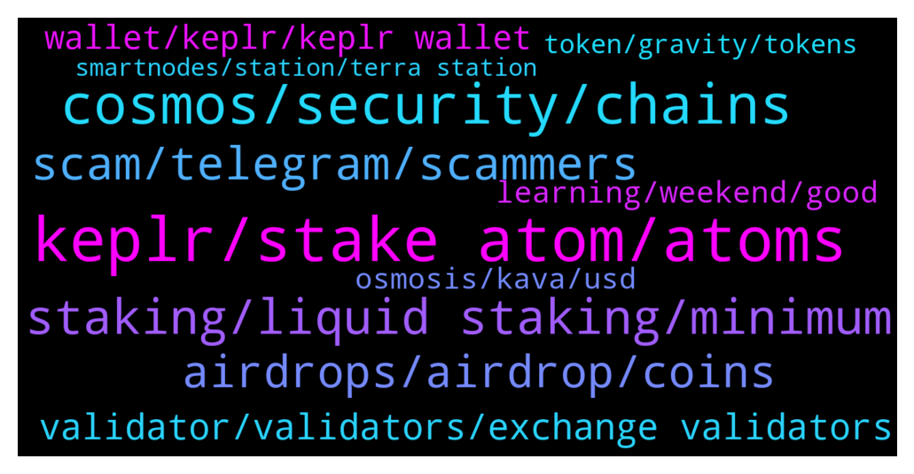

# **@cosmosproject**
 ## Analysis for **2022-01-22** - **2022-01-23**.

---

## 📊 **Basic Stats**

**n_messages_sent**: 298

---

---

## 🔝 **Top keywords and related messages**

1. **keplr, stake atom, atoms**

    @Sajbarkat --- *How can I qualify for it. Just buying Atom through Binance is enough?* **--->** [TG Discussion](https://t.me/cosmosproject/478965)

    @juliarhr --- *Why is everything crashing except atom* **--->** [TG Discussion](https://t.me/cosmosproject/478930)

    @Sajbarkat --- *How to compare Dot ecosystem Vs Atom ecosystem* **--->** [TG Discussion](https://t.me/cosmosproject/478941)

    @Simo --- *send your Atom from CEX to keplr wallet and stake it to a validator, the validator must not be a CEX and at 0% commision* **--->** [TG Discussion](https://t.me/cosmosproject/479396)

    @eyo98 --- *Dot Is like iOS and atom is like Android* **--->** [TG Discussion](https://t.me/cosmosproject/478944)

    @tylerfyu --- *Hi. Please let me know how to swap each the bnb or eth with atom. And the way  to swap atom to these.* **--->** [TG Discussion](https://t.me/cosmosproject/479794)

2. **cosmos, security, chains**

    @Nitroape --- *https://twitter.com/CryptoApe0/status/1484916641171488773?s=20 check this out cosmonauts !!* **--->** [TG Discussion](https://t.me/cosmosproject/479253)

    @DrDaxx --- *So binance was created for cosmos chain?* **--->** [TG Discussion](https://t.me/cosmosproject/478922)

    @ale128888 --- *Hi, I am Leo from Sat.is We are a multichain DEX that would like to seek advice on the best way to bridge liquidity in order to integrate Cosmos. Can we setup a group with the developers to discuss? thanks! 😊  Please advise on who to PM! 🙏🏼* **--->** [TG Discussion](https://t.me/cosmosproject/478897)

    @MrK_bulld0t --- *I understand (Even IBC fees aren't paid out in cosmos ?)* **--->** [TG Discussion](https://t.me/cosmosproject/479550)

    @AtomJazz --- *No fees for anything. Cosmos is not rent seeking ecosystem. That's why developers find it extremely attractive and it's the reason why Cosmos is growing faster than any other ecosystem* **--->** [TG Discussion](https://t.me/cosmosproject/479543)

    @AtomJazz --- *It's hard to see DOT competing with Cosmos tbh. Cosmos will pass 200 IBC chains probably this year already while 100chains is Polkadot's maximum. We will see tho* **--->** [TG Discussion](https://t.me/cosmosproject/478947)

3. **staking, liquid staking, minimum**

    @Jennycake82 --- *Hello 😊 Does anyone know if there's a minimum amount you can stake?* **--->** [TG Discussion](https://t.me/cosmosproject/479621)

    @unfreshmilk --- *I'm talking about liquid staking such as on Persistence (pStake)* **--->** [TG Discussion](https://t.me/cosmosproject/479786)

    @Capt_Morgan --- *What’s the minimum for staking in Keplr?* **--->** [TG Discussion](https://t.me/cosmosproject/479336)

    @nita_NFtart --- *hello, i want staking in sentinel ,why always fail?* **--->** [TG Discussion](https://t.me/cosmosproject/479194)

    @Sephiroth83 --- *Jenny are you form England? anyway i think is not a minimum if is not written ...* **--->** [TG Discussion](https://t.me/cosmosproject/479623)

    @Grgiorgi --- *But how can i provide liquidity to the pools?* **--->** [TG Discussion](https://t.me/cosmosproject/479025)

4. **scam, telegram, scammers**

    @Cordtus --- *Another thing I'll add here which pretty much defeats any scam attempt.... Never ever give your seed out or input it anywhere you aren't 300% sure is a legitimate wallet app from a verified link/source* **--->** [TG Discussion](https://t.me/cosmosproject/479643)

    @EVAIRaresh --- *Wonder when we will see a feature implemented which will deal with all the spam and scam users 🤦‍♂️* **--->** [TG Discussion](https://t.me/cosmosproject/479139)

    @Jennycake82 --- *Why are you trying to scam me when to seem so helpful in this chat?* **--->** [TG Discussion](https://t.me/cosmosproject/479633)

    @JasonOfArgonaut --- *Never follow a.link given in a dm.  They use lookalike.account logins to phish you.  You can find any site yourself through searching.* **--->** [TG Discussion](https://t.me/cosmosproject/479651)

    @EVAIRaresh --- *True...crazy the amount of scammers around 🙄* **--->** [TG Discussion](https://t.me/cosmosproject/479141)

    @Cordtus --- *I've had scam results in top 3 on google searches for things both in and out of the crypto world. Careful even there.* **--->** [TG Discussion](https://t.me/cosmosproject/479655)

5. **airdrops, airdrop, coins**

    @Beginnerxx --- *Thank you. How much atom shoudl i hold for airdrop sir ?* **--->** [TG Discussion](https://t.me/cosmosproject/479404)

    @Edoardo --- *Hello I have a question. Does the validator SG-1 is fine in order to be eligible for the cosmos airdrop? Do you have any advice?* **--->** [TG Discussion](https://t.me/cosmosproject/479551)

    @BeeBeeBee09 --- *For Sommelier airdrop, can i do some stake to get it now ?  https://airdrop.sommelier.finance/  >>> claim before 31 Mar* **--->** [TG Discussion](https://t.me/cosmosproject/479106)

    @AtomJazz --- *Evmos will be airdropping tokens to ATOM community among others* **--->** [TG Discussion](https://t.me/cosmosproject/478964)

    @LBankAdam --- *Where can $ATOM be pledged for airdrops of other coins？* **--->** [TG Discussion](https://t.me/cosmosproject/479261)

    @Beginnerxx --- *Where and how much atom coins do i need to hold Atom coins for future airdrops of other coins ?* **--->** [TG Discussion](https://t.me/cosmosproject/479394)

6. **validator, validators, exchange validators**

    @AtomJazz --- *Becoming a validator is permisonless so unfortunately there's nothing anyone can do about it* **--->** [TG Discussion](https://t.me/cosmosproject/479811)

    @AtomJazz --- *If you think it's too high you can always restake to another validator* **--->** [TG Discussion](https://t.me/cosmosproject/479149)

    @Cordtus --- *A good validator has perfect uptime, doesn't miss voting on proposals, is possibly an active member of these chat groups.. @Galadrin* **--->** [TG Discussion](https://t.me/cosmosproject/479656)

    @Cordtus --- *You can check lots of the validators details on the different chains on mintscan.io* **--->** [TG Discussion](https://t.me/cosmosproject/479659)

    @AtomJazz --- *Currently a validator needs to be in top 150 (number of delegations)* **--->** [TG Discussion](https://t.me/cosmosproject/479819)

    @AtomJazz --- *I can't recommend any of the validators. Would be unfair to the rest of them. All I can say is that exchange validators should be avoided* **--->** [TG Discussion](https://t.me/cosmosproject/479156)

7. **wallet, keplr, keplr wallet**

    @nita_NFtart --- *yes im use keplr extension and tokenpocket , but not work* **--->** [TG Discussion](https://t.me/cosmosproject/479209)

    @AtomJazz --- *Keplr wallet. You can find tutorials in the pinned message* **--->** [TG Discussion](https://t.me/cosmosproject/479208)

    @AtomJazz --- *Keplr is for chrome browser https://medium.com/chainapsis/how-to-use-keplr-wallet-40afc80907f6?source=user_profile---------0----------------------------* **--->** [TG Discussion](https://t.me/cosmosproject/479216)

    @Beginnerxx --- *Okay sir. Thanks. Is keplr wallet free to use or is there a fee associated with keplr wallet ?* **--->** [TG Discussion](https://t.me/cosmosproject/479398)

    @CrypticPisang --- *just noticed keplr sneakily added 4 more tokens in android wallet. well done!* **--->** [TG Discussion](https://t.me/cosmosproject/479544)

    @Beginnerxx --- *where can i find keplr wallet ? Link please* **--->** [TG Discussion](https://t.me/cosmosproject/479402)

8. **learning, weekend, good**

    @Jennycake82 --- *Yeah...I grasped the importance of that lol* **--->** [TG Discussion](https://t.me/cosmosproject/479648)

    @zstupar33 --- *https://www.youtube.com/watch?v=zcJtoJQBOsk Really nice and educative video guys, check it out!* **--->** [TG Discussion](https://t.me/cosmosproject/479212)

    @JasonOfArgonaut --- *You woke up.  That's a good start.* **--->** [TG Discussion](https://t.me/cosmosproject/479674)

    @Jennycake82 --- *I am! It's so interesting though! I'm enjoying learning 😊 Thank you* **--->** [TG Discussion](https://t.me/cosmosproject/479644)

    @Cordtus --- *👍 No bigs. Glad you dodhed the bullet there.* **--->** [TG Discussion](https://t.me/cosmosproject/479641)

    @Jennycake82 --- *No, I'm from Germany but live in Maryland* **--->** [TG Discussion](https://t.me/cosmosproject/479625)

9. **osmosis, kava, usd**

    @Cordtus --- *For those not listed use osmosis stats on the left panel* **--->** [TG Discussion](https://t.me/cosmosproject/479566)

    @AtomJazz --- *Stargaze and LUM went through LBP on Osmosis but no pubilc sales* **--->** [TG Discussion](https://t.me/cosmosproject/479549)

    @Grgiorgi --- *When is kava gonna be available in Kepler or cosmostation app??* **--->** [TG Discussion](https://t.me/cosmosproject/479020)

    @alen_muly --- *deposited SCRT into OSMOSIS. says it is finished. but i dont see it in my acc? Why?* **--->** [TG Discussion](https://t.me/cosmosproject/478891)

    @AtomJazz --- *Sure. You can join Osmosis channel for Osmosis-specific questions* **--->** [TG Discussion](https://t.me/cosmosproject/479717)

    @megotsomeusername --- *osmosis pool 606 50% ATOM / 50% HUAHUA  liquidity: 92,496.43 ATOM 455,182,272.33 HUAHUA  total liq.: 6,349,541.04 USD 24h vol.: 1,070,668.26 USD  rewards: total osmo/day: 920.63 APR: 45.72 % APY: 57.93 %  additional rewards: HUAHUA APR: 665.76 % APY: 73,234.97 %  swap fee: 0.30 % swap fees 24h: 3,212.00 USD fee APY: 20.27 %* **--->** [TG Discussion](https://t.me/cosmosproject/479019)

10. **token, gravity, tokens**

    @AtomJazz --- *Gravity bridge tokens? We will see. Nothing official has been communicated yet* **--->** [TG Discussion](https://t.me/cosmosproject/478954)

    @Cordtus --- *It's sort of only for the tokens performance specifically within their platform I guess. But for some of them that is the only platform to buy* **--->** [TG Discussion](https://t.me/cosmosproject/479575)

    @william28619 --- *will they havre their own token in the future?* **--->** [TG Discussion](https://t.me/cosmosproject/479720)

    @william28619 --- *does Gravity Dex have a token?* **--->** [TG Discussion](https://t.me/cosmosproject/479188)

    @Gnolang --- *Hey jazz what ever happen to the gravity tokens?* **--->** [TG Discussion](https://t.me/cosmosproject/478952)

    @Gnolang --- *It seems like a liquidity token ngl* **--->** [TG Discussion](https://t.me/cosmosproject/478956)

