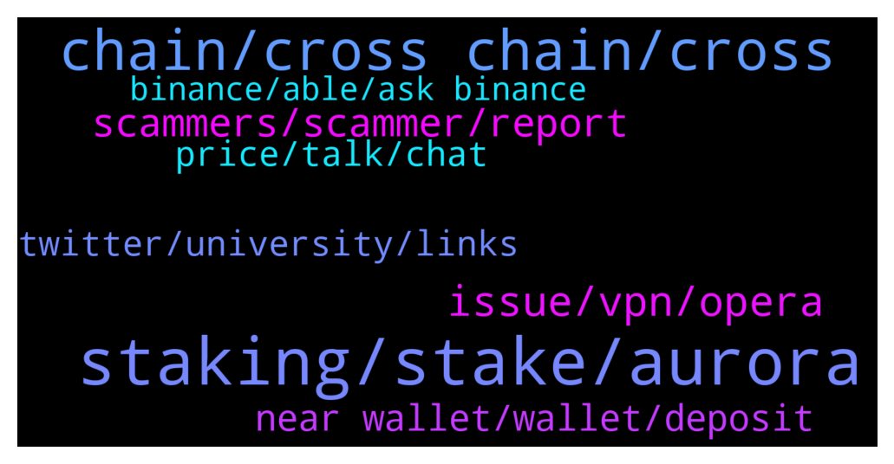

# **@cryptonear**
 ## Analysis for **2022-01-22** - **2022-01-23**.

---

## 📊 **Basic Stats**

**n_messages_sent**: 456

---

---

## 🔝 **Top keywords and related messages**

1. **staking, stake, aurora**

    @rahulgoel007 --- *You can stake via metapool or near wallet Check below links https://t.me/cryptonear/289255* **--->** [TG Discussion](https://t.me/cryptonear/295482)

    @rahulgoel007 --- *On Metapool you can liquid stake $NEAR and get $NEAR(~11% APY) + $META {Liquid staking --> Instant Unstake by paying extra fees} Guide--> https://www.producthunt.com/posts/meta-pool  What's $META? Here's the answer! https://twitter.com/Nearius_/status/1431208822895374337?s=19* **--->** [TG Discussion](https://t.me/cryptonear/295466)

    @kv9990 --- *I guess you mean APR on Farming Pools :) https://app.ref.finance/farms* **--->** [TG Discussion](https://t.me/cryptonear/296269)

    @Taurus990 --- *Where can i stake my NEAR ?* **--->** [TG Discussion](https://t.me/cryptonear/295481)

    @dehraw --- *Yes, if I happen to be in one of those pools I might get hit by that right?* **--->** [TG Discussion](https://t.me/cryptonear/296115)

    @NEARverse_xd --- *Well, case is different here. Near is not slashing validator for now. But if validator breaks any rules then it will lose all they have staked* **--->** [TG Discussion](https://t.me/cryptonear/296125)

2. **chain, cross chain, cross**

    @rahulgoel007 --- *Check the roadmap to get more idea about the goal  Protocol Development Roadmap-- :- https://gov.near.org/t/protocol-development-roadmap/2903?u=hiimhuyhai* **--->** [TG Discussion](https://t.me/cryptonear/295003)

    @oppzsmoKe --- *Would you say near is similar to Ethereum and Sol* **--->** [TG Discussion](https://t.me/cryptonear/295521)

    @iamkemoo --- *That's not our goal. The future will be multi-chain.* **--->** [TG Discussion](https://t.me/cryptonear/295667)

    @iamkemoo --- *Cross-chain A cross-chain is the interoperability between two relatively independent blockchains. In other words, it allows blockchains to speak to one another because they're built in a standardized way.  MultiChain MultiChain allows the creation and tracking of native assets at the blockchain network level. It has built-in blockchain tokens, both the native currency of the chain that can be used for transaction fees and additional assets issued on top.* **--->** [TG Discussion](https://t.me/cryptonear/295670)

    @instafinanzas --- *Awesome, for example multi chain would be near and ethereum but cross chain could be dvpn and Akash, the latter are independent but they can communicate each other ? Just mentioned the coins for the example sake* **--->** [TG Discussion](https://t.me/cryptonear/295671)

    @iamkemoo --- *For cross-chain best example is Kardiachain with their Dual Node technology they can speak to other Blockchains.* **--->** [TG Discussion](https://t.me/cryptonear/295672)

3. **issue, vpn, opera**

    @NEARverse_xd --- *Working fine here. Please close your tab and re-load it again* **--->** [TG Discussion](https://t.me/cryptonear/295428)

    @rahulgoel007 --- *Or try a different browser, I checked for me too it's working fine* **--->** [TG Discussion](https://t.me/cryptonear/295431)

    @saulscotland --- *chrome and opera, from the computer and the cell phone* **--->** [TG Discussion](https://t.me/cryptonear/295441)

    @rahulgoel007 --- *Can you please try firefox once.* **--->** [TG Discussion](https://t.me/cryptonear/295442)

    @VivinonoWU --- *There may be some problems with the page display, not seven months ago* **--->** [TG Discussion](https://t.me/cryptonear/296037)

    @NearFritz --- *You can also try: Erase cache / Restart OS / try another browser like OPERA / use a VPN* **--->** [TG Discussion](https://t.me/cryptonear/295144)

4. **scammers, scammer, report**

    @bradimas --- *How do you turn off DMs on TG? I asked a question earlier abiut how to buy and I have DM after DM from "near support". These scammers suck.* **--->** [TG Discussion](https://t.me/cryptonear/295949)

    @RYTHM_ISMYGOAL --- *Attention.    Attention  This ID 👇👇👇 @Near_protocol1 👆👆👆  Is a Scammer* **--->** [TG Discussion](https://t.me/cryptonear/295078)

    @tundeajibulu --- *You think or it's a scam.* **--->** [TG Discussion](https://t.me/cryptonear/296171)

    @larry_lang --- *i think, it look like scam, currently, we dont have any* **--->** [TG Discussion](https://t.me/cryptonear/296169)

    @kenjay60 --- *But it's been confirmed he is a scammer right?* **--->** [TG Discussion](https://t.me/cryptonear/295091)

    @kenjay60 --- *Wow! Did he tried anything suspicious?* **--->** [TG Discussion](https://t.me/cryptonear/295087)

5. **near wallet, wallet, deposit**

    @thevu687294 --- *Hello admin, i need your help , can i take Near Back to my Near wallet, if I sent Near coin to wallet of  single use funding adress ? Pls?* **--->** [TG Discussion](https://t.me/cryptonear/296214)

    @masstahcoiner --- *while centralized crypto.com have 4 days stucked deposits and withdrawals* **--->** [TG Discussion](https://t.me/cryptonear/295077)

    @saulscotland --- *When it comes to withdrawing, it stays on loading and never advances, it is a problem that already has more than 24 hours* **--->** [TG Discussion](https://t.me/cryptonear/295424)

    @lMamii --- *I can not withdraw my near from near wallet. Wallet say to me "An error occurred. Your send transaction was canceled". But all of steps is true.* **--->** [TG Discussion](https://t.me/cryptonear/295159)

    @b70valkyrie --- *Anybody facing issues with the NEAR wallet web frontend? Not being able to transfer any tokens for the whole day.* **--->** [TG Discussion](https://t.me/cryptonear/295313)

    @Limtf --- *Why deposit and withdrawal not work?* **--->** [TG Discussion](https://t.me/cryptonear/295400)

6. **price, talk, chat**

    @rahulgoel007 --- *You can join here https://t.me/merchantsofnear  Our price discussion group* **--->** [TG Discussion](https://t.me/cryptonear/295478)

    @bailey_12 --- *Hi,  If you looking for some price action, please join here https://t.me/merchantsofnear  Otherwise, we don't do price talk in this chat* **--->** [TG Discussion](https://t.me/cryptonear/295299)

    @NearFritz --- *Hello, if you want to talk about price you can come here: @merchantsofnear* **--->** [TG Discussion](https://t.me/cryptonear/295191)

    @NearFritz --- *Need you guys follow the rules, if you want to talk about price / buying opportunities or any similar, please you can go here: @merchantsofnear* **--->** [TG Discussion](https://t.me/cryptonear/295068)

    @iamkemoo --- *For price related discussions please join the unofficial price chat: https://t.me/merchantsofnear* **--->** [TG Discussion](https://t.me/cryptonear/295613)

    @oppzsmoKe --- *I actually own near I’m just trying to have a better understanding of my investment* **--->** [TG Discussion](https://t.me/cryptonear/295522)

7. **twitter, university, links**

    @larry_lang --- *maybe u can seek it in this article. https://twitter.com/sanket_naikwadi/status/1445042381531746310?s=21* **--->** [TG Discussion](https://t.me/cryptonear/296066)

    @bailey_12 --- *in the meantime, you can find the infos on google since I think it is all over the internet. Hope this might help  https://www.crunchbase.com/organization/near-0565/people* **--->** [TG Discussion](https://t.me/cryptonear/295355)

    @dehraw --- *How do you find stuff like this? Any good twitter page to follow?* **--->** [TG Discussion](https://t.me/cryptonear/296069)

    @larry_lang --- *where do u have this information* **--->** [TG Discussion](https://t.me/cryptonear/296168)

    @rahulgoel007 --- *Check here, all projects list is available https://awesomenear.com/* **--->** [TG Discussion](https://t.me/cryptonear/294991)

    @dehraw --- *Thanks, will look it up now.* **--->** [TG Discussion](https://t.me/cryptonear/296068)

