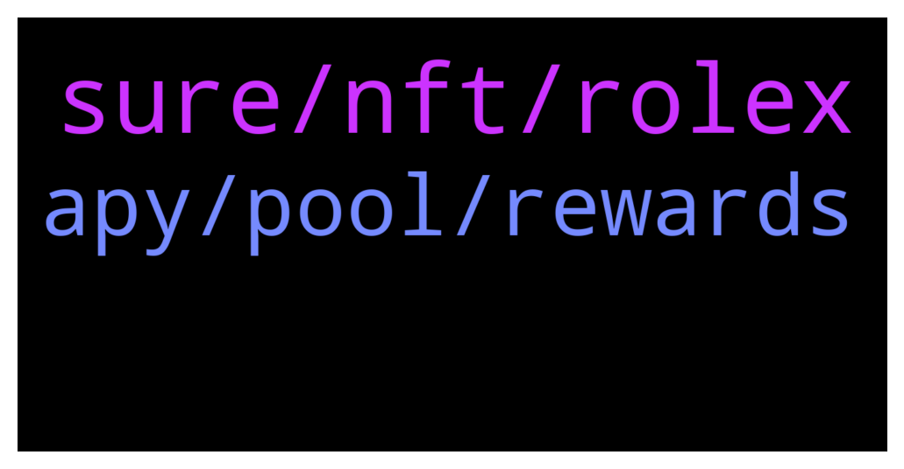

# **@dypfinance**
 ## Analysis for **2022-01-22** - **2022-01-23**.

---

## 📊 **Basic Stats**

**n_messages_sent**: 86

---

---

## 🔝 **Top keywords and related messages**

1. **sure, nft, rolex**

    @DhoniMSD516 --- *Hey https://t.me/dypannouncements is good source to know the latest news 😀* **--->** [TG Discussion](https://t.me/dypfinance/242241)

    @iamJubi --- *🔥Join Cats and Watches Society #NFTs Whitelist 🎉One Brand New Rolex Daytona Ceramic 116500LN worth $40k Giveaway  To win the watch: ✅Join dyp.finance/whitelist ✅Mint one #NFT once available ✅Like & Retweet this post ✅Join discord.gg/dypcaws ✅Tag 3 friends  👉https://twitter.com/dypfinance/status/1480623073208549380* **--->** [TG Discussion](https://t.me/dypfinance/242018)

    @Jeffzon --- *Any update on Tier 1 exchange listing for dyp?* **--->** [TG Discussion](https://t.me/dypfinance/242171)

    @iamJubi --- *You can check about the team here https://dyp.finance/about* **--->** [TG Discussion](https://t.me/dypfinance/241959)

    @DhoniMSD516 --- *No plans for now but we are flexible with roadmap and may include in between* **--->** [TG Discussion](https://t.me/dypfinance/242232)

    @DhoniMSD516 --- *If anything is needed team will take all the steps nothing to worry* **--->** [TG Discussion](https://t.me/dypfinance/242070)

2. **apy, pool, rewards**

    @DhoniMSD516 --- *Please head to any dApp and you can use calculate and just enter 100$ and enter days it shows you approx rewards you earn depending on current APY https://app-bsc.dyp.finance/farming-new-1* **--->** [TG Discussion](https://t.me/dypfinance/242089)

    @iamJubi --- *Hello. Unpair on pcs after you withdraw form the pool https://pancakeswap-v1.dyp.finance/#/remove/0x961C8c0B1aaD0c0b10a51FeF6a867E3091BCef17/BNB* **--->** [TG Discussion](https://t.me/dypfinance/241964)

    @v1ruzz --- *You guys have completely ignored, BSC, only promote/increase apy on eth and avax!* **--->** [TG Discussion](https://t.me/dypfinance/242100)

    @DhoniMSD516 --- *Hey you can use calculator to check it out but be aware the APY is dynamic and your share changes too* **--->** [TG Discussion](https://t.me/dypfinance/242086)

    @Frolman --- *OK, I'll refrase, what circumstances will decrease apy?* **--->** [TG Discussion](https://t.me/dypfinance/242150)

    @Frolman --- *I see 90k$ tvl and let's say I want to deposit the same amount, will it impact the apy?* **--->** [TG Discussion](https://t.me/dypfinance/242143)

