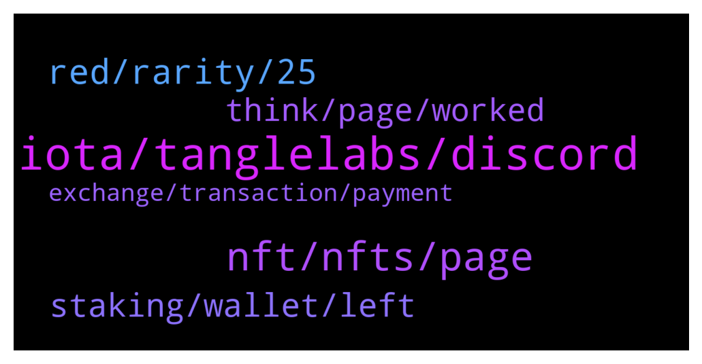

# **@iotatangle**
 ## Analysis for **2022-01-22** - **2022-01-23**.

---

## 📊 **Basic Stats**

**n_messages_sent**: 117

---

---

## 🔝 **Top keywords and related messages**

1. **iota, tanglelabs, discord**

    @itsmedev --- *Okay. We sent multiple messages and even pinned a few regarding this.* **--->** [TG Discussion](https://t.me/iotatangle/307397)

    @itsmedev --- *NOTE: We are not promoting any community NFT project here. Please checkout tanglelabs site and then only decide if you like their projects.* **--->** [TG Discussion](https://t.me/iotatangle/307299)

    @itsmedev --- *But overall response is dull from the telegram community I believe* **--->** [TG Discussion](https://t.me/iotatangle/307414)

    @davicico94 --- *But tanglelabs its from iota 🤔* **--->** [TG Discussion](https://t.me/iotatangle/307407)

    @JourneyWithoutYou --- *I have checked, and it says the message is not yet referenced by a milestone* **--->** [TG Discussion](https://t.me/iotatangle/307438)

    @baskinbeagle --- *Want to know as I understand that IOTA is already fully minted to its total supply and no more IOTA to be issued, what would be the reward for the validators right now?   Can I also conclude that IOTA is under someone control (or centralized)?  Do you have the statistics showing the holding percentage of the wallet that holds the highest amount of IOTA?* **--->** [TG Discussion](https://t.me/iotatangle/307338)

2. **nft, nfts, page**

    @raulgudiez --- *Thanks, what I have not been able to see is the other NFT in the Dashboard* **--->** [TG Discussion](https://t.me/iotatangle/307265)

    @lbenheilo --- *But it is not in my NFTs* **--->** [TG Discussion](https://t.me/iotatangle/307232)

    @davicico94 --- *If i have 3 nfts, can i sell one ?* **--->** [TG Discussion](https://t.me/iotatangle/307318)

    @MAM --- *Hi everyone, I want to know if someone has your NFT in Metamask, I have it in the page in my dashboard, but it doesn't appear in Metamask, and in the information in the page nft tanglelabs info said that it will appear* **--->** [TG Discussion](https://t.me/iotatangle/307468)

    @lbenheilo --- *next time visit, you also need to wait to see nfts* **--->** [TG Discussion](https://t.me/iotatangle/307258)

    @itsmedev --- *New address is shown for new NFT. Don't have to resend for the previous NFT* **--->** [TG Discussion](https://t.me/iotatangle/307264)

3. **red, rarity, 25**

    @davicico94 --- *And what is rarity? Cause says 25?* **--->** [TG Discussion](https://t.me/iotatangle/307332)

    @itsmedev --- *I got 1 gold as well* **--->** [TG Discussion](https://t.me/iotatangle/307418)

    @Jogadoh --- *I missed this campaign, I didn't know there would be this sale.* **--->** [TG Discussion](https://t.me/iotatangle/307396)

    @itsmedev --- *Did you buy one earlier and one now?* **--->** [TG Discussion](https://t.me/iotatangle/307266)

    @Jason --- *4 coloured rarities and each is number also* **--->** [TG Discussion](https://t.me/iotatangle/307337)

    @Tahmis --- *Red and blue for me :)* **--->** [TG Discussion](https://t.me/iotatangle/307269)

4. **staking, wallet, left**

    @topmusicdope --- *too late to start the staking?* **--->** [TG Discussion](https://t.me/iotatangle/307378)

    @Brypto --- *Haven't been on in a while, and didn't see it in last few pinned mwssages, did staking function in wallet ever happen?* **--->** [TG Discussion](https://t.me/iotatangle/307352)

    @sergyjer --- *Staking 1 phase-9 day, 2 phase 21 month* **--->** [TG Discussion](https://t.me/iotatangle/307386)

    @Tahmis --- *Nope. There is still plenty of time to stake* **--->** [TG Discussion](https://t.me/iotatangle/307380)

    @Tahmis --- *So no need to do anything. When staking ends it just ends and you will receive the rewards when networks launch* **--->** [TG Discussion](https://t.me/iotatangle/307379)

    @Tahmis --- *Yes. There is still few months of staking left* **--->** [TG Discussion](https://t.me/iotatangle/307354)

5. **think, page, worked**

    @raulgudiez --- *Thanks, now it doesn't connect well with the page.  I will try it later.* **--->** [TG Discussion](https://t.me/iotatangle/307262)

    @raulgudiez --- *The white list contains my address with NTF Minted.  But I don't see it in Metamask.  I enter: https://nft.tanglelabs.io/buy  And it appears for me to resend 100 Mi.  But I already sent them and they haven't returned them.  What should I do? I think I don't understand something.* **--->** [TG Discussion](https://t.me/iotatangle/307260)

    @raulgudiez --- *I think everything is fine although I have not yet access the dashboard* **--->** [TG Discussion](https://t.me/iotatangle/307291)

    @Tahmis --- *For some reason Chromium based browsers don't work so well* **--->** [TG Discussion](https://t.me/iotatangle/307289)

    @solgnar --- *ya it keeps crashing right now and is freaking out. it works like 20% of the time for me* **--->** [TG Discussion](https://t.me/iotatangle/307263)

    @itsmedev --- *Yeah server response is super bad now* **--->** [TG Discussion](https://t.me/iotatangle/307259)

6. **exchange, transaction, payment**

    @lbenheilo --- *I am stucking at awaiting payment? What should I do now?* **--->** [TG Discussion](https://t.me/iotatangle/307221)

    @⠠⠵ Lucas! --- *use https://explorer.iota.org to input the destination address. There you can check whether the transaction was actually issued by your exchange* **--->** [TG Discussion](https://t.me/iotatangle/307436)

    @Tahmis --- *I guess its a transaction from exchange? You should contact their support if that is the case* **--->** [TG Discussion](https://t.me/iotatangle/307445)

    @JourneyWithoutYou --- *My withdraw has been pending for more than 12 hours* **--->** [TG Discussion](https://t.me/iotatangle/307431)

    @lbenheilo --- *should i send another 100 MI and ask refund for the 7th Jan purchased* **--->** [TG Discussion](https://t.me/iotatangle/307229)

    @davicico94 --- *I did the payment with firefly* **--->** [TG Discussion](https://t.me/iotatangle/307314)

