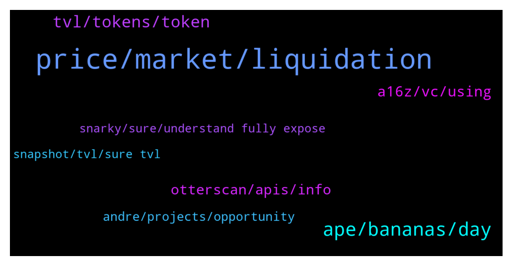

# **@lobsters_chat**
 ## Analysis for **2022-01-22** - **2022-01-23**.

---

## 📊 **Basic Stats**

**n_messages_sent**: 287

---

---

## 🔝 **Top keywords and related messages**

1. **price, market, liquidation**

    @Felix --- *What about organizing a liquidation of all short sellers?   If each person of this group buys for $100k of stable on Binance at a similar time, that’s $1.7bn. that would basically liquidate all short sellers and bring BTC to $65k* **--->** [TG Discussion](https://t.me/lobsters_chat/317864)

    @Cryptoaq --- *Have to be ultra coder for get those prices?* **--->** [TG Discussion](https://t.me/lobsters_chat/317777)

    @SC --- *Uniswap almost has same stablecoin swap market share as Curve? That's interesting https://twitter.com/PandaJackson42/status/1484596500978143234* **--->** [TG Discussion](https://t.me/lobsters_chat/317902)

    @ivangbi --- *Please tell my lusd curve deposit is fine, and gonna be okay? Please say so.* **--->** [TG Discussion](https://t.me/lobsters_chat/317910)

    @RobAnon --- *I suppose it'd be fairly false of me to say that no capital is locked, whoever provides liquidity to the system does get locked into that for a period. But they're profiting off of fees is the idea. Their IL would ultimately be equivalent to depositing liquidity to a traditional AMM* **--->** [TG Discussion](https://t.me/lobsters_chat/318014)

    @sonicblend --- *Price starts higher than market price to try screw noobs over first* **--->** [TG Discussion](https://t.me/lobsters_chat/317883)

2. **ape, bananas, day**

    @laconeat --- *I think the best thing I read for a while 🫂  https://link.medium.com/u7kRqJHy0mb* **--->** [TG Discussion](https://t.me/lobsters_chat/317707)

    @Crypt0mata --- *Man I like your youtube channel, no hype and no cringe face thumbnails, straight forward reviews of new or under the radar projects, good stuff* **--->** [TG Discussion](https://t.me/lobsters_chat/318036)

    @unchainedoneawoken --- *very nice, love the content from chadass.  I've been a ZNN boy for a while now.* **--->** [TG Discussion](https://t.me/lobsters_chat/317663)

    @ivangbi --- *Good trick Su Zhu, we won’t be buying your bags bro / s* **--->** [TG Discussion](https://t.me/lobsters_chat/317866)

    @pussinboots --- *thnx, so i should get the same day delivery for this rope* **--->** [TG Discussion](https://t.me/lobsters_chat/317844)

    @SpikeSpiege1 --- *Couldn't ask for a better stress test* **--->** [TG Discussion](https://t.me/lobsters_chat/318149)

3. **tvl, tokens, token**

    @crypticfollower --- *How does Defillama / GC prevent gaming the system?* **--->** [TG Discussion](https://t.me/lobsters_chat/318179)

    @jeff093 --- *isnt that how alchemix or one of those protocols which allow you to borrow stables (mim, alUSD) against yv tokens work* **--->** [TG Discussion](https://t.me/lobsters_chat/318162)

    @SpikeSpiege1 --- *Can you sell yvMIM on market? That's the tale of the tape for me. What's sellable should be counted in TVL* **--->** [TG Discussion](https://t.me/lobsters_chat/318159)

    @jeff093 --- *it doesnt count towards defi llama tvl and its probably too late to push a PR now* **--->** [TG Discussion](https://t.me/lobsters_chat/318098)

    @engineerking --- *if I have yvMIM (staked mim on yearn) then stake that token on radial who "claims" that as their tvl? Yearn? Radial? Both?* **--->** [TG Discussion](https://t.me/lobsters_chat/318151)

    @alexinlife --- *will the toggles (staking, treasury etc) on defillama count towards the tvl? or is the ranking without the toggles?* **--->** [TG Discussion](https://t.me/lobsters_chat/318061)

4. **a16z, vc, using**

    @adrianleb --- *im glad hundred is in the list would've sucked to see vfat implementing all the degen pools in his site while his protocol bled away* **--->** [TG Discussion](https://t.me/lobsters_chat/318201)

    @PFK2013 --- *Wonder why no one added sftm afaik* **--->** [TG Discussion](https://t.me/lobsters_chat/318086)

    @APMINERR --- *trying to WL 1000 addresses over IDE without merkle tree. didn't use it to optimize low gas* **--->** [TG Discussion](https://t.me/lobsters_chat/317979)

    @paulcr2009 --- *thanks, some og nfts already congrats seems fake body* **--->** [TG Discussion](https://t.me/lobsters_chat/318088)

    @ivangbi --- *why VC tho, what’s the joke here?* **--->** [TG Discussion](https://t.me/lobsters_chat/318193)

    @SpikeSpiege1 --- *@Darrenlautf does nansen have this tagged as a16z?* **--->** [TG Discussion](https://t.me/lobsters_chat/317833)

5. **otterscan, apis, info**

    @wmitsuda --- *hi, I just published Otterscan APIs docs, it may be of interest for anyone looking for info not available on standard rpc apis: https://twitter.com/wmitsuda/status/1484430102880559107* **--->** [TG Discussion](https://t.me/lobsters_chat/317698)

    @tinnehihi --- *@deranzxc this is the one you should ask, he is working for nansen 😂😂* **--->** [TG Discussion](https://t.me/lobsters_chat/317838)

    @jeff093 --- *What kind of info? Feel free to post there and you will be replied.* **--->** [TG Discussion](https://t.me/lobsters_chat/318050)

    @RobAnon --- *You can DM me, can't promise anything though. Sounds like you're already SOL* **--->** [TG Discussion](https://t.me/lobsters_chat/317983)

    @rocket_fuel --- *are these conference proceedings published? would like to review the bashings* **--->** [TG Discussion](https://t.me/lobsters_chat/317670)

    @twpks --- *This one is good (no fee) but don't trust me 😇 and check their website also: https://eth.liquity.fi* **--->** [TG Discussion](https://t.me/lobsters_chat/317918)

6. **andre, projects, opportunity**

    @engineerking --- *Honestly Andre can still do whatever he wants with the drop.. it would be nice if he included top 30-50 and just weight it by Tvl. So at least the tiny tiny projects get some crumbs..* **--->** [TG Discussion](https://t.me/lobsters_chat/318218)

    @SpikeSpiege1 --- *He is the master of chaos. Just brings more attention to Fantom which is the whole point of this exercise. He could have just done a stealth snapshot if he didn't want the chaos.* **--->** [TG Discussion](https://t.me/lobsters_chat/318138)

    @ivangbi --- *andre making snapshot jokes on twitter in his parent’s basemenet* **--->** [TG Discussion](https://t.me/lobsters_chat/318222)

    @SpikeSpiege1 --- *“Wherever there is danger, there lurks opportunity; wherever there is opportunity, there lurks danger. The two are inseparable.” In this scenario Andre supplied the opportunity and everyone else rushed to build the risk* **--->** [TG Discussion](https://t.me/lobsters_chat/318147)

    @XekFukOff --- *Andre has earned the right to do what he feels is best, in this space. I wouldn't be mad if he changed some parameters.* **--->** [TG Discussion](https://t.me/lobsters_chat/318143)

    @ivangbi --- *Idk Andre didn’t say anything yet. No rush.* **--->** [TG Discussion](https://t.me/lobsters_chat/318215)

7. **snarky, sure, understand fully expose**

    @MilianCrypto --- *better not, will result in more chaos and drama :)* **--->** [TG Discussion](https://t.me/lobsters_chat/318131)

    @ivangbi --- *are you sure this is not just bullshit?* **--->** [TG Discussion](https://t.me/lobsters_chat/317826)

    @adrianleb --- *that too, im mostly talking about human nature tho* **--->** [TG Discussion](https://t.me/lobsters_chat/318150)

    @RickCrosschain --- *Yes, I know, but I want to be really sure and understand it fully before I expose them* **--->** [TG Discussion](https://t.me/lobsters_chat/317935)

    @anisopteran --- *but also, in the end i care more about the actual results* **--->** [TG Discussion](https://t.me/lobsters_chat/317790)

    @RobAnon --- *Or are you just being snarky for the sake of being snarky?* **--->** [TG Discussion](https://t.me/lobsters_chat/318018)

