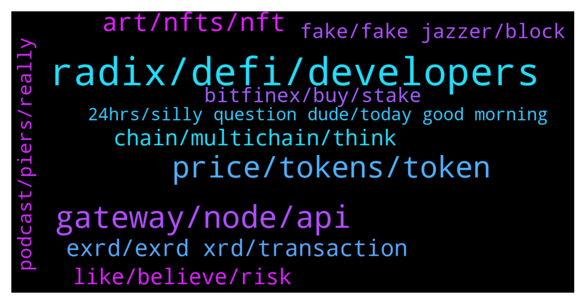

# **@radix_dlt**
 ## Analysis for **2022-01-22** - **2022-01-23**.

---

## 📊 **Basic Stats**

**n_messages_sent**: 259

---

---

## 🔝 **Top keywords and related messages**

1. **radix, defi, developers**

    @MilkyWayBlackHole --- *Hello, i am new here, first time heard today about Radix. It looks incredible. My question is that due to fact that now about 9,75B xrd is in circulation and the rest of the 24B will not be fully released in next 40 years will that not mean that the price could be higher because of that? Only concern i see is that dev team could dump their coins? I know Radix is not a meme without usecase but in theory it would be possible? Sorry for my silly questions😅* **--->** [TG Discussion](https://t.me/radix_dlt/344521)

    @Jazzer9F --- *Excellent article from Coin Telegraph highlighting the current issues faced by Solidity developers, and detailing how Radix will give developers the power to build quickly, securely, and know that scale will never be a bottleneck!  https://cointelegraph.com/news/watch-out-solidity-new-project-aims-to-tackle-downsides-of-coding-defi-projects* **--->** [TG Discussion](https://t.me/radix_dlt/344653)

    @gummy558 --- *Come join an upcoming radix related project https://t.me/windowsradix ^_^ Website will be up today or tomorrow* **--->** [TG Discussion](https://t.me/radix_dlt/344412)

    @Jazzer9F --- *The Radix app is available on @Ledger Live! 🚀  https://www.radixdlt.com/post/radix-app-now-on-ledger-live* **--->** [TG Discussion](https://t.me/radix_dlt/344445)

    @Avaunt --- *Check the pinned message in our TG group.  Avaunt | Radix Delegators Website - https://avaunt-staking.com/   Radix Dashboard - https://radixdashboard.com  Radix DLT official - https://t.me/radix_dlt https://t.me/radixstaking* **--->** [TG Discussion](https://t.me/radix_dlt/344510)

    @Kansuler --- *Do you want to get notifications when new radix projects get announced? Subscribe to the Radixlist announcement channel, and you'll be the first to know!  https://t.me/radixlist* **--->** [TG Discussion](https://t.me/radix_dlt/344674)

2. **gateway, node, api**

    @Ben_XRD --- *Under the old architecture, the desktop wallet obtained its information from archive nodes, i.e. it would connect to an archive node to obtain the state of the ledger - for example to display your balance. This was not the most scalable architecture as additional archive nodes had to be manually spun up if we saw an increase in demand. If we weren’t quick enough for your region, then that may have manifested as your wallet responding slowly.  The new Gateway API should completely resolve this. The Gateway API, which now feeds your wallet, is served by the Network Gateway. Network Gateway is a cloud based service and thus gains the elasticity you would expect from that, i.e. it can automatically increase its capacity to respond to spikes in demand.* **--->** [TG Discussion](https://t.me/radix_dlt/344392)

    @Matus1682 --- *hello @Ben_XRD  so is the network gateway a centralized cloud service in this case?* **--->** [TG Discussion](https://t.me/radix_dlt/344396)

    @TaserFace6937 --- *Correct, called components which will be available on the mainnet later this year.  You can read more about it here:  https://learn.radixdlt.com/article/what-are-components-blueprints-and-the-blueprint-catalog* **--->** [TG Discussion](https://t.me/radix_dlt/344795)

    @Jazzer9F --- *🎉  Network Gateway v1 🎉   Along with the v1.1.0 release of the radix node, we are pleased to announce the release of a production-ready v1.0.0 of the Network Gateway: https://github.com/radixdlt/radixdlt-network-gateway/releases/tag/1.0.0  The Network Gateway exposes the Gateway API, and is intended to replace Archive node functionality. For information on how to interact with the Radix-run Gateway API, check out our docs site here: https://docs.radixdlt.com/main/apis/gateway-api.html or the code on github here: https://github.com/radixdlt/radixdlt-network-gateway  Requests to https://mainnet.radixdlt.com with a X-Radixdlt-Target-Gw-Api header will get routed to the new Gateway API. An example request is shared below.  New versions of the Explorer and Wallet will be released in the coming days to move over to using the Gateway API.  Whilst Archive Nodes will continue to function, we recommend those running Archive Nodes migrate to running a Network Gateway. We will continue to update the docs site in the coming days with more information on how to run your own Network Gateway.  We'll keep an eye on the #node-runners channel for any questions.* **--->** [TG Discussion](https://t.me/radix_dlt/344535)

    @fpieper --- *Yes, you can even run it with less hardware (but I wouldn't recommend it). It should work with 8GB. Also you don't need 10 Gbit/s. It just gives more margin for ddos attacks. it is working fine with 100Mbit / 1 Gbit.  Nothing special overall. I am running a validator and since there are only 100 currently (top 100). It is recommended to have fast enough hardware to never need to think about and sleep well. Hardware is cheap. I am having 10+ cores, 64GB RAM and 1TB NMVe SSD. Never had any bottlenecks (not even close, more or less constantly on idle 😂)* **--->** [TG Discussion](https://t.me/radix_dlt/344333)

    @d1scere --- *Yes, node runners don't have to do much from what I understand. I haven't upgraded mine yet, was planning to do so later today.* **--->** [TG Discussion](https://t.me/radix_dlt/344626)

3. **price, tokens, token**

    @m_a_r_k0 --- *Folks, I don’t get the market cap thing. I bought some exrd in Jan 2021, price did not change a lot. But market cap is on rank 66 is or so right now? Shouldn’t the price have increased more if a project rises in mcap?* **--->** [TG Discussion](https://t.me/radix_dlt/344574)

    @chrisijoyah --- *Seems like everyone is getting this INU token* **--->** [TG Discussion](https://t.me/radix_dlt/344568)

    @TheCodeisTheLaw --- *The token unlock like Florian said, all tokens are unlocked(minus staking emissions) so although there are more circulating tokens, the price stayed the same which equates to a higher mcap.  Going into "price chat" territory.* **--->** [TG Discussion](https://t.me/radix_dlt/344578)

    @Magal36 --- *Sorry but we can't speculate on price on this channel* **--->** [TG Discussion](https://t.me/radix_dlt/344524)

    @CaptainMooseInc --- *That's what I thought. I just couldn't find it anywhere quickly. The economics paper is gone from what I see. Probably because of the unlock being removed?* **--->** [TG Discussion](https://t.me/radix_dlt/344563)

    @Avaunt --- *Yep. Our promo is still running* **--->** [TG Discussion](https://t.me/radix_dlt/344505)

4. **art, nfts, nft**

    @chrisijoyah --- *Seems like Coinbase is jumping on the NFT bandwagon https://www.coinbase.com/nft/announce* **--->** [TG Discussion](https://t.me/radix_dlt/344321)

    @Tom --- *Whoever pays money for all these low quality auto generated nft‘s is out of his mind, prove me wrong* **--->** [TG Discussion](https://t.me/radix_dlt/344816)

    @mattiabe98 --- *You just need to wait 24 hours since you joined this group, then you can post all the links you want. Anyway, if you're interested in showing more about your NFT, you can get it listed on RadixTalk.  More info here: https://radixtalk.com/t/how-to-get-your-nft-added-on-radixtalk/267* **--->** [TG Discussion](https://t.me/radix_dlt/344729)

    @tesslerc --- *People like to gamble and NFTs is simply a way to capitalize on this. If people took a break and looked into the fundamental value they'd see that most NFTs (across all platforms) aren't created by known artists, aren't super impressive from a creative point of view and don't have any real utility.  So as I can go to the local mall and purchase prettier art for the sake of art, these NFTs are clearly a way of short term speculative gambling 🙂  Interesting NFT projects are those that use the non-fungible property and combine it with utility 😄* **--->** [TG Discussion](https://t.me/radix_dlt/344687)

    @bartftel --- *Honestly I can see where you're coming from. For the Badix Universe however, I decided to incorporate NFTs into a game. These are the playable characters, which gives them utility. So yes, you pay to play a game, which I believe is not so strange.* **--->** [TG Discussion](https://t.me/radix_dlt/344864)

    @BlAzAk --- *the problem is that these "scam" NFTs projects discredit the real NFTs which required a lot of work, a solid team and a real project behind.  Despite being a known node runner with XIDAR and the fact that Radix Collection is very advanced. Despite the developments and projects that I have been able to bring to Radix for a long time now.  I have already been told "Another NFT project to make easy money". If I wanted to make easy money I think there would have been other easier ways 😂  We are hallucinated by these worthless projects that sold out in a few days. But does the problem come from the creators or from the buyers? In 2021/2022 we prefer to buy $SHIB than $XRD. It's the same with NFTs.  After all "20 $XRD I don't care to lose them it's not much". Ours are $200 XRD and we are clearly selling less. But we know where the project is going and we would be happy to see people paying double in round 2 haha.* **--->** [TG Discussion](https://t.me/radix_dlt/344686)

5. **exrd, exrd xrd, transaction**

    @Azatis --- *Any admin / team member here to ask few questions about XRD ?* **--->** [TG Discussion](https://t.me/radix_dlt/344582)

    @Magal36 --- *actually eXRD will keep on existing as long as Ethereum exists, and will always be swappable 1:1 for XRD (no dead line), but it surely will become less relevant when XRD reaches a wider adoption* **--->** [TG Discussion](https://t.me/radix_dlt/344769)

    @IsochronicHog --- *EXRD or XRD? Which is better to hold and why?* **--->** [TG Discussion](https://t.me/radix_dlt/344757)

    @IsochronicHog --- *So is there a plan to eventually phase out EXRD?* **--->** [TG Discussion](https://t.me/radix_dlt/344764)

    @tesslerc --- *eXRD tracks the price of XRD as they are traded 1:1. If you're speculating on the value is Radix, holding eXRD is just fine.* **--->** [TG Discussion](https://t.me/radix_dlt/344752)

    @CaptainMooseInc --- *Off hand, how many decimal places does XRD use? I forget* **--->** [TG Discussion](https://t.me/radix_dlt/344561)

6. **chain, multichain, think**

    @chrisijoyah --- *What are your thoughts on multichains?* **--->** [TG Discussion](https://t.me/radix_dlt/344819)

    @Sturlison_98 --- *I think future is multichain, but there will be leader layer 1* **--->** [TG Discussion](https://t.me/radix_dlt/344826)

    @CaviarNine --- *How exactly are you intending to do this? With a bunch of embedded messages? When we minted our onchain stuff we squeezed the metadata into the Description and URL fields* **--->** [TG Discussion](https://t.me/radix_dlt/344440)

    @chrisijoyah --- *Totally agree, the concept of multichains present their own problems, in the sense you'll always be waiting on the confirmation on one or more chain which will hinder the overall performance.* **--->** [TG Discussion](https://t.me/radix_dlt/344853)

    @Sturlison_98 --- *I think there will always be another better suitable chain for certain d'apps* **--->** [TG Discussion](https://t.me/radix_dlt/344821)

    @Sturlison_98 --- *Multichain, but not cross chain 😉* **--->** [TG Discussion](https://t.me/radix_dlt/344820)

7. **like, believe, risk**

    @Alex --- *Hey Leo I understand that price talk is not appreciated in this channel but I guess that is more a question of principle than price, to evaluate what other community members believe how likely something like this may occur. Personally I believe this is very unlikely since it wouldn’t be a very smart move to drown a project with such a massive potential, which the devs figured out for a decade. Nevertheless are the devs holding a massive stake in the network, where in my opinion the risk is completely transferred to the new entrants and early investors are after the first pay out, even at current prices, completely out of the risk if they only sell a part of the payout. That is a concern I see, that new entrants are in no comparison as generously rewarded as day 0 investors.  Now people can say okay, they trusted the process and invested already 7 years ago, when Dan was still building out of his bedroom. Looking at the initial investments that is already over a 100x today. Now the question you have to pose to yourself is, do you believe that the work which was done until now was worth this increase or not, before delivering a fully functioning L1 protocol.* **--->** [TG Discussion](https://t.me/radix_dlt/344527)

    @happyDog44647 --- *I mean the crash is over. 👏🏻 we are consolidating to pump then* **--->** [TG Discussion](https://t.me/radix_dlt/344436)

    @korone_stan --- *yeah he was like "there could be a holy grail of scalability that could still overtake the market" that one time...* **--->** [TG Discussion](https://t.me/radix_dlt/344870)

    @Tom --- *Everybody so scared like end of world😂😂😂😂😂😂 this is crypto. New technology, deal with it, it will be fine in longterm, it always was.* **--->** [TG Discussion](https://t.me/radix_dlt/344555)

    @crypt_punk --- *Bro, i mean technically Failed on dex* **--->** [TG Discussion](https://t.me/radix_dlt/344552)

    @giskard_rich --- *At first glance, that sounds like a scalable single point of failure…* **--->** [TG Discussion](https://t.me/radix_dlt/344398)

8. **fake, fake jazzer, block**

    @happyDog44647 --- *Yes. Pls block and report them!* **--->** [TG Discussion](https://t.me/radix_dlt/344390)

    @AV_7744 --- *Just had a fake Jazzer contact me on DM. Be wary everyone! They write the username in their bio and you may think they are the real one* **--->** [TG Discussion](https://t.me/radix_dlt/344387)

    @bextmany --- *I am u the invitation. Sure you can ignore it.* **--->** [TG Discussion](https://t.me/radix_dlt/344723)

    @Avaunt --- *Watch out for scammers who are probably DM'ing you as well* **--->** [TG Discussion](https://t.me/radix_dlt/344478)

    @Ben_XRD --- *Thanks for the warning but I can’t find a fake Jazzer in this channel to block.  Remember team nor mods will never DM you.* **--->** [TG Discussion](https://t.me/radix_dlt/344393)

    @N --- *NO ADMIN, neither anyone else sends DM here* **--->** [TG Discussion](https://t.me/radix_dlt/344388)

9. **bitfinex, buy, stake**

    @PeterFATAss --- *No. Buy it on exchanges. Bitfinex is the best option* **--->** [TG Discussion](https://t.me/radix_dlt/344509)

    @PeterFATAss --- *You can stake them in the wallet* **--->** [TG Discussion](https://t.me/radix_dlt/344501)

    @pzh85 --- *How much are the interest rates for staking?* **--->** [TG Discussion](https://t.me/radix_dlt/344765)

    @PeterFATAss --- *Can i still get a scorpion through staking?* **--->** [TG Discussion](https://t.me/radix_dlt/344504)

    @AL STEFANO --- *Can I buy it on the site too?* **--->** [TG Discussion](https://t.me/radix_dlt/344506)

    @AL STEFANO --- *And Can I buy xrd and stake them on radixdlt website?* **--->** [TG Discussion](https://t.me/radix_dlt/344500)

10. **podcast, piers, really**

    @tesslerc --- *Great podcast tbh 🙂 Really enjoyed it* **--->** [TG Discussion](https://t.me/radix_dlt/344784)

    @Magal36 --- *Watch the debate, Piers does a better job debating this subject than I can ever do over telegram* **--->** [TG Discussion](https://t.me/radix_dlt/344836)

    @Jacob_XRD --- *🎙️New DeFi Download Podcast🎙️  This week Piers Ridyard is joined by the Head of Ecosystem Growth at Harmony Protocol, Samuel Harrison!   👉 go.radixdlt.com/HarmonyAudio 👉 go.radixdlt.com/HarmonyVideo* **--->** [TG Discussion](https://t.me/radix_dlt/344415)

    @sonotopia --- *Oh I didn't know there was a spotify podcast, thanks 🙏* **--->** [TG Discussion](https://t.me/radix_dlt/344841)

    @TyPo1 --- *Has there been a discussion on here regarding the latest podcast with Harmony? Has there been a comparison made between Radix and Harmony?* **--->** [TG Discussion](https://t.me/radix_dlt/344783)

    @Jazzer9F --- *The latest technical AMA between RDX Works Founder Dan Hughes, and CEO Piers Ridyard is now live on YouTube!  https://youtu.be/Jn2FfMFzq0U* **--->** [TG Discussion](https://t.me/radix_dlt/344486)

