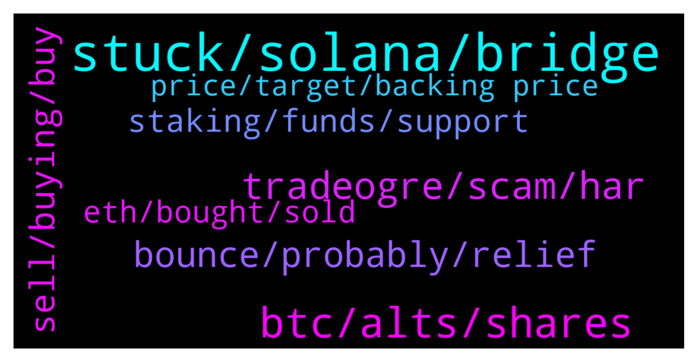

# **@shitpool**
 ## Analysis for **2022-01-22** - **2022-01-23**.

---

## 📊 **Basic Stats**

**n_messages_sent**: 228

---

---

## 🔝 **Top keywords and related messages**

1. **stuck, solana, bridge**

    @wojackdegreate --- *I’m good, been in stables forever but I have a stupid amount of ust stuck in the wormhole bridge almost for 24 hours because Solana is pretty much down… stuck at 400 tps and I guess this thing needs 2000+ tps for a tx to be successful smh* **--->** [TG Discussion](https://t.me/shitpool/719054)

    @wojackdegreate --- *Finally got my ust on sol. “24 hours later”* **--->** [TG Discussion](https://t.me/shitpool/719152)

    @da0man --- *SOL really drilling a hole today* **--->** [TG Discussion](https://t.me/shitpool/719123)

    @Breddao --- *wormhole is also down for retrieving, even if you managed to send to it?* **--->** [TG Discussion](https://t.me/shitpool/719112)

    @wojackdegreate --- *My ust still stuck in the bridge, can’t claim. Send it to zero.* **--->** [TG Discussion](https://t.me/shitpool/719111)

    @Antonioalcantara --- *blazeit was banned if i remember well* **--->** [TG Discussion](https://t.me/shitpool/718863)

2. **btc, alts, shares**

    @da0man --- *we might be at the 2019 stage sir where bitcoin pumped from 3k to 13k but alts got obliterated* **--->** [TG Discussion](https://t.me/shitpool/719278)

    @grammi --- *Do 27b * 2% for a puke in your mouth* **--->** [TG Discussion](https://t.me/shitpool/718901)

    @onchainjoe --- *lesson of this when btc -4%; alts -15%* **--->** [TG Discussion](https://t.me/shitpool/719052)

    @Bigjoeyf --- *Major alts down vs btc their eco shitcoins down vs majors* **--->** [TG Discussion](https://t.me/shitpool/718824)

    @da0man --- *damn these alts breaking down hard. look at the mighty metaverse coins* **--->** [TG Discussion](https://t.me/shitpool/718788)

    @da0man --- *at some point it is bound to happen. BTC pairs are still dangerously high on many alts.* **--->** [TG Discussion](https://t.me/shitpool/719253)

3. **tradeogre, scam, har**

    @Arysta01 --- *NFTs turned crypto into a joke* **--->** [TG Discussion](https://t.me/shitpool/719068)

    @AsianFever --- *be careful, there will be new cryptopias in this bear for sure* **--->** [TG Discussion](https://t.me/shitpool/718754)

    @Obli1 --- *Steganography has been a part of encrypting messages for millenia. Wtf you on about?* **--->** [TG Discussion](https://t.me/shitpool/719072)

    @huntersthompson101 --- *The last bastion of crypto anarchists with NO kyc ...hail tradeogre!* **--->** [TG Discussion](https://t.me/shitpool/718751)

    @ThePresidents --- *The best scam. They are fucking double dipping in bull markets. Theh but own btc, then sell it to 401k, then charge mgmt fees. They make mgmt fees regardless,  and when btc news they profit more. It's the best double dipping scam that 401k holders can't sell. And no calls him out* **--->** [TG Discussion](https://t.me/shitpool/718898)

    @pizza_dog --- *Lol it’s always been a weird crypto thing* **--->** [TG Discussion](https://t.me/shitpool/719223)

4. **bounce, probably, relief**

    @goldencatpat --- *Relief bounces are now down only, relieving you of your longs* **--->** [TG Discussion](https://t.me/shitpool/718976)

    @da0man --- *@BeAMightyKing should we be worried about a dominance run?* **--->** [TG Discussion](https://t.me/shitpool/719252)

    @tornadotrading --- *as you probably know, it's not in a straight line* **--->** [TG Discussion](https://t.me/shitpool/719174)

    @CharliePolite --- *Likely we now start bouncing and rekt early shorters, everyone starts thinking we are gonna be back to up only and then it goes for the new lows* **--->** [TG Discussion](https://t.me/shitpool/719193)

    @pizza_dog --- *oh well i'm waiting for a tiny relief bounce (if that happens) before i consider that* **--->** [TG Discussion](https://t.me/shitpool/719137)

    @EmotionLotion --- *but for now I think real bounce is on the way* **--->** [TG Discussion](https://t.me/shitpool/719043)

5. **sell, buying, buy**

    @maxmaximum1 --- *The market is red. Buy a dip or buy a presale?* **--->** [TG Discussion](https://t.me/shitpool/718746)

    @da0man --- *he flips within a year and gets it for 90% discount or so* **--->** [TG Discussion](https://t.me/shitpool/719128)

    @grammi --- *Imagine chamath saying he sold which means  All his vc frens already sold or will immediately sell  This was at $180 😂* **--->** [TG Discussion](https://t.me/shitpool/719125)

    @sumtemm --- *Maybe ppl who got in at presale* **--->** [TG Discussion](https://t.me/shitpool/719231)

    @wanker007 --- *Lmao current buyers since 3.50 to 300 be like Wtfmate* **--->** [TG Discussion](https://t.me/shitpool/719183)

    @tornadotrading --- *it is smart to sell , when it's clear right* **--->** [TG Discussion](https://t.me/shitpool/719167)

6. **staking, funds, support**

    @wojackdegreate --- *Literally everyone on chain is getting liquidated because they cant deposit funds or pay off debts, claim funds from bridges, etc 😂* **--->** [TG Discussion](https://t.me/shitpool/719146)

    @onchainjoe --- *https://www.bloomberg.com/news/articles/2022-01-20/yellen-still-hopes-u-s-inflation-gets-back-to-2-by-year-end “Households are in good financial shape -- in many ways have come out of this even stronger than they were pre-pandemic,” she said. “There’s a buffer stock of savings that accumulated that I think will continue to support the economy in the years ahead, even with less fiscal support.”"* **--->** [TG Discussion](https://t.me/shitpool/718981)

    @MoneroPal --- *That’s the whole point of cross-chain staking, make it hard to deposit more funds to prevent liquidations, lol* **--->** [TG Discussion](https://t.me/shitpool/719288)

    @Bigjoeyf --- *Most treasuries will  just be taken by the dev when they rug that's it* **--->** [TG Discussion](https://t.me/shitpool/719261)

    @Obli1 --- *When they all trade their fiat for a cbdc, they can ask you why youre making so much money staking your crypto, while they wageslave till 72 years old, finding out their pensions have been eaten aswell.* **--->** [TG Discussion](https://t.me/shitpool/719075)

    @Obli1 --- *Cause millenials cant afford enough kids to pay for the pensions, give it a decade* **--->** [TG Discussion](https://t.me/shitpool/719076)

7. **eth, bought, sold**

    @onchainjoe --- *what if "gm" was ETH version of lazer eyes* **--->** [TG Discussion](https://t.me/shitpool/719219)

    @wojackdegreate --- *Haven’t you heard? He sold the top of eth and bought the dip yesterday* **--->** [TG Discussion](https://t.me/shitpool/718924)

    @Chadderton --- *Worth buying ETH right now or wait? Opinions please 😁* **--->** [TG Discussion](https://t.me/shitpool/719272)

    @bsbscsgagacgsha --- *next eos ike all "eth killers" lmao* **--->** [TG Discussion](https://t.me/shitpool/719098)

    @Finita_est --- *That would be terrific, but this is likely the bottom day for eth* **--->** [TG Discussion](https://t.me/shitpool/718848)

    @AsianFever --- *how boring is vitalik, imagine still believing in eth* **--->** [TG Discussion](https://t.me/shitpool/718742)

