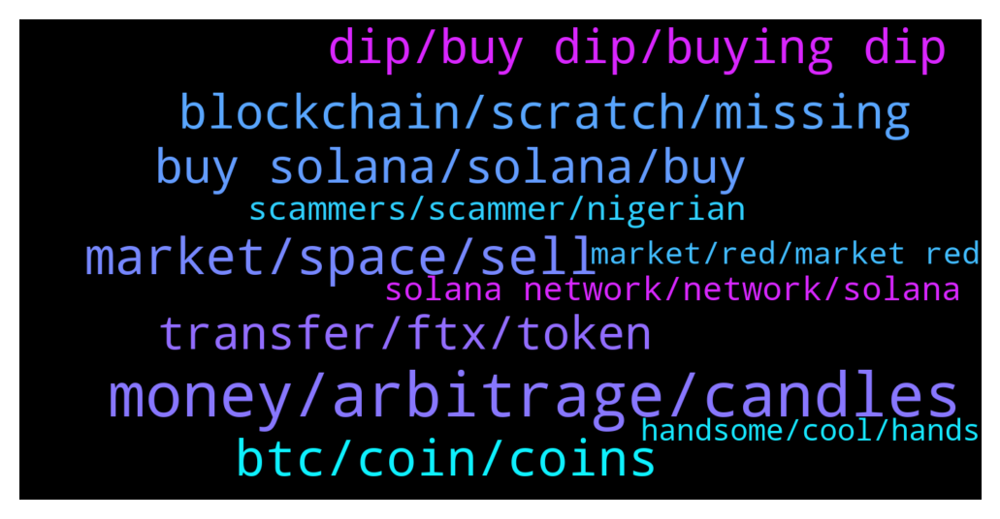

# **@solana**
 ## Analysis for **2022-01-22** - **2022-01-23**.

---

## 📊 **Basic Stats**

**n_messages_sent**: 1232

---

---

## 🔝 **Top keywords and related messages**

1. **money, arbitrage, candles**

    @Kbs --- *It makes sense... Y they wil do it in loss* **--->** [TG Discussion](https://t.me/solana/913184)

    @J --- *Should we sell or hold at this point, please advise??* **--->** [TG Discussion](https://t.me/solana/911388)

    @r_j_day --- *No one wants arbitrage ..scammer !!!* **--->** [TG Discussion](https://t.me/solana/911419)

    @Felipe --- *You foola invest with little to none market study, just dreaming of being rich in 3 months. Its fine, we need foola like you, buying at ATH and selling in dip, you will make us rich.* **--->** [TG Discussion](https://t.me/solana/912447)

    @Cescko77 --- *anytime there is somethging to do i cant use my money* **--->** [TG Discussion](https://t.me/solana/911762)

    @Charger66 --- *hello admin I have no idea what to do with my money ...i need help)))* **--->** [TG Discussion](https://t.me/solana/911751)

2. **market, space, sell**

    @UnknownIdentity --- *Why did you sell bruh!? Market is not only up everytime but have down sometimes. Now it's the time to buy more and fill your bag . #SOL will be the most funded crypto for WEB3.0* **--->** [TG Discussion](https://t.me/solana/914346)

    @Javier --- *Give it time. The whole stock market and crypto market is down* **--->** [TG Discussion](https://t.me/solana/911789)

    @Bhavnasatish --- *Cryptocurrencies is not for the weak minds* **--->** [TG Discussion](https://t.me/solana/913680)

    @rektkid --- *How does a top 10 crypto go down for days at a time every couple of weeks?* **--->** [TG Discussion](https://t.me/solana/912791)

    @Ricky --- *Don't worry.. volatility is common in crypto..* **--->** [TG Discussion](https://t.me/solana/914533)

    @emran998 --- *Crypto won’t recover unless the stock market does. Time to sell was when BTC was at 50-60K. I would not sell here.* **--->** [TG Discussion](https://t.me/solana/912371)

3. **btc, coin, coins**

    @southy33 --- *No. This isn’t just sol.  The whole bear market has started. I noticed this back in 2017-2018.   We have had a nice ride up. Now we will get people that are going to take profit and more will follow suit. It’s called FUD, if you look at the charts. Go back to beginning of 2018 charts and see for your self with the tip 10 coins then. And the whole MC. We will get a side ways moves for a while then this will restart.   I’m just annoyed I didn’t TP earlier.   My plan chamge to stable coin and wait it out. Probably add Stable coin LP into a pool while I wait for a nice entry. 😬* **--->** [TG Discussion](https://t.me/solana/913898)

    @Bhavnasatish --- *Ever coins does same, no coin is recovering* **--->** [TG Discussion](https://t.me/solana/913684)

    @tommasooo05 --- *Btc goes down to 30k in 3 4 days* **--->** [TG Discussion](https://t.me/solana/911582)

    @JWsCorner --- *Yelp, that is what everyone said when BTC was at 65K and I said be careful, we are heading back to 30K before we go to 100K.   We are almost there, so... I'll keep day dreaming, it seems to work out well.* **--->** [TG Discussion](https://t.me/solana/913059)

    @SeVen_AgoraNodes --- *and not jut saying that now. I tried saying that a couple of months back..... and as for getting more at $70 I am undecided at the moment. Most likely I wont be as there are other projects I like currently. But ive been in a long time now and will continue to stay in as I believe there are just a handful of coins that will dominate the market* **--->** [TG Discussion](https://t.me/solana/914076)

    @cryptotokenholder --- *I know u might be seeing those crazy prices and think how can an asset priced at 240 be going to 50 just 2 months later.... Well, this is crypto, specially now the big guys have entered, the big banks, pro traders at Goldman Sachs will make your life hell and take away every last dollar in your portfolio* **--->** [TG Discussion](https://t.me/solana/912265)

4. **dip, buy dip, buying dip**

    @okbro1 --- *No i knew everything is dip.. But wen it comes bounce back.. Y this sol is fked up recently unlike before it bounced nicely up.... Too much dip no recovery* **--->** [TG Discussion](https://t.me/solana/913682)

    @uio112233 --- *do u guys buy the dip today?* **--->** [TG Discussion](https://t.me/solana/914600)

    @rosewalter01 --- *DIP, market is facing DIP 🙄* **--->** [TG Discussion](https://t.me/solana/911830)

    @Tomsc27 --- *Good time to buy? Or wait for more dip?* **--->** [TG Discussion](https://t.me/solana/913980)

    @Toxic --- *Damn, everything is down just keep calm & buy the dip if you could on an weekly base* **--->** [TG Discussion](https://t.me/solana/912074)

    @Kbs --- *Wt is this non stop dip.. Someone stop... These fool people buying at 200 n selling at 100...wer did you get that brain instead of adding more* **--->** [TG Discussion](https://t.me/solana/913152)

5. **blockchain, scratch, missing**

    @tylercrypto1 --- *Yes been down a full day now* **--->** [TG Discussion](https://t.me/solana/913313)

    @JWsCorner --- *Hello,  Sorry to slide in here sideways, but I just woke up and wanted to make some adjustments to some positions.   Is the entire blockchain down?     I don't see any Tweets, or Official Messages pinned, so am I missing something here?    And, I feel the TEAM is Missing in Action.  Anyone know what's going on?      Thanks in Advance* **--->** [TG Discussion](https://t.me/solana/912991)

    @Happy_Corbin --- *Has the outage been resolved yet?* **--->** [TG Discussion](https://t.me/solana/914275)

    @MagicMoms --- *Blockchain is not working! We all are waiting* **--->** [TG Discussion](https://t.me/solana/912398)

    @MagicMoms --- *They announced it earlier but nothing happened. That's why i don't think it was the reason* **--->** [TG Discussion](https://t.me/solana/912368)

    @Ypop11 --- *Is there an ongoing maintenance on the blockchain? Because for days now I can't make transactions* **--->** [TG Discussion](https://t.me/solana/914513)

6. **buy solana, solana, buy**

    @netblizz --- *I am not fudding but if Solana will crash to $25 I am going to sell all my crypto and ALL In for SOL.* **--->** [TG Discussion](https://t.me/solana/912210)

    @Sun_dfan --- *I bought solana at 145 it was 245 and I hold it  Now I’m loosing a lot : I believe to this project but today I’m really pessimistic it could increase again as before* **--->** [TG Discussion](https://t.me/solana/912261)

    @Ridonmust --- *Yeah but all coins perfomed good today only solana didnt* **--->** [TG Discussion](https://t.me/solana/914888)

    @Ali_Mohsenii --- *I'm with Solana from 12$ and as long term visioner this situation is not scary to me even more drop* **--->** [TG Discussion](https://t.me/solana/913819)

    @GambleBlood --- *I might just cut my losses here. I bought at 136 and it's been blood red since that day. Solana has a terrible reputation of failed transactions now.* **--->** [TG Discussion](https://t.me/solana/913578)

    @MRX8880 --- *Is it good to buy solana at 90$??* **--->** [TG Discussion](https://t.me/solana/913411)

7. **transfer, ftx, token**

    @Mr_IKnowledge --- *how? the usdt is already gone from my ftx acc, it is already approved by ftx and got a txn* **--->** [TG Discussion](https://t.me/solana/911550)

    @xiashuaioo --- *I can't transfer my token with sol* **--->** [TG Discussion](https://t.me/solana/912357)

    @nguyenhieu5169 --- *Can anyone transfer token or SOL now ?* **--->** [TG Discussion](https://t.me/solana/911465)

    @DuckyTrading --- *I cant send USDT out of SOL into FTX wtf.... how is it acceptable for a network to have prolonged down time* **--->** [TG Discussion](https://t.me/solana/913066)

    @Dani00101 --- *i just withdrew my sol from FTX and it took 2 minuts in total* **--->** [TG Discussion](https://t.me/solana/913445)

    @Sonkral633 --- *Why can't we transfer spl tokens? Is the network too congested :D it says no block* **--->** [TG Discussion](https://t.me/solana/912272)

8. **scammers, scammer, nigerian**

    @Codedvinci --- *Get educated, go online and know what it means. No one is scamming. Trust me what you don't know you don't know. Be updated.* **--->** [TG Discussion](https://t.me/solana/911426)

    @cryptotokenholder --- *Scammers will surely help u, incoming in 3, 2, 1.....* **--->** [TG Discussion](https://t.me/solana/912323)

    @cryptotokenholder --- *I know the calls are hilarious 😆😆 let me help you with your problem I swear I'm not a scammer* **--->** [TG Discussion](https://t.me/solana/912302)

    @grisha --- *thank you ..... too many scammer write to dm,,,,,* **--->** [TG Discussion](https://t.me/solana/913767)

    @bvssf2 --- *When they have 2 first names that’s when u know they’re an Indian scammer* **--->** [TG Discussion](https://t.me/solana/913644)

    @Kate0101 --- *😂 How many scammers contact me! Cmon guys stop to break my balls* **--->** [TG Discussion](https://t.me/solana/912296)

9. **solana network, network, solana**

    @a1exand3r --- *Hi! All bridges don't work with solana, when it will be resolved?)* **--->** [TG Discussion](https://t.me/solana/912034)

    @unimadison --- *Ahahah great for what? solana network is always down* **--->** [TG Discussion](https://t.me/solana/913203)

    @OsmnBr --- *When will the Solana net be fixed? I can't swap in rayium. (I use phantom)* **--->** [TG Discussion](https://t.me/solana/913141)

    @OsmnBr --- *Is there a problem with the Solana network right now?* **--->** [TG Discussion](https://t.me/solana/912658)

    @antonioreis10 --- *The Solana Network will be congested at binance until when?* **--->** [TG Discussion](https://t.me/solana/912994)

    @BitcoinHobbit --- *Hello, my team is working on building a metaverse and we chose solana blockchain but there seems to be technically issues with the network and/or the main services associated with it frequently. Does anyone know if issues are being addresses with Solana and will be running more smoothly at some point?* **--->** [TG Discussion](https://t.me/solana/913344)

10. **market, red, market red**

    @Getagif --- *The whole market is down so no worries* **--->** [TG Discussion](https://t.me/solana/912036)

    @Sun_dfan --- *So in your opinion even though we will wait the market not get better ???* **--->** [TG Discussion](https://t.me/solana/912271)

    @DeepThoughtFortyTwo --- *The market is way down so everyone is trying to either sell or buy so making things much worse.* **--->** [TG Discussion](https://t.me/solana/912013)

    @nidin1 --- *No,but considering the recovery of market when the Chinese news came last year and market rebounded later,I was thinking how long it will take to bounce back* **--->** [TG Discussion](https://t.me/solana/913491)

    @cryptotokenholder --- *In my opinion holders don't to worry, u can wait for prices to bottom out and then buy when there is a clear reversal or hold for years/months..... Who needs to worry is the leveraged trader... They will be destroyed by pro traders... They are here to liquidate you.. rip your leverage your every last dollar...* **--->** [TG Discussion](https://t.me/solana/912278)

    @qazsd125 --- *Did the market's rise give you hope? But I always feel something is wrong* **--->** [TG Discussion](https://t.me/solana/914491)

