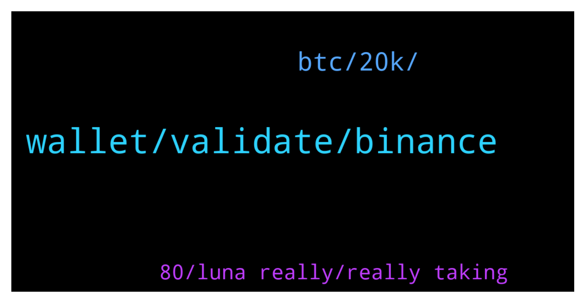

# **@terralunachat_officially**
 ## Analysis for **2022-01-22** - **2022-01-23**.

---

## 📊 **Basic Stats**

**n_messages_sent**: 37

---

---

## 🔝 **Top keywords and related messages**

1. **wallet, validate, binance**

    @seonghingoh --- *Sorry what you mean i validate my wallet? Is there any steps I need to perform to validate? I have checked my binance but no amount received for luno. Can you guide me pls. Tq* **--->** [TG Discussion](https://t.me/terralunachat_officially/24241)

    @MrW0lff --- *Hello everyone. Could anyone tell me how is it the procedure for selling the SD token when they are going to list them on Coinlist please? What do I have to do?* **--->** [TG Discussion](https://t.me/terralunachat_officially/24247)

    @Alberczx --- *Hello friends, do you know if is it possible to cancel a staking undelegate process? Thanks 🙏🏽* **--->** [TG Discussion](https://t.me/terralunachat_officially/24216)

    @Daniel_Briano --- *Just tried to answer you and got kicked for using some prohibited word ... Let's give it another try ...  No, I gave up for now. After using the internal function to swap staking rewards to SCRT I have no funds for fees as of now. When I get the next staking rewards, I will probably swap back to LUNA, send these to Binance, sell and buy SCRT and then send these to my Keplr wallet for staking SCRT.  Cumbersome but I don't know what else I could do* **--->** [TG Discussion](https://t.me/terralunachat_officially/24313)

    @Minixtechguy --- *What's the best place to stake ust other than anchor protocol.* **--->** [TG Discussion](https://t.me/terralunachat_officially/24189)

    @seonghingoh --- *Sure , can you link me the the instruction document . Thanks* **--->** [TG Discussion](https://t.me/terralunachat_officially/24244)

2. **btc, 20k, **

    @Nancy_jf --- *The price of crypto by next month  Btc: $20k  Eth:$1,700  Bnb:$250 Sol:$71  I'm not a financial advisor  And my prediction are based on my analysis* **--->** [TG Discussion](https://t.me/terralunachat_officially/24199)

    @M1tcho --- *Btc wont make it past 36.5k so prepare for more downside* **--->** [TG Discussion](https://t.me/terralunachat_officially/24304)

    @Rene --- *Be careful using words like never! Its very feasible that the 20s for BTC are ahead im not sure about 20k but 25-29k is extremely possible.* **--->** [TG Discussion](https://t.me/terralunachat_officially/24278)

    @djackop --- *And this is the cause why the market is Going down like hell* **--->** [TG Discussion](https://t.me/terralunachat_officially/24275)

    @fafsharchi --- *Only buy crypto out of savings that you will never ever need to spend in future! That's the way to hodle as many years as possible and see its growth! Unfortunately, All this huge fluctuations are caused by those who look for short big gains and fall into panic when the value is going down.* **--->** [TG Discussion](https://t.me/terralunachat_officially/24201)

    @Zurp --- *Maybe next week after the fed* **--->** [TG Discussion](https://t.me/terralunachat_officially/24303)

3. **80, luna really, really taking**

    @M1tcho --- *Damn luna really taking a hit 😔 whos still hodling?* **--->** [TG Discussion](https://t.me/terralunachat_officially/24195)

    @Vvv --- *luna is very stable, new peak signals are coming.  need to be evaluated* **--->** [TG Discussion](https://t.me/terralunachat_officially/24323)

    @Minixtechguy --- *Buy Luna now $80 here we come.* **--->** [TG Discussion](https://t.me/terralunachat_officially/24268)

    @Zurp --- *So much about lunas superior burning mechanism... damped like a shtcoin* **--->** [TG Discussion](https://t.me/terralunachat_officially/24211)

    @Mayginn --- *Alter where is your Luna delegate ?* **--->** [TG Discussion](https://t.me/terralunachat_officially/24240)

