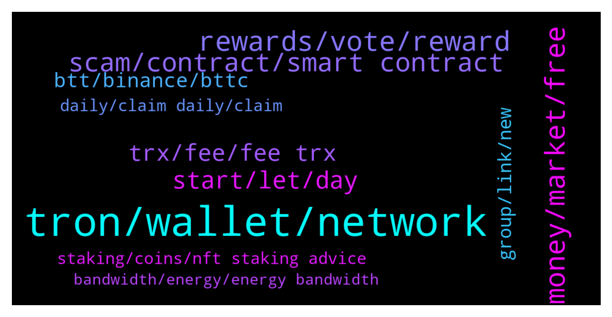

# **@tronnetworkEN**
 ## Analysis for **2022-01-22** - **2022-01-23**.

---

## 📊 **Basic Stats**

**n_messages_sent**: 277

---

---

## 🔝 **Top keywords and related messages**

1. **tron, wallet, network**

    @Richard --- *I have made a deposit from tron to my wallet but it didn't drop up to now* **--->** [TG Discussion](https://t.me/tronnetworkEN/3848470)

    @ip207 --- *hi , how to get free tron ?* **--->** [TG Discussion](https://t.me/tronnetworkEN/3849702)

    @Tuja --- *Hii i having problem since yesterday my TRX will not drop into my wallet off till know please i need your assistance* **--->** [TG Discussion](https://t.me/tronnetworkEN/3849091)

    @Jo --- *Who are all this  Angel tron  And tron guardian They just keep messaging me* **--->** [TG Discussion](https://t.me/tronnetworkEN/3846961)

    @superfantaaaa --- *they blocked accounts this morning or tron ac* **--->** [TG Discussion](https://t.me/tronnetworkEN/3847729)

    @gulammerdeka --- *Can anyone help me? my tron got scam.* **--->** [TG Discussion](https://t.me/tronnetworkEN/3847672)

2. **money, market, free**

    @simon866 --- *It's a strategic move, a mention of a ban lowers the price and putin already said Bitcoin is an asset so they will regulate and accept after buying on a dip  Also we are two years from a halving with accumulation starting a year out from halving   This gives whales 1 year to dump and accumulate as low as possible   Very sneaky buy they are manipulators* **--->** [TG Discussion](https://t.me/tronnetworkEN/3847239)

    @Roger --- *Don’t panic sell. Market will pick up* **--->** [TG Discussion](https://t.me/tronnetworkEN/3846510)

    @KingsDove_TRX --- *I heard the same thing about BTC when it was $2,000 😂* **--->** [TG Discussion](https://t.me/tronnetworkEN/3849732)

    @KingsDove_TRX --- *Nothing is free you must buy first and then you can earn* **--->** [TG Discussion](https://t.me/tronnetworkEN/3849704)

    @xPommepote --- *We are in crypto to not use 3rd party, manage our own assets and you all search for a company 🤦🏻‍♀️* **--->** [TG Discussion](https://t.me/tronnetworkEN/3849469)

    @cool_man78 --- *Only crypto market whale and God knows😅* **--->** [TG Discussion](https://t.me/tronnetworkEN/3848381)

3. **rewards, vote, reward**

    @Abelrajuz --- *In voting is all the reward given as trx itself* **--->** [TG Discussion](https://t.me/tronnetworkEN/3849802)

    @simon866 --- *You can check most here and look at the project websites etc too to see what they reward and when.  Some send rewards each day while some weekly   https://www.tokengoodies.com/* **--->** [TG Discussion](https://t.me/tronnetworkEN/3849817)

    @Zer0log --- *I can't even get the process of why should i vote or why do i need to gain energy and bandwidth 😐* **--->** [TG Discussion](https://t.me/tronnetworkEN/3849683)

    @agentpiki --- *You don't get USDT for rewards usually.   Default is TRX, unless the group you voted for gives otherwise* **--->** [TG Discussion](https://t.me/tronnetworkEN/3847608)

    @agentpiki --- *The default reward is trx. You can vote for any of top 27 (super representatives)* **--->** [TG Discussion](https://t.me/tronnetworkEN/3847676)

    @Vijai Kumar --- *want to know about voting frequency , is it to vote every six hour or its auto calculated ?* **--->** [TG Discussion](https://t.me/tronnetworkEN/3846811)

4. **scam, contract, smart contract**

    @HimanshuHoneyBee --- *What is Trigger smart contract? Anyone can explain.?* **--->** [TG Discussion](https://t.me/tronnetworkEN/3847621)

    @agentpiki --- *Yes. Trust only legit sources. Do not buy from so-called vendors.* **--->** [TG Discussion](https://t.me/tronnetworkEN/3847290)

    @Smoothfamily231086 --- *This is scammer company,plz... Be safe* **--->** [TG Discussion](https://t.me/tronnetworkEN/3849453)

    @Kinol0 --- *I hope scammers will die or cancer soon* **--->** [TG Discussion](https://t.me/tronnetworkEN/3847921)

    @فيراس --- *Those scammer trying real hard to scam...* **--->** [TG Discussion](https://t.me/tronnetworkEN/3847779)

    @agentpiki --- *Thank you for good info. This is definitely scam* **--->** [TG Discussion](https://t.me/tronnetworkEN/3849122)

5. **start, let, day**

    @Grogu80081 --- *sorry for the umb questions ... havent gone through all the documentation yet. just focusing on the back-end part at the moment* **--->** [TG Discussion](https://t.me/tronnetworkEN/3849312)

    @agentpiki --- *Yes you can. Using your mnemonic* **--->** [TG Discussion](https://t.me/tronnetworkEN/3847689)

    @ah66999 --- *How did you come to the conclusion?* **--->** [TG Discussion](https://t.me/tronnetworkEN/3847187)

    @simon866 --- *I think it's the only place and I only found out the other day too 😂* **--->** [TG Discussion](https://t.me/tronnetworkEN/3849785)

    @KingsDove_TRX --- *Kinda hard to beat it 😅* **--->** [TG Discussion](https://t.me/tronnetworkEN/3849791)

    @KingsDove_TRX --- *But for you let's start with the basics* **--->** [TG Discussion](https://t.me/tronnetworkEN/3849629)

6. **trx, fee, fee trx**

    @Moneyversac --- *Where do you get 80% with TRX* **--->** [TG Discussion](https://t.me/tronnetworkEN/3849634)

    @KingsDove_TRX --- *Just because you hold TRX does not mean you have energy and bandwidth especially if you're on a centralized exchange and not on tronlink Pro* **--->** [TG Discussion](https://t.me/tronnetworkEN/3849736)

    @pepelemeko --- *Thats true, never selling trx bro* **--->** [TG Discussion](https://t.me/tronnetworkEN/3849764)

    @KingsDove_TRX --- *Last thing I'm going to do is argue about why TRX won't hit a certain price point, kind of unprofessional on tron main. 👍  As mod I mean* **--->** [TG Discussion](https://t.me/tronnetworkEN/3849744)

    @Moneyversac --- *STOP USING PANCAKE TO BUY TRX, it's not the same chain* **--->** [TG Discussion](https://t.me/tronnetworkEN/3849434)

    @agentpiki --- *This is not the place to ask for financial advice. But we would be biased about it and say  TRX!!* **--->** [TG Discussion](https://t.me/tronnetworkEN/3847557)

7. **btt, binance, bttc**

    @KingsDove_TRX --- *BTTC, GameFi, A. I., And much more* **--->** [TG Discussion](https://t.me/tronnetworkEN/3849749)

    @ginyagami --- *also btt is no longer listed in binance?* **--->** [TG Discussion](https://t.me/tronnetworkEN/3849221)

    @Sunil --- *Bittorrent  chain  price ???* **--->** [TG Discussion](https://t.me/tronnetworkEN/3849246)

    @Moneyversac --- *BTTC means Bittorrent chain. BTT is the token. Go to www.google.com Type in "BTT price In INR"* **--->** [TG Discussion](https://t.me/tronnetworkEN/3849432)

    @agentpiki --- *You cannot buy BTT chain bro.  The currency is called BTT.  Only Binance named it BTTC for the new BTT currency name* **--->** [TG Discussion](https://t.me/tronnetworkEN/3849250)

    @agentpiki --- *Go to binance and check announcement bro* **--->** [TG Discussion](https://t.me/tronnetworkEN/3849243)

8. **group, link, new**

    @cool_man78 --- *Ask a question here. Group managers know the answer better* **--->** [TG Discussion](https://t.me/tronnetworkEN/3848379)

    @agentpiki --- *https://t.me/TronOfficialDevelopersGroupEn  This group might come handy and informative to you in the future.* **--->** [TG Discussion](https://t.me/tronnetworkEN/3849315)

    @Grogu80081 --- *I have pinned this group in telegram* **--->** [TG Discussion](https://t.me/tronnetworkEN/3849318)

    @LTLIQUIDATE --- *I need link to the group.* **--->** [TG Discussion](https://t.me/tronnetworkEN/3848597)

    @Ali --- *Your group is not available in Urdu language ?????🇵🇰🇵🇰🇵🇰🇵🇰* **--->** [TG Discussion](https://t.me/tronnetworkEN/3846565)

    @Hissa --- *Sorry I’m new to this group tho* **--->** [TG Discussion](https://t.me/tronnetworkEN/3846490)

9. **staking, coins, nft staking advice**

    @KingsDove_TRX --- *JustLend, TRX governance, BTT staking, TNT staking, NFT staking* **--->** [TG Discussion](https://t.me/tronnetworkEN/3849623)

    @𝕍𝕚𝕛𝕒𝕪 --- *Please I need suggestions on the best coins to buy for short and long-term investment* **--->** [TG Discussion](https://t.me/tronnetworkEN/3847554)

    @KingsDove_TRX --- *I will say this if you're staking rewards do not compensate for downturn Market then you're staking for no reason 👍* **--->** [TG Discussion](https://t.me/tronnetworkEN/3849767)

    @KingsDove_TRX --- *Staking options everywhere and we still get free transactions* **--->** [TG Discussion](https://t.me/tronnetworkEN/3849752)

    @agentpiki --- *Then go to central exchanges and stake there. Do your own research* **--->** [TG Discussion](https://t.me/tronnetworkEN/3849673)

    @Abdul --- *Please tell me  staking coins platform* **--->** [TG Discussion](https://t.me/tronnetworkEN/3846677)

10. **daily, claim daily, claim**

    @agentpiki --- *The rate is listed as YEARLY  but you can claim daily once* **--->** [TG Discussion](https://t.me/tronnetworkEN/3849370)

    @Arsenalii --- *The profit of staking tron on trust wallet is daily monthly or for a year???* **--->** [TG Discussion](https://t.me/tronnetworkEN/3849365)

    @Zer0log --- *No it's a dynamic apr actually* **--->** [TG Discussion](https://t.me/tronnetworkEN/3849611)

    @Grogu80081 --- *for a period of 3 years* **--->** [TG Discussion](https://t.me/tronnetworkEN/3849307)

    @agentpiki --- *There is no such thing as high interest daily.  All are scams.* **--->** [TG Discussion](https://t.me/tronnetworkEN/3847502)

    @KingsDove_TRX --- *And he said one day he didn't give a specific time limit* **--->** [TG Discussion](https://t.me/tronnetworkEN/3849720)

