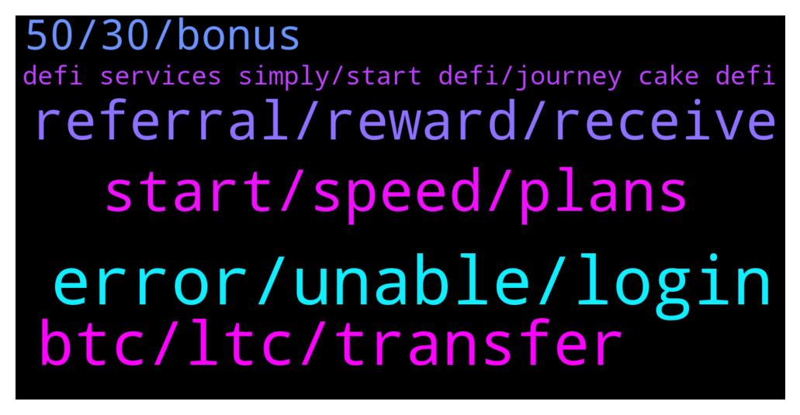

# **@CakeDeFi_EN**
 ## Analysis for **2022-01-23** - **2022-01-24**.

---

## 📊 **Basic Stats**

**n_messages_sent**: 178

---

---

## 🔝 **Top keywords and related messages**

1. **error, unable, login**

    @Michael_Schredl --- *Everything works fine for me, what error do you get?* **--->** [TG Discussion](https://t.me/CakeDeFi_EN/167653)

    @andywazzaa --- *strange.. im getting the same network error message when trying to log on..* **--->** [TG Discussion](https://t.me/CakeDeFi_EN/167691)

    @sunilpnwr --- *It shows the same error in a different browser.* **--->** [TG Discussion](https://t.me/CakeDeFi_EN/167657)

    @sunilpnwr --- *It shows network error but my connection seems fine. I can reload but I can't upload the docs.* **--->** [TG Discussion](https://t.me/CakeDeFi_EN/167655)

    @DmgBautista --- *Thats strange, everything seems to be working. Do you have another browser in which you can try?* **--->** [TG Discussion](https://t.me/CakeDeFi_EN/167656)

    @Bald --- *Restarted my laptop. Still can't login* **--->** [TG Discussion](https://t.me/CakeDeFi_EN/167759)

2. **btc, ltc, transfer**

    @Kenneth --- *Hi. As a fellow Malaysian, I would like to ask does anyone knows the best way to buy DFI?* **--->** [TG Discussion](https://t.me/CakeDeFi_EN/167697)

    @soulsensei --- *Can I buy DFI on the Cake DeFi platform* **--->** [TG Discussion](https://t.me/CakeDeFi_EN/167386)

    @Kenneth --- *Isn't buying BTC to convert to DFI not worth it given the expensive fees in BTC purchase?* **--->** [TG Discussion](https://t.me/CakeDeFi_EN/167726)

    @John --- *Yes Jess I transferred DFI from cake to desktop DEFI walled, well received the amount then transferred to dBTC and now want to send the dBTC to cake for Lending. I have 22 DFI in UTXO not sure what I am missing here 😬* **--->** [TG Discussion](https://t.me/CakeDeFi_EN/167415)

    @DoEvtgInLove --- *Hi friends, if I send dBTC to Cake to unwrap I will get BTC at Oracle price?* **--->** [TG Discussion](https://t.me/CakeDeFi_EN/167420)

    @gpkiefer --- *Question: if I wished to utilize the LM on the Defi desktop wallet for say, LTC-DFI pair, do I transfer my LTC from say Ledger wallet first to Cake to be wrapped/converted to dLTC and afterwards, transfer back to the Defi wallet in order to initiate the LM for the LTC-DFI pair?  Also if I wanted to convert back to LTC do I then transfer the dLTC back to Cake so I can withdraw LTC back to Ledger once I am done with LM?* **--->** [TG Discussion](https://t.me/CakeDeFi_EN/167281)

3. **start, speed, plans**

    @DmgBautista --- *Indeed! For the ones that started its crypto journey with Cake and Defichain, I believe they started in the best way possible :) Communities are amazing and providing good services and future. Will be an amaizing journey 😃* **--->** [TG Discussion](https://t.me/CakeDeFi_EN/167504)

    @Chigo1991 --- *Please i want to start trading now how do i start now* **--->** [TG Discussion](https://t.me/CakeDeFi_EN/167392)

    @Chigo1991 --- *Please how do i start trading now please am confuse here* **--->** [TG Discussion](https://t.me/CakeDeFi_EN/167395)

    @Cammy2904 --- *It's mostly the new ones that recently joined crypto. They'll learn sooner or later 😄.* **--->** [TG Discussion](https://t.me/CakeDeFi_EN/167502)

    @BerndMack --- *Here could be your start: https://support.cakedefi.com/hc/en-us/articles/900003427506-Cake-Service-simply-explained Or if you want to promote your tradingplatform or some sort on investmentstrategy, just DM me. Iam interested in such things :)* **--->** [TG Discussion](https://t.me/CakeDeFi_EN/167335)

    @fadfunky --- *Today is a strong sell off. Oh god. Just waiting for reversal* **--->** [TG Discussion](https://t.me/CakeDeFi_EN/167773)

4. **referral, reward, receive**

    @muhammedbyrkn --- *How much is the referral reward?* **--->** [TG Discussion](https://t.me/CakeDeFi_EN/167562)

    @DmgBautista --- *Yes, 25% of 1%. You will receive up to the maximum of 1% of the total holdings of all your referrals, per year, if they comply with the rules.* **--->** [TG Discussion](https://t.me/CakeDeFi_EN/167605)

    @muhammedbyrkn --- *How many months is the $10 referral reward?* **--->** [TG Discussion](https://t.me/CakeDeFi_EN/167569)

    @gaytanmisael --- *How is the percentages for referral calculated?* **--->** [TG Discussion](https://t.me/CakeDeFi_EN/167599)

    @muhammedbyrkn --- *How many months is my $10 reward locked?* **--->** [TG Discussion](https://t.me/CakeDeFi_EN/167565)

    @andreasisaak --- *The referral reward is $30. The Learn reward is locked too.* **--->** [TG Discussion](https://t.me/CakeDeFi_EN/167573)

5. **50, 30, bonus**

    @zachgax --- *If I may add on. Cake is not a spot trading platform. It’s an investment platform with long term goals for staking and liquidity mining. So don’t think of it as a run-and-gun scenario where you put in the minimum of $50 to get the $30 bonus and try to cash out immediately. Your $30 bonus is frozen for 6-months anyway.  You could put in a comfortable buffer of about $100, freeze along with the $30 for the same 6 month period. Use the time to learn more about Cake and Defichain, see how your rewards accumulate. I can guarantee that within this 6 month lock-in period, you’d be confident enough with the project to invest more.* **--->** [TG Discussion](https://t.me/CakeDeFi_EN/167722)

    @Kassius84 --- *If you register yourself at Cake DeFi and you deposit at least crypto worth $50, you will receive a sign up bonus in DFI worth $30.* **--->** [TG Discussion](https://t.me/CakeDeFi_EN/167566)

    @DmgBautista --- *Hi! Yes if the deposit is the first and at least 50$usd or more at arrival to Cake. The 30$usd tokens will be frozen for 180 days earning interest, but the initial deposit can be withdrawn if not invested into any other service* **--->** [TG Discussion](https://t.me/CakeDeFi_EN/167472)

    @YSL --- *💯 I’m 100% on staking with cakedefi as I believe on capital appreciation (DFI) and lazy to monitor LM hence staking is best for me . Just let it stake and compounding effect take place* **--->** [TG Discussion](https://t.me/CakeDeFi_EN/167368)

    @Kassius84 --- *Sorry I got you wrong, if you register at Cake DeFi and deposit cryptos worth $50, your $30 sign up bonus is locked for 180 days* **--->** [TG Discussion](https://t.me/CakeDeFi_EN/167568)

    @zachgax --- *That’s good, quite a few replies to why they couldn’t withdraw their $30 immediately. Anyway, just use any exchange you’re currently using. Sent BTC to Cake (or LTC, BCH, Doge). As long as the value is above US$50 you will get the bonus.  You can then swap your BTC for DFI on Cake.   Do not send ETH or other ERC-20 tokens, those require a pretty high one time US$130 gas fee for address creation.* **--->** [TG Discussion](https://t.me/CakeDeFi_EN/167725)

6. **defi services simply, start defi, journey cake defi**

    @liqprovider --- *🤤 I love to watch the thoughts and development of Cake DeFi https://www.youtube.com/watch?v=tGAz2tx0lPY&t=7s* **--->** [TG Discussion](https://t.me/CakeDeFi_EN/167636)

    @Chigo1991 --- *I have not understand dis cake defl en i need explaintion* **--->** [TG Discussion](https://t.me/CakeDeFi_EN/167317)

    @soulsensei --- *In light of the recent crypto.com hack, what are the cyber security measures adopted by Cake DeFi to prevent similar hacks from happening?* **--->** [TG Discussion](https://t.me/CakeDeFi_EN/167464)

    @ExPwr --- *Team, what is the current TVL of cake.defi?* **--->** [TG Discussion](https://t.me/CakeDeFi_EN/167347)

    @Michael_Schredl --- *Start your DeFi Journey Here: Cake  DeFi Services Simply Explained https://support.cakedefi.com/hc/en-us/articles/900003427506-Cake-Service-simply-explained* **--->** [TG Discussion](https://t.me/CakeDeFi_EN/167331)

    @Kassius84 --- *Start your DeFi Journey Here: Cake  DeFi Services Simply Explained https://support.cakedefi.com/hc/en-us/articles/900003427506-Cake-Service-simply-explained* **--->** [TG Discussion](https://t.me/CakeDeFi_EN/167319)

