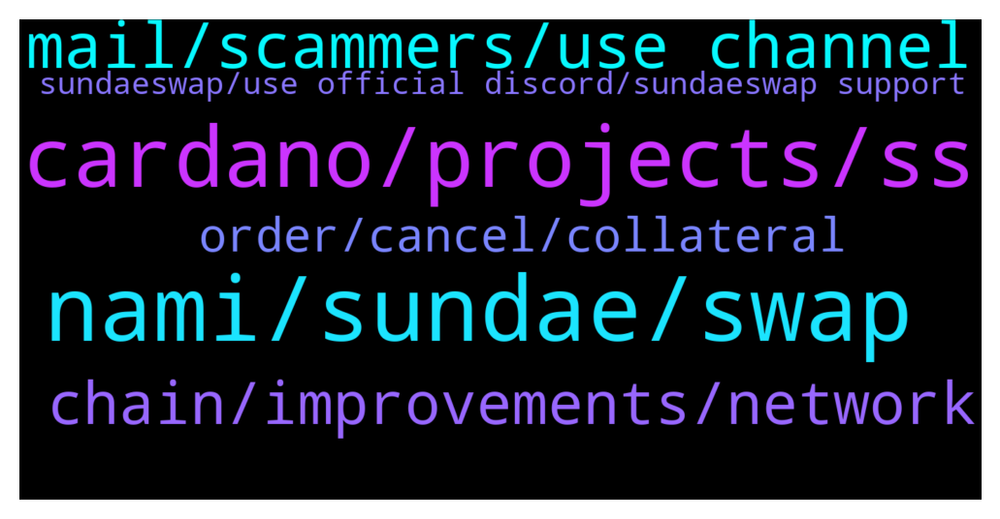

# **@Cardano**
 ## Analysis for **2022-01-23** - **2022-01-24**.

---

## 📊 **Basic Stats**

**n_messages_sent**: 109

---

---

## 🔝 **Top keywords and related messages**

1. **nami, sundae, swap**

    @MrBrinker --- *I would download CCvault and restore your wallet there, it has been best wallet handling the load. No one charged you 5 ADAs, it is the collateral and as soon as you remove it your Ada is back. Check Sundae’s Discord or Twitter for tutorials on how to setup CCvault* **--->** [TG Discussion](https://t.me/Cardano/774636)

    @Gr33nSun --- *Now both swaps are "Price outside range" and my ADA has not been returned to my Nami wallet! BS! And charged me 5 ADA (for the 2or3rd time) ! WTF?! Now swap price almost 3x'-5x's $ from where I started ... where is my f'ing ADA? I've been patient 3+ yrs and this is what it is ???* **--->** [TG Discussion](https://t.me/Cardano/774537)

    @ExInfernis --- *Hey did someone had problem today with binance? I deposited EUR and cant use it due to some annoying error that even the support there didnt fix it and told me to try tomorrow* **--->** [TG Discussion](https://t.me/Cardano/774466)

    @Gr33nSun --- *cant even move my ADA from the orders, and they wont cancel and go back to wallet* **--->** [TG Discussion](https://t.me/Cardano/774553)

    @shirazaahmed --- *Hi Can someone please help. Im using Daedalus Wallet and I redelegated on Friday to another pool "North" to earn SundaeSwap Rewards. Its been 3 days and the Pool to which Im delegated to says "Unknown". Any idea whats going on?* **--->** [TG Discussion](https://t.me/Cardano/775039)

    @Gr33nSun --- *Already have that. Now the amount from my Nami wallet has disappeared in the same amount that was trying to process from two days ago but it’s not showing up on Sundae swap as complete and that was after I click confirm to send a small portion to the Covalt wallet to interact with dapps.* **--->** [TG Discussion](https://t.me/Cardano/774494)

2. **cardano, projects, ss**

    @Apath00 --- *🎼🎹🎧Charles Hoskinson lofi beats to relax/stake on Cardano  https://www.youtube.com/watch?v=K3x1eYgHClk* **--->** [TG Discussion](https://t.me/Cardano/774480)

    @Bartleby --- *Hello,i cannot send any transaction on cardano ,is network congested now ?* **--->** [TG Discussion](https://t.me/Cardano/774666)

    @gmark --- *Any updates/news how cardano team plan to address to fix this ‘3rd gen’, ‘peered reviewed network’ and not be congested - ‘it was a single Dex that launched’, so how we expect to sustain scalability? Does anyone feel we need an update as did not expect it to be this bad from my end?* **--->** [TG Discussion](https://t.me/Cardano/774793)

    @Lgbeano --- *Did you ever look at the roadmap?* **--->** [TG Discussion](https://t.me/Cardano/774797)

    @Reco --- *Seeking Cardano devs please dm me ASAP* **--->** [TG Discussion](https://t.me/Cardano/774877)

    @cardano1900 --- *hello,i want to research cnfts and cardano metaverse projects a bit deeper...what is a good place to start?any projects,any sites that compare ect?just to make it clear,i WILL NOT take it as a financial advise and neither should anyone else.i just need to do a bit research and i want to dig deeper into that field.so any starting point is welcomed.thx* **--->** [TG Discussion](https://t.me/Cardano/774648)

3. **mail, scammers, use channel**

    @Gr33nSun --- *Do not DM me. Answer in main chat only* **--->** [TG Discussion](https://t.me/Cardano/774502)

    @jthomson1 --- *(By the way, beware of direct messages from scammers. Just  block them and reply in the group.)* **--->** [TG Discussion](https://t.me/Cardano/775093)

    @glitch04 --- *There are scammers here that will dm you and act as support or admins and try to steal your wallets if anyone dm's you please block and report the accounts.* **--->** [TG Discussion](https://t.me/Cardano/774867)

    @glitch04 --- *There are scammers with fake websites stealing seed words, If you are having issues please use the channel above 👆* **--->** [TG Discussion](https://t.me/Cardano/774635)

    @glitch04 --- *Anyone that dm's you here offering support is more than likely a scammer trying to take your funds. no admin or support will dm you or ask for a wallet verification!* **--->** [TG Discussion](https://t.me/Cardano/774568)

    @drigo101 --- *Anyone trying to DM you is with 99.999% certainty a scammer* **--->** [TG Discussion](https://t.me/Cardano/774560)

4. **chain, improvements, network**

    @CalusB --- *What embarrassment ? Chain is running great. It’s literally at max and I can send and receive transactions in minutes still. Even sundae swap transactions are reasonable still. And all at decent cost. Considering this is all done with almost no improvements it’s quite impressive* **--->** [TG Discussion](https://t.me/Cardano/774798)

    @Lgbeano --- *@CalusB : Once these improvements come in we can be sure even higher transaction volumes will at most be a mild inconvenience and not break the chain like Sol or the ridiculous fees in eth I have eth positions on chain I literally can’t unwind because it would cost more then it’s worth* **--->** [TG Discussion](https://t.me/Cardano/774805)

    @CalusB --- *Are you serious? Have you been living under a rock they have launched like 3 blog posts multiple videos and there are improvements coming in both the February hard fork and June hard fork as well as improvements in node and block size in the coming weeks* **--->** [TG Discussion](https://t.me/Cardano/774794)

    @CalusB --- *Wow this auto bot is kinda insane. Both our competitors have issues with super high volume either completely rendering the chain unusable or fees so high that it’s virtually unusable for regular transactions* **--->** [TG Discussion](https://t.me/Cardano/774802)

    @glitch04 --- *94% / 94% still room but there are backlogs depending on what you are using* **--->** [TG Discussion](https://t.me/Cardano/774674)

    @Chinerians --- *I think it is just super congested the network* **--->** [TG Discussion](https://t.me/Cardano/774644)

5. **order, cancel, collateral**

    @gauthamnag --- *I tried but still can't cancell* **--->** [TG Discussion](https://t.me/Cardano/774445)

    @brzi987 --- *I cancelled the order and they took the collateral again🤦 5ada collateral for submit order( price is outside range) and 5ada collateral for cancel* **--->** [TG Discussion](https://t.me/Cardano/774444)

    @FlamingElim --- *Hello all, just update. Finally I'm able to cancel my open order this morning.  SS has an update that they have fixed the issue that prevent users with small numbers to cancel their orders* **--->** [TG Discussion](https://t.me/Cardano/774565)

    @brzi987 --- *you have to submit collateral the cancel* **--->** [TG Discussion](https://t.me/Cardano/774447)

    @Smoky123 --- *finally let me put collateral but cancelation failed couple times for now* **--->** [TG Discussion](https://t.me/Cardano/774446)

    @FlamingElim --- *Order became limit order. Because my slippage is too low. But now I 'am able to cancel the order* **--->** [TG Discussion](https://t.me/Cardano/774641)

6. **sundaeswap, use official discord, sundaeswap support**

    @ChrisSTR8 --- *This is not a channel for sundaeswap support if you need help you should use their official discord https://discord.gg/Sundae* **--->** [TG Discussion](https://t.me/Cardano/774913)

    @Benjamin --- *Man, with the cardstarter drama and the sundae complications, this is rough* **--->** [TG Discussion](https://t.me/Cardano/774551)

    @notPoetEnough --- *I'm a little late to the party but just want to confirm that Sundaeswap is pretty much completely unusuable right now, correct?* **--->** [TG Discussion](https://t.me/Cardano/774918)

    @gmark --- *Sure, Do you know when Hydra is, cause I cant tell?* **--->** [TG Discussion](https://t.me/Cardano/774799)

    @glitch04 --- *This is not a channel for sundaeswap support if you need help you should use their official discord* **--->** [TG Discussion](https://t.me/Cardano/774866)

    @brzi987 --- *I'm not getting any feedback from sundaeswap on Twitter,so I'm asking here* **--->** [TG Discussion](https://t.me/Cardano/774757)

